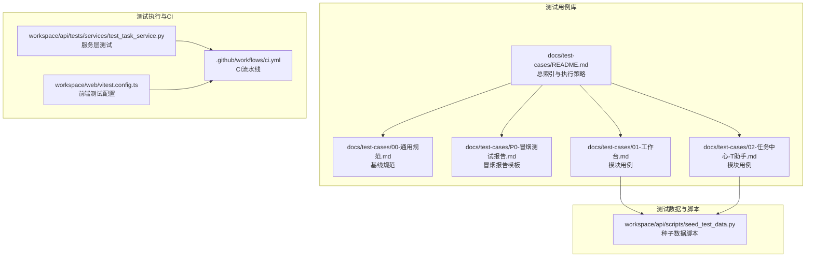
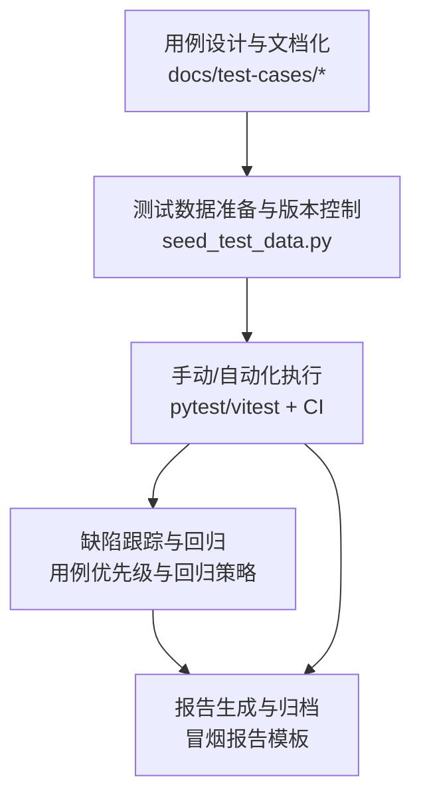
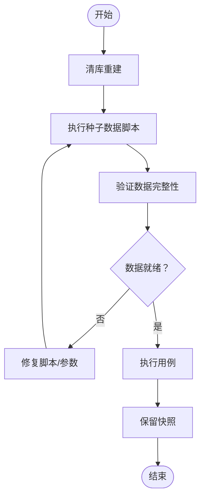
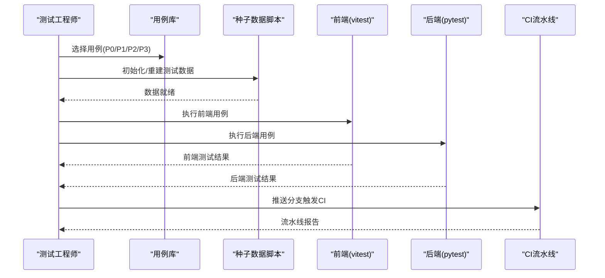
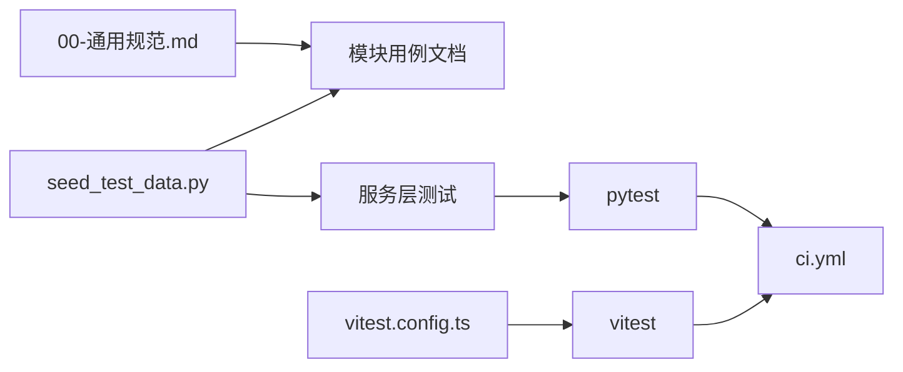

# 测试用例管理

<cite>
**本文引用的文件**
- [docs/test-cases/README.md](file://docs/test-cases/README.md)
- [docs/test-cases/00-通用规范.md](file://docs/test-cases/00-通用规范.md)
- [docs/test-cases/P0-冒烟测试报告.md](file://docs/test-cases/P0-冒烟测试报告.md)
- [docs/test-cases/01-工作台.md](file://docs/test-cases/01-工作台.md)
- [docs/test-cases/02-任务中心-T助手.md](file://docs/test-cases/02-任务中心-T助手.md)
- [workspace/api/scripts/seed_test_data.py](file://workspace/api/scripts/seed_test_data.py)
- [workspace/api/tests/services/test_task_service.py](file://workspace/api/tests/services/test_task_service.py)
- [workspace/web/vitest.config.ts](file://workspace/web/vitest.config.ts)
- [.github/workflows/ci.yml](file://.github/workflows/ci.yml)
</cite>

## 目录
1. [简介](#简介)
2. [项目结构](#项目结构)
3. [核心组件](#核心组件)
4. [架构总览](#架构总览)
5. [详细组件分析](#详细组件分析)
6. [依赖分析](#依赖分析)
7. [性能考虑](#性能考虑)
8. [故障排查指南](#故障排查指南)
9. [结论](#结论)
10. [附录](#附录)

## 简介
本文件面向 FDE 工作台的测试用例管理，系统化阐述测试用例设计原则、分类与优先级、覆盖范围评估方法；规范测试用例文档化格式与字段；说明测试数据准备、版本控制与清理策略；给出手动与自动化测试执行流程及回归策略；并覆盖缺陷跟踪与测试报告生成的关键实践。文档以仓库内现有测试用例库与测试脚本为基础，结合 CI 流程，形成可落地的测试管理体系。

## 项目结构
测试用例管理相关资源集中于 docs/test-cases 目录，采用“模块化 + 优先级 + 类型”的组织方式，辅以统一的规范文档与冒烟测试报告模板。前端与后端均具备单元/集成测试配置，CI 流水线覆盖三端测试任务。

**图表来源**
- [docs/test-cases/README.md:1-198](file://docs/test-cases/README.md#L1-L198)
- [docs/test-cases/00-通用规范.md:1-315](file://docs/test-cases/00-通用规范.md#L1-L315)
- [docs/test-cases/P0-冒烟测试报告.md:1-156](file://docs/test-cases/P0-冒烟测试报告.md#L1-L156)
- [workspace/api/scripts/seed_test_data.py:1-245](file://workspace/api/scripts/seed_test_data.py#L1-L245)
- [workspace/api/tests/services/test_task_service.py:1-217](file://workspace/api/tests/services/test_task_service.py#L1-L217)
- [workspace/web/vitest.config.ts:1-26](file://workspace/web/vitest.config.ts#L1-L26)
- [.github/workflows/ci.yml:1-106](file://.github/workflows/ci.yml#L1-L106)

**章节来源**
- [docs/test-cases/README.md:1-198](file://docs/test-cases/README.md#L1-L198)
- [docs/test-cases/00-通用规范.md:1-315](file://docs/test-cases/00-通用规范.md#L1-L315)

## 核心组件
- 用例库与索引：提供模块化用例清单、优先级分布、执行顺序与回归策略建议。
- 通用规范：定义用例 ID 编号、字段、优先级、账号矩阵、数据基线、浏览器与分辨率矩阵、性能与安全基线、AI 卡片渲染规范、二次确认异常路径等。
- 冒烟测试报告：提供冒烟清单、执行计划、环境状态、风险与下一步行动。
- 模块用例：按功能/接口/UI 维度拆分，覆盖主流程、异常与边界场景。
- 测试数据脚本：提供可重复使用的种子数据，确保测试一致性。
- 测试执行与CI：后端 pytest、前端 vitest 配置与 GitHub Actions 流水线。

**章节来源**
- [docs/test-cases/README.md:1-198](file://docs/test-cases/README.md#L1-L198)
- [docs/test-cases/00-通用规范.md:1-315](file://docs/test-cases/00-通用规范.md#L1-L315)
- [docs/test-cases/P0-冒烟测试报告.md:1-156](file://docs/test-cases/P0-冒烟测试报告.md#L1-L156)
- [workspace/api/scripts/seed_test_data.py:1-245](file://workspace/api/scripts/seed_test_data.py#L1-L245)

## 架构总览
测试体系围绕“用例设计—数据准备—执行—缺陷跟踪—报告”闭环展开，CI 流水线贯穿后端、前端与 AI 编排器的测试任务，保障持续质量。

[此图为概念性架构示意，无需图表来源]

## 详细组件分析

### 用例设计原则与分类
- 用例 ID 编号规则：TC-{模块代号}-{类型}-{NNN}，模块代号覆盖 10 类模块，类型为 F/I/U，NNN 按模块×类型独立递增。
- 优先级划分：P0（阻塞主流程）、P1（核心功能）、P2（次要功能）、P3（边缘场景），占比目标与强制覆盖清单明确。
- 用例类型：功能（F）、接口（I）、UI（U），要求步骤与预期一一对应，便于自动化执行。
- 用例字段：用例 ID、模块、标题、优先级、类型、前置条件、测试步骤、预期结果，缺一不可。
- 账号矩阵：测试环境账号与默认状态，确保权限与数据范围可控。
- 数据基线：种子数据清单、边界数据取值、初始化方式（脚本 + 清库重建 + 快照）。
- 浏览器与分辨率矩阵：Chrome/Edge/Safari/Firefox 优先级与最低版本，分辨率与三栏布局期望。
- 性能与安全基线：首屏加载、页面切换、AI 助手切换、@ 引用弹窗、SSE 首 token 等性能指标；数据脱敏、二次确认、ACL、XSS、CSRF 等安全要求。
- AI 卡片渲染规范：actionCard、report、nextSteps、searchResults 的必含元素与校验要点。
- 二次确认异常路径：actionId 不存在/过期/用户不匹配/工具不匹配/用户取消等 5 种异常场景与错误码。

**章节来源**
- [docs/test-cases/00-通用规范.md:14-56](file://docs/test-cases/00-通用规范.md#L14-L56)
- [docs/test-cases/00-通用规范.md:102-125](file://docs/test-cases/00-通用规范.md#L102-L125)
- [docs/test-cases/00-通用规范.md:59-98](file://docs/test-cases/00-通用规范.md#L59-L98)
- [docs/test-cases/00-通用规范.md:128-189](file://docs/test-cases/00-通用规范.md#L128-L189)
- [docs/test-cases/00-通用规范.md:192-221](file://docs/test-cases/00-通用规范.md#L192-L221)
- [docs/test-cases/00-通用规范.md:224-246](file://docs/test-cases/00-通用规范.md#L224-L246)
- [docs/test-cases/00-通用规范.md:249-269](file://docs/test-cases/00-通用规范.md#L249-L269)

### 用例文档化规范
- 每条用例必须包含 7 个基础字段，且步骤与预期一一对应。
- 标准模板：用例标题、模块、优先级、类型、前置条件、测试步骤、预期结果。
- 编写原则：可执行、可验证、独立性、数据复用、正向+反向+边界。
- 禁止行为：步骤与预期不对应、模糊描述、复用全局唯一 ID、P0 缺少失败影响说明、接口用例只写“返回成功”。

**章节来源**
- [docs/test-cases/00-通用规范.md:59-98](file://docs/test-cases/00-通用规范.md#L59-L98)
- [docs/test-cases/00-通用规范.md:272-289](file://docs/test-cases/00-通用规范.md#L272-L289)

### 测试数据管理
- 种子数据：用户、项目、任务、客户、文件等实体的数量与关键字段示例，确保测试覆盖主流程与边界。
- 边界数据：任务标题长度、文件大小、配额、actionId 有效期、密码强度等。
- 初始化方式：通过脚本一键初始化，每次测试前清库重建，测试结束保留快照便于回归。
- 数据一致性：统一账号矩阵与默认状态，避免用例间相互污染。

**图表来源**
- [workspace/api/scripts/seed_test_data.py:74-241](file://workspace/api/scripts/seed_test_data.py#L74-L241)

**章节来源**
- [docs/test-cases/00-通用规范.md:150-189](file://docs/test-cases/00-通用规范.md#L150-L189)
- [workspace/api/scripts/seed_test_data.py:1-245](file://workspace/api/scripts/seed_test_data.py#L1-L245)

### 测试执行流程
- 手动测试执行：按冒烟清单与模块用例文档，使用浏览器与 curl 验证核心场景与接口。
- 自动化测试运行：后端 pytest、前端 vitest，CI 流水线自动执行。
- 回归测试策略：冒烟测试（P0 全量）、核心回归（P0+P1）、全量回归（全部用例）；按模块独立测试，支持并行执行。

**图表来源**
- [docs/test-cases/README.md:112-140](file://docs/test-cases/README.md#L112-L140)
- [docs/test-cases/P0-冒烟测试报告.md:144-151](file://docs/test-cases/P0-冒烟测试报告.md#L144-L151)
- [.github/workflows/ci.yml:9-33](file://.github/workflows/ci.yml#L9-L33)
- [.github/workflows/ci.yml:34-53](file://.github/workflows/ci.yml#L34-L53)

**章节来源**
- [docs/test-cases/README.md:112-140](file://docs/test-cases/README.md#L112-L140)
- [docs/test-cases/P0-冒烟测试报告.md:144-151](file://docs/test-cases/P0-冒烟测试报告.md#L144-L151)
- [.github/workflows/ci.yml:9-106](file://.github/workflows/ci.yml#L9-L106)

### 缺陷跟踪与测试报告
- 缺陷跟踪：对失败用例创建缺陷报告，记录失败现象、重现步骤、期望结果与环境信息。
- 回归验证：缺陷修复后重新执行对应用例，直至通过。
- 测试报告：使用冒烟测试报告模板，记录执行信息、环境就绪性检查、用例执行计划、风险评估与下一步行动。

**章节来源**
- [docs/test-cases/P0-冒烟测试报告.md:1-156](file://docs/test-cases/P0-冒烟测试报告.md#L1-L156)

### 模块用例示例与覆盖范围
- 工作台：首屏加载、统计卡、最近任务/项目、通知、关键事件流、登录/登出、Token 刷新、UI 视觉与分辨率适配、接口校验。
- 任务中心 + T 助手：列表加载、筛选/排序/分页、CRUD、批量操作、二次确认、T 助手欢迎语、对话、actionCard 字段对比、批量延期、工作量分析、上下文感知、chip 推荐。

**章节来源**
- [docs/test-cases/01-工作台.md:1-560](file://docs/test-cases/01-工作台.md#L1-L560)
- [docs/test-cases/02-任务中心-T助手.md:1-800](file://docs/test-cases/02-任务中心-T助手.md#L1-L800)

## 依赖分析
- 用例库依赖通用规范：ID 编号、字段、优先级、账号、数据、性能/安全基线。
- 模块用例依赖种子数据脚本：确保测试数据一致性与可重复性。
- 自动化测试依赖 CI 流水线：后端 pytest、前端 vitest，CI 并行执行三端测试任务。
- 服务层测试样例：以 TaskService 为例，展示断言与异常路径覆盖。

**图表来源**
- [docs/test-cases/00-通用规范.md:1-315](file://docs/test-cases/00-通用规范.md#L1-L315)
- [docs/test-cases/01-工作台.md:1-560](file://docs/test-cases/01-工作台.md#L1-L560)
- [workspace/api/scripts/seed_test_data.py:1-245](file://workspace/api/scripts/seed_test_data.py#L1-L245)
- [workspace/api/tests/services/test_task_service.py:1-217](file://workspace/api/tests/services/test_task_service.py#L1-L217)
- [workspace/web/vitest.config.ts:1-26](file://workspace/web/vitest.config.ts#L1-L26)
- [.github/workflows/ci.yml:9-106](file://.github/workflows/ci.yml#L9-L106)

**章节来源**
- [workspace/api/tests/services/test_task_service.py:12-217](file://workspace/api/tests/services/test_task_service.py#L12-L217)

## 性能考虑
- 首屏加载、页面切换、AI 助手切换、@ 引用弹窗、SSE 首 token 等性能指标作为验收基线，用例需覆盖。
- 建议在冒烟测试中优先验证关键性能路径，避免阻塞主流程。

**章节来源**
- [docs/test-cases/00-通用规范.md:224-233](file://docs/test-cases/00-通用规范.md#L224-L233)

## 故障排查指南
- 环境部署阻塞：检查 CI 任务与本地端口占用情况，等待环境就绪后再执行接口预检与浏览器测试。
- 数据缺失：确认种子数据脚本可用性与数据库连接，必要时重新初始化。
- AI 服务依赖：准备 mock 方案或降级测试，避免外部依赖导致测试中断。
- 文件上传依赖：使用本地存储模式或模拟 OSS，保证文件相关用例可执行。

**章节来源**
- [docs/test-cases/P0-冒烟测试报告.md:12-24](file://docs/test-cases/P0-冒烟测试报告.md#L12-L24)
- [docs/test-cases/P0-冒烟测试报告.md:91-111](file://docs/test-cases/P0-冒烟测试报告.md#L91-L111)

## 结论
通过统一的用例设计原则、严格的文档化规范、可复用的测试数据脚本与完善的 CI 流水线，FDE 工作台测试用例管理实现了从设计到执行再到回归的闭环。建议在迭代过程中持续补充模块用例、完善边界与异常场景，并结合自动化测试提升效率与稳定性。

## 附录
- 用例 ID 编号规则与模块代号对照表
- 优先级定义与强制覆盖清单
- 账号矩阵与默认状态
- 种子数据清单与边界数据取值
- 浏览器与分辨率矩阵
- 性能与安全基线
- 二次确认异常路径与错误码
- 冒烟测试清单与执行计划
- CI 流水线任务与测试配置

**章节来源**
- [docs/test-cases/README.md:35-109](file://docs/test-cases/README.md#L35-L109)
- [docs/test-cases/00-通用规范.md:14-56](file://docs/test-cases/00-通用规范.md#L14-L56)
- [docs/test-cases/00-通用规范.md:102-125](file://docs/test-cases/00-通用规范.md#L102-L125)
- [docs/test-cases/00-通用规范.md:128-189](file://docs/test-cases/00-通用规范.md#L128-L189)
- [docs/test-cases/00-通用规范.md:192-246](file://docs/test-cases/00-通用规范.md#L192-L246)
- [docs/test-cases/00-通用规范.md:249-269](file://docs/test-cases/00-通用规范.md#L249-L269)
- [docs/test-cases/P0-冒烟测试报告.md:27-46](file://docs/test-cases/P0-冒烟测试报告.md#L27-L46)
- [.github/workflows/ci.yml:9-106](file://.github/workflows/ci.yml#L9-L106)
- [workspace/web/vitest.config.ts:1-26](file://workspace/web/vitest.config.ts#L1-L26)