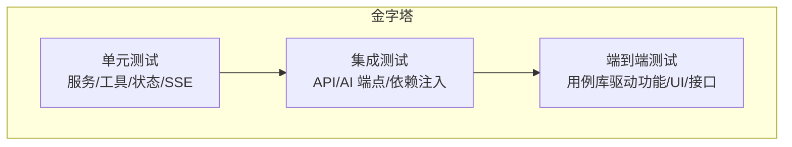
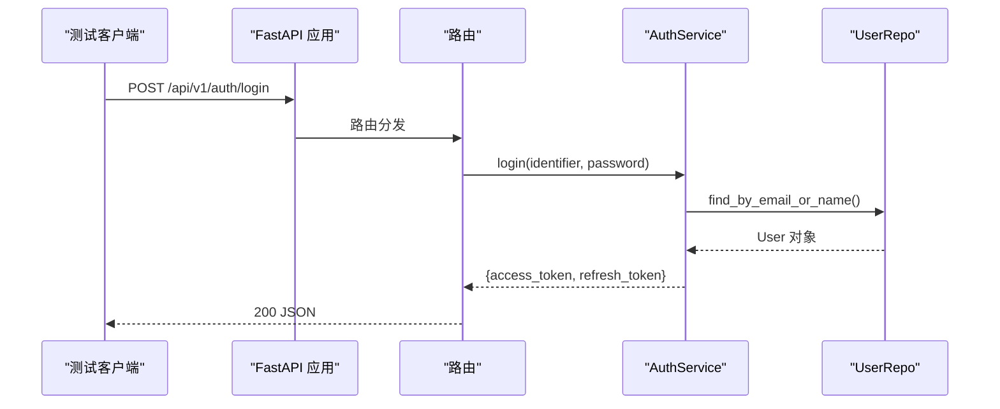
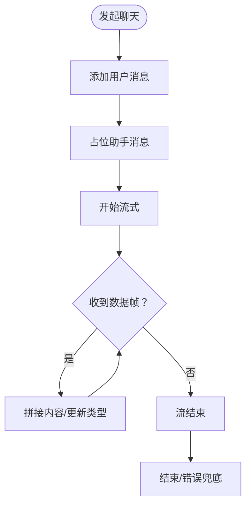
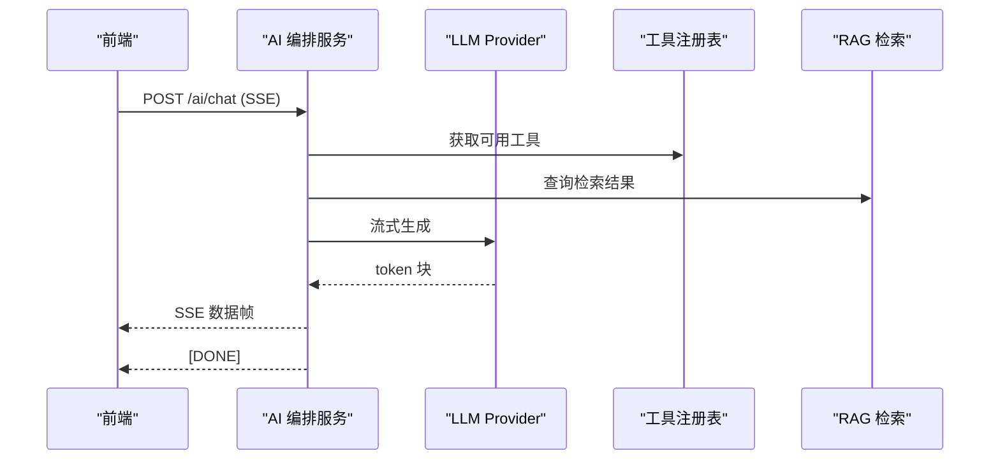
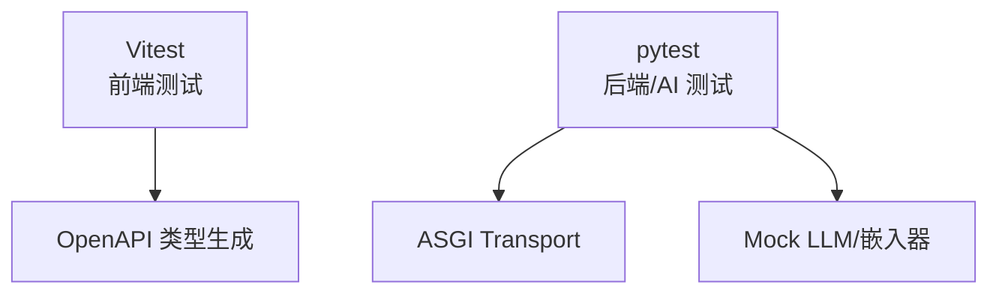

# 测试策略

<cite>
**本文引用的文件**
- [ci.yml](file://.github/workflows/ci.yml)
- [vitest.config.ts](file://workspace/web/vitest.config.ts)
- [package.json](file://workspace/web/package.json)
- [setup.ts](file://workspace/web/tests/setup.ts)
- [conftest.py](file://workspace/api/tests/conftest.py)
- [test_auth_service.py](file://workspace/api/tests/services/test_auth_service.py)
- [test_api_endpoints.py](file://workspace/api/tests/integration/test_api_endpoints.py)
- [main.py](file://workspace/api/app/main.py)
- [chat.test.ts](file://workspace/web/tests/stores/chat.test.ts)
- [sse.test.ts](file://workspace/web/tests/apis/sse.test.ts)
- [chat.ts](file://workspace/web/src/stores/chat.ts)
- [test_main.py](file://workspace/ai-orchestrator/tests/test_main.py)
- [test_integration.py](file://workspace/ai-orchestrator/tests/test_integration.py)
- [pyproject.toml](file://workspace/ai-orchestrator/pyproject.toml)
- [README.md（测试用例库总索引）](file://docs/test-cases/README.md)
- [00-通用规范.md](file://docs/test-cases/00-通用规范.md)
- [01-工作台.md](file://docs/test-cases/01-工作台.md)
</cite>

## 目录
1. [简介](#简介)
2. [项目结构](#项目结构)
3. [核心组件](#核心组件)
4. [架构总览](#架构总览)
5. [详细组件分析](#详细组件分析)
6. [依赖分析](#依赖分析)
7. [性能考虑](#性能考虑)
8. [故障排查指南](#故障排查指南)
9. [结论](#结论)
10. [附录](#附录)

## 简介
本测试策略面向 FDE 工作台，围绕“测试金字塔”构建覆盖全面的测试体系，涵盖单元测试、集成测试与端到端测试；针对后端 API、前端组件与状态管理、AI 编排服务（含工具调用、RAG 检索、安全过滤、路由熔断与性能基准）制定专项策略，并配套测试用例设计、测试数据管理与 CI 流程规范，确保质量与交付效率。

## 项目结构
- 后端 API（FastAPI）：提供 REST 接口与中间件、异常处理、路由注册与健康检查。
- 前端 Web（Vue 3 + Pinia + Vitest）：组件、状态管理、API 客户端与 SSE 客户端。
- AI 编排服务（FastAPI + LangGraph）：聊天、SSE 流式、工具调用、RAG 检索、安全过滤、路由与熔断、审计日志。
- CI：统一在 GitHub Actions 中执行后端、前端与 AI 编排服务的测试与构建。

```mermaid
graph TB
subgraph "CI"
CI["GitHub Actions<br/>ci.yml"]
end
subgraph "后端 API"
API_MAIN["app/main.py"]
API_TESTS["pytest 测试套件"]
end
subgraph "前端 Web"
WEB_VITEST["Vitest 配置"]
WEB_TESTS["组件/状态/SSE 测试"]
WEB_STORES["Pinia 状态 stores"]
end
subgraph "AI 编排服务"
ORCH_MAIN["app/main.py"]
ORCH_TESTS["pytest 测试套件"]
end
CI --> API_TESTS
CI --> WEB_TESTS
CI --> ORCH_TESTS
WEB_TESTS --> WEB_STORES
WEB_TESTS --> WEB_VITEST
API_TESTS --> API_MAIN
ORCH_TESTS --> ORCH_MAIN
```

图表来源
- [ci.yml:1-106](file://.github/workflows/ci.yml#L1-L106)
- [main.py:1-73](file://workspace/api/app/main.py#L1-L73)
- [vitest.config.ts:1-26](file://workspace/web/vitest.config.ts#L1-L26)
- [test_main.py:1-260](file://workspace/ai-orchestrator/tests/test_main.py#L1-L260)

章节来源
- [.github/workflows/ci.yml:1-106](file://.github/workflows/ci.yml#L1-L106)
- [workspace/api/app/main.py:1-73](file://workspace/api/app/main.py#L1-L73)
- [workspace/web/vitest.config.ts:1-26](file://workspace/web/vitest.config.ts#L1-L26)
- [workspace/ai-orchestrator/tests/test_main.py:1-260](file://workspace/ai-orchestrator/tests/test_main.py#L1-L260)

## 核心组件
- 后端 API：基于 FastAPI，包含认证、仪表盘、任务、项目、客户、文件、教练、Copilot、提及、设置等路由，统一异常处理与中间件。
- 前端 Web：Vue 3 + Pinia，包含聊天 store、SSE 客户端、组件测试与覆盖率配置。
- AI 编排服务：提供健康检查、聊天 SSE、工具列表、RAG 检索、安全过滤、路由熔断、审计日志与多模型路由。

章节来源
- [workspace/api/app/main.py:1-73](file://workspace/api/app/main.py#L1-L73)
- [workspace/web/src/stores/chat.ts:1-147](file://workspace/web/src/stores/chat.ts#L1-L147)
- [workspace/ai-orchestrator/tests/test_main.py:1-260](file://workspace/ai-orchestrator/tests/test_main.py#L1-L260)

## 架构总览
测试架构遵循“测试金字塔”：
- 单元测试：服务层、工具函数、状态管理、SSE 客户端等，强调快速反馈与高覆盖率。
- 集成测试：API 端点、AI 编排服务端点、依赖注入与外部服务（数据库、嵌入、路由）交互。
- 端到端测试：由测试用例库驱动，覆盖功能、UI、接口与跨模块通用场景。



## 详细组件分析

### 后端 API 测试策略
- 单元测试：服务层（如认证服务）使用 mock 会话与仓库，验证登录、注册、刷新等业务逻辑。
- 集成测试：使用 ASGI Transport 与 httpx AsyncClient，覆盖任务列表、创建、更新、仪表盘汇总、提及搜索等端点。
- 异常与中间件：统一异常处理与中间件（CORS、日志、追踪）在测试中保持稳定。



图表来源
- [test_auth_service.py:1-129](file://workspace/api/tests/services/test_auth_service.py#L1-L129)
- [main.py:58-67](file://workspace/api/app/main.py#L58-L67)

章节来源
- [workspace/api/tests/services/test_auth_service.py:1-129](file://workspace/api/tests/services/test_auth_service.py#L1-L129)
- [workspace/api/tests/integration/test_api_endpoints.py:1-144](file://workspace/api/tests/integration/test_api_endpoints.py#L1-L144)
- [workspace/api/app/main.py:1-73](file://workspace/api/app/main.py#L1-L73)

### 前端测试策略
- 单元测试：组件测试（如健康环、任务行）、状态管理（Pinia chat store）、组合式函数（如 useMention）。
- API/SSE 测试：SSE 客户端封装 openSse 与 SSEClient，验证连接状态、消息回调与中断控制。
- 测试环境：Vitest + jsdom，setup.ts 注入全局 mock（matchMedia、ResizeObserver、localStorage）。



图表来源
- [chat.ts:55-128](file://workspace/web/src/stores/chat.ts#L55-L128)

章节来源
- [workspace/web/tests/stores/chat.test.ts:1-112](file://workspace/web/tests/stores/chat.test.ts#L1-L112)
- [workspace/web/tests/apis/sse.test.ts:1-46](file://workspace/web/tests/apis/sse.test.ts#L1-L46)
- [workspace/web/vitest.config.ts:1-26](file://workspace/web/vitest.config.ts#L1-L26)
- [workspace/web/tests/setup.ts:1-36](file://workspace/web/tests/setup.ts#L1-L36)

### AI 编排服务测试策略
- 单元测试：健康检查、聊天 SSE、预览动作、RAG 搜索、提示词模板、LLM Provider（Mock）、LangGraph 图映射。
- 集成测试：工具列表、健康带 Provider 状态、RAG 检索、预览动作工具感知、熔断器、输入安全过滤、审计日志、工具注册表、多模型路由、重排器、嵌入器。



图表来源
- [test_main.py:25-94](file://workspace/ai-orchestrator/tests/test_main.py#L25-L94)
- [test_integration.py:16-86](file://workspace/ai-orchestrator/tests/test_integration.py#L16-L86)

章节来源
- [workspace/ai-orchestrator/tests/test_main.py:1-260](file://workspace/ai-orchestrator/tests/test_main.py#L1-L260)
- [workspace/ai-orchestrator/tests/test_integration.py:1-325](file://workspace/ai-orchestrator/tests/test_integration.py#L1-L325)
- [workspace/ai-orchestrator/pyproject.toml:1-29](file://workspace/ai-orchestrator/pyproject.toml#L1-L29)

### API 测试策略（REST、SSE、性能、安全）
- REST API：使用 ASGI Transport 与 AsyncClient，覆盖端点返回码、响应结构与鉴权要求。
- SSE 流式：验证 content-type、数据帧格式、结束标记与错误回调。
- 性能：参考测试用例规范中的性能验收基线（首屏、切换、流式首 token 等）。
- 安全：鉴权（401）、越权（403）、XSS/CSRF 基线与审计日志。

章节来源
- [workspace/api/tests/integration/test_api_endpoints.py:1-144](file://workspace/api/tests/integration/test_api_endpoints.py#L1-L144)
- [workspace/web/tests/apis/sse.test.ts:1-46](file://workspace/web/tests/apis/sse.test.ts#L1-L46)
- [docs/test-cases/00-通用规范.md:224-246](file://docs/test-cases/00-通用规范.md#L224-L246)

### 前端测试策略（组件、状态、交互、可访问性）
- 组件测试：覆盖渲染、交互与状态变更（如健康环、任务行、Copilot 面板）。
- 状态管理：Pinia store 初始化、消息增删改、模式切换、引用管理与会话清理。
- 用户交互：SSE 客户端连接、消息回调、中断控制与错误兜底。
- 可访问性：基于测试用例规范中的视觉与交互基线，确保对比度、可点击区域与键盘可达性。

章节来源
- [workspace/web/tests/stores/chat.test.ts:1-112](file://workspace/web/tests/stores/chat.test.ts#L1-L112)
- [workspace/web/src/stores/chat.ts:1-147](file://workspace/web/src/stores/chat.ts#L1-L147)
- [workspace/web/tests/apis/sse.test.ts:1-46](file://workspace/web/tests/apis/sse.test.ts#L1-L46)
- [docs/test-cases/00-通用规范.md:224-246](file://docs/test-cases/00-通用规范.md#L224-L246)

### AI 系统测试（工具调用、RAG、安全过滤、性能基准）
- 工具调用：验证工具列表、按代理类型过滤、预览动作工具感知与工具注册表完整性。
- RAG 检索：查询返回结构与来源字段，结合重排器合并与排序。
- 安全过滤：输入清洗、注入与越狱检测、长度限制与严重级别。
- 路由与熔断：多模型路由状态、熔断器初始状态、失败阈值与拒绝策略。
- 审计日志：审计条目创建与序列化。
- 性能基准：Mock LLM 与嵌入器的确定性输出与批处理能力。

章节来源
- [workspace/ai-orchestrator/tests/test_integration.py:1-325](file://workspace/ai-orchestrator/tests/test_integration.py#L1-L325)
- [workspace/ai-orchestrator/tests/test_main.py:1-260](file://workspace/ai-orchestrator/tests/test_main.py#L1-L260)

### 测试用例设计与测试数据管理
- 用例库：按模块与类型（功能/接口/UI）组织，覆盖 P0-P3 优先级与强制清单。
- 用例字段：ID、模块、标题、优先级、类型、前置条件、测试步骤、预期结果。
- 账号矩阵：测试环境账号与默认状态，统一密码与角色权限。
- 数据基线：种子数据、边界数据与初始化方式（脚本、清库重建、快照回归）。
- 浏览器与分辨率矩阵：主流浏览器与响应式布局期望。
- 性能与安全基线：首屏、切换、流式首 token、XSS/CSRF 等验收指标。

章节来源
- [docs/test-cases/README.md:1-198](file://docs/test-cases/README.md#L1-L198)
- [docs/test-cases/00-通用规范.md:1-315](file://docs/test-cases/00-通用规范.md#L1-L315)

### 持续集成中的测试流程
- CI 作业：后端 API、前端 Web、AI 编排服务分别执行测试与构建。
- 前端测试：类型检查、ESLint、Vitest 测试与覆盖率。
- 后端测试：类型检查、Ruff、pytest 测试。
- 镜像构建：仅在 master/main 推送时构建镜像。

章节来源
- [.github/workflows/ci.yml:1-106](file://.github/workflows/ci.yml#L1-L106)
- [workspace/web/package.json:1-59](file://workspace/web/package.json#L1-L59)
- [workspace/ai-orchestrator/pyproject.toml:1-29](file://workspace/ai-orchestrator/pyproject.toml#L1-L29)

## 依赖分析
- 测试框架与工具
  - 前端：Vitest、@vue/test-utils、jsdom、@vitest/coverage-v8。
  - 后端：pytest、pytest-asyncio、httpx ASGI Transport。
  - AI 编排：pytest、httpx、Mock LLM/嵌入器。
- 依赖耦合
  - 前端与后端通过 OpenAPI 类型同步（通过脚本生成），减少接口契约偏差。
  - AI 编排服务与工具、RAG、安全模块解耦，便于独立测试与替换。



图表来源
- [workspace/web/package.json:30-52](file://workspace/web/package.json#L30-L52)
- [workspace/ai-orchestrator/pyproject.toml:21-25](file://workspace/ai-orchestrator/pyproject.toml#L21-L25)

章节来源
- [workspace/web/package.json:1-59](file://workspace/web/package.json#L1-L59)
- [workspace/ai-orchestrator/pyproject.toml:1-29](file://workspace/ai-orchestrator/pyproject.toml#L1-L29)

## 性能考虑
- 首屏与切换：参考用例规范中的性能基线，确保关键路径在目标阈值内。
- SSE 流式：监控首 token 延迟与数据帧稳定性。
- 前端渲染：组件懒加载与 Pinia 状态最小化更新。
- 后端与 AI：缓存热点查询、异步处理与流式响应。

## 故障排查指南
- 前端
  - 环境变量缺失导致测试失败：检查 setup.ts 中的 matchMedia、ResizeObserver、localStorage mock。
  - 覆盖率异常：确认 vitest.config.ts 的 include 与 reporter 配置。
- 后端
  - 鉴权失败：确认测试中 JWT_SECRET_KEY 设置与依赖覆盖。
  - 端点异常：使用 ASGI Transport 与 AsyncClient 直接复现请求，检查响应码与异常处理器。
- AI 编排
  - SSE 无数据：检查 content-type 与 [DONE] 结束标记。
  - 工具/路由问题：验证工具注册表与熔断器状态。
  - 输入安全：确认输入清洗与严重级别判定。

章节来源
- [workspace/web/tests/setup.ts:1-36](file://workspace/web/tests/setup.ts#L1-L36)
- [workspace/api/tests/integration/test_api_endpoints.py:8-50](file://workspace/api/tests/integration/test_api_endpoints.py#L8-L50)
- [workspace/ai-orchestrator/tests/test_main.py:25-94](file://workspace/ai-orchestrator/tests/test_main.py#L25-L94)
- [workspace/ai-orchestrator/tests/test_integration.py:130-162](file://workspace/ai-orchestrator/tests/test_integration.py#L130-L162)

## 结论
本测试策略以测试金字塔为核心，结合测试用例库与 CI 流程，覆盖后端 API、前端组件与状态管理、AI 编排服务的关键能力。通过明确的用例设计、测试数据管理与性能/安全基线，确保功能正确性、用户体验与系统稳定性。

## 附录
- 推荐执行顺序：冒烟测试（P0）→ 核心回归（P0+P1）→ 全量回归（P0+P1+P2+P3）→ 模块独立测试。
- 冒烟测试清单：登录、工作台首屏、8 模块导航、任务列表、项目详情、文件树、AI 对话 SSE、T 助手创建任务、二次确认主流程。

章节来源
- [docs/test-cases/README.md:112-145](file://docs/test-cases/README.md#L112-L145)
- [docs/test-cases/01-工作台.md:18-34](file://docs/test-cases/01-工作台.md#L18-L34)