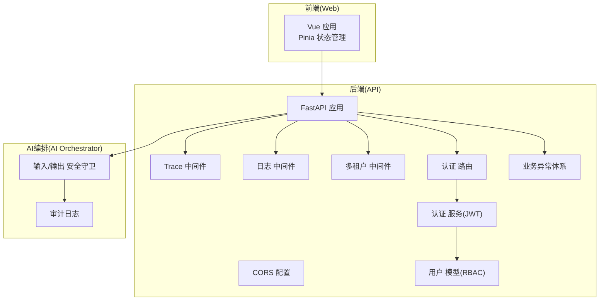
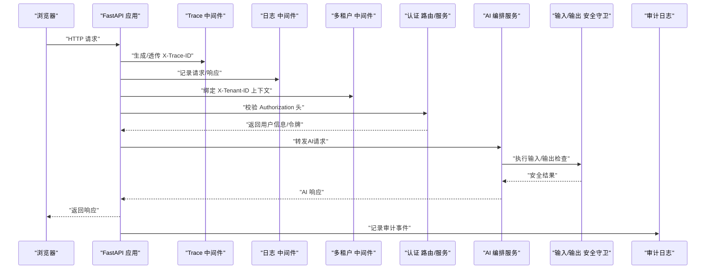
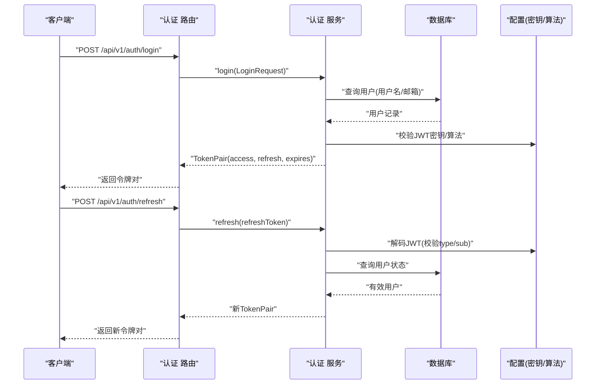
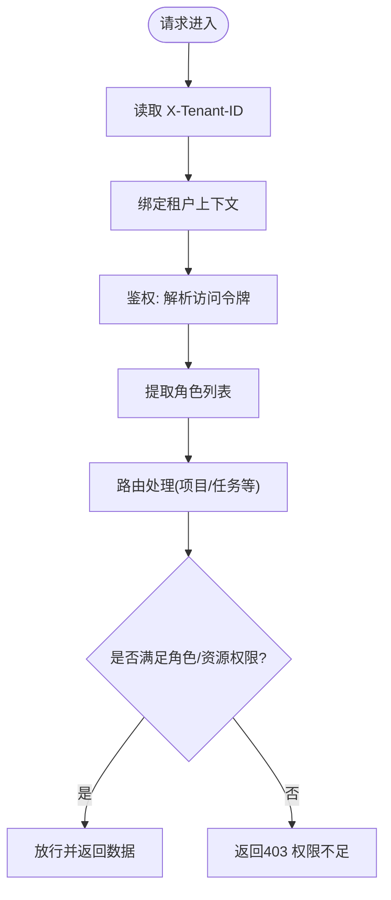
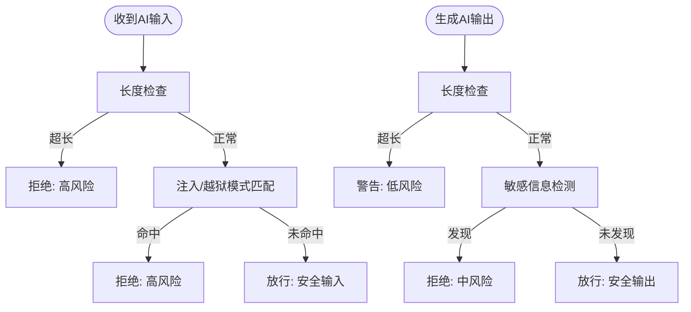
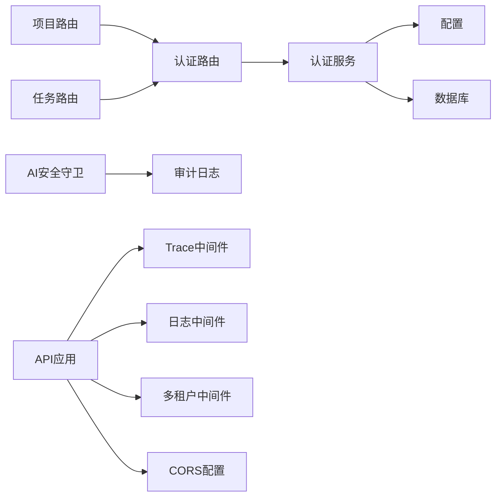

# 安全架构

<cite>
**本文引用的文件**
- [workspace/api/app/main.py](file://workspace/api/app/main.py)
- [workspace/api/app/middleware/cors.py](file://workspace/api/app/middleware/cors.py)
- [workspace/api/app/middleware/tenant.py](file://workspace/api/app/middleware/tenant.py)
- [workspace/api/app/middleware/logging.py](file://workspace/api/app/middleware/logging.py)
- [workspace/api/app/middleware/trace.py](file://workspace/api/app/middleware/trace.py)
- [workspace/api/app/routers/auth.py](file://workspace/api/app/routers/auth.py)
- [workspace/api/app/services/auth_service.py](file://workspace/api/app/services/auth_service.py)
- [workspace/api/app/schemas/auth.py](file://workspace/api/app/schemas/auth.py)
- [workspace/api/app/models/user.py](file://workspace/api/app/models/user.py)
- [workspace/api/app/config/settings.py](file://workspace/api/app/config/settings.py)
- [workspace/api/app/exceptions/biz.py](file://workspace/api/app/exceptions/biz.py)
- [workspace/api/app/exceptions/codes.py](file://workspace/api/app/exceptions/codes.py)
- [workspace/api/app/routers/projects.py](file://workspace/api/app/routers/projects.py)
- [workspace/api/app/routers/tasks.py](file://workspace/api/app/routers/tasks.py)
- [workspace/ai-orchestrator/app/safety/input_guard.py](file://workspace/ai-orchestrator/app/safety/input_guard.py)
- [workspace/ai-orchestrator/app/audit/logger.py](file://workspace/ai-orchestrator/app/audit/logger.py)
- [workspace/api/app/utils/crypto.py](file://workspace/api/app/utils/crypto.py)
- [workspace/web/src/stores/auth.ts](file://workspace/web/src/stores/auth.ts)
</cite>

## 目录
1. [引言](#引言)
2. [项目结构](#项目结构)
3. [核心组件](#核心组件)
4. [架构总览](#架构总览)
5. [详细组件分析](#详细组件分析)
6. [依赖分析](#依赖分析)
7. [性能考虑](#性能考虑)
8. [故障排查指南](#故障排查指南)
9. [结论](#结论)
10. [附录](#附录)

## 引言
本文件面向FDE工作台的“安全架构”，系统化梳理其在身份认证、授权控制、数据加密、网络安全、AI安全防护、审计与日志、监控告警以及合规性方面的设计与实现要点。文档同时给出威胁模型、攻击面分析与防护策略建议，并结合现有代码实现进行可视化说明，帮助开发者与安全人员快速理解与落地。

## 项目结构
后端采用FastAPI应用，前端采用Vue + Pinia，AI编排服务独立容器化运行。安全相关能力主要分布在API网关层（中间件、路由、异常体系）、认证服务（JWT）、业务路由（多租户上下文）、AI编排层（输入/输出安全守卫）与审计日志。

图表来源
- [workspace/api/app/main.py:1-73](file://workspace/api/app/main.py#L1-L73)
- [workspace/api/app/middleware/trace.py:1-30](file://workspace/api/app/middleware/trace.py#L1-L30)
- [workspace/api/app/middleware/logging.py:1-36](file://workspace/api/app/middleware/logging.py#L1-L36)
- [workspace/api/app/middleware/tenant.py:1-23](file://workspace/api/app/middleware/tenant.py#L1-L23)
- [workspace/api/app/middleware/cors.py:1-19](file://workspace/api/app/middleware/cors.py#L1-L19)
- [workspace/api/app/routers/auth.py:1-43](file://workspace/api/app/routers/auth.py#L1-L43)
- [workspace/api/app/services/auth_service.py:1-110](file://workspace/api/app/services/auth_service.py#L1-L110)
- [workspace/api/app/models/user.py:1-22](file://workspace/api/app/models/user.py#L1-L22)
- [workspace/ai-orchestrator/app/safety/input_guard.py:1-183](file://workspace/ai-orchestrator/app/safety/input_guard.py#L1-L183)
- [workspace/ai-orchestrator/app/audit/logger.py:1-136](file://workspace/ai-orchestrator/app/audit/logger.py#L1-L136)

章节来源
- [workspace/api/app/main.py:1-73](file://workspace/api/app/main.py#L1-L73)
- [workspace/api/app/middleware/trace.py:1-30](file://workspace/api/app/middleware/trace.py#L1-L30)
- [workspace/api/app/middleware/logging.py:1-36](file://workspace/api/app/middleware/logging.py#L1-L36)
- [workspace/api/app/middleware/tenant.py:1-23](file://workspace/api/app/middleware/tenant.py#L1-L23)
- [workspace/api/app/middleware/cors.py:1-19](file://workspace/api/app/middleware/cors.py#L1-L19)

## 核心组件
- 认证与令牌：基于JWT的登录/刷新/校验流程，支持访问令牌与刷新令牌分离，角色信息内嵌于访问令牌中。
- 授权与多租户：通过请求头注入租户上下文，结合用户角色列表实现资源级访问控制。
- 输入/输出安全：AI编排层内置输入注入检测、越狱尝试识别、敏感信息过滤与输出长度限制。
- 审计与日志：统一HTTP请求日志与AI交互审计日志，支持JSON格式与文件落盘。
- 网络安全：CORS白名单配置，请求追踪ID贯穿链路，便于问题定位与安全审计。
- 数据加密：密码使用bcrypt哈希存储；提供SHA-256工具函数用于数据完整性校验。

章节来源
- [workspace/api/app/services/auth_service.py:1-110](file://workspace/api/app/services/auth_service.py#L1-L110)
- [workspace/api/app/schemas/auth.py:1-32](file://workspace/api/app/schemas/auth.py#L1-L32)
- [workspace/api/app/models/user.py:1-22](file://workspace/api/app/models/user.py#L1-L22)
- [workspace/api/app/middleware/tenant.py:1-23](file://workspace/api/app/middleware/tenant.py#L1-L23)
- [workspace/ai-orchestrator/app/safety/input_guard.py:1-183](file://workspace/ai-orchestrator/app/safety/input_guard.py#L1-L183)
- [workspace/ai-orchestrator/app/audit/logger.py:1-136](file://workspace/ai-orchestrator/app/audit/logger.py#L1-L136)
- [workspace/api/app/middleware/cors.py:1-19](file://workspace/api/app/middleware/cors.py#L1-L19)
- [workspace/api/app/utils/crypto.py:1-21](file://workspace/api/app/utils/crypto.py#L1-L21)

## 架构总览
下图展示从浏览器到API再到AI编排的整体调用链路与安全控制点。

图表来源
- [workspace/api/app/main.py:1-73](file://workspace/api/app/main.py#L1-L73)
- [workspace/api/app/middleware/trace.py:1-30](file://workspace/api/app/middleware/trace.py#L1-L30)
- [workspace/api/app/middleware/logging.py:1-36](file://workspace/api/app/middleware/logging.py#L1-L36)
- [workspace/api/app/middleware/tenant.py:1-23](file://workspace/api/app/middleware/tenant.py#L1-L23)
- [workspace/api/app/routers/auth.py:1-43](file://workspace/api/app/routers/auth.py#L1-L43)
- [workspace/api/app/services/auth_service.py:1-110](file://workspace/api/app/services/auth_service.py#L1-L110)
- [workspace/ai-orchestrator/app/safety/input_guard.py:1-183](file://workspace/ai-orchestrator/app/safety/input_guard.py#L1-L183)
- [workspace/ai-orchestrator/app/audit/logger.py:1-136](file://workspace/ai-orchestrator/app/audit/logger.py#L1-L136)

## 详细组件分析

### 身份认证与JWT机制
- 登录接口接收用户名或邮箱+密码，匹配用户后签发访问令牌与刷新令牌，访问令牌包含角色列表与过期时间。
- 刷新接口校验刷新令牌类型与有效性，重新签发新的令牌对。
- 获取当前用户接口解析访问令牌，校验类型与签名，返回用户基本信息与角色列表。
- 密码以bcrypt哈希存储，避免明文泄露风险。

图表来源
- [workspace/api/app/routers/auth.py:1-43](file://workspace/api/app/routers/auth.py#L1-L43)
- [workspace/api/app/services/auth_service.py:1-110](file://workspace/api/app/services/auth_service.py#L1-L110)
- [workspace/api/app/config/settings.py:1-81](file://workspace/api/app/config/settings.py#L1-L81)

章节来源
- [workspace/api/app/routers/auth.py:1-43](file://workspace/api/app/routers/auth.py#L1-L43)
- [workspace/api/app/services/auth_service.py:1-110](file://workspace/api/app/services/auth_service.py#L1-L110)
- [workspace/api/app/schemas/auth.py:1-32](file://workspace/api/app/schemas/auth.py#L1-L32)
- [workspace/api/app/models/user.py:1-22](file://workspace/api/app/models/user.py#L1-L22)
- [workspace/api/app/config/settings.py:1-81](file://workspace/api/app/config/settings.py#L1-L81)

### 授权控制与多租户权限模型
- 多租户：通过请求头X-Tenant-ID注入租户上下文，便于后续按租户隔离数据与策略。
- RBAC：用户模型包含逗号分隔的角色字符串，服务层将其解析为列表，路由层可基于角色进行资源级授权。
- 示例：项目与任务路由均依赖current_user获取用户上下文，后续可在服务层或路由层扩展基于角色的访问控制逻辑。

图表来源
- [workspace/api/app/middleware/tenant.py:1-23](file://workspace/api/app/middleware/tenant.py#L1-L23)
- [workspace/api/app/services/auth_service.py:56-76](file://workspace/api/app/services/auth_service.py#L56-L76)
- [workspace/api/app/models/user.py:19-22](file://workspace/api/app/models/user.py#L19-L22)
- [workspace/api/app/routers/projects.py:1-82](file://workspace/api/app/routers/projects.py#L1-L82)
- [workspace/api/app/routers/tasks.py:1-70](file://workspace/api/app/routers/tasks.py#L1-L70)

章节来源
- [workspace/api/app/middleware/tenant.py:1-23](file://workspace/api/app/middleware/tenant.py#L1-L23)
- [workspace/api/app/models/user.py:1-22](file://workspace/api/app/models/user.py#L1-L22)
- [workspace/api/app/routers/projects.py:1-82](file://workspace/api/app/routers/projects.py#L1-L82)
- [workspace/api/app/routers/tasks.py:1-70](file://workspace/api/app/routers/tasks.py#L1-L70)

### 数据加密与密码存储
- 密码：使用bcrypt进行哈希存储，避免明文泄露；登录时比对哈希值。
- 令牌：使用随机安全字符串生成短期令牌，配合JWT实现会话管理。
- 哈希：提供SHA-256工具函数，可用于数据完整性校验或敏感字段摘要。

章节来源
- [workspace/api/app/services/auth_service.py:78-79](file://workspace/api/app/services/auth_service.py#L78-L79)
- [workspace/api/app/utils/crypto.py:1-21](file://workspace/api/app/utils/crypto.py#L1-L21)

### 网络安全与CORS
- CORS：在应用启动时注册CORSMiddleware，允许指定来源、方法与头部，确保跨域访问受控。
- 请求追踪：Trace中间件为每个请求生成唯一跟踪ID，写入响应头，便于端到端追踪。
- 日志：Logging中间件记录请求开始与完成事件，包含方法、路径与状态码，辅助安全审计。

章节来源
- [workspace/api/app/main.py:44-52](file://workspace/api/app/main.py#L44-L52)
- [workspace/api/app/middleware/cors.py:1-19](file://workspace/api/app/middleware/cors.py#L1-L19)
- [workspace/api/app/middleware/trace.py:1-30](file://workspace/api/app/middleware/trace.py#L1-L30)
- [workspace/api/app/middleware/logging.py:1-36](file://workspace/api/app/middleware/logging.py#L1-L36)

### AI安全防护与输出净化
- 输入守卫：检测多种提示注入模式（忽略指令、角色扮演、系统标签、编码绕过、假设场景等），限制最大输入长度，触发高/中风险判定。
- 输出守卫：限制最大输出长度，检测潜在敏感信息（如信用卡号、邮箱），阻断有害内容传播。
- 审计：AI交互事件（聊天、工具调用、RAG检索、安全拦截）统一记录到JSONL文件，保留trace_id、耗时、token数、安全原因等字段。

图表来源
- [workspace/ai-orchestrator/app/safety/input_guard.py:1-183](file://workspace/ai-orchestrator/app/safety/input_guard.py#L1-L183)
- [workspace/ai-orchestrator/app/audit/logger.py:1-136](file://workspace/ai-orchestrator/app/audit/logger.py#L1-L136)

章节来源
- [workspace/ai-orchestrator/app/safety/input_guard.py:1-183](file://workspace/ai-orchestrator/app/safety/input_guard.py#L1-L183)
- [workspace/ai-orchestrator/app/audit/logger.py:1-136](file://workspace/ai-orchestrator/app/audit/logger.py#L1-L136)

### 安全审计、日志记录与监控告警
- HTTP审计：Logging中间件记录请求/响应元数据，便于异常追踪与合规审计。
- AI审计：审计日志模块记录聊天、工具调用、RAG检索、安全拦截等事件，支持文件落盘与标准错误回退。
- 追踪ID：Trace中间件在请求头与响应头传递X-Trace-ID，串联前后端与AI服务链路。
- 建议：结合外部日志平台（如ELK/OTel）采集JSON日志，建立告警规则（异常状态码、安全拦截、超时/超长）。

章节来源
- [workspace/api/app/middleware/logging.py:1-36](file://workspace/api/app/middleware/logging.py#L1-L36)
- [workspace/api/app/middleware/trace.py:1-30](file://workspace/api/app/middleware/trace.py#L1-L30)
- [workspace/ai-orchestrator/app/audit/logger.py:1-136](file://workspace/ai-orchestrator/app/audit/logger.py#L1-L136)

### 输入验证、输出过滤与安全中间件
- 输入验证：Pydantic模型对登录参数进行最小/最大长度约束，减少异常输入。
- 输出过滤：AI安全守卫对输出长度与敏感信息进行过滤，降低数据泄露风险。
- 安全中间件：Trace/Logging/Tenant中间件在不侵入业务逻辑的前提下，统一增强可观测性与安全性。

章节来源
- [workspace/api/app/schemas/auth.py:1-32](file://workspace/api/app/schemas/auth.py#L1-L32)
- [workspace/ai-orchestrator/app/safety/input_guard.py:1-183](file://workspace/ai-orchestrator/app/safety/input_guard.py#L1-L183)
- [workspace/api/app/middleware/trace.py:1-30](file://workspace/api/app/middleware/trace.py#L1-L30)
- [workspace/api/app/middleware/logging.py:1-36](file://workspace/api/app/middleware/logging.py#L1-L36)
- [workspace/api/app/middleware/tenant.py:1-23](file://workspace/api/app/middleware/tenant.py#L1-L23)

### 前端令牌管理与会话生命周期
- 前端使用Pinia存储访问令牌与刷新令牌，登录成功后持久化到本地存储；刷新失败则抛出异常并清理状态。
- 建议：将令牌存储在HttpOnly Cookie中，避免XSS直接读取；刷新令牌也应具备更强的保护与轮换策略。

章节来源
- [workspace/web/src/stores/auth.ts:1-56](file://workspace/web/src/stores/auth.ts#L1-L56)

## 依赖分析
- 组件耦合：认证服务依赖配置与数据库；路由层仅依赖服务层与依赖注入；AI安全守卫与审计日志相互独立但共同服务于AI编排。
- 外部依赖：JWT库、bcrypt、structlog、fastapi中间件栈。
- 潜在风险：JWT密钥长度校验、CORS白名单、TraceID生成与日志落盘的健壮性需持续关注。

图表来源
- [workspace/api/app/services/auth_service.py:1-110](file://workspace/api/app/services/auth_service.py#L1-L110)
- [workspace/api/app/config/settings.py:1-81](file://workspace/api/app/config/settings.py#L1-L81)
- [workspace/api/app/routers/auth.py:1-43](file://workspace/api/app/routers/auth.py#L1-L43)
- [workspace/api/app/routers/projects.py:1-82](file://workspace/api/app/routers/projects.py#L1-L82)
- [workspace/api/app/routers/tasks.py:1-70](file://workspace/api/app/routers/tasks.py#L1-L70)
- [workspace/ai-orchestrator/app/safety/input_guard.py:1-183](file://workspace/ai-orchestrator/app/safety/input_guard.py#L1-L183)
- [workspace/ai-orchestrator/app/audit/logger.py:1-136](file://workspace/ai-orchestrator/app/audit/logger.py#L1-L136)
- [workspace/api/app/main.py:1-73](file://workspace/api/app/main.py#L1-L73)

章节来源
- [workspace/api/app/services/auth_service.py:1-110](file://workspace/api/app/services/auth_service.py#L1-L110)
- [workspace/api/app/routers/auth.py:1-43](file://workspace/api/app/routers/auth.py#L1-L43)
- [workspace/api/app/routers/projects.py:1-82](file://workspace/api/app/routers/projects.py#L1-L82)
- [workspace/api/app/routers/tasks.py:1-70](file://workspace/api/app/routers/tasks.py#L1-L70)
- [workspace/ai-orchestrator/app/safety/input_guard.py:1-183](file://workspace/ai-orchestrator/app/safety/input_guard.py#L1-L183)
- [workspace/ai-orchestrator/app/audit/logger.py:1-136](file://workspace/ai-orchestrator/app/audit/logger.py#L1-L136)
- [workspace/api/app/main.py:1-73](file://workspace/api/app/main.py#L1-L73)

## 性能考虑
- JWT解码与bcrypt比对：建议在缓存层复用用户信息，减少数据库查询；对频繁刷新请求增加速率限制。
- 中间件开销：Trace/Logging中间件为每次请求增加少量CPU与IO开销，建议在生产环境启用异步日志与批量落盘。
- AI安全守卫：正则匹配与敏感信息扫描可能带来CPU消耗，建议对超长输入提前短路，限制并发阈值。
- CORS与网络：严格白名单与预检缓存可减少跨域握手成本。

## 故障排查指南
- 认证失败/令牌无效：检查JWT密钥长度校验与算法配置；确认访问令牌类型为“access”且未过期；核对用户状态。
- 权限不足：确认用户角色列表与目标资源的授权策略；检查多租户上下文是否正确绑定。
- AI安全拦截：查看审计日志中的安全原因与严重级别；调整输入/输出长度阈值或敏感词规则。
- 日志与追踪：确认TraceID是否在请求/响应头中传递；检查日志格式与落盘路径；关注审计日志写入异常回退。

章节来源
- [workspace/api/app/config/settings.py:63-72](file://workspace/api/app/config/settings.py#L63-L72)
- [workspace/api/app/services/auth_service.py:41-76](file://workspace/api/app/services/auth_service.py#L41-L76)
- [workspace/api/app/exceptions/biz.py:1-170](file://workspace/api/app/exceptions/biz.py#L1-L170)
- [workspace/api/app/exceptions/codes.py:1-76](file://workspace/api/app/exceptions/codes.py#L1-L76)
- [workspace/ai-orchestrator/app/audit/logger.py:97-102](file://workspace/ai-orchestrator/app/audit/logger.py#L97-L102)

## 结论
FDE工作台在安全方面已形成较为完整的闭环：前端令牌管理、后端JWT认证与RBAC、多租户上下文、AI安全守卫与审计日志、以及统一的追踪与日志中间件。建议在生产环境中进一步强化密钥管理、CORS白名单、Cookie安全属性、速率限制与告警联动，并完善合规性检查与数据脱敏策略。

## 附录
- 威胁模型与攻击面
  - 提示注入与越狱：通过AI安全守卫与严格的输入/输出过滤缓解。
  - 令牌滥用：通过JWT类型校验、过期时间与刷新令牌策略降低风险。
  - 权限提升：通过RBAC与多租户上下文限制资源访问。
  - 跨域与中间人：通过CORS白名单与HTTPS传输保障。
  - 日志与审计：通过统一审计与追踪ID支撑取证与合规。
- 合规性建议
  - 数据最小化与去标识化；敏感字段脱敏；访问日志保留期限与删除策略。
  - 定期密钥轮换与算法升级；对外部集成的凭据进行安全存储与轮换。
  - 建立安全事件响应流程与演练计划。