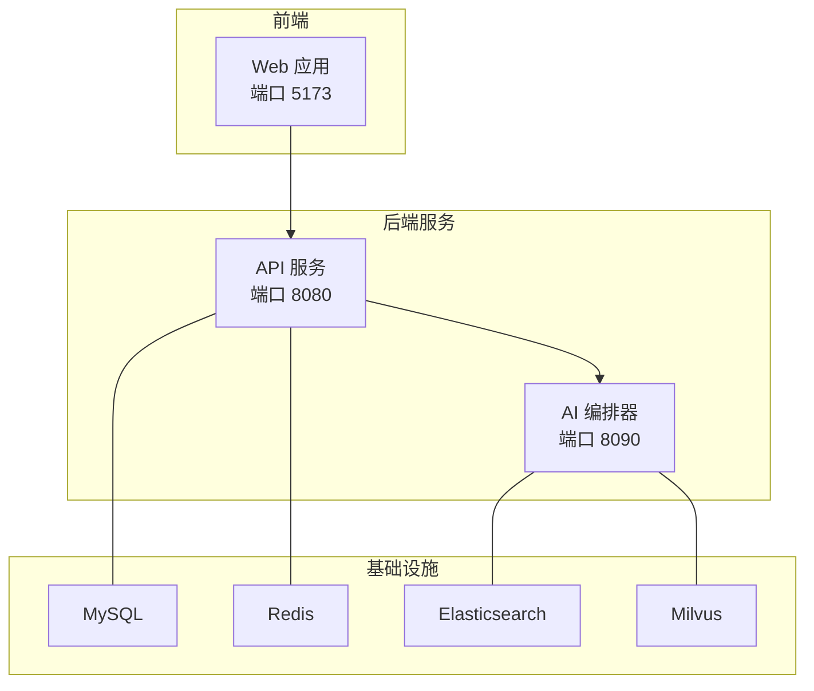
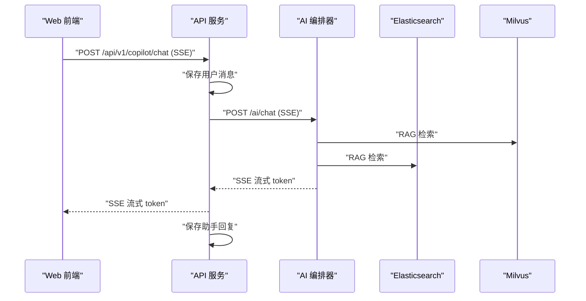
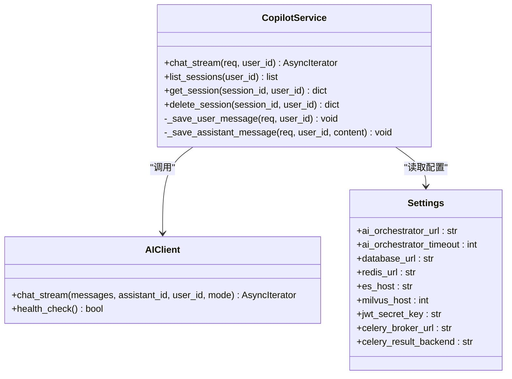
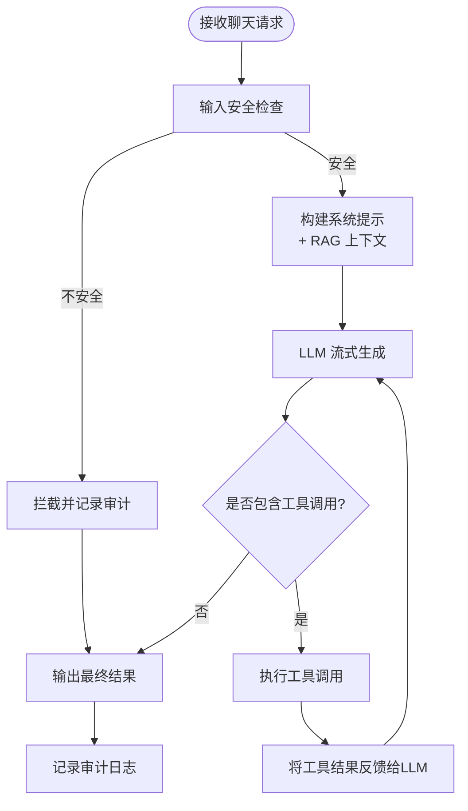
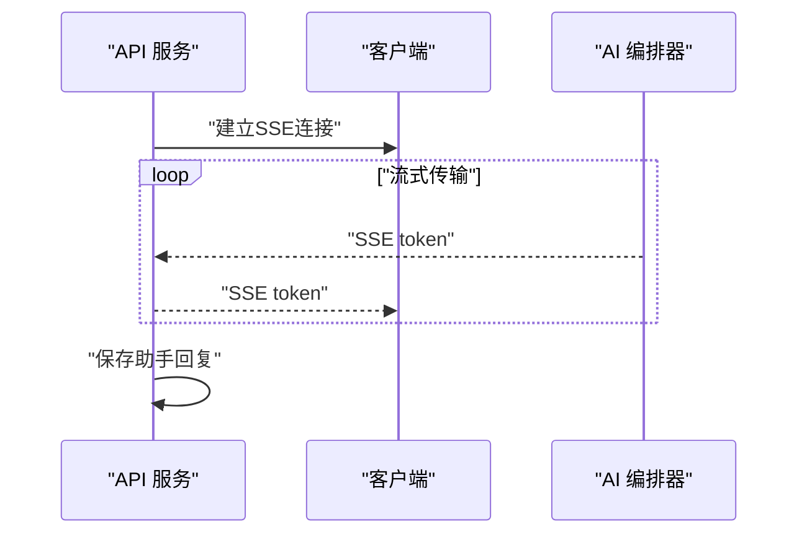

# 微服务架构

<cite>
**本文引用的文件**
- [workspace/ai-orchestrator/README.md](file://workspace/ai-orchestrator/README.md)
- [workspace/api/README.md](file://workspace/api/README.md)
- [workspace/ai-orchestrator/pyproject.toml](file://workspace/ai-orchestrator/pyproject.toml)
- [workspace/api/pyproject.toml](file://workspace/api/pyproject.toml)
- [workspace/ai-orchestrator/app/main.py](file://workspace/ai-orchestrator/app/main.py)
- [workspace/api/app/main.py](file://workspace/api/app/main.py)
- [workspace/ai-orchestrator/app/orchestrator/graph.py](file://workspace/ai-orchestrator/app/orchestrator/graph.py)
- [workspace/api/app/routers/copilot.py](file://workspace/api/app/routers/copilot.py)
- [workspace/api/app/ai_client/client.py](file://workspace/api/app/ai_client/client.py)
- [workspace/ai-orchestrator/app/routing/router.py](file://workspace/ai-orchestrator/app/routing/router.py)
- [workspace/ai-orchestrator/app/routing/circuit_breaker.py](file://workspace/ai-orchestrator/app/routing/circuit_breaker.py)
- [workspace/api/app/middleware/tenant.py](file://workspace/api/app/middleware/tenant.py)
- [workspace/api/app/config/settings.py](file://workspace/api/app/config/settings.py)
- [workspace/ai-orchestrator/app/config.py](file://workspace/ai-orchestrator/app/config.py)
- [workspace/api/app/services/copilot_service.py](file://workspace/api/app/services/copilot_service.py)
- [workspace/ai-orchestrator/app/tools/base.py](file://workspace/ai-orchestrator/app/tools/base.py)
- [workspace/api/app/tasks/data_sync.py](file://workspace/api/app/tasks/data_sync.py)
- [workspace/infra/docker-compose/docker-compose.yml](file://workspace/infra/docker-compose/docker-compose.yml)
</cite>

## 目录
1. [引言](#引言)
2. [项目结构](#项目结构)
3. [核心组件](#核心组件)
4. [架构总览](#架构总览)
5. [组件详解](#组件详解)
6. [依赖关系分析](#依赖关系分析)
7. [性能考量](#性能考量)
8. [故障排查指南](#故障排查指南)
9. [结论](#结论)
10. [附录](#附录)

## 引言
本文件面向FDE工作台的微服务架构，聚焦两大核心服务：API服务（后端业务服务）与AI编排器（AI Orchestrator）。文档从设计理念、实现方式、服务间通信、数据一致性、故障隔离、多租户与权限控制、服务发现与负载均衡、熔断器设计、数据同步与事件驱动、异步处理、监控与追踪等方面进行系统化阐述，并提供架构图、交互图与部署拓扑图，帮助读者快速理解并落地该微服务体系。

## 项目结构
FDE工作台采用前后端分离与双微服务架构：
- API服务（后端业务服务）：提供REST接口与SSE流式能力，负责业务编排、鉴权、会话管理、RAG索引触发、异步任务等。
- AI编排器（AI Orchestrator）：独立部署的AI编排服务，提供LangGraph多Agent编排、RAG检索、工具函数调用、安全防护与审计等能力。
- 基础设施：MySQL、Redis、Elasticsearch、Milvus、Web前端容器通过Docker Compose统一编排。



图表来源
- [workspace/infra/docker-compose/docker-compose.yml:1-132](file://workspace/infra/docker-compose/docker-compose.yml#L1-L132)
- [workspace/api/app/main.py:36-73](file://workspace/api/app/main.py#L36-L73)
- [workspace/ai-orchestrator/app/main.py:43-47](file://workspace/ai-orchestrator/app/main.py#L43-L47)

章节来源
- [workspace/infra/docker-compose/docker-compose.yml:1-132](file://workspace/infra/docker-compose/docker-compose.yml#L1-L132)
- [workspace/api/README.md:1-50](file://workspace/api/README.md#L1-L50)
- [workspace/ai-orchestrator/README.md:1-51](file://workspace/ai-orchestrator/README.md#L1-L51)

## 核心组件
- API服务（后端业务服务）
  - 职责：对外提供REST接口与SSE；编排业务流程；调用AI编排器；维护会话与消息；触发异步任务；多租户上下文注入；统一异常处理与日志追踪。
  - 关键模块：routers（路由）、services（业务服务）、repositories（数据访问）、tasks（Celery异步任务）、ai_client（AI编排器HTTP客户端）。
- AI编排器（AI Orchestrator）
  - 职责：LangGraph多Agent编排；RAG检索（向量+全文+重排序）；工具函数调用；多模型路由与熔断；安全防护与审计；SSE流式输出。
  - 关键模块：orchestrator（主图与子图）、rag（检索与索引）、routing（路由与熔断）、tools（工具注册与执行）、safety（输入防护）、audit（审计日志）。

章节来源
- [workspace/api/README.md:1-50](file://workspace/api/README.md#L1-L50)
- [workspace/ai-orchestrator/README.md:1-51](file://workspace/ai-orchestrator/README.md#L1-L51)
- [workspace/api/app/main.py:58-67](file://workspace/api/app/main.py#L58-L67)
- [workspace/ai-orchestrator/app/main.py:89-172](file://workspace/ai-orchestrator/app/main.py#L89-L172)

## 架构总览
API服务与AI编排器通过HTTP进行松耦合通信，API服务作为上游，AI编排器作为下游AI能力提供者。两者均依赖共享的数据库、缓存与向量/搜索存储。API服务负责业务域逻辑与用户交互，AI编排器专注于AI推理与工具编排。



图表来源
- [workspace/api/app/routers/copilot.py:29-65](file://workspace/api/app/routers/copilot.py#L29-L65)
- [workspace/api/app/services/copilot_service.py:21-56](file://workspace/api/app/services/copilot_service.py#L21-L56)
- [workspace/ai-orchestrator/app/main.py:89-172](file://workspace/ai-orchestrator/app/main.py#L89-L172)
- [workspace/ai-orchestrator/app/orchestrator/graph.py:113-183](file://workspace/ai-orchestrator/app/orchestrator/graph.py#L113-L183)

## 组件详解

### API服务（后端业务服务）
- 设计理念
  - 以领域模型与服务层解耦业务逻辑，使用SSE提供实时对话体验；通过中间件实现多租户上下文与分布式追踪；通过Celery实现异步任务与数据同步。
- 关键实现
  - 路由与SSE：/api/v1/copilot/chat与/query通过CopilotService转发至AI编排器，并在本地持久化会话与消息。
  - 会话与消息：会话仓库与消息仓库分别管理会话与消息生命周期。
  - 异步任务：Celery任务触发ES/Milvus同步，具备指数退避与抖动重试。
  - 中间件：TenantMiddleware注入租户上下文；TraceMiddleware与LoggingMiddleware提供追踪与日志。
  - 配置：Settings集中管理数据库、缓存、外部集成、AI编排器地址与超时等参数。
- 服务发现与负载均衡
  - 在Docker Compose中通过服务名解析（如api、ai-orchestrator），容器内直接通过服务名访问，无需额外服务发现组件。
- 故障隔离与降级
  - 当AI编排器不可达时，API服务返回模拟响应，保障前端可用性。
- 权限与多租户
  - 通过TenantMiddleware从请求头提取租户ID并绑定到日志上下文；业务层结合用户上下文实现权限校验。



图表来源
- [workspace/api/app/services/copilot_service.py:15-111](file://workspace/api/app/services/copilot_service.py#L15-L111)
- [workspace/api/app/ai_client/client.py:15-61](file://workspace/api/app/ai_client/client.py#L15-L61)
- [workspace/api/app/config/settings.py:12-81](file://workspace/api/app/config/settings.py#L12-L81)

章节来源
- [workspace/api/app/routers/copilot.py:29-137](file://workspace/api/app/routers/copilot.py#L29-L137)
- [workspace/api/app/services/copilot_service.py:21-111](file://workspace/api/app/services/copilot_service.py#L21-L111)
- [workspace/api/app/ai_client/client.py:22-58](file://workspace/api/app/ai_client/client.py#L22-L58)
- [workspace/api/app/middleware/tenant.py:11-23](file://workspace/api/app/middleware/tenant.py#L11-L23)
- [workspace/api/app/config/settings.py:36-47](file://workspace/api/app/config/settings.py#L36-L47)

### AI编排器（AI Orchestrator）
- 设计理念
  - 基于LangGraph构建主图与子图，支持多Agent路由与工具函数调用；内置RAG检索与混合重排；提供多模型路由与熔断器；内置输入安全与审计。
- 关键实现
  - LangGraph编排：根据assistant_id映射到具体Agent，执行RAG检索、构建系统提示、LLM流式生成、工具调用与二次推理。
  - RAG检索：结合Milvus向量与Elasticsearch全文检索，使用RRF与重排序提升召回质量。
  - 工具体系：工具注册与定义，区分只读与写操作（写操作需用户确认）。
  - 路由与熔断：优先级路由（DashScope → OpenAI → Mock），失败自动降级；熔断器避免雪崩。
  - 审计与安全：输入注入检测与拦截，审计日志记录输入/输出/耗时/错误。
- 服务发现与负载均衡
  - 通过配置项API_BASE_URL指向API服务，用于工具调用回溯业务数据；AI编排器内部不暴露给Web直连。
- 数据一致性
  - RAG索引通过API服务的Celery任务触发，AI编排器提供索引与删除接口供上游调用，确保知识库变更与检索一致。



图表来源
- [workspace/ai-orchestrator/app/main.py:90-172](file://workspace/ai-orchestrator/app/main.py#L90-L172)
- [workspace/ai-orchestrator/app/orchestrator/graph.py:113-183](file://workspace/ai-orchestrator/app/orchestrator/graph.py#L113-L183)
- [workspace/ai-orchestrator/app/routing/router.py:54-96](file://workspace/ai-orchestrator/app/routing/router.py#L54-L96)

章节来源
- [workspace/ai-orchestrator/app/main.py:89-307](file://workspace/ai-orchestrator/app/main.py#L89-L307)
- [workspace/ai-orchestrator/app/orchestrator/graph.py:25-211](file://workspace/ai-orchestrator/app/orchestrator/graph.py#L25-L211)
- [workspace/ai-orchestrator/app/routing/router.py:14-124](file://workspace/ai-orchestrator/app/routing/router.py#L14-L124)
- [workspace/ai-orchestrator/app/routing/circuit_breaker.py:18-129](file://workspace/ai-orchestrator/app/routing/circuit_breaker.py#L18-L129)
- [workspace/ai-orchestrator/app/tools/base.py:50-89](file://workspace/ai-orchestrator/app/tools/base.py#L50-L89)

### 服务间通信机制
- API服务调用AI编排器
  - 使用httpx异步客户端发起SSE流式请求，逐行解析data:行，将token透传给前端。
  - 当连接失败时，返回模拟响应，保障前端体验。
- AI编排器调用API服务
  - 通过配置项API_BASE_URL调用业务API（例如查询业务数据），用于工具函数回溯。
- SSE与心跳
  - API服务在SSE响应头中设置心跳间隔与追踪ID，便于前端与监控侧识别。



图表来源
- [workspace/api/app/routers/copilot.py:38-65](file://workspace/api/app/routers/copilot.py#L38-L65)
- [workspace/api/app/services/copilot_service.py:26-56](file://workspace/api/app/services/copilot_service.py#L26-L56)
- [workspace/ai-orchestrator/app/main.py:130-172](file://workspace/ai-orchestrator/app/main.py#L130-L172)

章节来源
- [workspace/api/app/ai_client/client.py:22-58](file://workspace/api/app/ai_client/client.py#L22-L58)
- [workspace/api/app/routers/copilot.py:29-101](file://workspace/api/app/routers/copilot.py#L29-L101)

### 多租户架构与权限控制
- 多租户
  - 通过TenantMiddleware从请求头提取X-Tenant-ID并绑定到structlog上下文，便于日志与审计关联。
- 权限控制
  - API服务在路由层使用current_user依赖注入获取用户上下文，结合业务仓储与服务层逻辑实现RBAC与资源级权限校验。
- 租户隔离
  - 数据层面：每个租户对应独立的业务数据（会话、消息、项目等）；日志层面：通过租户ID上下文隔离不同租户的审计与追踪。

章节来源
- [workspace/api/app/middleware/tenant.py:11-23](file://workspace/api/app/middleware/tenant.py#L11-L23)
- [workspace/api/app/routers/copilot.py:34-35](file://workspace/api/app/routers/copilot.py#L34-L35)

### 服务发现、负载均衡与熔断器设计
- 服务发现
  - Docker Compose通过服务名解析，容器内直接使用服务名访问（如api、ai-orchestrator、milvus、elasticsearch）。
- 负载均衡
  - 本项目未引入外部LB组件，容器内通过服务名访问；若扩展可借助Kubernetes或反向代理实现。
- 熔断器
  - AI编排器对多模型提供者（DashScope/OpenAI/Mock）实施熔断器保护，失败阈值与恢复时间可配置，避免级联故障。

章节来源
- [workspace/ai-orchestrator/app/routing/router.py:14-124](file://workspace/ai-orchestrator/app/routing/router.py#L14-L124)
- [workspace/ai-orchestrator/app/routing/circuit_breaker.py:36-129](file://workspace/ai-orchestrator/app/routing/circuit_breaker.py#L36-L129)
- [workspace/infra/docker-compose/docker-compose.yml:72-116](file://workspace/infra/docker-compose/docker-compose.yml#L72-L116)

### 数据同步、事件驱动与异步处理
- 数据同步
  - API服务通过Celery任务将实体同步到Elasticsearch与Milvus，具备自动重试与退避策略。
- 事件驱动
  - 文件上传或知识库更新后，触发RAG索引任务，AI编排器提供索引/删除接口供上游调用。
- 异步处理
  - Celery Worker与Beat负责任务调度与执行；API服务在SSE过程中保持非阻塞。

章节来源
- [workspace/api/app/tasks/data_sync.py:7-28](file://workspace/api/app/tasks/data_sync.py#L7-L28)
- [workspace/ai-orchestrator/app/main.py:253-306](file://workspace/ai-orchestrator/app/main.py#L253-L306)

### 监控、日志聚合与分布式追踪
- 日志
  - API服务使用structlog与中间件统一记录请求日志；AI编排器在安全拦截与审计中记录关键事件。
- 追踪
  - API服务在SSE响应头中注入X-Trace-Id，便于前端与后端关联一次会话的链路。
- 健康检查
  - API与AI编排器均提供/health端点，Docker Compose中配置健康检查与重启策略。

章节来源
- [workspace/api/app/main.py:51-52](file://workspace/api/app/main.py#L51-L52)
- [workspace/ai-orchestrator/app/main.py:79-86](file://workspace/ai-orchestrator/app/main.py#L79-L86)
- [workspace/infra/docker-compose/docker-compose.yml:88-116](file://workspace/infra/docker-compose/docker-compose.yml#L88-L116)

## 依赖关系分析
- 语言与框架
  - API服务：FastAPI、SQLAlchemy、Celery、Pydantic、httpx、structlog、OpenTelemetry等。
  - AI编排器：FastAPI、LangGraph、LangChain、Jinja2、Pymilvus、Elasticsearch等。
- 外部依赖
  - MySQL（业务数据）、Redis（缓存/队列）、Elasticsearch（全文检索）、Milvus（向量检索）。
- 内部依赖
  - API服务依赖AI编排器提供的SSE接口；AI编排器依赖API服务的工具调用回溯能力。

```mermaid
graph LR
API["API 服务"] --> |HTTP(SSE)| ORCH["AI 编排器"]
API --> MYSQL["MySQL"]
API --> REDIS["Redis"]
ORCH --> ES["Elasticsearch"]
ORCH --> MILVUS["Milvus"]
```

图表来源
- [workspace/api/pyproject.toml:9-27](file://workspace/api/pyproject.toml#L9-L27)
- [workspace/ai-orchestrator/pyproject.toml:8-19](file://workspace/ai-orchestrator/pyproject.toml#L8-L19)
- [workspace/infra/docker-compose/docker-compose.yml:72-116](file://workspace/infra/docker-compose/docker-compose.yml#L72-L116)

章节来源
- [workspace/api/pyproject.toml:9-27](file://workspace/api/pyproject.toml#L9-L27)
- [workspace/ai-orchestrator/pyproject.toml:8-19](file://workspace/ai-orchestrator/pyproject.toml#L8-L19)

## 性能考量
- 流式传输
  - SSE逐token推送，降低首字节延迟，提升用户体验。
- 并发与异步
  - API服务与AI编排器均采用异步I/O，避免阻塞；Celery异步任务处理数据同步。
- 缓存与索引
  - Redis缓存热点数据；Elasticsearch与Milvus优化检索性能。
- 超时与降级
  - AI编排器超时可配置；当AI服务不可用时，API服务返回模拟响应，保障可用性。

## 故障排查指南
- 健康检查
  - 访问/health端点确认服务状态；Docker Compose中查看容器健康检查日志。
- 日志定位
  - 结合X-Trace-Id与租户ID上下文，定位请求链路与错误来源。
- 熔断器状态
  - 查看AI编排器/health返回的提供者状态，判断熔断器是否处于OPEN/HALF_OPEN状态。
- RAG检索失败
  - 检查Milvus与Elasticsearch连通性；确认索引任务是否成功执行。

章节来源
- [workspace/ai-orchestrator/app/main.py:79-86](file://workspace/ai-orchestrator/app/main.py#L79-L86)
- [workspace/ai-orchestrator/app/routing/router.py:97-111](file://workspace/ai-orchestrator/app/routing/router.py#L97-L111)
- [workspace/api/app/ai_client/client.py:50-58](file://workspace/api/app/ai_client/client.py#L50-L58)

## 结论
FDE工作台通过清晰的服务边界与松耦合通信，实现了业务服务与AI编排服务的高效协作。API服务专注业务域与用户体验，AI编排器专注AI推理与工具编排。配合多租户上下文、安全与审计、熔断与降级、异步任务与SSE流式传输，整体架构具备良好的可扩展性、稳定性与可观测性。

## 附录
- 部署拓扑图（容器编排）
  - Docker Compose定义了API、AI编排器、Web、MySQL、Redis、Elasticsearch、Milvus的依赖与端口映射，适合开发与演示环境。

章节来源
- [workspace/infra/docker-compose/docker-compose.yml:1-132](file://workspace/infra/docker-compose/docker-compose.yml#L1-L132)