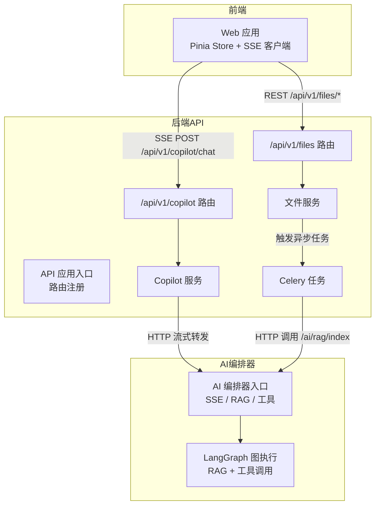
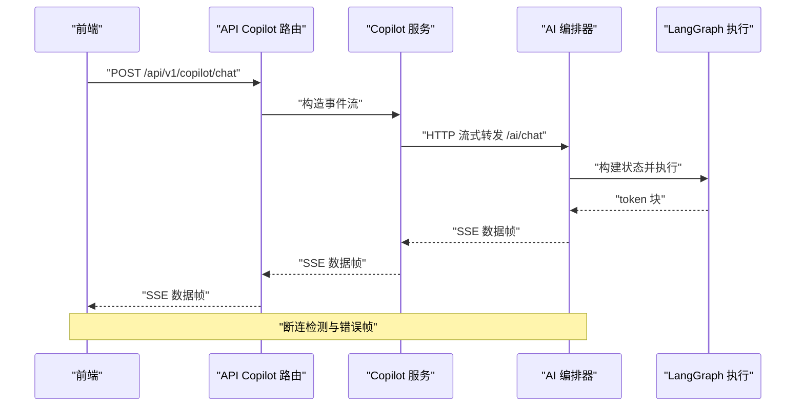
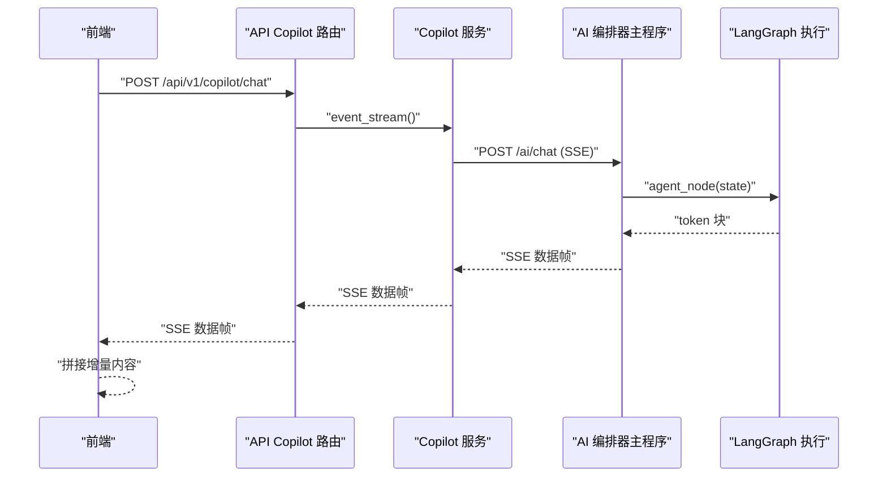
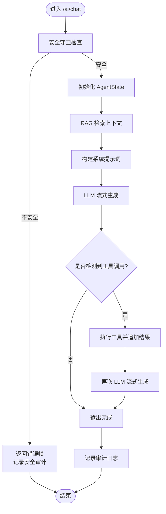
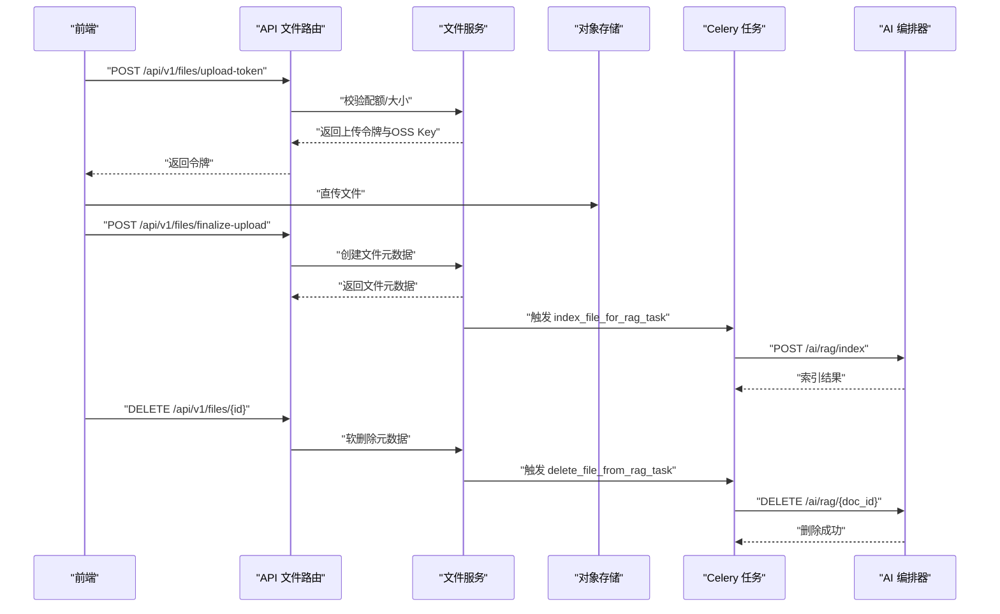
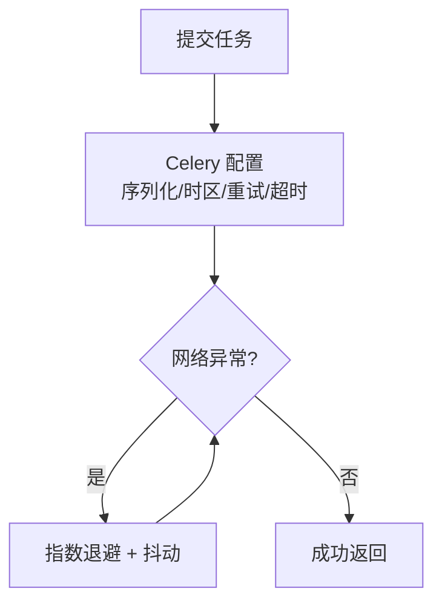
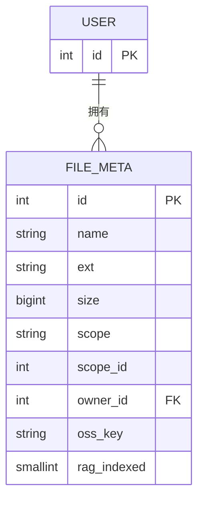
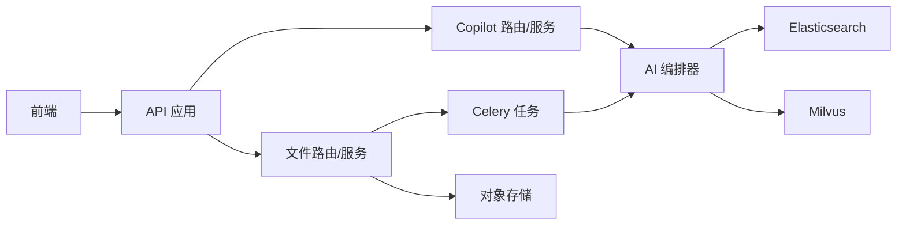

# 数据流设计

<cite>
**本文引用的文件**
- [workspace/ai-orchestrator/app/main.py](file://workspace/ai-orchestrator/app/main.py)
- [workspace/ai-orchestrator/app/orchestrator/graph.py](file://workspace/ai-orchestrator/app/orchestrator/graph.py)
- [workspace/api/app/main.py](file://workspace/api/app/main.py)
- [workspace/api/app/routers/copilot.py](file://workspace/api/app/routers/copilot.py)
- [workspace/api/app/services/copilot_service.py](file://workspace/api/app/services/copilot_service.py)
- [workspace/api/app/routers/files.py](file://workspace/api/app/routers/files.py)
- [workspace/api/app/services/file_service.py](file://workspace/api/app/services/file_service.py)
- [workspace/api/app/repositories/file_repo.py](file://workspace/api/app/repositories/file_repo.py)
- [workspace/api/app/models/file.py](file://workspace/api/app/models/file.py)
- [workspace/api/app/tasks/celery_app.py](file://workspace/api/app/tasks/celery_app.py)
- [workspace/api/app/tasks/rag_index.py](file://workspace/api/app/tasks/rag_index.py)
- [workspace/api/app/tasks/data_sync.py](file://workspace/api/app/tasks/data_sync.py)
- [workspace/web/src/apis/sse.ts](file://workspace/web/src/apis/sse.ts)
- [workspace/web/src/stores/chat.ts](file://workspace/web/src/stores/chat.ts)
- [workspace/api/app/middleware/tenant.py](file://workspace/api/app/middleware/tenant.py)
</cite>

## 目录
1. [引言](#引言)
2. [项目结构](#项目结构)
3. [核心组件](#核心组件)
4. [架构总览](#架构总览)
5. [详细组件分析](#详细组件分析)
6. [依赖分析](#依赖分析)
7. [性能考虑](#性能考虑)
8. [故障排查指南](#故障排查指南)
9. [结论](#结论)
10. [附录](#附录)

## 引言
本文件面向FDE工作台的数据流设计，聚焦以下目标：
- 用户请求处理流程：从前端发起到后端API、再到AI编排器的完整链路。
- AI请求处理流程：从Copilot到AI编排器的SSE流式对话、工具调用与上下文检索。
- 文件数据处理流程：上传、配额校验、对象存储签名、RAG索引与删除。
- 实时数据流（SSE）、批处理与异步任务机制：包括心跳、断连处理与重试。
- 缓存策略、同步机制与一致性保障：租户隔离、审计与追踪。
- 安全、隐私与访问控制：鉴权头、输入安全守卫、审计日志。

## 项目结构
系统由三层构成：
- 前端 Web：负责用户交互、SSE接收与会话管理。
- 后端 API：提供REST接口、SSE转发、业务逻辑与异步任务编排。
- AI编排器：提供SSE聊天、RAG检索、工具调用与安全守卫。

图表来源
- [workspace/api/app/main.py:36-73](file://workspace/api/app/main.py#L36-L73)
- [workspace/api/app/routers/copilot.py:29-137](file://workspace/api/app/routers/copilot.py#L29-L137)
- [workspace/api/app/services/copilot_service.py:21-56](file://workspace/api/app/services/copilot_service.py#L21-L56)
- [workspace/ai-orchestrator/app/main.py:89-172](file://workspace/ai-orchestrator/app/main.py#L89-L172)
- [workspace/ai-orchestrator/app/orchestrator/graph.py:113-183](file://workspace/ai-orchestrator/app/orchestrator/graph.py#L113-L183)
- [workspace/api/app/routers/files.py:32-86](file://workspace/api/app/routers/files.py#L32-L86)
- [workspace/api/app/services/file_service.py:64-96](file://workspace/api/app/services/file_service.py#L64-L96)
- [workspace/api/app/tasks/rag_index.py:42-81](file://workspace/api/app/tasks/rag_index.py#L42-L81)

章节来源
- [workspace/api/app/main.py:36-73](file://workspace/api/app/main.py#L36-L73)
- [workspace/ai-orchestrator/app/main.py:43-50](file://workspace/ai-orchestrator/app/main.py#L43-L50)

## 核心组件
- 前端SSE客户端：使用fetch+ReadableStream实现POST型SSE，支持断线恢复与错误回调。
- API Copilot路由与服务：封装SSE流式转发、会话持久化与回退策略。
- AI编排器：统一SSE聊天端点、安全守卫、RAG检索与工具调用。
- 文件服务与仓库：元数据管理、配额与下载URL生成、树形结构聚合。
- 异步任务：Celery配置、RAG索引/删除任务、Elasticsearch/Milvus同步任务。

章节来源
- [workspace/web/src/apis/sse.ts:18-79](file://workspace/web/src/apis/sse.ts#L18-L79)
- [workspace/api/app/routers/copilot.py:29-137](file://workspace/api/app/routers/copilot.py#L29-L137)
- [workspace/api/app/services/copilot_service.py:21-56](file://workspace/api/app/services/copilot_service.py#L21-L56)
- [workspace/ai-orchestrator/app/main.py:89-172](file://workspace/ai-orchestrator/app/main.py#L89-L172)
- [workspace/api/app/routers/files.py:32-86](file://workspace/api/app/routers/files.py#L32-L86)
- [workspace/api/app/services/file_service.py:64-96](file://workspace/api/app/services/file_service.py#L64-L96)
- [workspace/api/app/tasks/celery_app.py:8-29](file://workspace/api/app/tasks/celery_app.py#L8-L29)

## 架构总览
整体数据流分为三条主线：
- 用户请求处理：Web → API Copilot → AI编排器（SSE流式）。
- AI请求处理：Copilot服务转发至AI编排器，AI内部进行RAG检索与工具调用。
- 文件数据处理：Web → API 文件路由 → 文件服务 → 对象存储与RAG异步任务。

图表来源
- [workspace/api/app/routers/copilot.py:38-65](file://workspace/api/app/routers/copilot.py#L38-L65)
- [workspace/api/app/services/copilot_service.py:26-52](file://workspace/api/app/services/copilot_service.py#L26-L52)
- [workspace/ai-orchestrator/app/main.py:130-162](file://workspace/ai-orchestrator/app/main.py#L130-L162)
- [workspace/ai-orchestrator/app/orchestrator/graph.py:113-183](file://workspace/ai-orchestrator/app/orchestrator/graph.py#L113-L183)

## 详细组件分析

### 组件A：用户请求处理流程（SSE）
- 前端通过SSE客户端以POST方式建立连接，携带认证头与请求体。
- API路由将SSE事件流透传给Copilot服务，服务侧记录traceId并注入响应头。
- Copilot服务向AI编排器发起HTTP流式请求，并在编排器不可用时提供回退消息。
- AI编排器执行LangGraph，按需检索RAG并执行工具；前端逐块接收token。

图表来源
- [workspace/web/src/apis/sse.ts:18-79](file://workspace/web/src/apis/sse.ts#L18-L79)
- [workspace/api/app/routers/copilot.py:38-65](file://workspace/api/app/routers/copilot.py#L38-L65)
- [workspace/api/app/services/copilot_service.py:26-52](file://workspace/api/app/services/copilot_service.py#L26-L52)
- [workspace/ai-orchestrator/app/main.py:130-162](file://workspace/ai-orchestrator/app/main.py#L130-L162)
- [workspace/ai-orchestrator/app/orchestrator/graph.py:113-183](file://workspace/ai-orchestrator/app/orchestrator/graph.py#L113-L183)

章节来源
- [workspace/web/src/stores/chat.ts:55-128](file://workspace/web/src/stores/chat.ts#L55-L128)
- [workspace/web/src/apis/sse.ts:18-79](file://workspace/web/src/apis/sse.ts#L18-L79)
- [workspace/api/app/routers/copilot.py:38-65](file://workspace/api/app/routers/copilot.py#L38-L65)
- [workspace/api/app/services/copilot_service.py:21-56](file://workspace/api/app/services/copilot_service.py#L21-L56)
- [workspace/ai-orchestrator/app/main.py:89-172](file://workspace/ai-orchestrator/app/main.py#L89-L172)

### 组件B：AI请求处理流程（RAG + 工具）
- 输入安全守卫：AI编排器在SSE入口对用户输入进行安全检查，触发则返回稳定错误码并终止。
- LangGraph执行：提取查询、RAG检索、构建系统提示词、LLM流式输出；若检测到工具调用则执行并再次流式输出。
- 审计日志：记录输入预览、输出预览、耗时、token数与错误原因。

图表来源
- [workspace/ai-orchestrator/app/main.py:97-160](file://workspace/ai-orchestrator/app/main.py#L97-L160)
- [workspace/ai-orchestrator/app/orchestrator/graph.py:49-183](file://workspace/ai-orchestrator/app/orchestrator/graph.py#L49-L183)

章节来源
- [workspace/ai-orchestrator/app/main.py:97-160](file://workspace/ai-orchestrator/app/main.py#L97-L160)
- [workspace/ai-orchestrator/app/orchestrator/graph.py:113-183](file://workspace/ai-orchestrator/app/orchestrator/graph.py#L113-L183)

### 组件C：文件数据处理流程（上传/索引/删除）
- 上传令牌：前端请求上传令牌，后端校验配额与大小，生成OSS Key与临时令牌。
- 完成上传：后端创建文件元数据，标记RAG未索引。
- RAG索引：异步任务调用AI编排器的/RAG索引端点，失败自动重试。
- 删除文件：异步任务调用AI编排器的/RAG删除端点，清理向量库。

图表来源
- [workspace/api/app/routers/files.py:59-86](file://workspace/api/app/routers/files.py#L59-L86)
- [workspace/api/app/services/file_service.py:64-96](file://workspace/api/app/services/file_service.py#L64-L96)
- [workspace/api/app/tasks/rag_index.py:42-114](file://workspace/api/app/tasks/rag_index.py#L42-L114)
- [workspace/ai-orchestrator/app/main.py:253-306](file://workspace/ai-orchestrator/app/main.py#L253-L306)

章节来源
- [workspace/api/app/routers/files.py:32-86](file://workspace/api/app/routers/files.py#L32-L86)
- [workspace/api/app/services/file_service.py:64-127](file://workspace/api/app/services/file_service.py#L64-L127)
- [workspace/api/app/repositories/file_repo.py:12-46](file://workspace/api/app/repositories/file_repo.py#L12-L46)
- [workspace/api/app/models/file.py:9-23](file://workspace/api/app/models/file.py#L9-L23)
- [workspace/api/app/tasks/rag_index.py:42-114](file://workspace/api/app/tasks/rag_index.py#L42-L114)
- [workspace/ai-orchestrator/app/main.py:253-306](file://workspace/ai-orchestrator/app/main.py#L253-L306)

### 组件D：异步任务与批处理
- Celery配置：统一序列化、UTC时区、延迟重试、软超时与硬超时。
- RAG索引/删除：自动重试与幂等返回，区分4xx与5xx错误。
- 数据同步：ES/Milvus同步任务占位，便于后续扩展。

图表来源
- [workspace/api/app/tasks/celery_app.py:14-28](file://workspace/api/app/tasks/celery_app.py#L14-L28)
- [workspace/api/app/tasks/rag_index.py:34-41](file://workspace/api/app/tasks/rag_index.py#L34-L41)
- [workspace/api/app/tasks/data_sync.py:7-28](file://workspace/api/app/tasks/data_sync.py#L7-L28)

章节来源
- [workspace/api/app/tasks/celery_app.py:8-29](file://workspace/api/app/tasks/celery_app.py#L8-L29)
- [workspace/api/app/tasks/rag_index.py:34-114](file://workspace/api/app/tasks/rag_index.py#L34-L114)
- [workspace/api/app/tasks/data_sync.py:7-28](file://workspace/api/app/tasks/data_sync.py#L7-L28)

### 组件E：数据模型与存储策略
- 文件元数据：软删除、所有者外键、范围字段、OSS Key与RAG索引标志。
- 仓库层：支持关键词/扩展名/范围过滤、树形聚合与配额统计。
- 存储策略：前端直传对象存储，后端只维护元数据与索引状态。

图表来源
- [workspace/api/app/models/file.py:9-23](file://workspace/api/app/models/file.py#L9-L23)
- [workspace/api/app/repositories/file_repo.py:12-46](file://workspace/api/app/repositories/file_repo.py#L12-L46)

章节来源
- [workspace/api/app/models/file.py:9-23](file://workspace/api/app/models/file.py#L9-L23)
- [workspace/api/app/repositories/file_repo.py:12-46](file://workspace/api/app/repositories/file_repo.py#L12-L46)

### 组件F：数据缓存与一致性
- 前端缓存：Pinia Store缓存消息、模式、上下文与引用列表，避免重复请求。
- 中间件：租户中间件绑定多租户上下文，便于审计与日志追踪。
- 一致性：文件删除采用软删除，RAG删除通过异步任务确保最终一致。

章节来源
- [workspace/web/src/stores/chat.ts:13-147](file://workspace/web/src/stores/chat.ts#L13-L147)
- [workspace/api/app/middleware/tenant.py:11-23](file://workspace/api/app/middleware/tenant.py#L11-L23)
- [workspace/api/app/services/file_service.py:45-52](file://workspace/api/app/services/file_service.py#L45-L52)

### 组件G：安全、隐私与访问控制
- 认证：SSE客户端通过Authorization头传递令牌，避免泄露至URL。
- 输入安全：AI编排器在SSE入口执行安全守卫，拦截不安全输入并记录审计。
- 审计：记录输入/输出预览、耗时、token数与错误原因，便于合规追溯。
- 租户隔离：通过中间件绑定租户ID，贯穿日志与追踪。

章节来源
- [workspace/web/src/apis/sse.ts:22-29](file://workspace/web/src/apis/sse.ts#L22-L29)
- [workspace/ai-orchestrator/app/main.py:97-120](file://workspace/ai-orchestrator/app/main.py#L97-L120)
- [workspace/ai-orchestrator/app/main.py:122-160](file://workspace/ai-orchestrator/app/main.py#L122-L160)
- [workspace/api/app/middleware/tenant.py:14-22](file://workspace/api/app/middleware/tenant.py#L14-L22)

## 依赖分析
- 组件耦合：
  - API Copilot服务依赖AI编排器的SSE端点，形成强耦合但通过超时与回退缓解。
  - 文件服务与Celery任务解耦，通过HTTP调用实现跨服务协作。
- 外部依赖：
  - 对象存储：OSS直传与签名。
  - 搜索引擎：Elasticsearch与向量库（Milvus）通过RAG检索器抽象。
  - 消息队列：Celery Redis作为Broker与Backend。

图表来源
- [workspace/api/app/main.py:57-67](file://workspace/api/app/main.py#L57-L67)
- [workspace/api/app/routers/copilot.py:29-137](file://workspace/api/app/routers/copilot.py#L29-L137)
- [workspace/api/app/routers/files.py:32-86](file://workspace/api/app/routers/files.py#L32-L86)
- [workspace/api/app/tasks/rag_index.py:19-31](file://workspace/api/app/tasks/rag_index.py#L19-L31)
- [workspace/ai-orchestrator/app/main.py:253-306](file://workspace/ai-orchestrator/app/main.py#L253-L306)

章节来源
- [workspace/api/app/main.py:57-67](file://workspace/api/app/main.py#L57-L67)
- [workspace/api/app/tasks/rag_index.py:19-31](file://workspace/api/app/tasks/rag_index.py#L19-L31)

## 性能考虑
- SSE流式传输：前端逐块渲染，降低首屏延迟；后端保持长连接并检测断连。
- LLM流式：LangGraph按token增量输出，减少等待时间。
- 异步任务：RAG索引与删除采用自动重试与退避，避免阻塞主流程。
- 缓存：前端Pinia缓存会话与消息，减少重复请求；仓库层聚合查询避免N+1。

## 故障排查指南
- SSE连接失败：
  - 检查前端SSE客户端是否正确设置Authorization头与请求体。
  - 查看API路由是否注入traceId与心跳头。
- AI编排器错误：
  - 关注SSE错误帧中的稳定code字段，前端据此分类处理。
  - 审计日志记录错误原因与耗时，定位问题根因。
- RAG索引失败：
  - 观察Celery任务重试日志，区分4xx与5xx错误。
  - 确认AI编排器/RAG端点可用性与参数合法性。
- 文件上传异常：
  - 校验配额与大小限制；确认OSS直传成功后再finalize。
  - 删除后检查RAG删除任务是否执行。

章节来源
- [workspace/web/src/apis/sse.ts:22-79](file://workspace/web/src/apis/sse.ts#L22-L79)
- [workspace/api/app/routers/copilot.py:54-65](file://workspace/api/app/routers/copilot.py#L54-L65)
- [workspace/ai-orchestrator/app/main.py:151-154](file://workspace/ai-orchestrator/app/main.py#L151-L154)
- [workspace/api/app/tasks/rag_index.py:68-81](file://workspace/api/app/tasks/rag_index.py#L68-L81)
- [workspace/api/app/services/file_service.py:64-82](file://workspace/api/app/services/file_service.py#L64-L82)

## 结论
本设计文档梳理了FDE工作台的数据流全链路：从前端SSE、后端API转发、AI编排器的RAG与工具调用，到文件上传与RAG异步索引。通过统一的SSE协议、安全守卫与审计日志，系统实现了可观察、可扩展且具备容错能力的数据处理体系。建议后续在ES/Milvus同步任务上补齐具体实现，进一步完善一致性保障。

## 附录
- 关键端点与职责：
  - /api/v1/copilot/chat：SSE聊天转发。
  - /api/v1/files/*：文件元数据与上传令牌。
  - /ai/chat：AI编排器SSE聊天。
  - /ai/rag/index：RAG文档索引。
  - /ai/rag/{doc_id}：RAG文档删除。