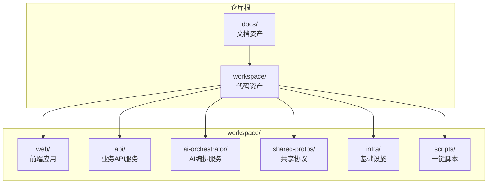
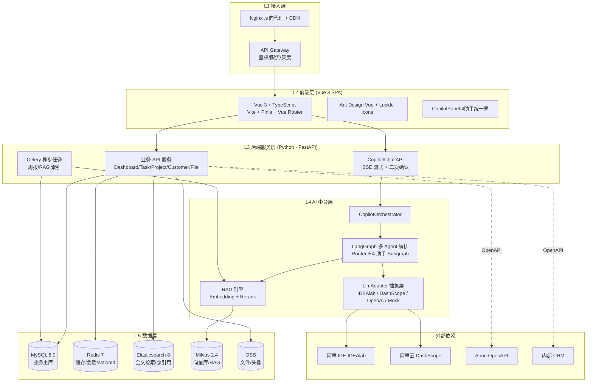
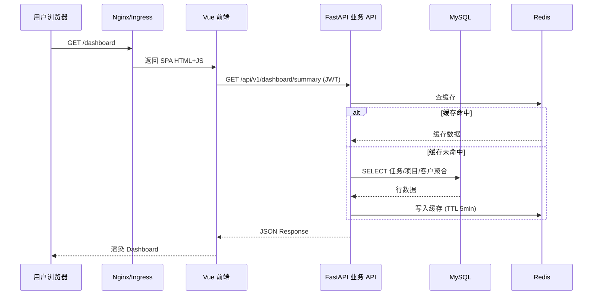
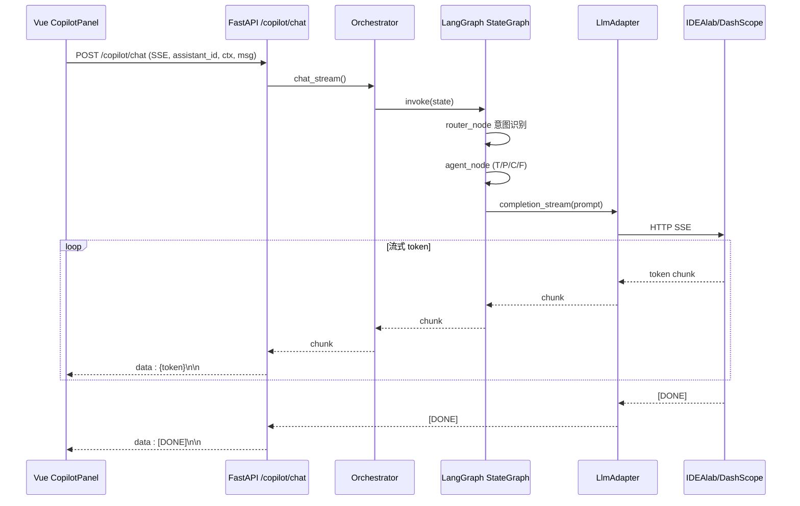
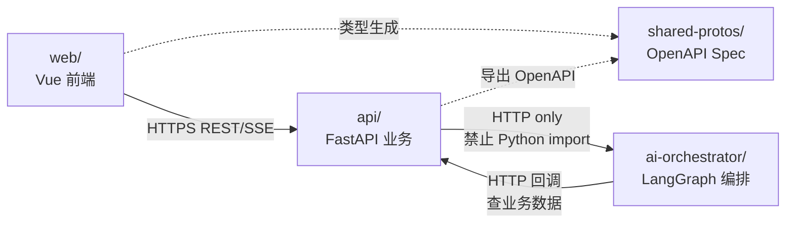

# 整体架构设计

<cite>
**本文档引用的文件**
- [FDE工作台技术方案.md](file://docs/FDE工作台技术方案.md)
- [00-目录结构设计.md](file://docs/detail-design/00-目录结构设计.md)
- [01-前端详细设计.md](file://docs/detail-design/01-前端详细设计.md)
- [02-后端详细设计.md](file://docs/detail-design/02-后端详细设计.md)
- [03-AI编排服务详细设计.md](file://docs/detail-design/03-AI编排服务详细设计.md)
- [部署文档.md](file://docs/部署文档.md)
- [README.md](file://workspace/README.md)
- [api/README.md](file://workspace/api/README.md)
- [ai-orchestrator/README.md](file://workspace/ai-orchestrator/README.md)
- [web/README.md](file://workspace/web/README.md)
- [workspace/api/app/main.py](file://workspace/api/app/main.py)
- [workspace/ai-orchestrator/app/main.py](file://workspace/ai-orchestrator/app/main.py)
- [workspace/web/src/main.ts](file://workspace/web/src/main.ts)
- [workspace/api/pyproject.toml](file://workspace/api/pyproject.toml)
- [workspace/ai-orchestrator/pyproject.toml](file://workspace/ai-orchestrator/pyproject.toml)
- [workspace/web/package.json](file://workspace/web/package.json)
</cite>

## 目录
1. [引言](#引言)
2. [项目结构](#项目结构)
3. [核心组件](#核心组件)
4. [架构总览](#架构总览)
5. [详细组件分析](#详细组件分析)
6. [依赖关系分析](#依赖关系分析)
7. [性能考虑](#性能考虑)
8. [故障排查指南](#故障排查指南)
9. [结论](#结论)
10. [附录](#附录)

## 引言

本架构设计文档面向FDE工作台的整体系统，阐述其基于三层架构（表现层、业务层、数据层）与微服务架构模式的设计理念。系统围绕API服务、AI编排器、前端应用三大核心组件构建，通过严格的跨模块边界约束、统一的共享协议与可观测性设计，实现可扩展、可维护、高性能的现代化企业级工作台。

## 项目结构

FDE工作台采用monorepo组织方式，将前端、后端、AI编排、基础设施与脚本统一管理，确保跨模块协作的一致性与可演进性。



**图表来源**
- [00-目录结构设计.md:53-86](file://docs/detail-design/00-目录结构设计.md#L53-L86)

**章节来源**
- [README.md:7-16](file://workspace/README.md#L7-L16)
- [00-目录结构设计.md:53-86](file://docs/detail-design/00-目录结构设计.md#L53-L86)

## 核心组件

系统由以下核心组件构成：

- **前端应用（web/）**：Vue 3 + TypeScript + Vite + Pinia，提供工作台页面、Copilot助手、聊天中心等交互体验。
- **业务API服务（api/）**：Python + FastAPI，提供REST API与SSE流式能力，负责业务编排、鉴权、数据访问与外部系统集成。
- **AI编排服务（ai-orchestrator/）**：Python + FastAPI + LangGraph，提供多Agent编排、RAG检索、工具调用与安全审计。
- **共享协议（shared-protos/）**：OpenAPI规范与跨服务类型生成，确保前后端契约一致性。
- **基础设施（infra/）**：Docker Compose/Kubernetes部署配置与监控告警。
- **脚本（scripts/）**：一键启动、测试、发布与数据导入脚本。

**章节来源**
- [README.md:9-16](file://workspace/README.md#L9-L16)
- [web/README.md:1-49](file://workspace/web/README.md#L1-L49)
- [api/README.md:1-50](file://workspace/api/README.md#L1-L50)
- [ai-orchestrator/README.md:1-51](file://workspace/ai-orchestrator/README.md#L1-L51)

## 架构总览

系统采用“三层架构 + 微服务”的混合架构模式。表现层（Web）与业务层（API）通过REST/SSE交互，业务层与AI层通过HTTP隔离调用，形成清晰的职责边界与物理隔离。



**图表来源**
- [FDE工作台技术方案.md:47-120](file://docs/FDE工作台技术方案.md#L47-L120)

**章节来源**
- [FDE工作台技术方案.md:45-120](file://docs/FDE工作台技术方案.md#L45-L120)

## 详细组件分析

### 前端应用（web/）

- 技术栈：Vue 3 + TypeScript + Vite + Pinia + Ant Design Vue
- 职责：提供工作台页面、Copilot助手、聊天中心、@引用、富文本渲染等
- 关键特性：三栏布局（Header/Nav/Main/Copilot）、SSE流式对话、Mock与真实API切换、类型生成与协议同步



**图表来源**
- [FDE工作台技术方案.md:162-184](file://docs/FDE工作台技术方案.md#L162-L184)

**章节来源**
- [web/README.md:1-49](file://workspace/web/README.md#L1-L49)
- [01-前端详细设计.md:17-82](file://docs/detail-design/01-前端详细设计.md#L17-L82)

### 业务API服务（api/）

- 技术栈：Python 3.11 + FastAPI + SQLAlchemy 2 + Celery
- 职责：REST API路由、业务编排、鉴权、数据访问、外部系统集成、SSE转发至AI编排器
- 关键特性：Clean Architecture轻量化分层、中间件链路追踪、全局异常处理、OpenAPI自动生成



**图表来源**
- [FDE工作台技术方案.md:188-214](file://docs/FDE工作台技术方案.md#L188-L214)

**章节来源**
- [api/README.md:1-50](file://workspace/api/README.md#L1-L50)
- [workspace/api/app/main.py:1-73](file://workspace/api/app/main.py#L1-L73)
- [02-后端详细设计.md:123-176](file://docs/detail-design/02-后端详细设计.md#L123-L176)

### AI编排服务（ai-orchestrator/）

- 技术栈：Python 3.11 + FastAPI + LangGraph + Milvus + DashScope
- 职责：多Agent编排、RAG检索、工具调用、安全审计、熔断降级
- 关键特性：InputGuard/OutputGuard安全闸门、多模型路由与熔断、审计日志、SSE流式输出

```mermaid
flowchart TD
Start([SSE 请求到达 main.py /ai/chat]) --> Guard[InputGuard.check<br/>注入/越狱/超长拦截]
Guard --> |不安全| Block[审计 log_safety_block<br/>SSE 返回 error + DONE]
Guard --> |安全| Audit[create_entry 审计起点]
Audit --> Agent[agent_node 流程开始]
Agent --> Q[抽取最后一条 user message]
Q --> RAG[Retriever.retrieve<br/>top_k=3]
RAG --> Prompt[get_system_prompt + 拼 context]
Prompt --> LLM1[get_llm 选择 provider<br/>stream 首轮回答]
LLM1 --> Parse{响应中是否含<br/>tool_calls JSON?}
Parse --> |否| Done[流式输出完成]
Parse --> |是且未达 MAX_ITERATIONS=8| Exec[execute tools<br/>写工具 -> requires_confirmation]
Exec --> LLM2[append tool_results<br/>再次 LLM stream]
LLM2 --> Parse
Done --> AuditEnd[audit log_chat<br/>SSE [DONE]]
Block --> AuditEnd
```

**图表来源**
- [03-AI编排服务详细设计.md:139-159](file://docs/detail-design/03-AI编排服务详细设计.md#L139-L159)

**章节来源**
- [ai-orchestrator/README.md:1-51](file://workspace/ai-orchestrator/README.md#L1-L51)
- [workspace/ai-orchestrator/app/main.py:1-307](file://workspace/ai-orchestrator/app/main.py#L1-L307)
- [03-AI编排服务详细设计.md:96-131](file://docs/detail-design/03-AI编排服务详细设计.md#L96-L131)

### 共享协议（shared-protos/）

- 职责：OpenAPI规范导出与前端类型生成，确保跨模块契约一致性
- 流程：API启动时导出OpenAPI → 前端生成TS类型 → CI校验同步

**章节来源**
- [00-目录结构设计.md:484-503](file://docs/detail-design/00-目录结构设计.md#L484-L503)

### 基础设施（infra/）

- 职责：Docker Compose/Kubernetes部署、Nginx配置、监控告警、ArgoCD应用配置
- 特性：支持开发/测试/生产多环境部署，提供健康检查与资源编排

**章节来源**
- [00-目录结构设计.md:506-554](file://docs/detail-design/00-目录结构设计.md#L506-L554)

## 依赖关系分析

系统通过严格的跨模块边界约束实现松耦合与高内聚：

- web → api：HTTPS REST + SSE，禁止直接调用AI编排器
- api → ai-orchestrator：仅HTTP调用，禁止Python跨服务import
- shared-protos：OpenAPI规范与类型生成，禁止跨服务直接import业务代码
- 外部系统：Aone CRM DashScope IDEAlab等通过HTTP集成



**图表来源**
- [00-目录结构设计.md:683-709](file://docs/detail-design/00-目录结构设计.md#L683-L709)

**章节来源**
- [00-目录结构设计.md:681-710](file://docs/detail-design/00-目录结构设计.md#L681-L710)

## 性能考虑

- 前端性能：路由懒加载、Vite代码分割、CDN、keep-alive缓存、SSE首token优化
- 后端性能：异步SQLAlchemy、Redis缓存、Celery异步任务、SSE响应头优化（禁用Nginx缓冲）
- AI编排性能：多模型熔断降级、并行检索、工具调用二次确认、审计日志降级写stderr
- 数据层性能：MySQL主从、Redis集群、ES集群、Milvus集群、OSS对象存储

**章节来源**
- [FDE工作台技术方案.md:543-552](file://docs/FDE工作台技术方案.md#L543-L552)
- [03-AI编排服务详细设计.md:252-261](file://docs/detail-design/03-AI编排服务详细设计.md#L252-L261)

## 故障排查指南

- 健康检查：/health端点返回服务状态与提供商健康度
- 日志定位：结构化JSON日志（audit/*.jsonl）+ 控制台日志
- 网络连通：Docker容器间网络检查、API网关代理配置
- 数据库连接：容器健康状态、连接串配置、权限验证
- 代码更新：开发模式热重载、构建缓存清理、镜像重建

**章节来源**
- [部署文档.md:193-198](file://docs/部署文档.md#L193-L198)
- [部署文档.md:255-265](file://docs/部署文档.md#L255-L265)
- [部署文档.md:241-253](file://docs/部署文档.md#L241-L253)

## 结论

FDE工作台通过清晰的三层架构与微服务模式，实现了前端、业务与AI的职责分离与物理隔离。严格的跨模块边界、统一的共享协议与完善的可观测性设计，确保了系统的可扩展性、可维护性与高性能。随着业务发展，系统可通过Kubernetes弹性扩缩容、Prometheus指标导出与更细粒度的微服务拆分持续演进。

## 附录

### 技术栈与版本

- 前端：Vue 3.4 + TypeScript 5 + Vite 5 + Pinia 2 + Ant Design Vue 4
- 后端：Python 3.11 + FastAPI 0.110 + SQLAlchemy 2.0 + Celery 5.3
- AI编排：Python 3.11 + FastAPI 0.110 + LangGraph 0.2 + Milvus 2.4
- 数据与中间件：MySQL 8.0 + Redis 7 + Elasticsearch 8 + Milvus 2.4 + OSS

**章节来源**
- [FDE工作台技术方案.md:16-20](file://docs/FDE工作台技术方案.md#L16-L20)
- [web/package.json:18-29](file://workspace/web/package.json#L18-L29)
- [workspace/api/pyproject.toml:9-28](file://workspace/api/pyproject.toml#L9-L28)
- [workspace/ai-orchestrator/pyproject.toml:8-19](file://workspace/ai-orchestrator/pyproject.toml#L8-L19)