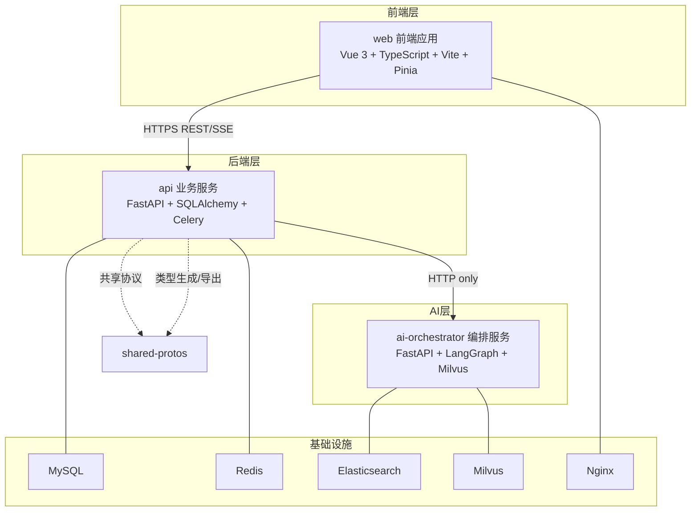
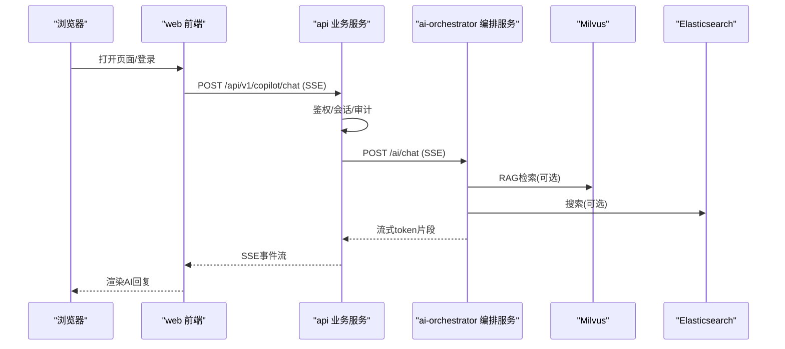
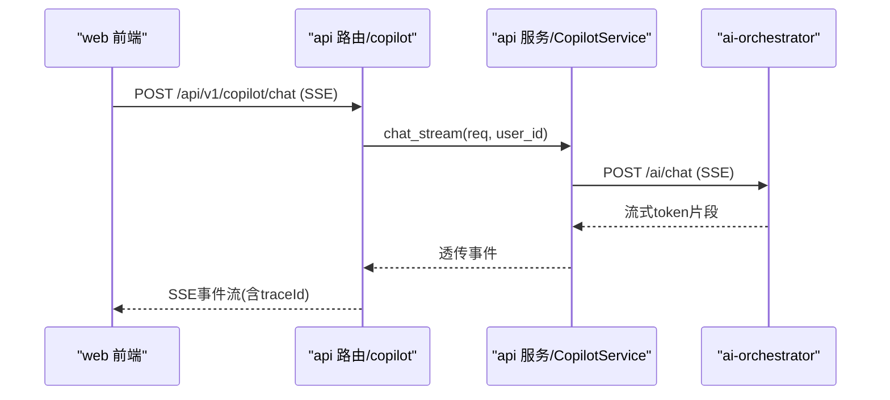
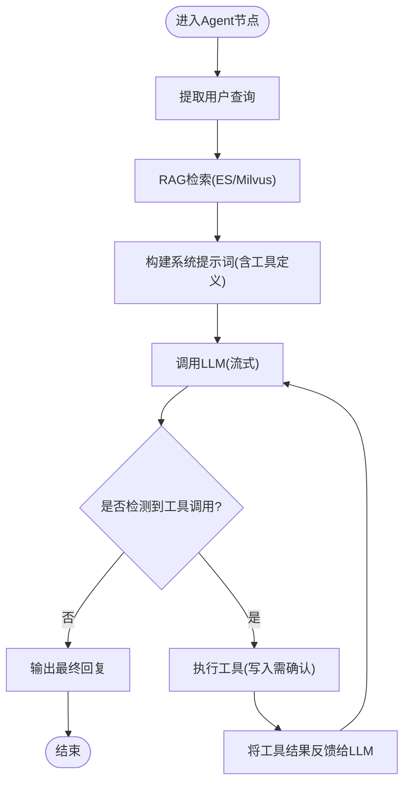
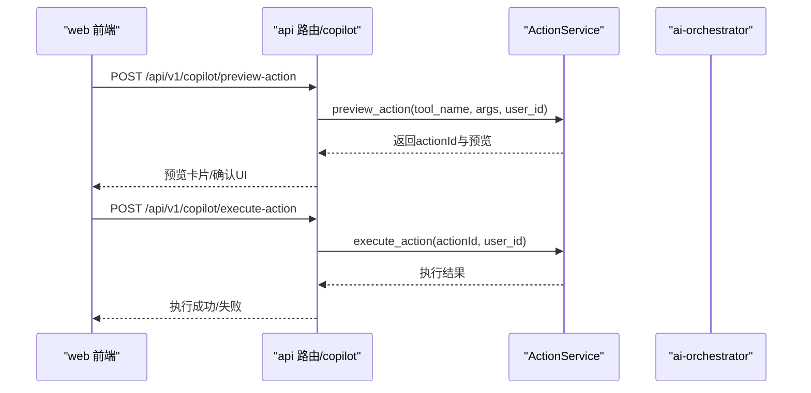
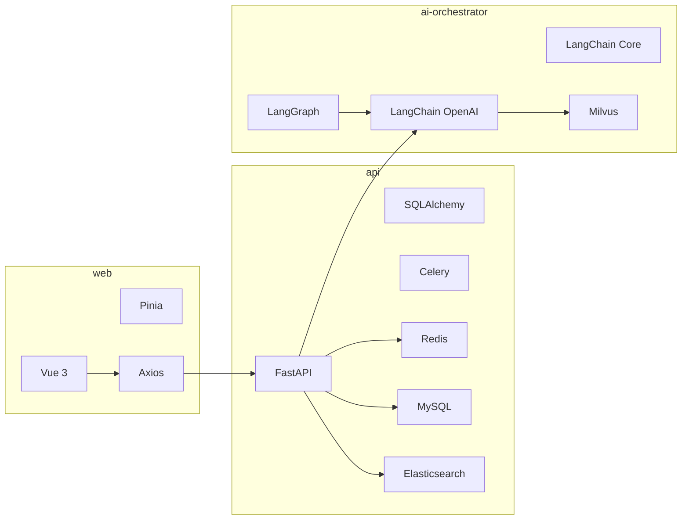

# 系统架构

<cite>
**本文引用的文件**
- [workspace/README.md](file://workspace/README.md)
- [workspace/api/app/main.py](file://workspace/api/app/main.py)
- [workspace/api/app/routers/copilot.py](file://workspace/api/app/routers/copilot.py)
- [workspace/api/app/services/copilot_service.py](file://workspace/api/app/services/copilot_service.py)
- [workspace/api/app/config/settings.py](file://workspace/api/app/config/settings.py)
- [workspace/api/pyproject.toml](file://workspace/api/pyproject.toml)
- [workspace/ai-orchestrator/app/main.py](file://workspace/ai-orchestrator/app/main.py)
- [workspace/ai-orchestrator/app/config.py](file://workspace/ai-orchestrator/app/config.py)
- [workspace/ai-orchestrator/app/orchestrator/graph.py](file://workspace/ai-orchestrator/app/orchestrator/graph.py)
- [workspace/ai-orchestrator/pyproject.toml](file://workspace/ai-orchestrator/pyproject.toml)
- [workspace/web/src/main.ts](file://workspace/web/src/main.ts)
- [workspace/web/src/apis/modules/copilot.ts](file://workspace/web/src/apis/modules/copilot.ts)
- [workspace/web/package.json](file://workspace/web/package.json)
- [workspace/infra/docker-compose/docker-compose.yml](file://workspace/infra/docker-compose/docker-compose.yml)
</cite>

## 目录
1. [引言](#引言)
2. [项目结构](#项目结构)
3. [核心组件](#核心组件)
4. [架构总览](#架构总览)
5. [详细组件分析](#详细组件分析)
6. [依赖分析](#依赖分析)
7. [性能考虑](#性能考虑)
8. [故障排查指南](#故障排查指南)
9. [结论](#结论)
10. [附录](#附录)

## 引言
本文件面向FDE工作台的系统架构，聚焦微服务设计理念与边界划分：前端应用(web)、后端业务服务(api)、AI编排服务(ai-orchestrator)，以及共享协议(shared-protos)与基础设施(infra)。文档从系统边界、数据流与组件交互入手，解释API服务、AI编排器与前端应用的协作方式；阐述技术选型与权衡；给出基础设施要求、可扩展性与部署拓扑；并覆盖安全性、监控与可观测性、灾难恢复等横切关注点。

## 项目结构
FDE工作台采用Monorepo组织，按“功能域”划分模块：
- web：Vue 3 + TypeScript + Vite + Pinia 的前端SPA
- api：Python + FastAPI + SQLAlchemy + Celery 的后端业务服务
- ai-orchestrator：Python + FastAPI + LangGraph + Milvus 的AI编排服务
- shared-protos：共享协议（OpenAPI Spec）占位
- infra：Docker Compose/Kubernetes/Helm/Nginx等基础设施
- scripts：一键启动与开发脚本

系统边界与通信约定：
- web 通过HTTPS REST/SSE调用 api
- api 与 ai-orchestrator 之间仅通过HTTP通信，禁止Python跨服务import
- 共享类型通过 shared-protos 统一管理，避免跨服务直接import业务代码

图表来源
- [workspace/README.md:47-56](file://workspace/README.md#L47-L56)
- [workspace/infra/docker-compose/docker-compose.yml:66-126](file://workspace/infra/docker-compose/docker-compose.yml#L66-L126)

章节来源
- [workspace/README.md:9-58](file://workspace/README.md#L9-L58)
- [workspace/infra/docker-compose/docker-compose.yml:1-132](file://workspace/infra/docker-compose/docker-compose.yml#L1-L132)

## 核心组件
- 前端应用(web)
  - 使用Pinia进行状态管理，Axios封装HTTP请求，支持SSE
  - 通过模块化API适配器对接后端接口，如/copilot/*
- 业务服务(api)
  - FastAPI路由聚合/copilot/*，负责鉴权、会话管理、动作预览/执行、SSE转发
  - 通过HTTP向ai-orchestrator发起AI对话与RAG检索
- AI编排服务(ai-orchestrator)
  - 提供/chat、/ai/tools、/ai/rag/*等端点
  - 基于LangGraph的Agent节点，结合RAG检索与工具调用
- 基础设施(infra)
  - Docker Compose编排MySQL、Redis、Elasticsearch、Milvus、api、ai-orchestrator、web
  - Nginx作为静态资源与反向代理入口

章节来源
- [workspace/web/src/main.ts:1-24](file://workspace/web/src/main.ts#L1-L24)
- [workspace/web/src/apis/modules/copilot.ts:1-40](file://workspace/web/src/apis/modules/copilot.ts#L1-L40)
- [workspace/api/app/main.py:1-73](file://workspace/api/app/main.py#L1-L73)
- [workspace/api/app/routers/copilot.py:1-137](file://workspace/api/app/routers/copilot.py#L1-L137)
- [workspace/api/app/services/copilot_service.py:1-111](file://workspace/api/app/services/copilot_service.py#L1-L111)
- [workspace/ai-orchestrator/app/main.py:1-307](file://workspace/ai-orchestrator/app/main.py#L1-L307)
- [workspace/ai-orchestrator/app/orchestrator/graph.py:1-211](file://workspace/ai-orchestrator/app/orchestrator/graph.py#L1-L211)
- [workspace/infra/docker-compose/docker-compose.yml:1-132](file://workspace/infra/docker-compose/docker-compose.yml#L1-L132)

## 架构总览
系统采用“前端-后端-编排-数据”的分层微服务架构：
- 前端通过REST/SSE与后端交互，后端统一鉴权与审计
- 后端作为编排入口，将AI对话与RAG检索请求转发至AI编排服务
- AI编排服务内部以LangGraph构建Agent节点，结合RAG与工具调用完成多轮对话与动作执行
- 数据层由MySQL、Redis、Elasticsearch、Milvus构成，支撑业务、缓存、搜索与向量检索

图表来源
- [workspace/api/app/routers/copilot.py:29-65](file://workspace/api/app/routers/copilot.py#L29-L65)
- [workspace/api/app/services/copilot_service.py:21-56](file://workspace/api/app/services/copilot_service.py#L21-L56)
- [workspace/ai-orchestrator/app/main.py:89-172](file://workspace/ai-orchestrator/app/main.py#L89-L172)
- [workspace/ai-orchestrator/app/orchestrator/graph.py:49-58](file://workspace/ai-orchestrator/app/orchestrator/graph.py#L49-L58)

## 详细组件分析

### 前端应用(web)与后端API的交互
- 前端通过Axios与SSE与后端交互，模块化API适配器集中管理/copilot/*相关接口
- 后端路由统一暴露/copilot/*，负责鉴权、会话管理、动作预览/执行，并将AI对话请求转发给AI编排服务
- SSE通道中注入traceId，便于全链路追踪

图表来源
- [workspace/web/src/apis/modules/copilot.ts:12-20](file://workspace/web/src/apis/modules/copilot.ts#L12-L20)
- [workspace/api/app/routers/copilot.py:29-65](file://workspace/api/app/routers/copilot.py#L29-L65)
- [workspace/api/app/services/copilot_service.py:21-56](file://workspace/api/app/services/copilot_service.py#L21-L56)
- [workspace/ai-orchestrator/app/main.py:89-172](file://workspace/ai-orchestrator/app/main.py#L89-L172)

章节来源
- [workspace/web/src/apis/modules/copilot.ts:1-40](file://workspace/web/src/apis/modules/copilot.ts#L1-L40)
- [workspace/api/app/routers/copilot.py:1-137](file://workspace/api/app/routers/copilot.py#L1-L137)
- [workspace/api/app/services/copilot_service.py:1-111](file://workspace/api/app/services/copilot_service.py#L1-L111)

### AI编排服务的Agent与RAG流程
- Agent节点负责提取查询、RAG检索、构建系统提示词、调用LLM、解析工具调用并执行
- 工具调用分为只读与写入两类，写入类需要用户确认后执行
- 编排服务提供/tools与/rag/*端点，支持工具清单查询与知识入库/删除

图表来源
- [workspace/ai-orchestrator/app/orchestrator/graph.py:113-183](file://workspace/ai-orchestrator/app/orchestrator/graph.py#L113-L183)

章节来源
- [workspace/ai-orchestrator/app/orchestrator/graph.py:1-211](file://workspace/ai-orchestrator/app/orchestrator/graph.py#L1-L211)
- [workspace/ai-orchestrator/app/main.py:175-306](file://workspace/ai-orchestrator/app/main.py#L175-L306)

### 动作预览与执行（两步写操作）
- 写操作采用“预览-执行”双阶段，由后端ActionService负责actionId生命周期管理（Redis缓存、完整性校验、TTL、审计绑定）
- 编排服务不再直接执行写操作，若被旧调用方误调用，将返回明确的重定向错误

图表来源
- [workspace/api/app/routers/copilot.py:119-131](file://workspace/api/app/routers/copilot.py#L119-L131)
- [workspace/ai-orchestrator/app/main.py:192-220](file://workspace/ai-orchestrator/app/main.py#L192-L220)

章节来源
- [workspace/api/app/routers/copilot.py:119-131](file://workspace/api/app/routers/copilot.py#L119-L131)
- [workspace/ai-orchestrator/app/main.py:181-220](file://workspace/ai-orchestrator/app/main.py#L181-L220)

### 数据流与集成模式
- 数据流：前端发起SSE请求 → 后端鉴权与会话管理 → 后端转发至AI编排服务 → 编排服务RAG检索与工具调用 → 流式返回前端渲染
- 集成模式：后端与编排服务通过HTTP集成，共享协议通过shared-protos管理，禁止跨服务直接import业务代码

章节来源
- [workspace/README.md:47-56](file://workspace/README.md#L47-L56)
- [workspace/api/app/services/copilot_service.py:21-56](file://workspace/api/app/services/copilot_service.py#L21-L56)

## 依赖分析
- 技术栈与版本
  - web：Vue 3、TypeScript、Vite、Pinia、Axios、Ant Design Vue
  - api：FastAPI、SQLAlchemy、Celery、Redis、MySQL、httpx、structlog、Elasticsearch、Pydantic
  - ai-orchestrator：FastAPI、LangGraph、LangChain、OpenAI/DashScope Provider、Jinja2、Pydantic
- 外部依赖与集成
  - 内部集成：Aone、CRM、钉钉、OSS等客户端（当前为模拟实现）
  - 搜索与向量：Elasticsearch、Milvus
  - 缓存与队列：Redis、Celery
- 依赖关系可视化

图表来源
- [workspace/web/package.json:18-29](file://workspace/web/package.json#L18-L29)
- [workspace/api/pyproject.toml:9-28](file://workspace/api/pyproject.toml#L9-L28)
- [workspace/ai-orchestrator/pyproject.toml:8-19](file://workspace/ai-orchestrator/pyproject.toml#L8-L19)

章节来源
- [workspace/web/package.json:1-59](file://workspace/web/package.json#L1-L59)
- [workspace/api/pyproject.toml:1-61](file://workspace/api/pyproject.toml#L1-L61)
- [workspace/ai-orchestrator/pyproject.toml:1-29](file://workspace/ai-orchestrator/pyproject.toml#L1-L29)

## 性能考虑
- SSE长连接与心跳
  - 后端在SSE响应头中设置心跳间隔与traceId，前端据此维持连接与日志关联
- 超时与降级
  - 后端对AI编排服务调用配置超时；当编排服务不可达时，回退为mock响应，保障可用性
- 并发与限流
  - 建议在网关层引入限流与熔断策略，避免热点路由拖垮下游
- 缓存与索引
  - 利用Redis缓存会话与临时状态；RAG检索结合ES与Milvus，合理设置top_k与分页
- 数据库与队列
  - Celery异步任务处理耗时操作；MySQL使用连接池与索引优化

章节来源
- [workspace/api/app/routers/copilot.py:54-65](file://workspace/api/app/routers/copilot.py#L54-L65)
- [workspace/api/app/services/copilot_service.py:48-52](file://workspace/api/app/services/copilot_service.py#L48-L52)

## 故障排查指南
- 健康检查
  - 各服务均提供/health端点，Compose中配置了健康检查与重启策略
- 日志与追踪
  - 后端启用结构化日志与Trace中间件；SSE事件携带traceId，便于定位问题
- 常见问题
  - 编排服务不可达：后端自动降级为mock响应；检查网络连通性与环境变量
  - 工具执行失败：查看编排服务日志与工具注册表；确认写操作是否需要用户确认
  - RAG检索异常：检查ES/Milvus健康状态与索引配置

章节来源
- [workspace/ai-orchestrator/app/main.py:79-86](file://workspace/ai-orchestrator/app/main.py#L79-L86)
- [workspace/api/app/main.py:70-73](file://workspace/api/app/main.py#L70-L73)
- [workspace/infra/docker-compose/docker-compose.yml:14-16](file://workspace/infra/docker-compose/docker-compose.yml#L14-L16)

## 结论
FDE工作台通过清晰的微服务边界与严格的跨服务通信约定，实现了前端、后端与AI编排的解耦协同。后端承担鉴权、会话与动作治理，AI编排专注于对话与工具调用，前端专注用户体验与交互。配合完善的基础设施编排与可观测性实践，系统具备良好的可扩展性与可维护性。

## 附录

### 基础设施与部署拓扑
- 本地开发
  - 使用Docker Compose一键启动：MySQL、Redis、Elasticsearch、Milvus、api、ai-orchestrator、web
  - 前端通过Nginx映射至80端口，本地访问http://localhost:5173
- 生产部署
  - 建议使用Kubernetes/Helm进行容器化部署，结合Ingress/Nginx提供TLS与路由
  - 数据持久化：MySQL、ES、Milvus使用PVC；Redis可选集群模式
  - 网络与安全：开启TLS、限制入站IP、启用WAF；后端与编排服务间通过内网通信

章节来源
- [workspace/README.md:20-42](file://workspace/README.md#L20-L42)
- [workspace/infra/docker-compose/docker-compose.yml:1-132](file://workspace/infra/docker-compose/docker-compose.yml#L1-L132)

### 安全性、监控与灾难恢复
- 安全性
  - JWT鉴权与租户隔离中间件；SSE事件头包含traceId，便于审计
  - 输入安全守卫与审计日志，拦截不安全输入并记录
- 监控与可观测性
  - 后端结构化日志；SSE事件流；健康检查与容器重启策略
  - 建议引入APM与指标采集（如Prometheus/Grafana），对关键端点与延迟进行告警
- 灾难恢复
  - 关键数据（会话、消息、动作）落库；RAG索引与搜索独立，确保部分组件故障不影响整体
  - 建议定期备份MySQL与Milvus/ES快照，演练恢复流程

章节来源
- [workspace/api/app/routers/copilot.py:36-50](file://workspace/api/app/routers/copilot.py#L36-L50)
- [workspace/ai-orchestrator/app/main.py:97-120](file://workspace/ai-orchestrator/app/main.py#L97-L120)
- [workspace/infra/docker-compose/docker-compose.yml:81-93](file://workspace/infra/docker-compose/docker-compose.yml#L81-L93)