# 部署架构

<cite>
**本文引用的文件**
- [部署文档.md](file://docs/部署文档.md)
- [05-部署运维详细设计.md](file://docs/detail-design/05-部署运维详细设计.md)
- [docker-compose.yml](file://docker-compose.yml)
- [docker-compose.yml（应用）](file://workspace/infra/docker-compose/docker-compose.yml)
- [docker-compose.app.yml](file://workspace/infra/docker-compose/docker-compose.app.yml)
- [docker-compose.deps.yml](file://workspace/infra/docker-compose/docker-compose.deps.yml)
- [docker-compose.dev.yml](file://workspace/infra/docker-compose/docker-compose.dev.yml)
- [ci.yml](file://.github/workflows/ci.yml)
- [Dockerfile（API）](file://workspace/api/Dockerfile)
- [Dockerfile（Web）](file://workspace/web/Dockerfile)
- [Dockerfile（AI编排）](file://workspace/ai-orchestrator/Dockerfile)
- [start-dev.sh](file://workspace/scripts/dev/start-dev.sh)
- [start-all.sh](file://workspace/scripts/dev/start-all.sh)
</cite>

## 目录
1. [简介](#简介)
2. [项目结构](#项目结构)
3. [核心组件](#核心组件)
4. [架构总览](#架构总览)
5. [详细组件分析](#详细组件分析)
6. [依赖关系分析](#依赖关系分析)
7. [性能考量](#性能考量)
8. [故障排查指南](#故障排查指南)
9. [结论](#结论)
10. [附录](#附录)

## 简介
本文件面向FDE工作台的部署与运维，系统化阐述容器化部署、服务编排、环境配置与CI/CD流水线，覆盖开发、测试与生产三类环境的差异化配置，并给出高可用、负载均衡与自动扩缩容建议。同时，结合现有仓库中的Docker Compose与Kubernetes设计文档，提供部署架构图、环境配置图与运维监控图，帮助工程团队高效落地与稳定运营。

## 项目结构
FDE工作台采用“多服务单仓库”的组织方式，核心由以下部分组成：
- 前端Web：基于Vue 3与Nginx，打包后以静态站点提供服务
- 后端API：基于FastAPI，提供REST与SSE接口
- AI编排服务：基于LangGraph与LangChain，负责智能对话与任务编排
- 依赖服务：MySQL、Redis、Elasticsearch、Milvus等
- 部署与编排：Docker Compose与Kubernetes清单
- CI/CD：GitHub Actions流水线

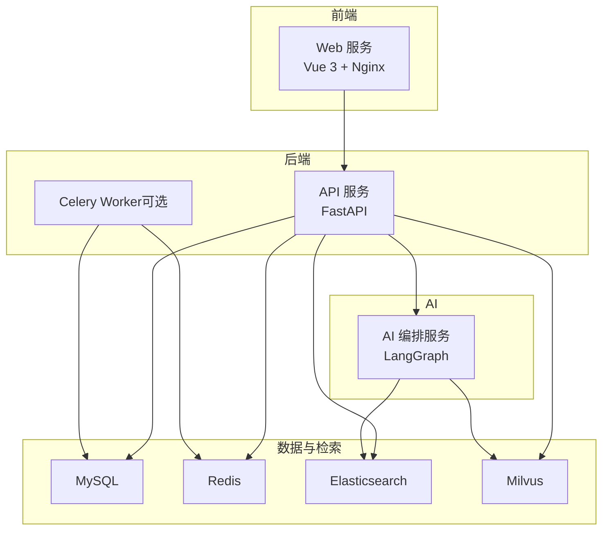

图表来源
- [docker-compose.yml（应用）:66-126](file://workspace/infra/docker-compose/docker-compose.yml#L66-L126)
- [docker-compose.dev.yml:18-183](file://workspace/infra/docker-compose/docker-compose.dev.yml#L18-L183)
- [Dockerfile（API）:1-61](file://workspace/api/Dockerfile#L1-L61)
- [Dockerfile（Web）:1-21](file://workspace/web/Dockerfile#L1-L21)
- [Dockerfile（AI编排）:1-39](file://workspace/ai-orchestrator/Dockerfile#L1-L39)

章节来源
- [部署文档.md:17-379](file://docs/部署文档.md#L17-L379)
- [05-部署运维详细设计.md:1-507](file://docs/detail-design/05-部署运维详细设计.md#L1-L507)

## 核心组件
- Web服务：多阶段构建，生产阶段使用Nginx托管静态资源，提供SPA路由回退与API代理
- API服务：多阶段构建，生产阶段以uvicorn运行，内置健康检查端点
- AI编排服务：多阶段构建，生产阶段以uvicorn运行，作为API内部服务调用
- 依赖服务：MySQL、Redis、Elasticsearch、Milvus，支持独立部署与共享实例
- 开发脚本：提供Docker与原生双模式开发启动，支持热重载与并行依赖启动

章节来源
- [Dockerfile（Web）:1-21](file://workspace/web/Dockerfile#L1-L21)
- [Dockerfile（API）:1-61](file://workspace/api/Dockerfile#L1-L61)
- [Dockerfile（AI编排）:1-39](file://workspace/ai-orchestrator/Dockerfile#L1-L39)
- [start-dev.sh:1-269](file://workspace/scripts/dev/start-dev.sh#L1-L269)

## 架构总览
下图展示从浏览器到后端API再到AI编排与数据存储的整体链路，以及各组件间的通信边界与端口映射。

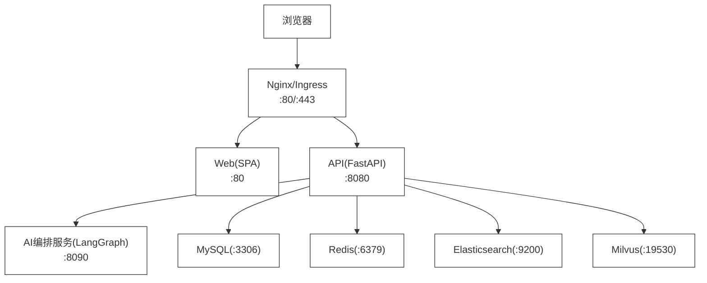

图表来源
- [05-部署运维详细设计.md:12-40](file://docs/detail-design/05-部署运维详细设计.md#L12-L40)
- [docker-compose.yml（应用）:66-126](file://workspace/infra/docker-compose/docker-compose.yml#L66-L126)

章节来源
- [05-部署运维详细设计.md:8-51](file://docs/detail-design/05-部署运维详细设计.md#L8-L51)

## 详细组件分析

### Web服务（前端）
- 容器化：多阶段构建，生产阶段使用Nginx托管dist目录，包含API代理、SSE代理、Gzip与SPA回退
- 端口：容器内80，映射至宿主机5173（开发模式），或通过Ingress暴露
- 启动：Nginx前台运行，支持静态资源与反向代理

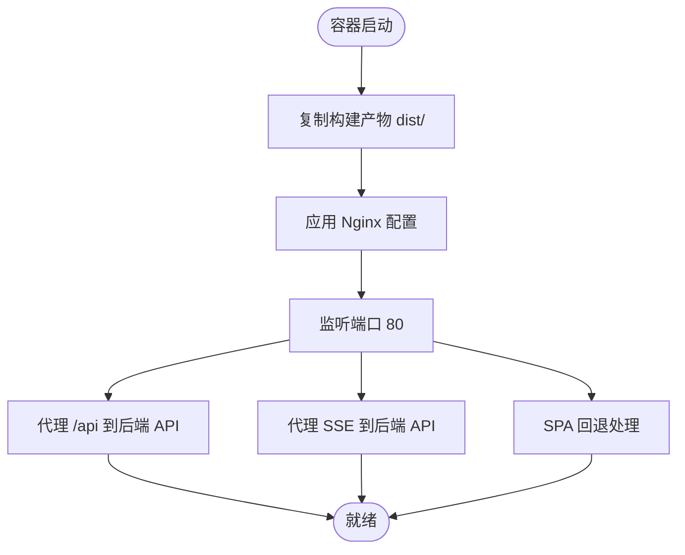

图表来源
- [Dockerfile（Web）:1-21](file://workspace/web/Dockerfile#L1-L21)

章节来源
- [Dockerfile（Web）:1-21](file://workspace/web/Dockerfile#L1-L21)
- [05-部署运维详细设计.md:74-77](file://docs/detail-design/05-部署运维详细设计.md#L74-L77)

### API服务（后端）
- 容器化：多阶段构建，生产阶段以uvicorn运行，4个工作进程；内置健康检查端点
- 端口：容器内8080，映射至宿主机8080
- 依赖：MySQL、Redis、Elasticsearch、Milvus、AI编排服务
- 启动：uvicorn启动FastAPI应用，支持健康检查与探针

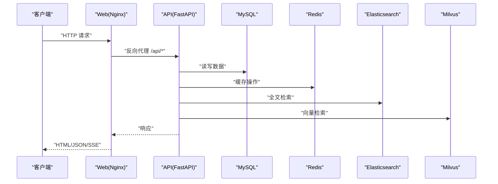

图表来源
- [docker-compose.yml（应用）:66-93](file://workspace/infra/docker-compose/docker-compose.yml#L66-L93)
- [Dockerfile（API）:57-61](file://workspace/api/Dockerfile#L57-L61)

章节来源
- [Dockerfile（API）:1-61](file://workspace/api/Dockerfile#L1-L61)
- [05-部署运维详细设计.md:68-72](file://docs/detail-design/05-部署运维详细设计.md#L68-L72)

### AI编排服务（AI Orchestrator）
- 容器化：多阶段构建，生产阶段以uvicorn运行，2个工作进程
- 端口：容器内8090，映射至宿主机8090
- 依赖：Elasticsearch、Milvus、API服务
- 启动：uvicorn启动LangGraph应用，作为API内部服务调用

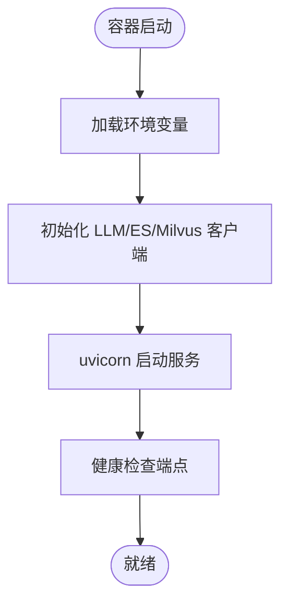

图表来源
- [Dockerfile（AI编排）:1-39](file://workspace/ai-orchestrator/Dockerfile#L1-L39)
- [docker-compose.yml（应用）:95-116](file://workspace/infra/docker-compose/docker-compose.yml#L95-L116)

章节来源
- [Dockerfile（AI编排）:1-39](file://workspace/ai-orchestrator/Dockerfile#L1-L39)
- [05-部署运维详细设计.md:79-82](file://docs/detail-design/05-部署运维详细设计.md#L79-L82)

### 依赖服务（MySQL/Redis/ES/Milvus）
- MySQL：8.0，持久化数据卷，健康检查
- Redis：7-alpine，持久化数据卷，健康检查
- Elasticsearch：8.12.0，单节点，JVM内存限制
- Milvus：v2.3.0，单机模式，嵌入式Etcd

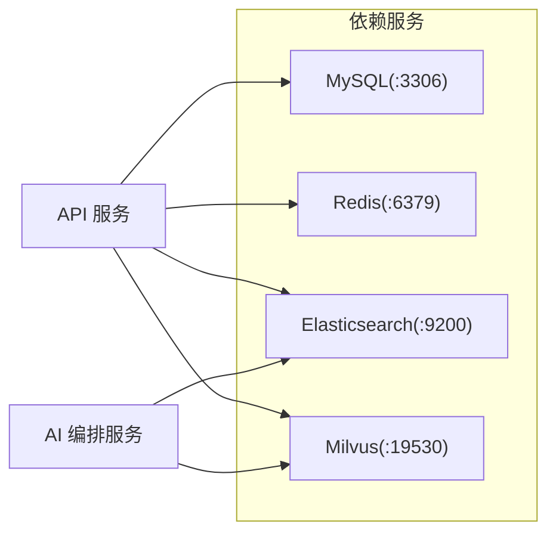

图表来源
- [docker-compose.yml（应用）:4-64](file://workspace/infra/docker-compose/docker-compose.yml#L4-L64)

章节来源
- [docker-compose.yml（应用）:4-64](file://workspace/infra/docker-compose/docker-compose.yml#L4-L64)

### 开发模式与热重载
- Docker开发编排：API与AI编排使用Dockerfile.dev，启用--reload与源码挂载，实现热重载
- Web开发：挂载src/public等目录，使用Vite实时开发
- 依赖服务：MySQL、Redis、ES、Milvus在Docker中运行，提升启动速度
- 命令入口：start-dev.sh统一管理依赖拉起、健康检查、迁移与应用启动

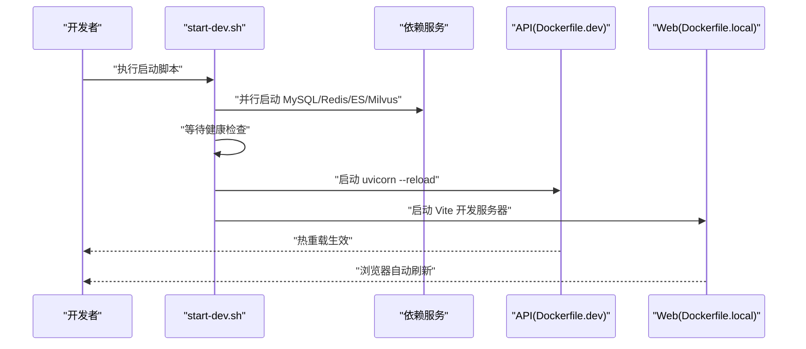

图表来源
- [start-dev.sh:76-149](file://workspace/scripts/dev/start-dev.sh#L76-L149)
- [docker-compose.dev.yml:18-148](file://workspace/infra/docker-compose/docker-compose.dev.yml#L18-L148)

章节来源
- [start-dev.sh:1-269](file://workspace/scripts/dev/start-dev.sh#L1-L269)
- [docker-compose.dev.yml:1-281](file://workspace/infra/docker-compose/docker-compose.dev.yml#L1-L281)

## 依赖关系分析
- 服务依赖
  - Web依赖API提供REST与SSE能力
  - API依赖MySQL、Redis、ES、Milvus与AI编排服务
  - AI编排服务依赖ES与Milvus，同时调用API内部接口
  - Celery Worker依赖Redis与MySQL，用于异步任务
- 启动顺序
  - 依赖服务先于应用服务启动，且需健康检查通过
  - API与AI编排服务之间存在相互依赖，需确保API先就绪
- 网络
  - 开发模式使用自定义bridge网络，生产模式通过共享网络或K8s服务发现

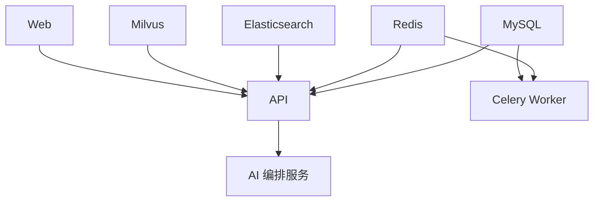

图表来源
- [docker-compose.yml（应用）:66-126](file://workspace/infra/docker-compose/docker-compose.yml#L66-L126)
- [docker-compose.dev.yml:150-183](file://workspace/infra/docker-compose/docker-compose.dev.yml#L150-L183)

章节来源
- [docker-compose.yml（应用）:66-126](file://workspace/infra/docker-compose/docker-compose.yml#L66-L126)
- [docker-compose.dev.yml:18-111](file://workspace/infra/docker-compose/docker-compose.dev.yml#L18-L111)

## 性能考量
- 容器镜像
  - 多阶段构建减少镜像体积，生产阶段仅包含运行时依赖
  - 使用国内镜像源加速包安装，缩短构建时间
- 进程与并发
  - API使用4个工作进程，AI编排使用2个工作进程，满足不同负载特征
- 存储与检索
  - ES与Milvus分离部署，避免单点瓶颈；生产环境建议独立高可用集群
- 网络与代理
  - Web侧Nginx代理与SSE缓冲配置，结合Ingress超时设置，保障长连接稳定性

章节来源
- [Dockerfile（API）:29-61](file://workspace/api/Dockerfile#L29-L61)
- [Dockerfile（AI编排）:18-39](file://workspace/ai-orchestrator/Dockerfile#L18-L39)
- [05-部署运维详细设计.md:74-82](file://docs/detail-design/05-部署运维详细设计.md#L74-L82)

## 故障排查指南
- 健康检查
  - API与AI编排均提供/health端点，用于探活与扩缩容判断
- 日志
  - Docker Compose与K8s均可查看容器日志，审计日志位于AI编排服务的audit目录
- 常见问题
  - 构建缓慢：优先使用开发模式热重载，或优化.dockerignore与镜像源
  - API返回HTML而非JSON：检查Web代理与API服务状态
  - 数据库连接失败：检查容器健康与连接串配置
  - LLM调用失败：检查Circuit Breaker状态与外部密钥配置

章节来源
- [部署文档.md:193-276](file://docs/部署文档.md#L193-L276)
- [05-部署运维详细设计.md:336-482](file://docs/detail-design/05-部署运维详细设计.md#L336-L482)

## 结论
FDE工作台提供了从开发到生产的完整容器化与编排方案。通过Docker Compose与Kubernetes清单，结合GitHub Actions流水线，实现了标准化的构建、测试与发布流程。建议在生产环境中进一步完善高可用与自动扩缩容策略，并持续优化监控与告警体系，以支撑业务稳定增长。

## 附录

### 环境配置图（开发/测试/生产）
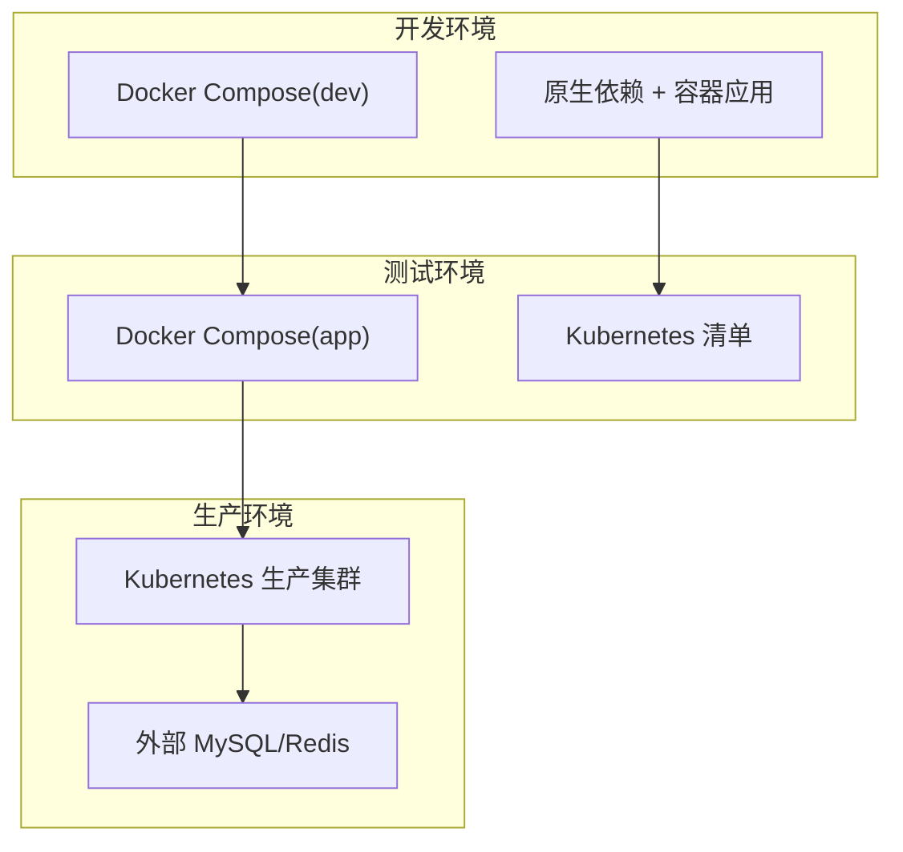

图表来源
- [docker-compose.dev.yml:1-281](file://workspace/infra/docker-compose/docker-compose.dev.yml#L1-L281)
- [docker-compose.app.yml:1-73](file://workspace/infra/docker-compose/docker-compose.app.yml#L1-L73)
- [05-部署运维详细设计.md:117-287](file://docs/detail-design/05-部署运维详细设计.md#L117-L287)

章节来源
- [05-部署运维详细设计.md:485-507](file://docs/detail-design/05-部署运维详细设计.md#L485-L507)

### CI/CD流水线
- 触发：push到master或PR
- 步骤：后端/前端/编排三类测试通过后，构建三类镜像
- 缓存：利用GitHub Actions缓存Docker层、npm与poetry

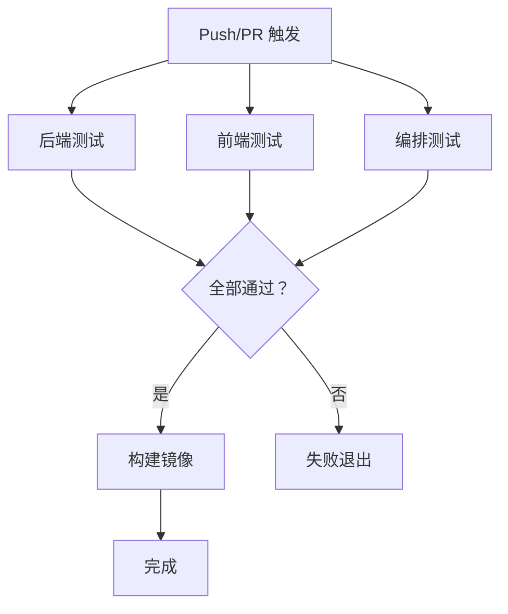

图表来源
- [.github/workflows/ci.yml:1-106](file://.github/workflows/ci.yml#L1-L106)

章节来源
- [.github/workflows/ci.yml:1-106](file://.github/workflows/ci.yml#L1-L106)

### 运维监控图（建议）
- 应用层：/health端点、Trace ID中间件
- 指标：请求总量、延迟、错误率、LLM延迟与Token用量、安全拦截
- 日志：结构化日志，EFK栈收集
- 告警：基于Prometheus与AlertManager的规则组

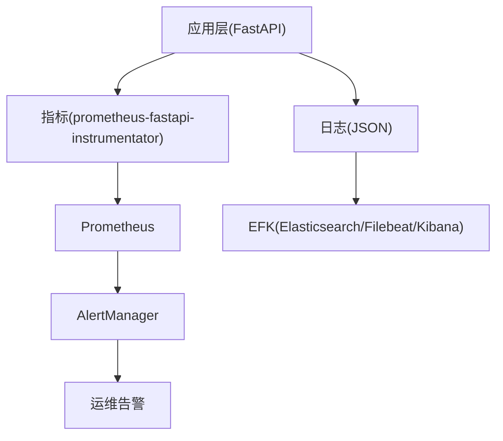

图表来源
- [05-部署运维详细设计.md:336-423](file://docs/detail-design/05-部署运维详细设计.md#L336-L423)

章节来源
- [05-部署运维详细设计.md:336-423](file://docs/detail-design/05-部署运维详细设计.md#L336-L423)