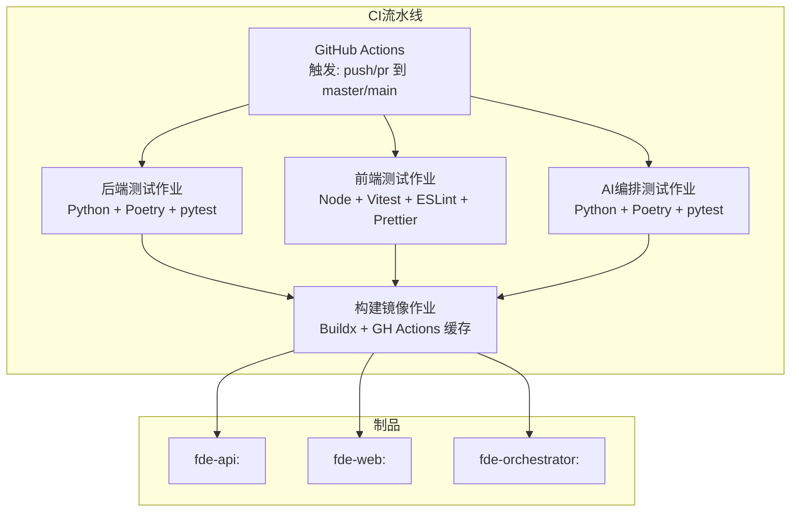
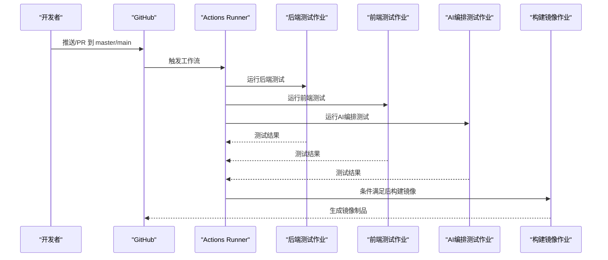
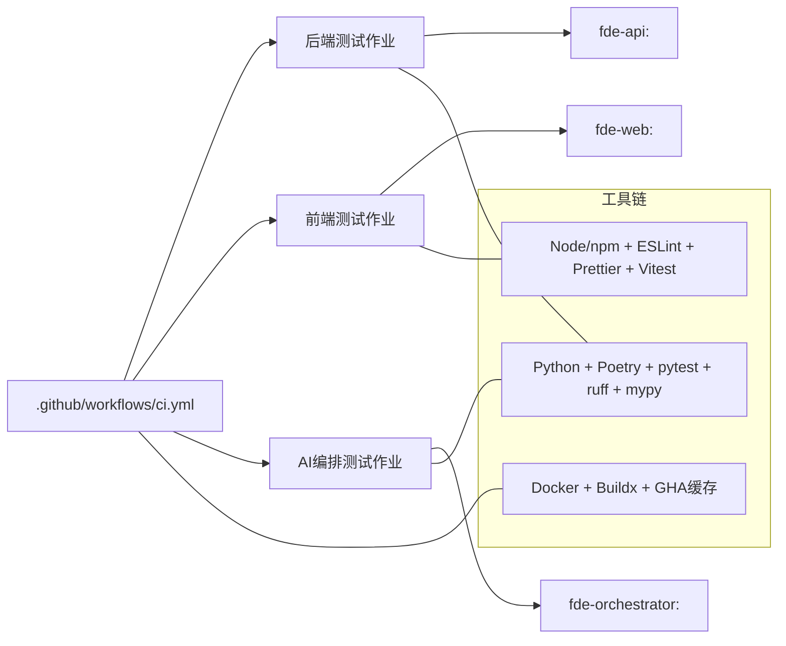
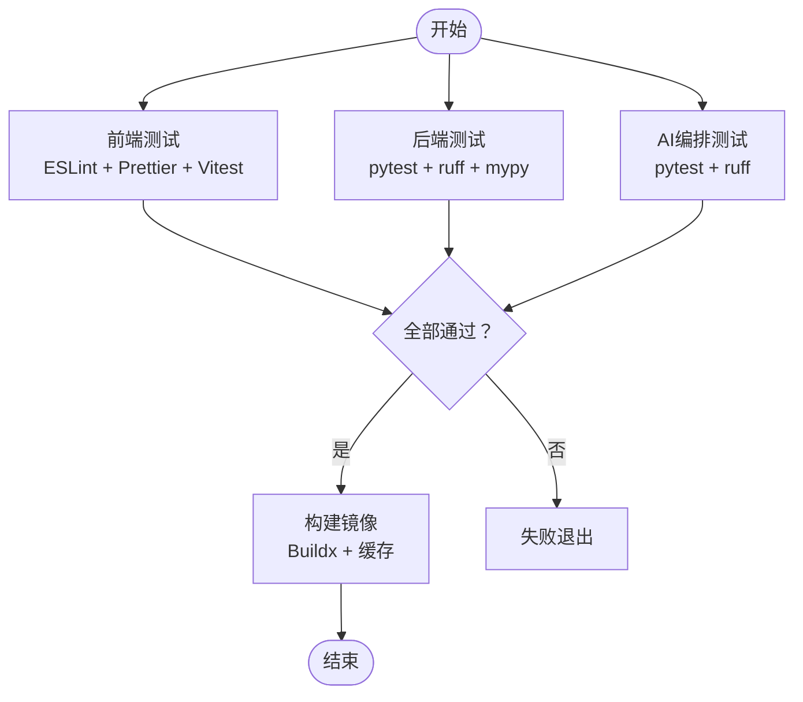

# CI/CD流水线

<cite>
**本文引用的文件**
- [.github/workflows/ci.yml](file://.github/workflows/ci.yml)
- [workspace/web/package.json](file://workspace/web/package.json)
- [workspace/web/vitest.config.ts](file://workspace/web/vitest.config.ts)
- [workspace/web/.eslintrc.cjs](file://workspace/web/.eslintrc.cjs)
- [workspace/web/.prettierrc](file://workspace/web/.prettierrc)
- [workspace/web/Dockerfile](file://workspace/web/Dockerfile)
- [workspace/web/tests/setup.ts](file://workspace/web/tests/setup.ts)
- [workspace/api/pyproject.toml](file://workspace/api/pyproject.toml)
- [workspace/api/Dockerfile](file://workspace/api/Dockerfile)
- [workspace/api/tests/conftest.py](file://workspace/api/tests/conftest.py)
- [workspace/ai-orchestrator/pyproject.toml](file://workspace/ai-orchestrator/pyproject.toml)
- [workspace/ai-orchestrator/Dockerfile](file://workspace/ai-orchestrator/Dockerfile)
- [workspace/ai-orchestrator/tests/test_main.py](file://workspace/ai-orchestrator/tests/test_main.py)
- [docs/部署文档.md](file://docs/部署文档.md)
</cite>

## 目录
1. [简介](#简介)
2. [项目结构](#项目结构)
3. [核心组件](#核心组件)
4. [架构总览](#架构总览)
5. [详细组件分析](#详细组件分析)
6. [依赖关系分析](#依赖关系分析)
7. [性能考虑](#性能考虑)
8. [故障排查指南](#故障排查指南)
9. [结论](#结论)
10. [附录](#附录)

## 简介
本文件面向FDE工作台项目的CI/CD流水线，基于现有GitHub Actions工作流与各子系统的构建、测试与部署配置，给出完整的流水线设计与实施建议。内容涵盖：
- 触发条件、环境变量与缓存策略
- 自动化测试流程（单元、集成、端到端）
- 代码质量检查（静态分析、格式化、类型检查）
- 构建与发布（Docker镜像、版本标签、制品管理）
- 多环境部署策略（开发、测试、生产）
- 回滚机制、蓝绿与金丝雀发布思路
- 监控、告警与故障恢复方案

## 项目结构
FDE工作台采用多模块架构，包含前端Web、后端API、AI编排服务，并通过Docker进行统一打包与部署。CI流水线在GitHub Actions中并行执行三类测试作业，随后按分支策略构建镜像。

图表来源
- [.github/workflows/ci.yml:1-106](file://.github/workflows/ci.yml#L1-L106)
- [workspace/web/Dockerfile:1-21](file://workspace/web/Dockerfile#L1-L21)
- [workspace/api/Dockerfile:1-61](file://workspace/api/Dockerfile#L1-L61)
- [workspace/ai-orchestrator/Dockerfile:1-39](file://workspace/ai-orchestrator/Dockerfile#L1-L39)

章节来源
- [.github/workflows/ci.yml:1-106](file://.github/workflows/ci.yml#L1-L106)

## 核心组件
- 触发与矩阵
  - 触发条件：推送到master/main分支或拉取请求至master/main
  - 并行作业：后端测试、前端测试、AI编排测试
  - 成功条件：所有测试作业成功后才进入镜像构建阶段
- 环境变量
  - 后端测试中设置了JWT密钥用于CI专用测试
- 缓存策略
  - 前端：npm缓存与package-lock.json路径
  - 构建：Docker Buildx使用GHA缓存（cache-from/cache-to）

章节来源
- [.github/workflows/ci.yml:3-106](file://.github/workflows/ci.yml#L3-L106)
- [workspace/api/pyproject.toml:54-57](file://workspace/api/pyproject.toml#L54-L57)

## 架构总览
下图展示从代码提交到镜像构建的关键流程，以及各组件间的依赖关系。

图表来源
- [.github/workflows/ci.yml:9-106](file://.github/workflows/ci.yml#L9-L106)

## 详细组件分析

### GitHub Actions工作流配置
- 触发条件
  - push到master/main
  - pull_request到master/main
- 作业划分
  - 后端测试：Python 3.11，Poetry安装，ruff + mypy + pytest
  - 前端测试：Node 20，npm ci，ESLint + Prettier + Vitest
  - AI编排测试：Python 3.11，Poetry安装，ruff + pytest
- 构建镜像
  - 仅在master分支推送时执行
  - 使用docker/setup-buildx-action与docker/build-push-action
  - 使用GHA缓存提升构建速度
  - 镜像标签采用提交SHA，便于溯源

章节来源
- [.github/workflows/ci.yml:3-106](file://.github/workflows/ci.yml#L3-L106)

### 前端测试与质量检查
- 测试框架
  - Vitest + jsdom环境，覆盖率输出多种格式
  - 别名配置简化导入路径
- 质量工具
  - ESLint + TypeScript解析器 + Vue插件
  - Prettier统一格式化
  - 提交前钩子配合lint-staged批量修复
- 测试准备
  - setup.ts中对window.matchMedia、ResizeObserver、localStorage等进行mock

章节来源
- [workspace/web/package.json:6-16](file://workspace/web/package.json#L6-L16)
- [workspace/web/vitest.config.ts:1-26](file://workspace/web/vitest.config.ts#L1-L26)
- [workspace/web/.eslintrc.cjs:4-21](file://workspace/web/.eslintrc.cjs#L4-L21)
- [workspace/web/.prettierrc:1-8](file://workspace/web/.prettierrc#L1-L8)
- [workspace/web/tests/setup.ts:1-36](file://workspace/web/tests/setup.ts#L1-L36)

### 后端测试与质量检查
- 测试框架
  - pytest + asyncio模式，覆盖率报告term-missing
- 质量工具
  - ruff规则集覆盖常见问题
  - mypy严格类型检查，启用Pydantic插件
- 测试夹具
  - conftest.py提供数据库会话与业务模型样例数据

章节来源
- [workspace/api/pyproject.toml:29-57](file://workspace/api/pyproject.toml#L29-L57)
- [workspace/api/tests/conftest.py:1-139](file://workspace/api/tests/conftest.py#L1-L139)

### AI编排测试与质量检查
- 测试范围
  - 健康检查、SSE聊天流、动作预览、RAG搜索、提示模板、LLM提供者、LangGraph编排
- 质量工具
  - ruff基础规则
- 测试策略
  - 使用ASGI传输与HTTPX异步客户端发起请求，验证响应状态与内容特征

章节来源
- [workspace/ai-orchestrator/pyproject.toml:21-28](file://workspace/ai-orchestrator/pyproject.toml#L21-L28)
- [workspace/ai-orchestrator/tests/test_main.py:1-260](file://workspace/ai-orchestrator/tests/test_main.py#L1-L260)

### 构建与发布流程
- Docker镜像
  - 前端：基于node:20-alpine构建产物，使用nginx:alpine作为运行时
  - 后端：多阶段构建，使用国内镜像源加速，包含健康检查
  - AI编排：多阶段构建，包含健康检查
- 版本标签
  - 使用提交SHA作为镜像tag，便于追踪
- 制品管理
  - 当前工作流仅构建不推送镜像；如需制品库，可在构建后使用docker/build-push-action的push参数或引入ghcr/ecr等仓库

章节来源
- [workspace/web/Dockerfile:1-21](file://workspace/web/Dockerfile#L1-L21)
- [workspace/api/Dockerfile:1-61](file://workspace/api/Dockerfile#L1-L61)
- [workspace/ai-orchestrator/Dockerfile:1-39](file://workspace/ai-orchestrator/Dockerfile#L1-L39)
- [.github/workflows/ci.yml:74-106](file://.github/workflows/ci.yml#L74-L106)

### 多环境部署策略
- 开发环境
  - 支持开发模式（热重载），适合本地联调
- 测试环境
  - 可使用完整构建或快速启动，结合健康检查端点验证
- 生产环境
  - 使用生产配置文件与外部数据库/缓存，关闭mock LLM，配置真实密钥

章节来源
- [docs/部署文档.md:104-151](file://docs/部署文档.md#L104-L151)
- [docs/部署文档.md:154-199](file://docs/部署文档.md#L154-L199)

### 回滚机制、蓝绿与金丝雀发布
- 回滚机制
  - 基于镜像标签回退：使用上一个已知稳定提交的镜像标签进行回滚
- 蓝绿发布
  - 通过切换服务路由或负载均衡器指向新/旧版本实现零停机切换
- 金丝雀发布
  - 将少量流量导入新版本，观察指标与日志后再扩大流量

注：上述为通用发布策略建议，具体实现需结合部署平台（Kubernetes/Docker Compose/云托管）进行配置。

## 依赖关系分析
- 作业耦合
  - 构建镜像作业依赖三个测试作业全部成功
- 工具链依赖
  - 前端：Node/npm、ESLint、Prettier、Vitest
  - 后端：Python/Poetry、pytest、ruff、mypy
  - 构建：Docker Buildx、GHA缓存
- 镜像依赖
  - 前端镜像依赖nginx配置；后端与AI编排镜像依赖运行时与健康检查

图表来源
- [.github/workflows/ci.yml:9-106](file://.github/workflows/ci.yml#L9-L106)
- [workspace/web/package.json:30-52](file://workspace/web/package.json#L30-L52)
- [workspace/api/pyproject.toml:29-37](file://workspace/api/pyproject.toml#L29-L37)
- [workspace/ai-orchestrator/pyproject.toml:21-24](file://workspace/ai-orchestrator/pyproject.toml#L21-L24)

## 性能考虑
- 缓存优化
  - 前端：启用npm缓存并指定依赖锁文件路径
  - 构建：使用GHA缓存（cache-from/cache-to）减少重复构建
- 构建加速
  - 使用国内镜像源（后端Dockerfile已内置）
  - 多阶段构建减少最终镜像体积
- 测试隔离
  - 并行执行三类测试，缩短整体流水线时长

章节来源
- [.github/workflows/ci.yml:44-46](file://.github/workflows/ci.yml#L44-L46)
- [.github/workflows/ci.yml:88-89](file://.github/workflows/ci.yml#L88-L89)
- [workspace/api/Dockerfile:7-8](file://workspace/api/Dockerfile#L7-L8)

## 故障排查指南
- 前端测试失败
  - 检查ESLint规则与Prettier格式化差异，确保提交前已执行lint-staged
  - Vitest覆盖率报告与测试环境配置（setup.ts）
- 后端测试失败
  - 核对pytest配置与覆盖率选项，检查数据库会话mock是否正确
- 构建镜像失败
  - 检查Dockerfile多阶段构建与健康检查端点
  - 确认国内镜像源可用性
- 部署问题
  - 使用部署文档中的命令与健康检查端点定位问题

章节来源
- [workspace/web/.eslintrc.cjs:15-20](file://workspace/web/.eslintrc.cjs#L15-L20)
- [workspace/web/.prettierrc:1-8](file://workspace/web/.prettierrc#L1-8)
- [workspace/web/tests/setup.ts:7-36](file://workspace/web/tests/setup.ts#L7-L36)
- [workspace/api/pyproject.toml:54-57](file://workspace/api/pyproject.toml#L54-L57)
- [workspace/api/Dockerfile:57-58](file://workspace/api/Dockerfile#L57-L58)
- [workspace/ai-orchestrator/Dockerfile:35-36](file://workspace/ai-orchestrator/Dockerfile#L35-L36)
- [docs/部署文档.md:193-198](file://docs/部署文档.md#L193-L198)

## 结论
当前CI流水线已覆盖前端、后端与AI编排的自动化测试，并通过Docker多阶段构建形成标准化制品。建议后续在以下方面完善：
- 在构建作业中启用镜像推送与标签策略
- 引入依赖漏洞扫描与静态分析（如SAST/SBOM）
- 在部署阶段增加蓝绿/金丝雀发布与回滚策略
- 建立流水线监控与告警机制，保障交付稳定性

## 附录

### 测试执行顺序与覆盖范围

图表来源
- [.github/workflows/ci.yml:9-106](file://.github/workflows/ci.yml#L9-L106)