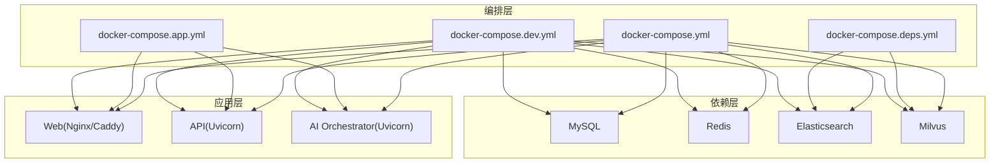
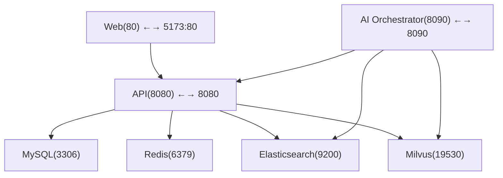
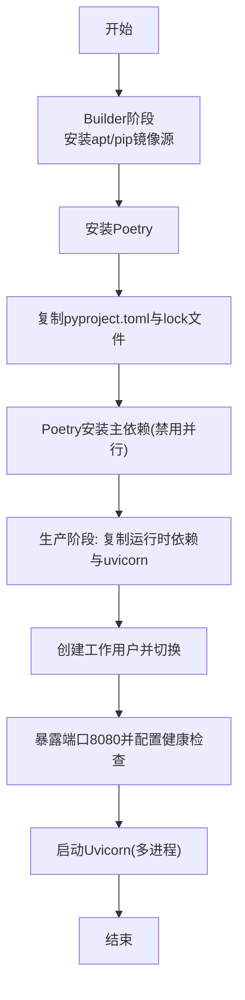
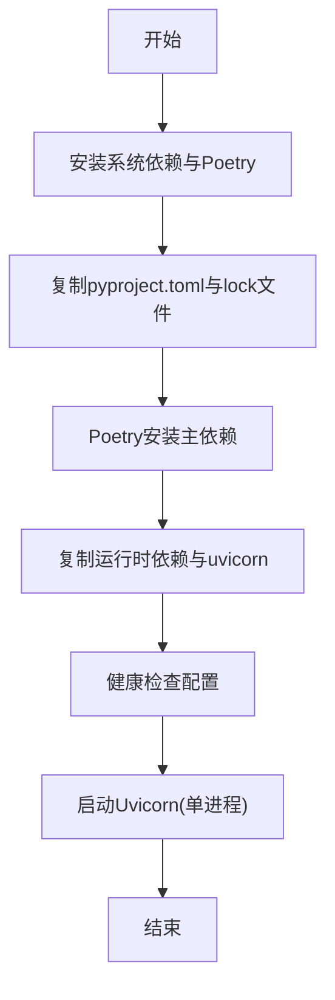
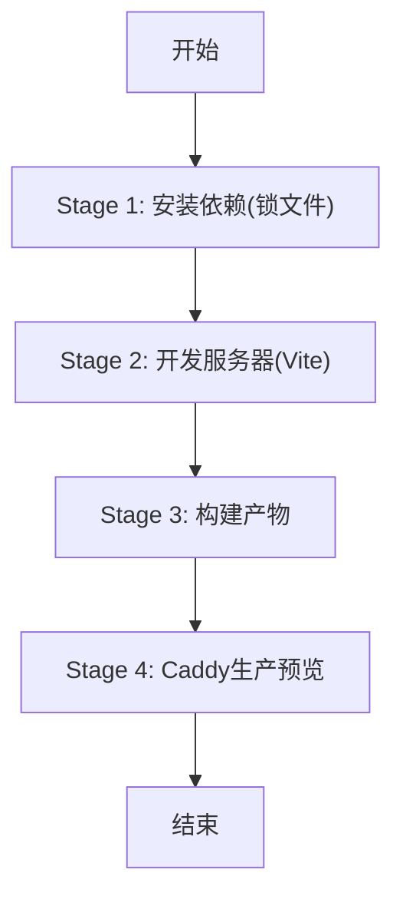
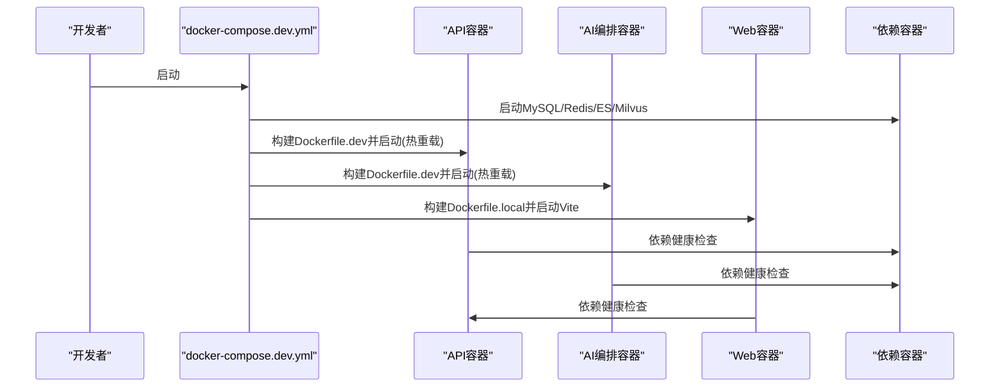
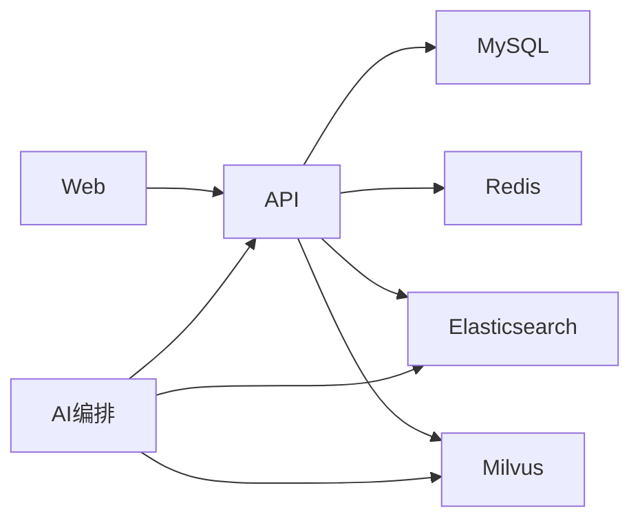

# Docker部署

<cite>
**本文引用的文件**
- [docker-compose.yml](file://workspace/infra/docker-compose/docker-compose.yml)
- [docker-compose.app.yml](file://workspace/infra/docker-compose/docker-compose.app.yml)
- [docker-compose.deps.yml](file://workspace/infra/docker-compose/docker-compose.deps.yml)
- [docker-compose.dev.yml](file://workspace/infra/docker-compose/docker-compose.dev.yml)
- [Dockerfile（API）](file://workspace/api/Dockerfile)
- [Dockerfile.dev（API）](file://workspace/api/Dockerfile.dev)
- [Dockerfile（AI编排）](file://workspace/ai-orchestrator/Dockerfile)
- [Dockerfile.dev（AI编排）](file://workspace/ai-orchestrator/Dockerfile.dev)
- [Dockerfile（Web）](file://workspace/web/Dockerfile)
- [Dockerfile.local（Web）](file://workspace/web/Dockerfile.local)
- [.dockerignore（API）](file://workspace/api/.dockerignore)
- [.dockerignore（AI编排）](file://workspace/ai-orchestrator/.dockerignore)
- [.dockerignore（Web）](file://workspace/web/.dockerignore)
- [部署文档.md](file://docs/部署文档.md)
- [settings.py（API配置）](file://workspace/api/app/config/settings.py)
- [infra/README.md](file://workspace/infra/README.md)
</cite>

## 目录
1. [简介](#简介)
2. [项目结构](#项目结构)
3. [核心组件](#核心组件)
4. [架构总览](#架构总览)
5. [详细组件分析](#详细组件分析)
6. [依赖关系分析](#依赖关系分析)
7. [性能考量](#性能考量)
8. [故障排查指南](#故障排查指南)
9. [结论](#结论)
10. [附录](#附录)

## 简介
本文件面向FDE工作台的Docker部署，覆盖镜像构建（多阶段、依赖管理、体积优化）、服务编排（compose文件、网络、健康检查、依赖顺序）、环境变量管理（数据库、Redis、JWT等）、开发与生产部署策略（Dockerfile.dev与Dockerfile.local差异）、容器启动顺序、资源限制与日志配置，并提供部署检查清单与常见问题解决方案。

## 项目结构
- 三层编排文件：
  - 全栈编排：包含Web、API、AI编排与依赖（MySQL、Redis、Elasticsearch、Milvus）
  - 应用编排：以“外部”依赖为主，便于对接现有基础设施
  - 依赖编排：仅启动ES/Milvus，MySQL/Redis由基础设施提供
  - 开发编排：启用热重载、持久化虚拟环境与node_modules、简化网络
- 三类镜像：
  - API：Python 3.11，Poetry安装依赖，Uvicorn运行，多阶段精简
  - AI编排：Python 3.11，Poetry安装依赖，Uvicorn运行，多阶段精简
  - Web：Node多阶段构建产物，Nginx提供静态服务；local版支持开发服务器与生产预览

图表来源
- [docker-compose.yml:1-132](file://workspace/infra/docker-compose/docker-compose.yml#L1-L132)
- [docker-compose.app.yml:1-73](file://workspace/infra/docker-compose/docker-compose.app.yml#L1-L73)
- [docker-compose.deps.yml:1-44](file://workspace/infra/docker-compose/docker-compose.deps.yml#L1-L44)
- [docker-compose.dev.yml:1-281](file://workspace/infra/docker-compose/docker-compose.dev.yml#L1-L281)

章节来源
- [docker-compose.yml:1-132](file://workspace/infra/docker-compose/docker-compose.yml#L1-L132)
- [docker-compose.app.yml:1-73](file://workspace/infra/docker-compose/docker-compose.app.yml#L1-L73)
- [docker-compose.deps.yml:1-44](file://workspace/infra/docker-compose/docker-compose.deps.yml#L1-L44)
- [docker-compose.dev.yml:1-281](file://workspace/infra/docker-compose/docker-compose.dev.yml#L1-L281)
- [infra/README.md:1-44](file://workspace/infra/README.md#L1-L44)

## 核心组件
- Web服务
  - 生产镜像：基于Nginx，多阶段构建产物
  - 本地开发镜像：支持Vite开发服务器与Caddy生产预览
- API服务
  - 多阶段构建：Builder阶段安装依赖，Production阶段仅拷贝必要运行时
  - Uvicorn多进程运行，健康检查端点
- AI编排服务
  - 多阶段构建：Builder阶段安装依赖，Production阶段仅拷贝运行时
  - Uvicorn单进程运行，健康检查端点
- 依赖服务
  - MySQL、Redis、Elasticsearch、Milvus，均配置健康检查与持久化卷

章节来源
- [Dockerfile（Web）:1-21](file://workspace/web/Dockerfile#L1-L21)
- [Dockerfile.local（Web）:1-115](file://workspace/web/Dockerfile.local#L1-L115)
- [Dockerfile（API）:1-61](file://workspace/api/Dockerfile#L1-L61)
- [Dockerfile.dev（API）:1-68](file://workspace/api/Dockerfile.dev#L1-L68)
- [Dockerfile（AI编排）:1-39](file://workspace/ai-orchestrator/Dockerfile#L1-L39)
- [Dockerfile.dev（AI编排）:1-54](file://workspace/ai-orchestrator/Dockerfile.dev#L1-L54)
- [docker-compose.yml:3-132](file://workspace/infra/docker-compose/docker-compose.yml#L3-L132)

## 架构总览
下图展示容器间交互与端口映射，以及服务依赖顺序（API依赖数据库/缓存/搜索，Web依赖API，AI编排依赖API与向量/搜索）。

图表来源
- [docker-compose.yml:66-126](file://workspace/infra/docker-compose/docker-compose.yml#L66-L126)

章节来源
- [docker-compose.yml:66-126](file://workspace/infra/docker-compose/docker-compose.yml#L66-L126)

## 详细组件分析

### API服务镜像构建（多阶段与依赖管理）
- 构建阶段
  - 使用国内apt/pip镜像源，提升安装速度
  - Poetry安装主依赖，禁用并行加速
- 生产阶段
  - 仅复制site-packages与uvicorn二进制，减小镜像体积
  - 添加非root用户与权限修正
  - 暴露8080端口，健康检查通过HTTP端点
- 命令与并发
  - Uvicorn多进程运行，适合生产

图表来源
- [Dockerfile（API）:1-61](file://workspace/api/Dockerfile#L1-L61)

章节来源
- [Dockerfile（API）:1-61](file://workspace/api/Dockerfile#L1-L61)

### AI编排服务镜像构建（多阶段与依赖管理）
- 构建阶段
  - 安装系统依赖与Poetry
  - 复制依赖文件，Poetry安装主依赖
- 生产阶段
  - 仅复制运行时依赖与uvicorn
  - 健康检查通过HTTP端点
- 命令
  - Uvicorn单进程运行

图表来源
- [Dockerfile（AI编排）:1-39](file://workspace/ai-orchestrator/Dockerfile#L1-L39)

章节来源
- [Dockerfile（AI编排）:1-39](file://workspace/ai-orchestrator/Dockerfile#L1-L39)

### Web服务镜像构建（多阶段与开发/生产变体）
- 生产镜像（Dockerfile）
  - Node多阶段构建产物
  - Nginx提供静态服务
- 本地开发镜像（Dockerfile.local）
  - Stage 1：按锁文件安装依赖（最大化缓存）
  - Stage 2：开发服务器（Vite），支持热重载
  - Stage 3：构建产物
  - Stage 4：Caddy提供生产预览

图表来源
- [Dockerfile.local（Web）:1-115](file://workspace/web/Dockerfile.local#L1-L115)

章节来源
- [Dockerfile（Web）:1-21](file://workspace/web/Dockerfile#L1-L21)
- [Dockerfile.local（Web）:1-115](file://workspace/web/Dockerfile.local#L1-L115)

### 开发模式镜像与启动流程（docker-compose.dev.yml）
- API/AI编排
  - 使用Dockerfile.dev，Poetry虚拟环境持久化
  - Uvicorn带--reload，支持热重载
- Web
  - 使用Dockerfile.local，Vite开发服务器
  - 挂载源码与node_modules缓存
- 依赖
  - MySQL/Redis/ES/Milvus均在容器内运行
  - API/AI编排健康检查通过HTTP端点

图表来源
- [docker-compose.dev.yml:1-281](file://workspace/infra/docker-compose/docker-compose.dev.yml#L1-L281)

章节来源
- [docker-compose.dev.yml:1-281](file://workspace/infra/docker-compose/docker-compose.dev.yml#L1-L281)

### 环境变量管理
- API关键变量
  - 数据库连接：DATABASE_URL
  - 缓存：REDIS_URL
  - 搜索：ES_URL
  - 向量：MILVUS_HOST/PORT
  - AI编排：AI_ORCHESTRATOR_URL
  - 认证：JWT_SECRET_KEY、JWT算法与过期
  - 日志：LOG_LEVEL、LOG_FORMAT
- AI编排关键变量
  - LLM提供商API Key：DASHSCOPE_API_KEY、OPENAI_API_KEY
  - 依赖服务：ES_HOST/PORT、MILVUS_HOST/PORT
  - 上游API：API_BASE_URL
- Web关键变量（开发镜像）
  - VITE_API_BASE_URL
  - VITE_USE_MOCK
  - 文件监控相关环境变量（CHOKIDAR_USEPOLLING、WATCHPACK_POLLING）

章节来源
- [docker-compose.yml:72-80](file://workspace/infra/docker-compose/docker-compose.yml#L72-L80)
- [docker-compose.app.yml:12-20](file://workspace/infra/docker-compose/docker-compose.app.yml#L12-L20)
- [docker-compose.dev.yml:31-48](file://workspace/infra/docker-compose/docker-compose.dev.yml#L31-L48)
- [settings.py（API配置）:12-81](file://workspace/api/app/config/settings.py#L12-L81)

### 服务编排与健康检查
- 服务定义
  - Web：暴露80端口，映射至5173（开发）或80（生产）
  - API：暴露8080端口，健康检查通过HTTP端点
  - AI编排：暴露8090端口，健康检查通过HTTP端点
  - 依赖：MySQL/Redis/Elasticsearch/Milvus均配置健康检查
- 依赖关系
  - API依赖数据库/缓存/搜索健康
  - AI编排依赖API健康
  - Web依赖API健康
- 网络
  - 开发编排使用自定义桥接网络
  - 应用编排可加入外部共享网络

章节来源
- [docker-compose.yml:66-126](file://workspace/infra/docker-compose/docker-compose.yml#L66-L126)
- [docker-compose.app.yml:21-68](file://workspace/infra/docker-compose/docker-compose.app.yml#L21-L68)
- [docker-compose.dev.yml:49-148](file://workspace/infra/docker-compose/docker-compose.dev.yml#L49-L148)

### 开发与生产部署策略
- 开发模式（docker-compose.dev.yml）
  - 热重载：API/AI编排使用--reload；Web使用Vite
  - 持久化缓存：Python虚拟环境与node_modules卷
  - 端口映射：Web映射5173而非80，避免冲突
- 生产模式（docker-compose.yml / docker-compose.app.yml）
  - 使用Dockerfile（非.dev），镜像更精简
  - Web使用Nginx或Caddy进行生产预览
  - 依赖可指向外部实例（应用编排）

章节来源
- [docker-compose.dev.yml:1-281](file://workspace/infra/docker-compose/docker-compose.dev.yml#L1-L281)
- [docker-compose.yml:118-126](file://workspace/infra/docker-compose/docker-compose.yml#L118-L126)
- [docker-compose.app.yml:57-68](file://workspace/infra/docker-compose/docker-compose.app.yml#L57-L68)

### 容器启动顺序与依赖关系
- 顺序
  - 依赖服务先于应用服务启动
  - 应用服务等待依赖健康后再启动自身
- 条件
  - service_healthy/service_started用于精确控制启动时机

章节来源
- [docker-compose.yml:81-87](file://workspace/infra/docker-compose/docker-compose.yml#L81-L87)
- [docker-compose.app.yml:45-47](file://workspace/infra/docker-compose/docker-compose.app.yml#L45-L47)
- [docker-compose.dev.yml:51-59](file://workspace/infra/docker-compose/docker-compose.dev.yml#L51-L59)

### 资源限制与日志配置
- 资源限制
  - 可在compose中添加deploy.resources（CPU/内存配额）
- 日志
  - 使用Docker日志驱动与JSON格式
  - 建议在生产中配置日志聚合（如Filebeat/Fluent Bit）

章节来源
- [Dockerfile（API）:52-53](file://workspace/api/Dockerfile#L52-L53)
- [Dockerfile（AI编排）:31-32](file://workspace/ai-orchestrator/Dockerfile#L31-L32)
- [Dockerfile.local（Web）:107-109](file://workspace/web/Dockerfile.local#L107-L109)

## 依赖关系分析
- 组件耦合
  - API与数据库/缓存/搜索耦合度高，需优先可用
  - Web与API耦合度高，需等待API健康
  - AI编排与API耦合度高，且依赖搜索/向量
- 外部依赖
  - 应用编排可将数据库/缓存指向外部实例，降低耦合
- 循环依赖
  - 无循环依赖，依赖方向清晰

图表来源
- [docker-compose.yml:66-126](file://workspace/infra/docker-compose/docker-compose.yml#L66-L126)

章节来源
- [docker-compose.yml:66-126](file://workspace/infra/docker-compose/docker-compose.yml#L66-L126)

## 性能考量
- 镜像体积
  - 多阶段构建仅复制运行时依赖，显著减少体积
- 构建速度
  - 使用国内镜像源与缓存策略（.dockerignore、锁文件）
- 运行效率
  - API使用多进程Uvicorn，AI编排单进程满足轻量需求
- 热重载
  - 开发模式启用--reload与Vite，提升迭代效率

章节来源
- [Dockerfile（API）:1-61](file://workspace/api/Dockerfile#L1-L61)
- [Dockerfile（AI编排）:1-39](file://workspace/ai-orchestrator/Dockerfile#L1-L39)
- [Dockerfile.local（Web）:1-115](file://workspace/web/Dockerfile.local#L1-L115)
- [docker-compose.dev.yml:43-47](file://workspace/infra/docker-compose/docker-compose.dev.yml#L43-L47)

## 故障排查指南
- 健康检查失败
  - 检查API/AI编排健康端点与依赖服务状态
- 端口冲突
  - 开发模式Web映射5173，避免与宿主占用冲突
- 依赖不可达
  - 检查compose中的服务名称与网络配置
- 日志查看
  - 使用deploy logs或docker logs查看具体服务日志
- 数据库连接
  - 检查DATABASE_URL与容器网络连通性

章节来源
- [部署文档.md:202-276](file://docs/部署文档.md#L202-L276)
- [docker-compose.yml:88-92](file://workspace/infra/docker-compose/docker-compose.yml#L88-L92)
- [docker-compose.app.yml:23-27](file://workspace/infra/docker-compose/docker-compose.app.yml#L23-L27)

## 结论
本文档提供了FDE工作台的Docker部署全景：从多阶段镜像构建、依赖管理与体积优化，到compose服务编排、健康检查与启动顺序，再到开发与生产的差异化策略、环境变量管理与故障排查。建议在生产中采用精简镜像与外部依赖，开发中采用热重载与持久化缓存，确保高效迭代与稳定运行。

## 附录

### 部署检查清单
- 构建与启动
  - 使用docker-compose完成全栈/应用/依赖编排
  - 确认各服务健康检查通过
- 环境变量
  - 数据库、Redis、ES、Milvus、JWT密钥、LLM Key均已正确配置
- 端口与网络
  - 端口映射符合预期，网络互通正常
- 日志与监控
  - 日志输出正常，必要时接入集中日志
- 安全
  - JWT密钥强度足够，敏感信息不进入镜像

### 常用命令参考
- 全栈/应用/依赖编排启动与停止
- 查看状态与日志
- 重启与重置

章节来源
- [部署文档.md:280-334](file://docs/部署文档.md#L280-L334)