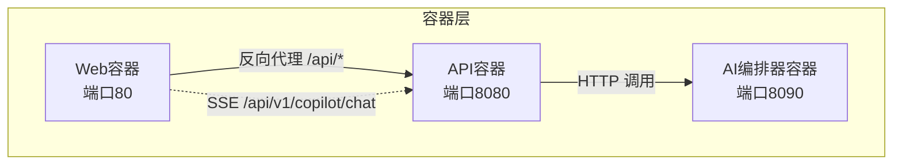
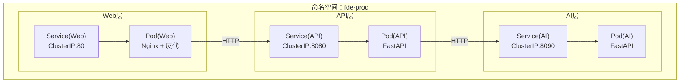
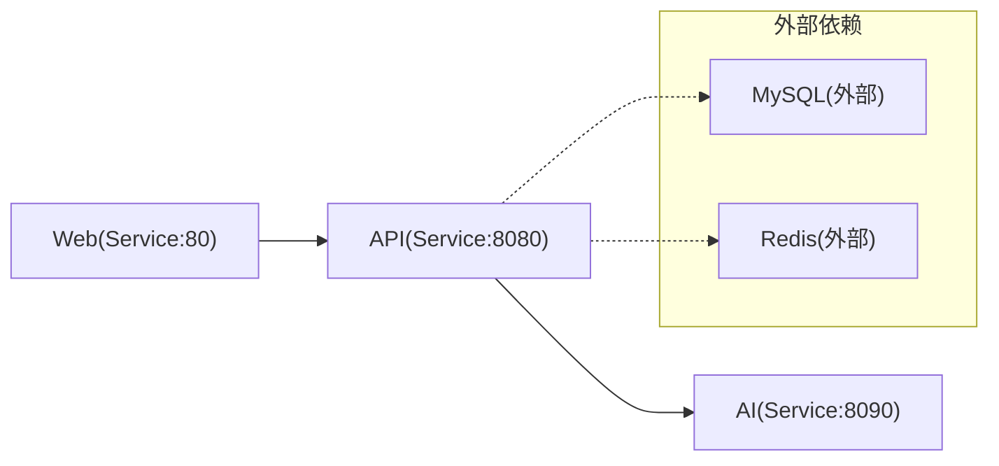

# Kubernetes部署

<cite>
**本文引用的文件**
- [部署文档.md](file://docs/部署文档.md)
- [docker-compose.yml](file://docker-compose.yml)
- [docker-compose.app.yml](file://workspace/infra/docker-compose/docker-compose.app.yml)
- [docker-compose.deps.yml](file://workspace/infra/docker-compose/docker-compose.deps.yml)
- [docker-compose.dev.yml](file://workspace/infra/docker-compose/docker-compose.dev.yml)
- [Dockerfile（API）](file://workspace/api/Dockerfile)
- [Dockerfile（Web）](file://workspace/web/Dockerfile)
- [Dockerfile（AI编排器）](file://workspace/ai-orchestrator/Dockerfile)
- [nginx.conf](file://workspace/web/nginx.conf)
- [settings.py（API配置）](file://workspace/api/app/config/settings.py)
- [main.py（API入口）](file://workspace/api/app/main.py)
- [main.py（AI编排器入口）](file://workspace/ai-orchestrator/app/main.py)
- [.gitkeep（k8s占位）](file://workspace/infra/k8s/.gitkeep)
</cite>

## 目录
1. [简介](#简介)
2. [项目结构](#项目结构)
3. [核心组件](#核心组件)
4. [架构总览](#架构总览)
5. [详细组件分析](#详细组件分析)
6. [依赖关系分析](#依赖关系分析)
7. [性能考量](#性能考量)
8. [故障排除指南](#故障排除指南)
9. [结论](#结论)
10. [附录](#附录)

## 简介
本文件面向在Kubernetes上部署FDE工作台的工程实践，基于仓库内现有的Docker Compose与容器镜像定义，给出可落地的Kubernetes部署方案。内容涵盖命名空间与网络设计、Deployment与Service配置要点、ConfigMap与Secret管理、Helm Chart与kubectl部署建议、Pod调度与资源限制、HPA自动扩缩容、以及完整的部署检查清单与故障排除指引。

## 项目结构
FDE工作台由三层服务构成：
- Web前端服务：静态站点+反向代理，负责SPA路由与API代理
- API后端服务：FastAPI应用，提供业务接口与健康检查
- AI编排器服务：FastAPI应用，提供AI对话与RAG能力，被API调用

下图展示容器化服务与端口映射关系，便于映射到Kubernetes资源：

图表来源
- [docker-compose.yml:80-92](file://docker-compose.yml#L80-L92)
- [nginx.conf:17-36](file://workspace/web/nginx.conf#L17-L36)
- [Dockerfile（Web）:18](file://workspace/web/Dockerfile#L18)
- [Dockerfile（API）:55](file://workspace/api/Dockerfile#L55)
- [Dockerfile（AI编排器）:33](file://workspace/ai-orchestrator/Dockerfile#L33)

章节来源
- [docker-compose.yml:80-92](file://docker-compose.yml#L80-L92)
- [nginx.conf:17-36](file://workspace/web/nginx.conf#L17-L36)

## 核心组件
- Web前端
  - 静态资源由Nginx提供；通过反向代理转发/api/到后端API；SSE路径单独处理
  - 暴露端口80
- API后端
  - FastAPI应用，提供多模块路由；内置/health健康检查
  - 暴露端口8080；健康检查URL为/health
- AI编排器
  - 提供AI聊天SSE流、工具列表、RAG检索与索引等接口
  - 暴露端口8090；内置/health健康检查

章节来源
- [nginx.conf:17-36](file://workspace/web/nginx.conf#L17-L36)
- [main.py（API入口）:70-73](file://workspace/api/app/main.py#L70-L73)
- [Dockerfile（API）:55-61](file://workspace/api/Dockerfile#L55-L61)
- [Dockerfile（AI编排器）:33-39](file://workspace/ai-orchestrator/Dockerfile#L33-L39)
- [main.py（AI编排器入口）:79-86](file://workspace/ai-orchestrator/app/main.py#L79-L86)

## 架构总览
Kubernetes部署建议采用“三层服务+共享网络”的架构：
- 命名空间：按环境划分（如fde-prod、fde-dev），隔离资源与权限
- 网络：使用ClusterIP Service暴露内部服务；对外统一由Ingress/NLB接入
- 存储：数据库与缓存作为外部依赖（MySQL/Redis），避免在集群内自建
- 安全：敏感配置放入Secret；非敏感配置放入ConfigMap；启用Pod安全策略

图表来源
- [docker-compose.yml:43-46](file://docker-compose.yml#L43-L46)
- [nginx.conf:17-36](file://workspace/web/nginx.conf#L17-L36)
- [Dockerfile（Web）:18](file://workspace/web/Dockerfile#L18)
- [Dockerfile（API）:55](file://workspace/api/Dockerfile#L55)
- [Dockerfile（AI编排器）:33](file://workspace/ai-orchestrator/Dockerfile#L33)

## 详细组件分析

### 命名空间与网络策略
- 命名空间
  - 建议创建独立命名空间用于隔离不同环境（如fde-prod、fde-staging、fde-dev）
  - 在命名空间级别设置ResourceQuota与LimitRange，控制CPU/内存总量与单Pod默认限制
- 网络
  - 内部服务使用ClusterIP，确保仅集群内可达
  - 对外暴露使用Ingress（或云厂商LB），统一TLS终止与路由规则
  - 可选NetworkPolicy限制入站/出站流量，仅允许必要的服务间通信

章节来源
- [docker-compose.yml:43-46](file://docker-compose.yml#L43-L46)

### Deployment配置要点
- 副本数
  - Web：至少2副本，结合就绪探针保障滚动更新期间无损流量
  - API：至少2副本，考虑并发与会话特性，必要时启用亲和性
  - AI：根据负载与模型资源评估副本数，建议与HPA联动
- 滚动更新策略
  - 设置maxUnavailable与maxSurge，确保更新过程中的可用性
  - 结合ReadinessGate与PodDisruptionBudget，避免同时驱逐
- 就绪探针
  - Web：以HTTP GET /health或Nginx可用性检测为准
  - API：HTTP GET /health
  - AI：HTTP GET /health
- 安全上下文
  - API/AI：使用非root用户运行（镜像中已切换）
  - Web：Nginx以非root运行即可

章节来源
- [Dockerfile（API）:57-58](file://workspace/api/Dockerfile#L57-L58)
- [Dockerfile（AI编排器）:35-36](file://workspace/ai-orchestrator/Dockerfile#L35-L36)
- [main.py（API入口）:70-73](file://workspace/api/app/main.py#L70-L73)
- [main.py（AI编排器入口）:79-86](file://workspace/ai-orchestrator/app/main.py#L79-L86)

### Service配置：ClusterIP、LoadBalancer与Ingress
- ClusterIP
  - 用于内部服务发现：Web→API、API→AI
- LoadBalancer
  - 用于对外暴露：Ingress Controller或云LB
- Ingress
  - 路由规则：/api/* 反代至API；/api/v1/copilot/chat 走SSE
  - TLS：统一在Ingress终止，简化后端证书管理
  - 限流/压缩：可在Ingress层配置

章节来源
- [nginx.conf:17-36](file://workspace/web/nginx.conf#L17-L36)

### ConfigMap与Secret管理
- ConfigMap
  - 非敏感配置：如日志级别、功能开关、第三方服务地址
  - 通过挂载或环境变量注入；支持热更新（滚动重启Pod生效）
- Secret
  - 敏感配置：数据库密码、Redis密码、JWT密钥、LLM API Key
  - 建议使用kubernetes.io/tls存储证书；其他凭据使用Opaque类型
- 热更新
  - ConfigMap/Secret变更后，通过滚动更新触发Pod重启以加载新值
  - 对于SSE/长连接场景，需确保客户端具备重连逻辑

章节来源
- [settings.py（API配置）:40-58](file://workspace/api/app/config/settings.py#L40-L58)

### Helm Chart部署方案
- Chart结构建议
  - templates/：Deployment、Service、Ingress、ConfigMap、Secret、HPA、PDB
  - values.yaml：环境差异化参数（副本数、资源、镜像标签、Ingress域名）
  - crds/：如需使用IngressClass等
- 关键模板
  - Deployment：容器镜像、探针、资源、安全上下文、亲和性
  - Service：ClusterIP与端口映射
  - Ingress：路由规则、TLS、注解
  - ConfigMap/Secret：按需生成
  - HPA：基于CPU/自定义指标
- 发布流程
  - helm lint → helm template → kubectl apply 或 helm upgrade --install

说明：本仓库未提供Helm Chart源文件，以上为通用最佳实践建议。

### kubectl命令行部署方式
- 基本步骤
  - 创建命名空间与资源配额
  - 应用ConfigMap/Secret
  - 应用Service与Deployment
  - 应用Ingress
  - 验证健康与连通性
- 常用命令
  - kubectl apply -f manifests/
  - kubectl rollout status deployment/<name>
  - kubectl get pods -o wide
  - kubectl describe pod <name>
  - kubectl logs -f deployment/<name>

### Pod调度策略、资源限制与HPA
- 调度
  - 优先使用节点选择器/污点容忍，确保关键服务分布在不同节点
  - Web与API可启用拓扑感知，降低跨节点延迟
- 资源
  - API/AI：建议设置requests/limits（CPU/内存），避免资源争抢
  - Web：Nginx轻量，可适当降低requests
- HPA
  - 基于CPU利用率或自定义指标（QPS、队列长度）进行扩缩容
  - 配置最小/最大副本数，避免过度伸缩

## 依赖关系分析
- 服务依赖
  - Web依赖API；API依赖AI编排器；数据库与缓存为外部依赖
- 端口与协议
  - Web:80（HTTP）→ API:8080（HTTP）
  - API:8080（HTTP）→ AI:8090（HTTP）
  - Web对API的SSE路径需保持长连接与缓冲关闭
- 网络连通性
  - 同一命名空间内通过Service DNS访问
  - 外部数据库/缓存通过环境变量配置

图表来源
- [docker-compose.yml:12-18](file://docker-compose.yml#L12-L18)
- [docker-compose.app.yml:12-18](file://workspace/infra/docker-compose/docker-compose.app.yml#L12-L18)

章节来源
- [docker-compose.yml:12-18](file://docker-compose.yml#L12-L18)
- [docker-compose.app.yml:12-18](file://workspace/infra/docker-compose/docker-compose.app.yml#L12-L18)

## 性能考量
- 端口与探针
  - 严格遵循容器暴露端口与健康检查路径，避免探针误判导致频繁重启
- 资源规划
  - API与AI通常为CPU密集型，应合理设置requests/limits
  - Web为I/O密集型，Nginx可承载较高并发
- 网络优化
  - Ingress层开启gzip与静态资源缓存
  - SSE路径禁用代理缓存与缓冲，保证实时性
- 调度与亲和
  - 将同属一个业务链路的服务尽量调度在同一节点或同可用区，减少网络抖动

## 故障排除指南
- 健康检查失败
  - 检查容器内/health端点是否可达；确认端口与探针配置一致
- 无法访问API
  - 检查Service端口与Selector；确认Ingress路由规则
- SSE连接中断
  - 检查代理层是否启用缓冲与缓存；确认超时与Keep-Alive设置
- 认证失败
  - 检查JWT密钥是否正确注入到Secret；确认API与Web的密钥一致
- 数据库/缓存连接异常
  - 检查外部服务可达性与凭据；确认网络策略放行

章节来源
- [main.py（API入口）:70-73](file://workspace/api/app/main.py#L70-L73)
- [main.py（AI编排器入口）:79-86](file://workspace/ai-orchestrator/app/main.py#L79-L86)
- [nginx.conf:17-36](file://workspace/web/nginx.conf#L17-L36)
- [settings.py（API配置）:40-58](file://workspace/api/app/config/settings.py#L40-L58)

## 结论
本文基于仓库现有容器化与编排实践，给出了在Kubernetes上部署FDE工作台的完整方案。通过清晰的命名空间与网络设计、合理的Deployment与Service配置、完善的ConfigMap/Secret管理、以及HPA与滚动更新策略，可实现高可用、可观测、易维护的生产级部署。

## 附录

### 部署检查清单
- 基础设施
  - 命名空间、ResourceQuota、LimitRange已创建
  - Ingress Controller/LB可用，TLS证书已配置
- 配置
  - ConfigMap/Secret已创建，敏感信息已加密存储
  - 环境变量与挂载路径正确
- 服务
  - Service（ClusterIP）与Ingress已创建
  - Deployment副本数、探针、资源限制已配置
- 运行验证
  - Pod状态均为Running；事件无错误
  - /health端点返回正常
  - API/SSE连通性测试通过
  - 外部依赖（数据库/缓存）连通性测试通过

### 参考文件与路径
- [部署文档.md](file://docs/部署文档.md)
- [docker-compose.yml](file://docker-compose.yml)
- [docker-compose.app.yml](file://workspace/infra/docker-compose/docker-compose.app.yml)
- [docker-compose.deps.yml](file://workspace/infra/docker-compose/docker-compose.deps.yml)
- [docker-compose.dev.yml](file://workspace/infra/docker-compose/docker-compose.dev.yml)
- [Dockerfile（API）](file://workspace/api/Dockerfile)
- [Dockerfile（Web）](file://workspace/web/Dockerfile)
- [Dockerfile（AI编排器）](file://workspace/ai-orchestrator/Dockerfile)
- [nginx.conf](file://workspace/web/nginx.conf)
- [settings.py（API配置）](file://workspace/api/app/config/settings.py)
- [main.py（API入口）](file://workspace/api/app/main.py)
- [main.py（AI编排器入口）](file://workspace/ai-orchestrator/app/main.py)
- [.gitkeep（k8s占位）](file://workspace/infra/k8s/.gitkeep)