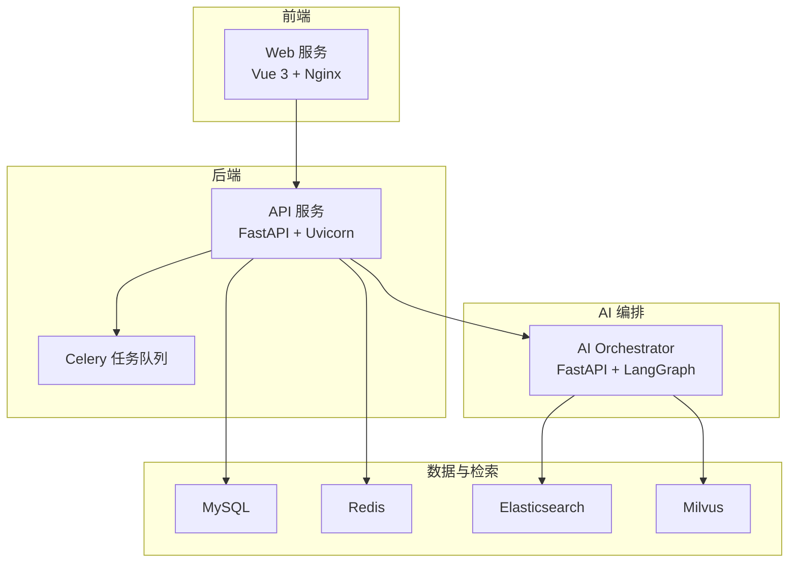
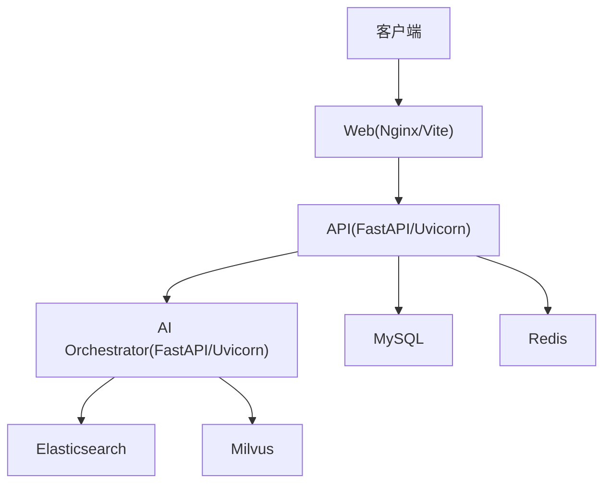
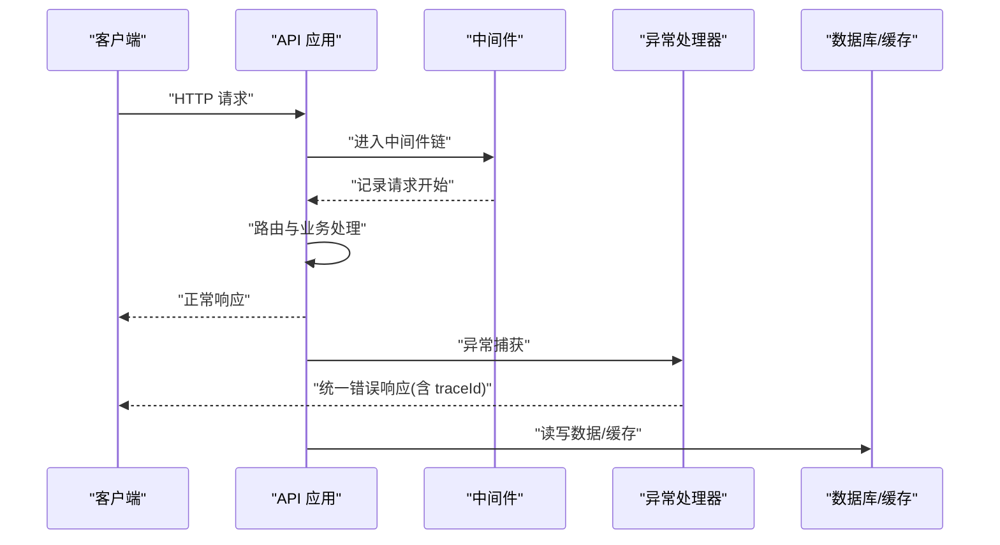
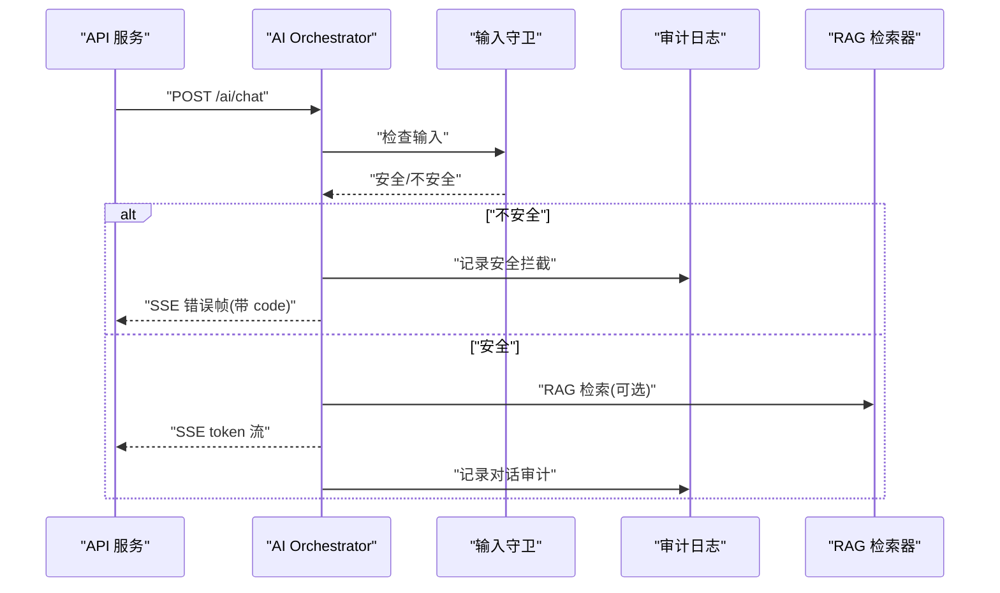
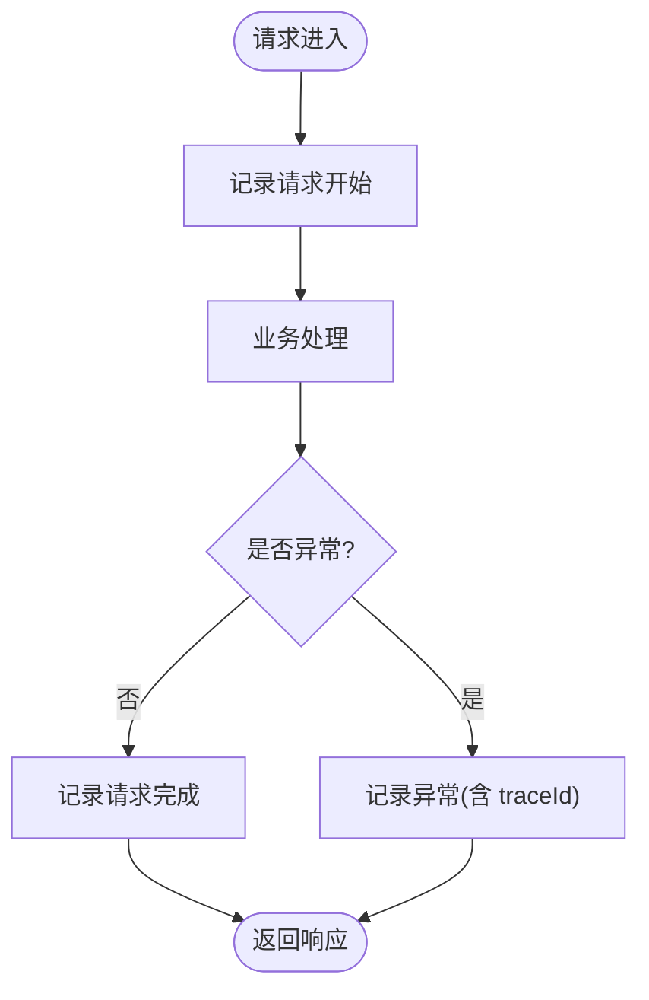
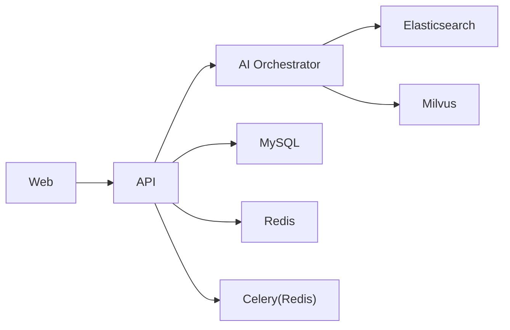

# 故障排除与运维

<cite>
**本文引用的文件**   
- [部署文档.md](file://docs/部署文档.md)
- [05-部署运维详细设计.md](file://docs/detail-design/05-部署运维详细设计.md)
- [docker-compose.yml](file://workspace/infra/docker-compose/docker-compose.yml)
- [docker-compose.app.yml](file://workspace/infra/docker-compose/docker-compose.app.yml)
- [docker-compose.deps.yml](file://workspace/infra/docker-compose/docker-compose.deps.yml)
- [main.py（API）](file://workspace/api/app/main.py)
- [logging.py（API 日志中间件）](file://workspace/api/app/middleware/logging.py)
- [logging.py（API 日志配置）](file://workspace/api/app/config/logging.py)
- [handlers.py（API 异常处理）](file://workspace/api/app/exceptions/handlers.py)
- [celery_app.py（API 任务）](file://workspace/api/app/tasks/celery_app.py)
- [main.py（AI Orchestrator）](file://workspace/ai-orchestrator/app/main.py)
- [config.py（AI Orchestrator 配置）](file://workspace/ai-orchestrator/app/config.py)
- [start-all.sh（开发脚本）](file://workspace/scripts/dev/start-all.sh)
- [package.json（前端）](file://workspace/web/package.json)
- [pyproject.toml（后端）](file://workspace/api/pyproject.toml)
</cite>

## 目录
1. [简介](#简介)
2. [项目结构](#项目结构)
3. [核心组件](#核心组件)
4. [架构总览](#架构总览)
5. [详细组件分析](#详细组件分析)
6. [依赖关系分析](#依赖关系分析)
7. [性能考量](#性能考量)
8. [故障排除指南](#故障排除指南)
9. [结论](#结论)
10. [附录](#附录)

## 简介
本文件面向运维与平台工程团队，提供 FDE 工作台的故障排除与运维指南。内容覆盖启动失败排查、性能问题分析、内存泄漏检测、日志分析技巧、系统健康检查、紧急响应流程、运维工具使用、备份恢复策略、灾难恢复计划与业务连续性保障，并补充运维最佳实践与安全加固建议。

## 项目结构
FDE 工作台由三层组成：前端 Web（Vue 3 + Vite）、后端 API（FastAPI + Uvicorn）、AI 编排服务（FastAPI + LangGraph）。容器化通过 Docker Compose 编排，支持开发模式与生产模式；同时提供 Kubernetes 部署与监控告警设计蓝图。

图表来源
- [docker-compose.yml:1-132](file://workspace/infra/docker-compose/docker-compose.yml#L1-L132)
- [docker-compose.app.yml:1-73](file://workspace/infra/docker-compose/docker-compose.app.yml#L1-L73)
- [main.py（API）:1-73](file://workspace/api/app/main.py#L1-L73)
- [main.py（AI Orchestrator）:1-307](file://workspace/ai-orchestrator/app/main.py#L1-L307)

章节来源
- [部署文档.md:17-101](file://docs/部署文档.md#L17-L101)
- [05-部署运维详细设计.md:8-51](file://docs/detail-design/05-部署运维详细设计.md#L8-L51)

## 核心组件
- Web 服务：前端静态资源与反向代理，负责 API 与 SSE 代理、SPA 回退。
- API 服务：业务主服务，提供 REST/SSE 接口、统一异常处理、结构化日志、健康检查。
- AI Orchestrator：AI 编排服务，提供聊天流式输出、工具调用、RAG 检索与索引、健康检查。
- 任务系统：基于 Celery 的异步任务（Redis 作为 Broker/Backend），支持重试、软超时与硬超时。
- 数据与检索：MySQL（持久化）、Redis（缓存/会话/队列）、ES/Milvus（RAG 检索）。

章节来源
- [docker-compose.yml:66-126](file://workspace/infra/docker-compose/docker-compose.yml#L66-L126)
- [docker-compose.app.yml:4-68](file://workspace/infra/docker-compose/docker-compose.app.yml#L4-L68)
- [main.py（API）:36-73](file://workspace/api/app/main.py#L36-L73)
- [main.py（AI Orchestrator）:43-86](file://workspace/ai-orchestrator/app/main.py#L43-L86)
- [celery_app.py:8-28](file://workspace/api/app/tasks/celery_app.py#L8-L28)

## 架构总览
整体架构采用“Web → API → AI Orchestrator”的链路，内部依赖 MySQL、Redis、ES、Milvus。健康检查端点统一为 /health，便于运维快速验证服务可用性。

图表来源
- [05-部署运维详细设计.md:12-40](file://docs/detail-design/05-部署运维详细设计.md#L12-L40)
- [main.py（API）:70-73](file://workspace/api/app/main.py#L70-L73)
- [main.py（AI Orchestrator）:79-86](file://workspace/ai-orchestrator/app/main.py#L79-L86)

## 详细组件分析

### API 服务（FastAPI）
- 中间件：CORS、Trace（请求追踪 ID）、结构化日志中间件。
- 异常处理：统一返回结构，包含 traceId，便于跨服务定位问题。
- 健康检查：/health 返回状态与版本信息。
- 任务系统：Celery 配置默认重试、软/硬超时，确保后台任务稳定性。

图表来源
- [main.py（API）:44-55](file://workspace/api/app/main.py#L44-L55)
- [logging.py（API 日志中间件）:16-35](file://workspace/api/app/middleware/logging.py#L16-L35)
- [handlers.py（API 异常处理）:31-99](file://workspace/api/app/exceptions/handlers.py#L31-L99)

章节来源
- [main.py（API）:36-73](file://workspace/api/app/main.py#L36-L73)
- [logging.py（API 日志中间件）:13-35](file://workspace/api/app/middleware/logging.py#L13-L35)
- [handlers.py（API 异常处理）:31-99](file://workspace/api/app/exceptions/handlers.py#L31-L99)
- [celery_app.py:8-28](file://workspace/api/app/tasks/celery_app.py#L8-L28)

### AI Orchestrator（FastAPI）
- 提供 /health、/ai/chat（SSE）、/ai/tools、/ai/rag/* 等端点。
- 输入安全守卫与审计日志，SSE 错误帧包含稳定 code 以便前端分类处理。
- 健康检查返回服务名、版本与 LLM 提供方状态。

图表来源
- [main.py（AI Orchestrator）:89-172](file://workspace/ai-orchestrator/app/main.py#L89-L172)
- [main.py（AI Orchestrator）:223-248](file://workspace/ai-orchestrator/app/main.py#L223-L248)
- [config.py（AI Orchestrator 配置）:7-31](file://workspace/ai-orchestrator/app/config.py#L7-L31)

章节来源
- [main.py（AI Orchestrator）:79-86](file://workspace/ai-orchestrator/app/main.py#L79-L86)
- [main.py（AI Orchestrator）:89-172](file://workspace/ai-orchestrator/app/main.py#L89-L172)
- [main.py（AI Orchestrator）:223-248](file://workspace/ai-orchestrator/app/main.py#L223-L248)
- [config.py（AI Orchestrator 配置）:7-31](file://workspace/ai-orchestrator/app/config.py#L7-L31)

### 日志与审计
- API 使用 structlog 输出结构化 JSON 日志，中间件记录请求生命周期。
- 异常处理器统一记录错误并附带 traceId。
- AI Orchestrator 审计日志以 JSONL 形式按天分文件存储，便于离线分析。

图表来源
- [logging.py（API 日志中间件）:16-35](file://workspace/api/app/middleware/logging.py#L16-L35)
- [handlers.py（API 异常处理）:34-99](file://workspace/api/app/exceptions/handlers.py#L34-L99)
- [05-部署运维详细设计.md:380-384](file://docs/detail-design/05-部署运维详细设计.md#L380-L384)

章节来源
- [logging.py（API 日志中间件）:13-35](file://workspace/api/app/middleware/logging.py#L13-L35)
- [logging.py（API 日志配置）:10-35](file://workspace/api/app/config/logging.py#L10-L35)
- [handlers.py（API 异常处理）:31-99](file://workspace/api/app/exceptions/handlers.py#L31-L99)
- [05-部署运维详细设计.md:380-384](file://docs/detail-design/05-部署运维详细设计.md#L380-L384)

## 依赖关系分析
- 容器编排：docker-compose.yml 定义完整栈；docker-compose.app.yml 使用外部 MySQL/Redis；docker-compose.deps.yml 仅启动 ES/Milvus。
- 服务依赖：Web 依赖 API；AI Orchestrator 依赖 API；API 依赖 MySQL/Redis/ES/Milvus；任务系统依赖 Redis。
- 健康检查：API 与 AI Orchestrator 均提供 /health；依赖服务（MySQL/Redis/ES/Milvus）具备健康检查探针。

图表来源
- [docker-compose.yml:66-126](file://workspace/infra/docker-compose/docker-compose.yml#L66-L126)
- [docker-compose.app.yml:4-68](file://workspace/infra/docker-compose/docker-compose.app.yml#L4-L68)
- [docker-compose.deps.yml:8-44](file://workspace/infra/docker-compose/docker-compose.deps.yml#L8-L44)

章节来源
- [docker-compose.yml:66-126](file://workspace/infra/docker-compose/docker-compose.yml#L66-L126)
- [docker-compose.app.yml:4-68](file://workspace/infra/docker-compose/docker-compose.app.yml#L4-L68)
- [docker-compose.deps.yml:8-44](file://workspace/infra/docker-compose/docker-compose.deps.yml#L8-L44)

## 性能考量
- Web 层：Nginx 托管静态资源，启用 Gzip 与 SPA 回退，减少前端资源传输成本。
- API 层：Uvicorn 多进程（设计文档中定义为 4 worker），结合健康检查与资源限制，提升吞吐与稳定性。
- AI Orchestrator：Uvicorn 2 worker，LangGraph + LangChain 调用需关注 LLM 与检索延迟，建议开启 Prometheus 指标采集与 Grafana 面板。
- 任务系统：Celery 默认重试与超时策略，避免长时间阻塞；建议结合队列长度与任务耗时进行容量评估。

章节来源
- [05-部署运维详细设计.md:62-82](file://docs/detail-design/05-部署运维详细设计.md#L62-L82)
- [celery_app.py:14-28](file://workspace/api/app/tasks/celery_app.py#L14-L28)

## 故障排除指南

### 启动失败排查
- Docker 完整部署/快速启动/停止命令参考见部署文档。
- 开发模式下，使用 start-all.sh 启动依赖与服务，观察各服务端口与日志。
- 健康检查端点：API 与 AI Orchestrator 的 /health 用于快速判断服务状态。

章节来源
- [部署文档.md:52-77](file://docs/部署文档.md#L52-L77)
- [部署文档.md:104-150](file://docs/部署文档.md#L104-L150)
- [部署文档.md:187-198](file://docs/部署文档.md#L187-L198)
- [start-all.sh:14-61](file://workspace/scripts/dev/start-all.sh#L14-L61)
- [main.py（API）:70-73](file://workspace/api/app/main.py#L70-L73)
- [main.py（AI Orchestrator）:79-86](file://workspace/ai-orchestrator/app/main.py#L79-L86)

### 性能问题分析
- API 延迟与错误率：通过 /health 与日志中的 traceId 进行关联分析；必要时在 API 中集成 Prometheus 指标（设计文档已给出指标建议）。
- SSE 断开：检查 Ingress 的 proxy-read-timeout 与 proxy-buffering 配置，避免长连接被提前关闭。
- LLM 调用失败：检查 AI Orchestrator 的 /health 与 LLM 提供方状态，确认 Circuit Breaker 状态。
- 数据库连接：检查 MySQL 连接数与慢查询，必要时优化索引与连接池配置。

章节来源
- [05-部署运维详细设计.md:473-481](file://docs/detail-design/05-部署运维详细设计.md#L473-L481)
- [05-部署运维详细设计.md:338-384](file://docs/detail-design/05-部署运维详细设计.md#L338-L384)

### 内存泄漏检测
- 使用 kubectl top pods 或 docker stats 观察内存趋势，定位异常增长的服务。
- 对 API 与 AI Orchestrator 的 worker 数量与并发请求进行压测，结合 GC 日志与内存快照定位泄漏点。
- 审计日志与结构化日志可用于回放请求路径，辅助定位异常资源占用。

章节来源
- [05-部署运维详细设计.md:473-481](file://docs/detail-design/05-部署运维详细设计.md#L473-L481)
- [logging.py（API 日志配置）:18-30](file://workspace/api/app/config/logging.py#L18-L30)

### 日志分析技巧
- 结构化日志：API 使用 structlog 输出 JSON，便于集中收集与检索；异常处理器统一记录 traceId，便于跨服务串联。
- 审计日志：AI Orchestrator 的审计日志按天分文件，适合离线分析与合规审计。
- 日志查看：Docker Compose 与 K8s 提供日志查看命令，支持 tail 与实时跟踪。

章节来源
- [logging.py（API 日志中间件）:16-35](file://workspace/api/app/middleware/logging.py#L16-L35)
- [handlers.py（API 异常处理）:34-99](file://workspace/api/app/exceptions/handlers.py#L34-L99)
- [05-部署运维详细设计.md:439-451](file://docs/detail-design/05-部署运维详细设计.md#L439-L451)

### 系统健康检查
- 健康检查端点：/health 返回状态、版本与提供方信息。
- 依赖服务检查：MySQL/Redis/ES/Milvus 健康检查探针与端口映射需保持可用。
- 资源使用监控：结合 docker stats 与 K8s 资源限制与 HPA（CPU/内存利用率）进行容量规划。

章节来源
- [main.py（API）:70-73](file://workspace/api/app/main.py#L70-L73)
- [main.py（AI Orchestrator）:79-86](file://workspace/ai-orchestrator/app/main.py#L79-L86)
- [docker-compose.yml:14-64](file://workspace/infra/docker-compose/docker-compose.yml#L14-L64)
- [05-部署运维详细设计.md:196-207](file://docs/detail-design/05-部署运维详细设计.md#L196-L207)

### 紧急响应流程
- 故障分级：根据错误率、P99 延迟、服务不可用时长与影响范围划分等级。
- 应急处理：优先回滚/重启、切换备用 LLM 提供方、临时关闭高风险功能。
- 恢复策略：逐步恢复流量、验证 /health 与关键接口、持续监控指标与日志。

章节来源
- [05-部署运维详细设计.md:386-423](file://docs/detail-design/05-部署运维详细设计.md#L386-L423)

### 运维工具使用指南
- 调试工具：docker exec 进入容器、docker logs 实时查看、curl 验证 /health。
- 监控工具：Prometheus + Grafana 面板（设计文档提供推荐指标与阈值）。
- 性能分析：压测工具（如 k6/JMeter）模拟峰值负载，结合指标与日志定位瓶颈。

章节来源
- [部署文档.md:280-334](file://docs/部署文档.md#L280-L334)
- [05-部署运维详细设计.md:336-384](file://docs/detail-design/05-部署运维详细设计.md#L336-L384)

### 备份恢复策略与灾难恢复
- 数据库备份：mysqldump 备份与恢复命令示例；建议定期执行并校验恢复流程。
- 配置与密钥：Secrets/ConfigMap 在 K8s 中管理；生产环境务必使用强随机密钥。
- 灾难恢复：多副本部署（API 至少 2 副本），HPA 自动扩缩容，Ingress 与 LB 健壮性保障。

章节来源
- [部署文档.md:320-334](file://docs/部署文档.md#L320-L334)
- [05-部署运维详细设计.md:117-287](file://docs/detail-design/05-部署运维详细设计.md#L117-L287)

### 运维最佳实践与安全加固
- 环境变量：生产环境必须设置 DATABASE_URL、REDIS_URL、ES_URL、MILVUS_*、JWT_SECRET_KEY、AI_ORCHESTRATOR_URL、LOG_LEVEL。
- 安全加固：禁用 mock LLM 提供方于生产；使用强随机 JWT 密钥；限制 CORS 与来源；启用 TLS（Ingress）。
- 合规检查：保留审计日志与访问日志，满足最小留存期；定期审计敏感字段与权限控制。

章节来源
- [05-部署运维详细设计.md:485-507](file://docs/detail-design/05-部署运维详细设计.md#L485-L507)
- [config.py（AI Orchestrator 配置）:12-28](file://workspace/ai-orchestrator/app/config.py#L12-L28)

## 结论
通过统一的健康检查、结构化日志与异常处理、完善的容器编排与监控告警设计，FDE 工作台具备良好的可观测性与可运维性。建议在生产环境中落实强密钥、TLS、最小暴露面与灾备演练，持续完善指标与告警体系，确保业务连续性与安全性。

## 附录

### 常用命令速查
- 启动/停止/重启：deploy up/build/dev/logs/status/restart/down/reset/test/open/clean
- 原生命令：docker ps/logs/exec/restart/stats；kubectl logs/scale/rollout
- 数据库：mysqldump 备份与恢复；SHOW PROCESSLIST 检查连接

章节来源
- [部署文档.md:280-334](file://docs/部署文档.md#L280-L334)

### 端口与健康检查
- Web: 5173（容器 80）
- API: 8080
- AI Orchestrator: 8090
- 健康检查: /health

章节来源
- [部署文档.md:94-101](file://docs/部署文档.md#L94-L101)
- [main.py（API）:70-73](file://workspace/api/app/main.py#L70-L73)
- [main.py（AI Orchestrator）:79-86](file://workspace/ai-orchestrator/app/main.py#L79-L86)