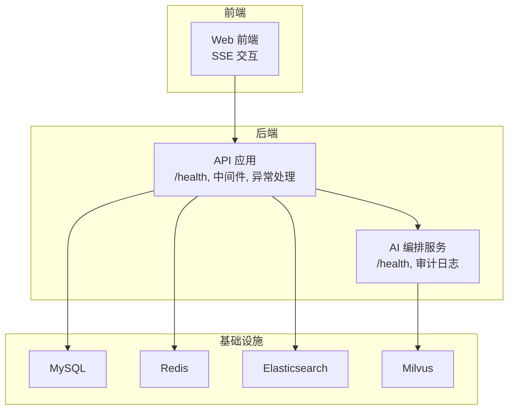
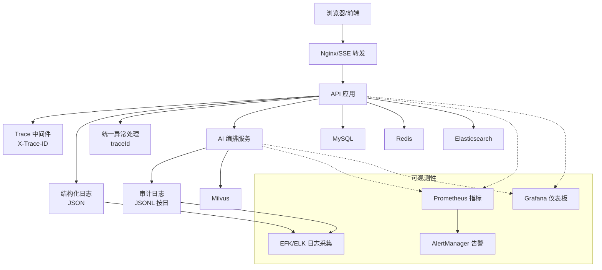
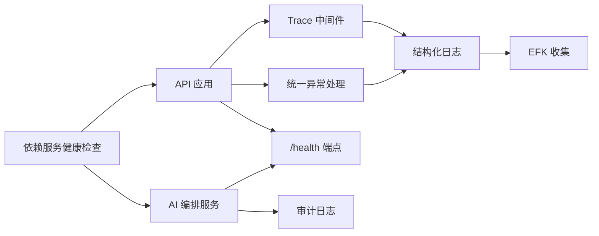

# 监控与日志

<cite>
**本文引用的文件**
- [workspace/api/app/main.py](file://workspace/api/app/main.py)
- [workspace/api/app/middleware/trace.py](file://workspace/api/app/middleware/trace.py)
- [workspace/api/app/middleware/logging.py](file://workspace/api/app/middleware/logging.py)
- [workspace/api/app/config/logging.py](file://workspace/api/app/config/logging.py)
- [workspace/api/app/config/settings.py](file://workspace/api/app/config/settings.py)
- [workspace/api/app/exceptions/handlers.py](file://workspace/api/app/exceptions/handlers.py)
- [workspace/ai-orchestrator/app/main.py](file://workspace/ai-orchestrator/app/main.py)
- [workspace/ai-orchestrator/app/config.py](file://workspace/ai-orchestrator/app/config.py)
- [workspace/ai-orchestrator/app/audit/logger.py](file://workspace/ai-orchestrator/app/audit/logger.py)
- [workspace/ai-orchestrator/app/exceptions/handlers.py](file://workspace/ai-orchestrator/app/exceptions/handlers.py)
- [workspace/infra/docker-compose/docker-compose.yml](file://workspace/infra/docker-compose/docker-compose.yml)
- [docs/detail-design/05-部署运维详细设计.md](file://docs/detail-design/05-部署运维详细设计.md)
- [docs/detail-design/03-AI编排服务详细设计.md](file://docs/detail-design/03-AI编排服务详细设计.md)
- [docs/FDE工作台技术方案.md](file://docs/FDE工作台技术方案.md)
- [workspace/scripts/dev/start-dev.sh](file://workspace/scripts/dev/start-dev.sh)
- [workspace/infra/README.md](file://workspace/infra/README.md)
- [docs/code-review/02-后端CR规范.md](file://docs/code-review/02-后端CR规范.md)
</cite>

## 目录
1. [简介](#简介)
2. [项目结构](#项目结构)
3. [核心组件](#核心组件)
4. [架构总览](#架构总览)
5. [组件详解](#组件详解)
6. [依赖关系分析](#依赖关系分析)
7. [性能考量](#性能考量)
8. [故障排查指南](#故障排查指南)
9. [结论](#结论)
10. [附录](#附录)

## 简介
本文件面向FDE工作台的监控与日志体系，覆盖应用监控（Prometheus指标、Grafana仪表板、告警规则）、日志聚合（ELK/EFK、审计日志、日志轮转与存储）、性能指标（APM集成、关键业务指标、用户体验监控）、健康检查（服务可用性、数据库/缓存/搜索引擎/向量库连通性、第三方服务依赖）、分布式追踪（链路与错误追踪）、日志分析与容量规划、以及监控告警配置与应急响应流程。文档以现有代码与设计文档为基础，结合可落地的实践建议，帮助团队建立稳定可靠的可观测性体系。

## 项目结构
FDE工作台采用前后端分离与微服务架构：
- Web前端：负责UI与交互，通过SSE与后端通信。
- API后端：FastAPI应用，提供REST接口与SSE通道，内置结构化日志、链路追踪中间件与统一异常处理。
- AI编排服务：FastAPI应用，提供AI聊天、工具调用、RAG检索等能力，并输出结构化审计日志。
- 基础设施：Docker Compose编排MySQL、Redis、Elasticsearch、Milvus等依赖；提供K8s/Helm/Nginx等部署资源与监控配置占位。

图表来源
- [workspace/infra/docker-compose/docker-compose.yml:66-116](file://workspace/infra/docker-compose/docker-compose.yml#L66-L116)
- [workspace/api/app/main.py:69-73](file://workspace/api/app/main.py#L69-L73)
- [workspace/ai-orchestrator/app/main.py:79-86](file://workspace/ai-orchestrator/app/main.py#L79-L86)

章节来源
- [workspace/infra/docker-compose/docker-compose.yml:1-132](file://workspace/infra/docker-compose/docker-compose.yml#L1-L132)
- [workspace/infra/README.md:1-44](file://workspace/infra/README.md#L1-L44)

## 核心组件
- 链路追踪中间件：为每个请求生成trace_id，贯穿日志与异常处理，支持跨服务传递。
- 结构化日志：统一JSON格式输出，便于ELK/EFK采集与分析。
- 统一异常处理：标准化错误响应，包含traceId，便于定位问题。
- 健康检查端点：/health用于服务可用性与外部依赖状态检查。
- 审计日志：AI编排服务输出JSONL审计日志，按天滚动，支持降级与去重。
- 基础设施健康检查：Docker Compose为各依赖服务配置健康检查，保障启动顺序与可用性。

章节来源
- [workspace/api/app/middleware/trace.py:12-30](file://workspace/api/app/middleware/trace.py#L12-L30)
- [workspace/api/app/middleware/logging.py:13-36](file://workspace/api/app/middleware/logging.py#L13-L36)
- [workspace/api/app/config/logging.py:10-35](file://workspace/api/app/config/logging.py#L10-L35)
- [workspace/api/app/exceptions/handlers.py:31-99](file://workspace/api/app/exceptions/handlers.py#L31-L99)
- [workspace/api/app/main.py:69-73](file://workspace/api/app/main.py#L69-L73)
- [workspace/ai-orchestrator/app/audit/logger.py:46-121](file://workspace/ai-orchestrator/app/audit/logger.py#L46-L121)
- [workspace/ai-orchestrator/app/main.py:79-86](file://workspace/ai-orchestrator/app/main.py#L79-L86)
- [workspace/infra/docker-compose/docker-compose.yml:14-64](file://workspace/infra/docker-compose/docker-compose.yml#L14-L64)

## 架构总览
下图展示从Web到API再到AI编排与依赖服务的调用链路，以及可观测性组件的集成位置。

图表来源
- [docs/FDE工作台技术方案.md:1890-1900](file://docs/FDE工作台技术方案.md#L1890-L1900)
- [workspace/api/app/middleware/trace.py:12-30](file://workspace/api/app/middleware/trace.py#L12-L30)
- [workspace/api/app/config/logging.py:10-35](file://workspace/api/app/config/logging.py#L10-L35)
- [workspace/ai-orchestrator/app/audit/logger.py:46-121](file://workspace/ai-orchestrator/app/audit/logger.py#L46-L121)
- [workspace/infra/docker-compose/docker-compose.yml:32-64](file://workspace/infra/docker-compose/docker-compose.yml#L32-L64)

## 组件详解

### 应用监控与指标（Prometheus）
- 设计目标：采集API与AI编排服务的关键指标，支撑Grafana可视化与AlertManager告警。
- 推荐指标（基于设计文档）：
  - API请求总量与延迟、请求大小
  - LLM调用延迟与Token用量
  - RAG检索延迟
  - 安全拦截次数
- 实施建议：
  - 在API与AI编排服务中引入指标导出端点，采集上述指标。
  - 通过Grafana导入推荐面板，设置P99延迟、错误率、LLM延迟与Token用量等阈值告警。
- 当前状态：设计文档已明确指标清单与Grafana面板建议，当前代码尚未实现指标导出端点。

章节来源
- [docs/detail-design/05-部署运维详细设计.md:351-379](file://docs/detail-design/05-部署运维详细设计.md#L351-L379)
- [docs/detail-design/03-AI编排服务详细设计.md:570-580](file://docs/detail-design/03-AI编排服务详细设计.md#L570-L580)
- [docs/FDE工作台技术方案.md:1902-1913](file://docs/FDE工作台技术方案.md#L1902-L1913)

### Grafana 仪表板与告警规则
- 仪表板建议：
  - API QPS、P99延迟、错误率
  - LLM调用延迟、Token用量
  - 安全拦截突增
- 告警规则（基于设计文档）：
  - 高错误率、高延迟、服务宕机、安全拦截突增
- 实施建议：
  - 将告警规则导入AlertManager，结合Grafana触发钉钉机器人通知。
  - 为关键业务指标设置分级告警（严重/警告），并配套升级策略。

章节来源
- [docs/detail-design/05-部署运维详细设计.md:369-423](file://docs/detail-design/05-部署运维详细设计.md#L369-L423)

### 日志聚合与审计日志
- 结构化日志：
  - API后端使用structlog输出JSON日志，便于EFK/ELK采集。
- 审计日志：
  - AI编排服务输出JSONL审计日志，按天滚动，支持降级至stderr，永不阻塞主链路。
- 日志收集链路：
  - Fluent Bit → Elasticsearch → Kibana（EFK）。
- 日志轮转与存储：
  - 建议在EFK侧配置索引生命周期策略，按天/周/月轮转并清理过期索引，控制存储成本。

章节来源
- [workspace/api/app/config/logging.py:10-35](file://workspace/api/app/config/logging.py#L10-L35)
- [workspace/ai-orchestrator/app/audit/logger.py:46-121](file://workspace/ai-orchestrator/app/audit/logger.py#L46-L121)
- [docs/detail-design/05-部署运维详细设计.md:380-384](file://docs/detail-design/05-部署运维详细设计.md#L380-L384)
- [docs/detail-design/03-AI编排服务详细设计.md:315-354](file://docs/detail-design/03-AI编排服务详细设计.md#L315-L354)

### 性能指标监控（APM与用户体验）
- APM集成建议：
  - 在API与AI编排服务中集成OpenTelemetry SDK，上报指标、日志与链路追踪。
  - 指标包括：QPS、P95/P99延迟、错误率、Token消耗、RAG检索延迟、熔断状态等。
- 用户体验监控：
  - 关注SSE首token延迟、客户端断连率、动作卡片确认率等前端侧关键指标。
- 成本与容量：
  - 基于LLM Token消耗趋势进行容量规划，结合慢查询、连接数、命中率等数据库与缓存指标。

章节来源
- [docs/FDE工作台技术方案.md:1890-1900](file://docs/FDE工作台技术方案.md#L1890-L1900)
- [docs/FDE工作台技术方案.md:1902-1913](file://docs/FDE工作台技术方案.md#L1902-L1913)

### 健康检查机制
- 服务健康端点：
  - API与AI编排服务均提供/health端点，返回服务状态与版本信息。
  - AI编排服务的/health还包含第三方Provider健康状态列表。
- 基础设施健康：
  - Docker Compose为MySQL、Redis、Elasticsearch、Milvus配置健康检查，确保依赖可用后再启动应用。
- 实施建议：
  - 将/health纳入K8s探针或Prometheus探测，作为服务可用性监控的基础。

章节来源
- [workspace/api/app/main.py:69-73](file://workspace/api/app/main.py#L69-L73)
- [workspace/ai-orchestrator/app/main.py:79-86](file://workspace/ai-orchestrator/app/main.py#L79-L86)
- [workspace/infra/docker-compose/docker-compose.yml:14-64](file://workspace/infra/docker-compose/docker-compose.yml#L14-L64)

### 分布式追踪（链路与错误追踪）
- Trace ID生成与传递：
  - Trace中间件为每个请求生成或提取X-Trace-ID，绑定到structlog上下文，并在响应头中回传。
  - 跨服务调用通过X-Trace-ID头传递，保证端到端链路可追踪。
- 错误追踪：
  - 统一异常处理在错误日志中包含traceId，便于快速定位问题。
- 实施建议：
  - 在API与AI编排服务中启用OpenTelemetry，将trace_id与span关联，结合Grafana Trace面板查看链路。

章节来源
- [workspace/api/app/middleware/trace.py:12-30](file://workspace/api/app/middleware/trace.py#L12-L30)
- [workspace/api/app/exceptions/handlers.py:31-99](file://workspace/api/app/exceptions/handlers.py#L31-L99)
- [docs/code-review/02-后端CR规范.md:1302-1322](file://docs/code-review/02-后端CR规范.md#L1302-L1322)

### 日志分析、趋势分析与容量规划
- 日志分析：
  - 利用Kibana进行日志检索与聚合，结合traceId进行问题复盘。
- 趋势分析：
  - 基于Prometheus指标与Grafana面板，观察错误率、延迟、Token用量等趋势。
- 容量规划：
  - 结合慢查询、连接数、命中率、RAG检索延迟等指标，评估数据库与缓存扩容策略。

章节来源
- [docs/FDE工作台技术方案.md:1902-1913](file://docs/FDE工作台技术方案.md#L1902-L1913)

### 监控告警配置与应急响应流程
- 告警配置：
  - 参考设计文档中的告警规则组，设置高错误率、高延迟、服务宕机、安全拦截突增等告警。
- 应急响应：
  - 建立分级响应机制（严重/警告），明确升级流程与责任人。
  - 结合SOP进行快速处置（限流、熔断、扩容、回滚等）。

章节来源
- [docs/detail-design/05-部署运维详细设计.md:386-423](file://docs/detail-design/05-部署运维详细设计.md#L386-L423)

## 依赖关系分析
- 中间件与日志：
  - Trace中间件与结构化日志共同为每条请求提供可追踪的日志上下文。
- 异常处理：
  - 统一异常处理在错误响应中携带traceId，便于前端与日志系统联动定位问题。
- 健康检查：
  - API与AI编排服务的/health端点为上层监控与编排系统提供健康状态。
- 基础设施：
  - Docker Compose的健康检查确保依赖服务可用，降低启动失败风险。

图表来源
- [workspace/api/app/middleware/trace.py:12-30](file://workspace/api/app/middleware/trace.py#L12-L30)
- [workspace/api/app/config/logging.py:10-35](file://workspace/api/app/config/logging.py#L10-L35)
- [workspace/api/app/exceptions/handlers.py:31-99](file://workspace/api/app/exceptions/handlers.py#L31-L99)
- [workspace/api/app/main.py:69-73](file://workspace/api/app/main.py#L69-L73)
- [workspace/ai-orchestrator/app/audit/logger.py:46-121](file://workspace/ai-orchestrator/app/audit/logger.py#L46-L121)
- [workspace/ai-orchestrator/app/main.py:79-86](file://workspace/ai-orchestrator/app/main.py#L79-L86)
- [workspace/infra/docker-compose/docker-compose.yml:14-64](file://workspace/infra/docker-compose/docker-compose.yml#L14-L64)

章节来源
- [workspace/api/app/middleware/trace.py:12-30](file://workspace/api/app/middleware/trace.py#L12-L30)
- [workspace/api/app/middleware/logging.py:13-36](file://workspace/api/app/middleware/logging.py#L13-L36)
- [workspace/api/app/exceptions/handlers.py:31-99](file://workspace/api/app/exceptions/handlers.py#L31-L99)
- [workspace/api/app/main.py:69-73](file://workspace/api/app/main.py#L69-L73)
- [workspace/ai-orchestrator/app/audit/logger.py:46-121](file://workspace/ai-orchestrator/app/audit/logger.py#L46-L121)
- [workspace/ai-orchestrator/app/main.py:79-86](file://workspace/ai-orchestrator/app/main.py#L79-L86)
- [workspace/infra/docker-compose/docker-compose.yml:14-64](file://workspace/infra/docker-compose/docker-compose.yml#L14-L64)

## 性能考量
- 指标采集：
  - 在API与AI编排服务中增加指标导出端点，覆盖关键业务与性能指标。
- 日志与审计：
  - 控制日志级别与字段长度，避免日志爆炸；审计日志按天滚动并支持降级。
- 健康检查：
  - 将/health纳入探针，结合Docker Compose健康检查，提升整体可用性。
- APM与容量：
  - 基于指标与日志趋势进行容量规划，关注数据库慢查询、缓存命中率与RAG检索延迟。

章节来源
- [docs/detail-design/05-部署运维详细设计.md:351-379](file://docs/detail-design/05-部署运维详细设计.md#L351-L379)
- [docs/detail-design/03-AI编排服务详细设计.md:315-354](file://docs/detail-design/03-AI编排服务详细设计.md#L315-L354)
- [docs/FDE工作台技术方案.md:1902-1913](file://docs/FDE工作台技术方案.md#L1902-L1913)

## 故障排查指南
- 快速定位：
  - 通过统一异常处理返回的traceId在结构化日志中检索对应请求上下文。
- 健康检查：
  - 访问/health端点确认服务状态与外部依赖健康状况。
- 依赖可用性：
  - 使用Docker Compose查看依赖容器状态与健康检查结果。
- 审计日志：
  - 检查AI编排服务的JSONL审计日志，定位安全拦截与端到端耗时。

章节来源
- [workspace/api/app/exceptions/handlers.py:31-99](file://workspace/api/app/exceptions/handlers.py#L31-L99)
- [workspace/api/app/main.py:69-73](file://workspace/api/app/main.py#L69-L73)
- [workspace/ai-orchestrator/app/audit/logger.py:46-121](file://workspace/ai-orchestrator/app/audit/logger.py#L46-L121)
- [workspace/infra/docker-compose/docker-compose.yml:14-64](file://workspace/infra/docker-compose/docker-compose.yml#L14-L64)

## 结论
FDE工作台已具备可观测性的基础能力：结构化日志、链路追踪中间件、统一异常处理与健康检查端点。下一步建议围绕Prometheus指标导出、Grafana仪表板与告警规则、EFK日志采集与审计日志落盘策略进行落地，同时完善APM与用户体验监控，形成闭环的监控与告警体系，支撑业务稳定运行与持续优化。

## 附录

### 关键端点与配置要点
- /health端点：用于服务可用性与外部依赖状态检查。
- X-Trace-ID：跨服务传递的链路标识。
- 结构化日志：JSON格式，便于EFK采集。
- 审计日志：JSONL格式，按天滚动，支持降级。

章节来源
- [workspace/api/app/main.py:69-73](file://workspace/api/app/main.py#L69-L73)
- [workspace/ai-orchestrator/app/main.py:79-86](file://workspace/ai-orchestrator/app/main.py#L79-L86)
- [workspace/api/app/middleware/trace.py:12-30](file://workspace/api/app/middleware/trace.py#L12-L30)
- [workspace/api/app/config/logging.py:10-35](file://workspace/api/app/config/logging.py#L10-L35)
- [workspace/ai-orchestrator/app/audit/logger.py:46-121](file://workspace/ai-orchestrator/app/audit/logger.py#L46-L121)