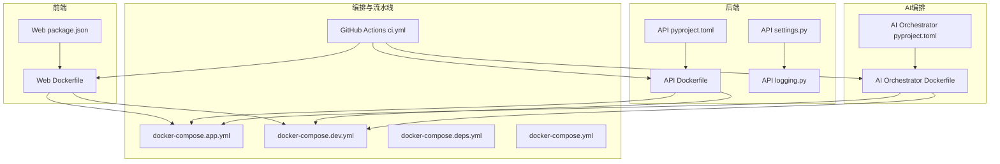
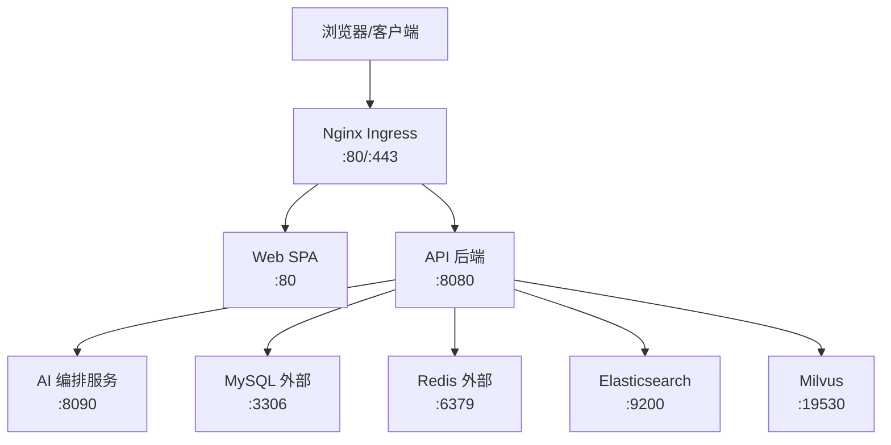
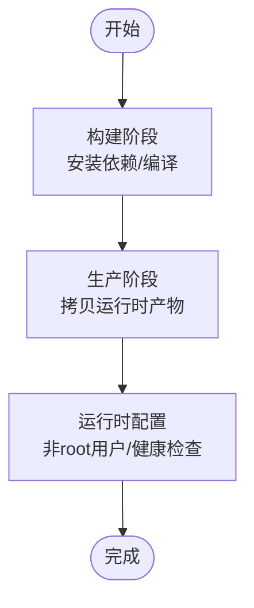
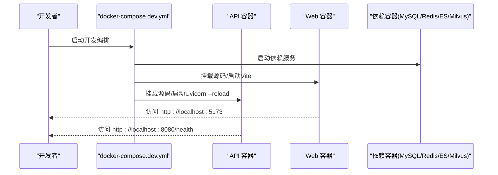
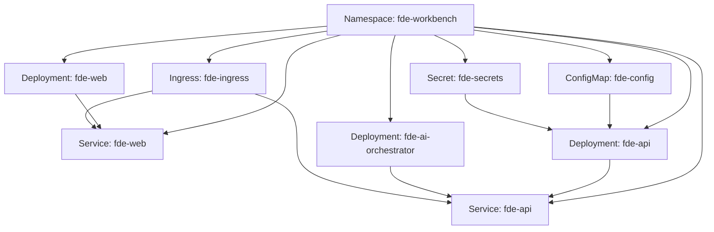
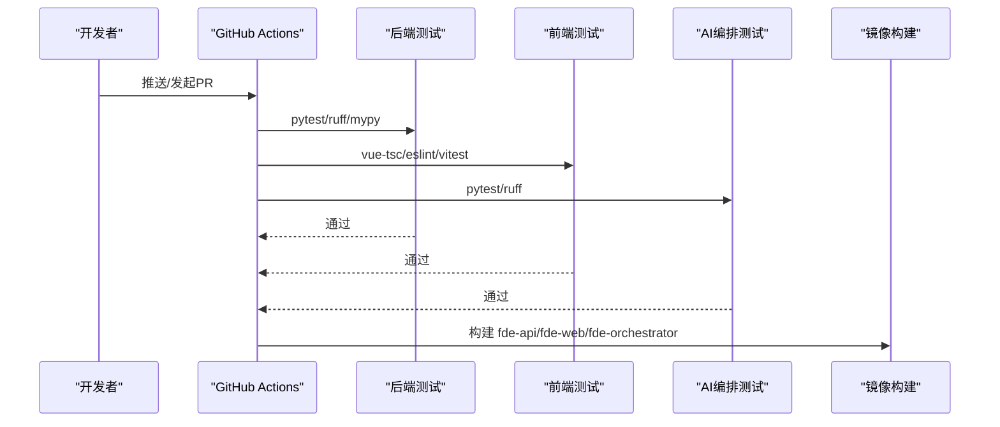
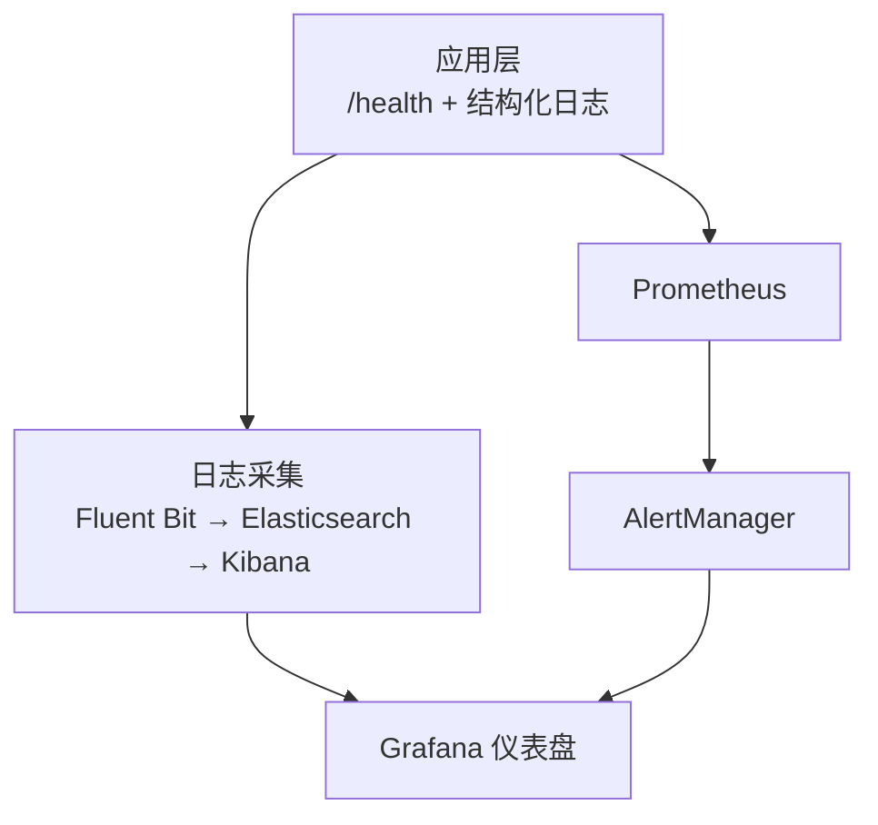
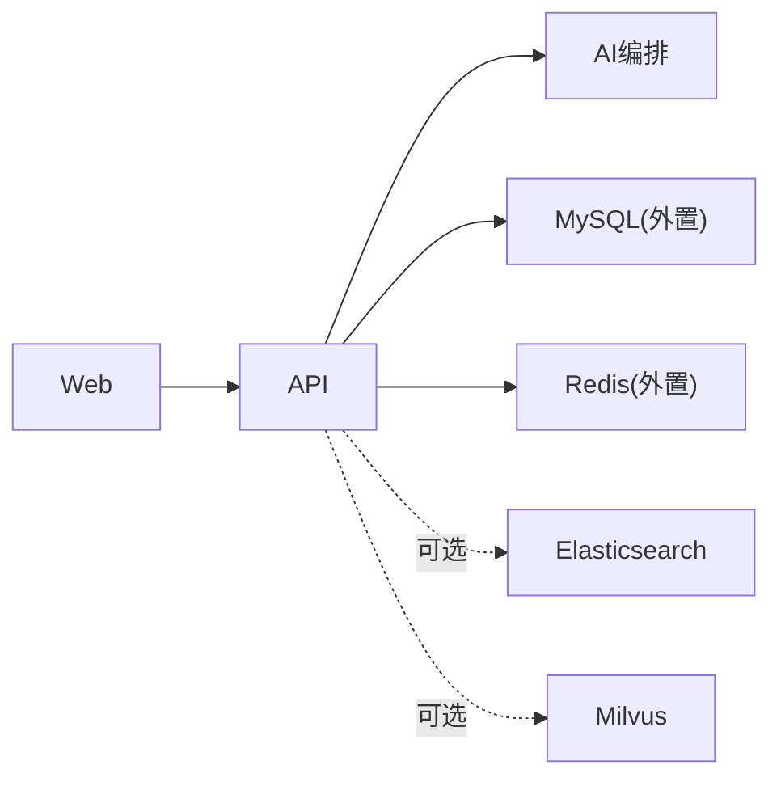

# 部署与运维

<cite>
**本文引用的文件**
- [ci.yml](file://.github/workflows/ci.yml)
- [docker-compose.yml](file://docker-compose.yml)
- [docker-compose.yml（应用编排）](file://workspace/infra/docker-compose/docker-compose.yml)
- [docker-compose.app.yml](file://workspace/infra/docker-compose/docker-compose.app.yml)
- [docker-compose.deps.yml](file://workspace/infra/docker-compose/docker-compose.deps.yml)
- [docker-compose.dev.yml](file://workspace/infra/docker-compose/docker-compose.dev.yml)
- [Dockerfile（API）](file://workspace/api/Dockerfile)
- [Dockerfile（Web）](file://workspace/web/Dockerfile)
- [Dockerfile（AI编排）](file://workspace/ai-orchestrator/Dockerfile)
- [pyproject.toml（API）](file://workspace/api/pyproject.toml)
- [package.json（Web）](file://workspace/web/package.json)
- [pyproject.toml（AI编排）](file://workspace/ai-orchestrator/pyproject.toml)
- [settings.py（API配置）](file://workspace/api/app/config/settings.py)
- [logging.py（API日志）](file://workspace/api/app/config/logging.py)
- [部署文档.md](file://docs/部署文档.md)
- [05-部署运维详细设计.md](file://docs/detail-design/05-部署运维详细设计.md)
</cite>

## 目录
1. [简介](#简介)
2. [项目结构](#项目结构)
3. [核心组件](#核心组件)
4. [架构总览](#架构总览)
5. [详细组件分析](#详细组件分析)
6. [依赖关系分析](#依赖关系分析)
7. [性能考量](#性能考量)
8. [故障排除指南](#故障排除指南)
9. [结论](#结论)
10. [附录](#附录)

## 简介
本文件面向FDE工作台的部署与运维团队，系统化说明Docker部署策略、Kubernetes部署设计、CI/CD流水线、监控与日志体系、故障排除与应急预案，并提供完整的部署检查清单与运维最佳实践。内容基于仓库中的实际配置文件与设计文档整理而成，确保可执行、可验证、可追溯。

## 项目结构
FDE工作台采用多模块工程组织，包含后端API、前端Web、AI编排服务以及基础设施编排与文档。部署相关的关键位置如下：
- Docker镜像与构建：各模块独立的Dockerfile与多阶段构建策略
- 编排与环境：多套docker-compose配置，覆盖开发、应用与依赖分离场景
- CI/CD：GitHub Actions流水线，统一执行后端、前端与AI编排的测试与镜像构建
- 配置与日志：后端通过Pydantic Settings加载环境变量，使用structlog输出JSON结构化日志
- 文档与设计：部署文档与详细设计文档提供了端到端的部署与运维指导

**图表来源**
- [docker-compose.app.yml:1-73](file://workspace/infra/docker-compose/docker-compose.app.yml#L1-L73)
- [docker-compose.dev.yml:1-281](file://workspace/infra/docker-compose/docker-compose.dev.yml#L1-L281)
- [docker-compose.deps.yml:1-44](file://workspace/infra/docker-compose/docker-compose.deps.yml#L1-L44)
- [docker-compose.yml:1-46](file://docker-compose.yml#L1-L46)
- [Dockerfile（API）:1-61](file://workspace/api/Dockerfile#L1-L61)
- [Dockerfile（Web）:1-21](file://workspace/web/Dockerfile#L1-L21)
- [Dockerfile（AI编排）:1-39](file://workspace/ai-orchestrator/Dockerfile#L1-L39)
- [pyproject.toml（API）:1-61](file://workspace/api/pyproject.toml#L1-L61)
- [package.json（Web）:1-59](file://workspace/web/package.json#L1-L59)
- [pyproject.toml（AI编排）:1-29](file://workspace/ai-orchestrator/pyproject.toml#L1-L29)
- [settings.py（API配置）:1-81](file://workspace/api/app/config/settings.py#L1-L81)
- [logging.py（API日志）:1-35](file://workspace/api/app/config/logging.py#L1-L35)
- [ci.yml:1-106](file://.github/workflows/ci.yml#L1-L106)

**章节来源**
- [docker-compose.yml:1-46](file://docker-compose.yml#L1-L46)
- [docker-compose.yml（应用编排）:1-132](file://workspace/infra/docker-compose/docker-compose.yml#L1-L132)
- [docker-compose.app.yml:1-73](file://workspace/infra/docker-compose/docker-compose.app.yml#L1-L73)
- [docker-compose.deps.yml:1-44](file://workspace/infra/docker-compose/docker-compose.deps.yml#L1-L44)
- [docker-compose.dev.yml:1-281](file://workspace/infra/docker-compose/docker-compose.dev.yml#L1-L281)
- [Dockerfile（API）:1-61](file://workspace/api/Dockerfile#L1-L61)
- [Dockerfile（Web）:1-21](file://workspace/web/Dockerfile#L1-L21)
- [Dockerfile（AI编排）:1-39](file://workspace/ai-orchestrator/Dockerfile#L1-L39)
- [pyproject.toml（API）:1-61](file://workspace/api/pyproject.toml#L1-L61)
- [package.json（Web）:1-59](file://workspace/web/package.json#L1-L59)
- [pyproject.toml（AI编排）:1-29](file://workspace/ai-orchestrator/pyproject.toml#L1-L29)
- [settings.py（API配置）:1-81](file://workspace/api/app/config/settings.py#L1-L81)
- [logging.py（API日志）:1-35](file://workspace/api/app/config/logging.py#L1-L35)
- [部署文档.md:1-379](file://docs/部署文档.md#L1-L379)
- [05-部署运维详细设计.md:1-507](file://docs/detail-design/05-部署运维详细设计.md#L1-L507)
- [ci.yml:1-106](file://.github/workflows/ci.yml#L1-L106)

## 核心组件
- API服务（后端）：基于FastAPI + Uvicorn，多阶段构建，非root用户运行，健康检查端点/health
- Web前端：基于Vue 3 + Vite构建，Nginx托管静态资源，支持代理与SSE
- AI编排服务：基于FastAPI + Uvicorn，LangGraph/LangChain链路编排，独立镜像
- 数据与检索：MySQL（外置）、Redis（外置）、Elasticsearch、Milvus（可选/外置）
- 编排与环境：多套docker-compose，覆盖开发、应用与依赖分离场景
- CI/CD：GitHub Actions统一执行测试与镜像构建

**章节来源**
- [Dockerfile（API）:1-61](file://workspace/api/Dockerfile#L1-L61)
- [Dockerfile（Web）:1-21](file://workspace/web/Dockerfile#L1-L21)
- [Dockerfile（AI编排）:1-39](file://workspace/ai-orchestrator/Dockerfile#L1-L39)
- [docker-compose.yml（应用编排）:66-127](file://workspace/infra/docker-compose/docker-compose.yml#L66-L127)
- [docker-compose.app.yml:4-68](file://workspace/infra/docker-compose/docker-compose.app.yml#L4-L68)
- [ci.yml:1-106](file://.github/workflows/ci.yml#L1-L106)

## 架构总览
整体架构由Web前端、API后端、AI编排服务与数据/检索组件构成，服务间通过内网通信，对外通过Nginx Ingress暴露REST与SSE接口。

**图表来源**
- [05-部署运维详细设计.md:10-40](file://docs/detail-design/05-部署运维详细设计.md#L10-L40)
- [docker-compose.yml（应用编排）:66-127](file://workspace/infra/docker-compose/docker-compose.yml#L66-L127)

## 详细组件分析

### Docker镜像构建策略
- 多阶段构建：Builder阶段安装Poetry与依赖，Production阶段仅拷贝运行时产物，减小镜像体积
- 国内镜像优化：APT与pip镜像源替换，提升构建速度
- 运行安全：以非root用户运行，设置健康检查与进程参数
- Web镜像：Node构建产物交由Nginx托管，启用Gzip与SPA回退

**图表来源**
- [Dockerfile（API）:1-61](file://workspace/api/Dockerfile#L1-L61)
- [Dockerfile（Web）:1-21](file://workspace/web/Dockerfile#L1-L21)
- [Dockerfile（AI编排）:1-39](file://workspace/ai-orchestrator/Dockerfile#L1-L39)

**章节来源**
- [Dockerfile（API）:1-61](file://workspace/api/Dockerfile#L1-L61)
- [Dockerfile（Web）:1-21](file://workspace/web/Dockerfile#L1-L21)
- [Dockerfile（AI编排）:1-39](file://workspace/ai-orchestrator/Dockerfile#L1-L39)

### 服务编排与环境变量管理
- 应用编排（docker-compose.app.yml）：Web/API/AI编排于同一网络，API与AI依赖外部MySQL/Redis；AI编排可禁用ES/Milvus用于网络受限场景
- 开发编排（docker-compose.dev.yml）：挂载源码实现热重载，持久化node_modules与Python虚拟环境，支持Celery Worker
- 依赖编排（docker-compose.deps.yml）：仅启动Elasticsearch与Milvus，便于网络隔离
- 环境变量：API通过settings.py读取环境变量，如DATABASE_URL、REDIS_URL、JWT_SECRET_KEY、ES_URL、MILVUS_HOST等；Web通过Vite环境变量控制API代理与Mock开关

**图表来源**
- [docker-compose.dev.yml:1-281](file://workspace/infra/docker-compose/docker-compose.dev.yml#L1-L281)
- [docker-compose.app.yml:1-73](file://workspace/infra/docker-compose/docker-compose.app.yml#L1-L73)

**章节来源**
- [docker-compose.yml（应用编排）:1-132](file://workspace/infra/docker-compose/docker-compose.yml#L1-L132)
- [docker-compose.app.yml:1-73](file://workspace/infra/docker-compose/docker-compose.app.yml#L1-L73)
- [docker-compose.deps.yml:1-44](file://workspace/infra/docker-compose/docker-compose.deps.yml#L1-L44)
- [docker-compose.dev.yml:1-281](file://workspace/infra/docker-compose/docker-compose.dev.yml#L1-L281)
- [settings.py（API配置）:1-81](file://workspace/api/app/config/settings.py#L1-L81)
- [package.json（Web）:1-59](file://workspace/web/package.json#L1-L59)

### Kubernetes部署设计
- 命名空间：fde-workbench
- ConfigMap：集中存放数据库、缓存、ES/Milvus、AI编排URL与日志级别等
- Secrets：存放敏感信息如MySQL Root密码、JWT密钥、DashScope/OpenAI API Key
- Deployment与Service：API服务示例，含探针与资源限制
- Ingress：将/与/api分别路由至Web与API
- HPA：基于CPU/内存利用率的自动扩缩容

**图表来源**
- [05-部署运维详细设计.md:119-287](file://docs/detail-design/05-部署运维详细设计.md#L119-L287)

**章节来源**
- [05-部署运维详细设计.md:119-287](file://docs/detail-design/05-部署运维详细设计.md#L119-L287)

### CI/CD流水线设计
- 触发：push到master/main或pull request
- 并行Job：后端测试、前端测试、AI编排测试
- 条件构建：所有测试通过且push到master时触发镜像构建
- 缓存策略：GitHub Actions缓存、npm缓存、Poetry缓存、Docker层缓存
- 本地校验：提供本地执行测试与类型检查的命令参考

**图表来源**
- [ci.yml:1-106](file://.github/workflows/ci.yml#L1-L106)

**章节来源**
- [ci.yml:1-106](file://.github/workflows/ci.yml#L1-L106)
- [05-部署运维详细设计.md:291-333](file://docs/detail-design/05-部署运维详细设计.md#L291-L333)

### 监控与日志系统
- 应用监控：/health健康检查端点；建议集成Prometheus指标（待实现）
- 日志：结构化JSON日志，支持审计日志（AI编排）
- 告警：基于Prometheus AlertManager的告警规则（错误率、延迟、服务下线、安全拦截）

**图表来源**
- [05-部署运维详细设计.md:336-423](file://docs/detail-design/05-部署运维详细设计.md#L336-L423)

**章节来源**
- [05-部署运维详细设计.md:336-423](file://docs/detail-design/05-部署运维详细设计.md#L336-L423)
- [logging.py（API日志）:1-35](file://workspace/api/app/config/logging.py#L1-L35)

## 依赖关系分析
- 组件耦合：API与AI编排通过内网HTTP调用；Web仅与API交互，不直接访问数据/检索组件
- 外部依赖：MySQL/Redis（外置），ES/Milvus可选；JWT密钥与LLM Key通过Secret管理
- 编排解耦：docker-compose.deps.yml将数据/检索组件与应用解耦，便于网络隔离与弹性扩展

**图表来源**
- [docker-compose.yml（应用编排）:66-127](file://workspace/infra/docker-compose/docker-compose.yml#L66-L127)
- [docker-compose.app.yml:4-68](file://workspace/infra/docker-compose/docker-compose.app.yml#L4-L68)

**章节来源**
- [docker-compose.yml（应用编排）:1-132](file://workspace/infra/docker-compose/docker-compose.yml#L1-L132)
- [docker-compose.app.yml:1-73](file://workspace/infra/docker-compose/docker-compose.app.yml#L1-L73)

## 性能考量
- 镜像体积与启动速度：多阶段构建与国内镜像源显著降低构建时间
- 运行时并发：API使用多worker，AI编排使用2个worker以平衡负载
- 缓存与持久化：开发模式持久化node_modules与Python虚拟环境，减少重复安装
- 资源限制：K8s中为API设置requests/limits，配合HPA实现弹性伸缩

**章节来源**
- [Dockerfile（API）:30-61](file://workspace/api/Dockerfile#L30-L61)
- [Dockerfile（AI编排）:18-39](file://workspace/ai-orchestrator/Dockerfile#L18-L39)
- [docker-compose.dev.yml:25-131](file://workspace/infra/docker-compose/docker-compose.dev.yml#L25-L131)
- [05-部署运维详细设计.md:259-287](file://docs/detail-design/05-部署运维详细设计.md#L259-L287)

## 故障排除指南
- 构建缓慢：使用开发模式热重载，或启用国内镜像与缓存
- 代码更新未生效：使用完整构建或开发模式；确认.dockerignore排除无关文件
- API返回HTML而非JSON：检查API容器健康、网络连通性，必要时重启服务
- 数据库连接失败：检查MySQL容器状态、连接串与凭据
- 日志定位：使用deploy logs或docker logs查看API/Web/AI编排日志
- 完全重置：删除容器与数据卷后重新初始化

**章节来源**
- [部署文档.md:202-277](file://docs/部署文档.md#L202-L277)
- [docker-compose.yml:1-46](file://docker-compose.yml#L1-L46)

## 结论
本方案提供了从Docker到Kubernetes的全栈部署与运维路径，结合CI/CD自动化流水线、结构化日志与可扩展的监控告警体系，能够支撑FDE工作台在开发、测试与生产环境的稳定交付与持续演进。建议在生产环境中优先采用K8s编排与HPA自动扩缩容，并完善Prometheus指标与Grafana仪表盘建设。

## 附录

### 部署检查清单
- 环境变量齐全：DATABASE_URL、REDIS_URL、JWT_SECRET_KEY、ES_URL、MILVUS_HOST/PORT、AI_ORCHESTRATOR_URL、LLM Key
- 镜像构建成功：fde-api、fde-web、fde-orchestrator三镜像可用
- 健康检查通过：/health端点返回ok
- 网络连通：Web可访问API，API可访问MySQL/Redis/ES/Milvus
- 日志与审计：结构化日志正常输出，AI审计日志按天落盘
- 告警与监控：Prometheus/AlertManager/Grafana就绪（建议项）

### 运维最佳实践
- 使用K8s Secrets管理敏感信息，避免硬编码
- 为关键服务配置HPA与资源限制，保障稳定性
- 将ES/Milvus与应用解耦，便于网络隔离与弹性扩展
- 在CI中强制执行lint/type check/tests，确保质量门槛
- 定期备份MySQL，制定应急恢复预案