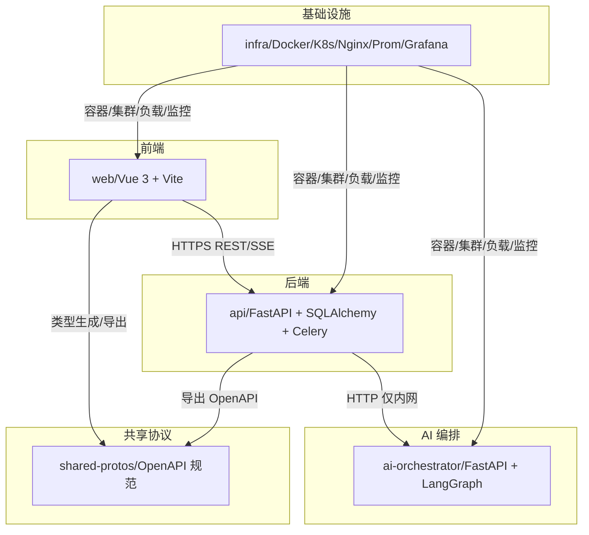
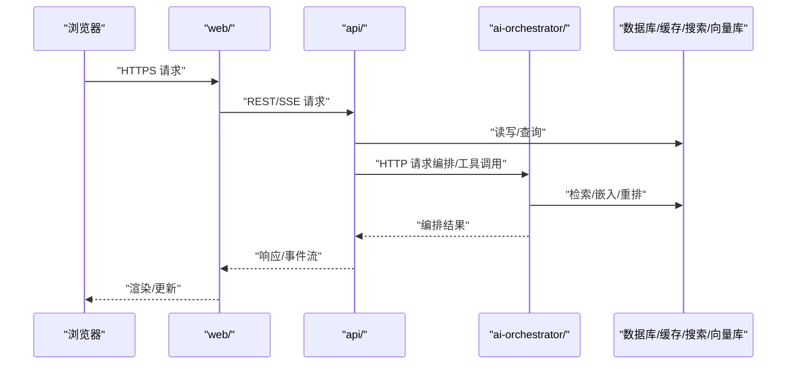
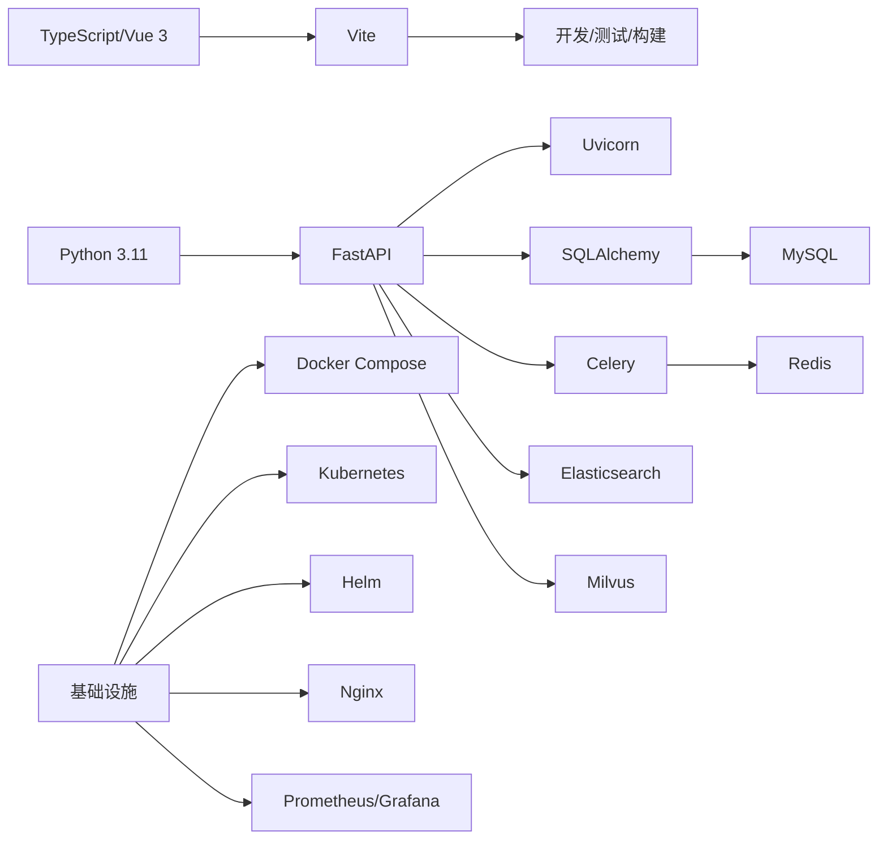

# 附录

<cite>
**本文引用的文件**
- [workspace/README.md](file://workspace/README.md)
- [workspace/infra/README.md](file://workspace/infra/README.md)
- [workspace/scripts/README.md](file://workspace/scripts/README.md)
- [workspace/ai-orchestrator/pyproject.toml](file://workspace/ai-orchestrator/pyproject.toml)
- [workspace/api/pyproject.toml](file://workspace/api/pyproject.toml)
- [workspace/web/package.json](file://workspace/web/package.json)
- [docs/detail-design/00-目录结构设计.md](file://docs/detail-design/00-目录结构设计.md)
- [docs/detail-design/05-部署运维详细设计.md](file://docs/detail-design/05-部署运维详细设计.md)
- [docs/FDE工作台技术方案.md](file://docs/FDE工作台技术方案.md)
- [docs/开发进度.md](file://docs/开发进度.md)
- [docs/部署文档.md](file://docs/部署文档.md)
- [.changes/新增-FDE工作台-20260428/spec.md](file://.changes/新增-FDE工作台-20260428/spec.md)
</cite>

## 目录
1. [简介](#简介)
2. [项目结构](#项目结构)
3. [核心组件](#核心组件)
4. [架构总览](#架构总览)
5. [详细组件分析](#详细组件分析)
6. [依赖分析](#依赖分析)
7. [性能考虑](#性能考虑)
8. [故障排查指南](#故障排查指南)
9. [结论](#结论)
10. [附录](#附录)

## 简介
本附录面向 FDE 工作台项目的使用者与维护者，提供配置参考、命令参考、版本历史、许可证与贡献者信息、术语表与缩写词解释等。内容基于仓库中的工程化文档与配置文件整理而成，帮助快速理解与落地开发、部署与运维。

## 项目结构
- 采用 monorepo 结构，按“前端/后端/API 编排/共享协议/基础设施/脚本”划分模块。
- 服务端口与职责：
  - Web 前端：Vue 3 + TypeScript + Vite，开发端口 5173。
  - API 服务：Python + FastAPI + SQLAlchemy + Celery，对外端口 8080。
  - AI 编排服务：Python + FastAPI + LangGraph + Milvus，对外端口 8090。
- 跨模块边界约束：Web 不直接访问 AI 编排服务；API 与 AI 编排服务仅通过 HTTP 通信；共享类型通过 shared-protos 同步。

图表来源
- [workspace/README.md:47-57](file://workspace/README.md#L47-L57)
- [workspace/README.md:9-16](file://workspace/README.md#L9-L16)

章节来源
- [workspace/README.md:7-16](file://workspace/README.md#L7-L16)
- [workspace/README.md:45-57](file://workspace/README.md#L45-L57)

## 核心组件
- Web 前端：页面、组件、状态管理、路由、HTTP/SSE 与 Mock 套件齐全，支持类型生成与本地开发。
- API 服务：路由、中间件、领域模型、仓储层、服务层、Celery 任务、数据库迁移与集成客户端。
- AI 编排服务：LangGraph 多智能体编排、提示词模板、RAG 检索重排、安全与审计、熔断与路由。
- 基础设施：Docker Compose、Kubernetes（Kustomize/Helm）、Nginx、Prometheus/Grafana、ArgoCD/Terraform。
- 脚本：开发一键启动、数据库重置与种子数据、数据导入与 RAG 索引重建、CI 校验。

章节来源
- [workspace/README.md:80-87](file://workspace/README.md#L80-L87)
- [workspace/infra/README.md:1-44](file://workspace/infra/README.md#L1-L44)
- [workspace/scripts/README.md:1-33](file://workspace/scripts/README.md#L1-L33)

## 架构总览
- 交互链路：浏览器通过 HTTPS 访问 Web 前端；Web 通过 REST/SSE 与 API 通信；API 通过 HTTP 与 AI 编排服务通信；AI 编排服务内部通过 LangGraph 执行多智能体流程。
- 数据与类型：API 与 AI 编排服务之间以 HTTP 传输；类型定义通过 shared-protos 同步，避免跨服务直接 import 业务代码。
- 部署与监控：本地可通过 docker-compose 快速拉起依赖与服务；生产可用 K8s 或 Helm；Nginx 负责静态资源与 SSE 转发；Prometheus/Grafana 提供监控告警。

图表来源
- [workspace/README.md:47-57](file://workspace/README.md#L47-L57)
- [workspace/README.md:9-16](file://workspace/README.md#L9-L16)

## 详细组件分析

### 配置参考

- 环境变量与配置文件
  - Python 服务（API/编排）使用 pydantic-settings 从环境加载配置，建议通过环境变量或 .env 文件注入，确保密钥与连接串不硬编码在代码中。
  - 前端通过 Vite 的环境变量机制注入运行时配置，注意区分开发与生产环境变量前缀与作用域。
  - 基础设施层（Docker/K8s/Helm）通过 compose 文件与 values 文件注入配置，遵循命名规范与资源前缀。

- 配置文件格式
  - Python 项目使用 Poetry 配置文件声明依赖与构建系统，包含开发依赖组与测试配置。
  - 前端项目使用 package.json 声明脚本、依赖与开发工具链。
  - 基础设施使用 YAML（Compose/K8s/Helm/Nginx）描述资源与网络策略。

- 默认值说明
  - 端口默认：Web 5173（开发），API 8080，AI 编排 8090。
  - 数据库与中间件：MySQL、Redis、Elasticsearch、Milvus 作为默认依赖。
  - 日志与追踪：结构化日志与链路追踪中间件已在 API 层启用。

- 配置最佳实践
  - 分环境分离：开发/测试/预发/生产使用不同配置文件与环境变量。
  - 最小权限：数据库与第三方服务凭据仅授予必要权限。
  - 安全基线：TLS 终止于 Nginx/Ingress，敏感参数不落盘，使用密钥管理服务。
  - 可观测性：开启健康检查、指标采集与日志聚合。

章节来源
- [workspace/ai-orchestrator/pyproject.toml:1-29](file://workspace/ai-orchestrator/pyproject.toml#L1-L29)
- [workspace/api/pyproject.toml:1-61](file://workspace/api/pyproject.toml#L1-L61)
- [workspace/web/package.json:1-59](file://workspace/web/package.json#L1-L59)
- [workspace/README.md:9-16](file://workspace/README.md#L9-L16)
- [workspace/infra/README.md:25-36](file://workspace/infra/README.md#L25-L36)

### 命令参考

- 开发命令
  - 一键启动全部服务：参见开发脚本与说明。
  - 仅启动依赖（MySQL/Redis/ES/Milvus）：使用 docker-compose 拉起依赖。
  - 分别启动各服务：API/编排/前端分别进入对应目录执行启动命令。
  - 首次数据库迁移：安装依赖后执行迁移至最新版本。

- 部署命令
  - 本地依赖：docker-compose 拉起依赖。
  - K8s 应用：使用 kustomize 构建并应用到目标环境。
  - Helm 升级：根据 values 文件进行升级安装。
  - Nginx 配置：用于静态资源与 SSE 转发。

- 监控命令
  - Prometheus 告警规则与 Grafana Dashboard 已在基础设施中提供，结合服务指标与日志进行监控。

- 调试命令
  - 本地重置数据库与种子数据：通过脚本执行。
  - 数据导入与 RAG 索引重建：通过数据脚本执行。

章节来源
- [workspace/README.md:20-42](file://workspace/README.md#L20-L42)
- [workspace/README.md:91-103](file://workspace/README.md#L91-L103)
- [workspace/infra/README.md:25-36](file://workspace/infra/README.md#L25-L36)
- [workspace/scripts/README.md:12-26](file://workspace/scripts/README.md#L12-L26)

### 版本历史

- 版本变更记录
  - 项目当前版本号与依赖版本在各模块的配置文件中体现，Poetry 与 package.json 中声明了版本与依赖范围。
  - 变更记录与规格说明位于 .changes 目录下的新增条目文档中。

- 升级指南
  - 语言与框架：Python 3.11、FastAPI、Vue 3、Vite 等版本升级需评估依赖兼容性与迁移成本。
  - 数据库：升级前先备份，执行迁移脚本，验证数据完整性。
  - 服务间协议：升级 shared-protos 后，确保前后端与服务均同步更新。

- 兼容性说明
  - 跨模块通信仅通过 HTTP，避免直接 import 业务代码，降低耦合与升级风险。
  - 类型同步通过 shared-protos，减少重复定义与不一致。

- 移除功能说明
  - 未在现有仓库中发现明确的“移除功能”清单，请以最新设计文档与变更记录为准。

章节来源
- [workspace/ai-orchestrator/pyproject.toml:1-29](file://workspace/ai-orchestrator/pyproject.toml#L1-L29)
- [workspace/api/pyproject.toml:1-61](file://workspace/api/pyproject.toml#L1-L61)
- [workspace/web/package.json:1-59](file://workspace/web/package.json#L1-L59)
- [.changes/新增-FDE工作台-20260428/spec.md](file://.changes/新增-FDE工作台-20260428/spec.md)

### 许可证信息
- 仓库未包含独立的 LICENSE 文件。请在项目根目录或各模块中查找许可证声明，或联系项目维护者获取许可信息。

### 贡献者指南
- 代码评审规范与测试用例规范详见 docs 目录下的相关文档。
- 任务认领与进度跟踪见开发进度与任务总表文档。

章节来源
- [docs/code-review/README.md](file://docs/code-review/README.md)
- [docs/test-cases/README.md](file://docs/test-cases/README.md)
- [docs/开发进度.md](file://docs/开发进度.md)
- [docs/detail-design/任务总表.md](file://docs/detail-design/任务总表.md)

### 相关链接
- 技术方案与详细设计：见 docs 目录中的技术方案与详细设计文档。
- 部署文档：见 docs/部署文档.md。
- 目录结构设计：见 docs/detail-design/00-目录结构设计.md。
- 部署运维详细设计：见 docs/detail-design/05-部署运维详细设计.md。

章节来源
- [docs/FDE工作台技术方案.md](file://docs/FDE工作台技术方案.md)
- [docs/detail-design/00-目录结构设计.md](file://docs/detail-design/00-目录结构设计.md)
- [docs/detail-design/05-部署运维详细设计.md](file://docs/detail-design/05-部署运维详细设计.md)
- [docs/部署文档.md](file://docs/部署文档.md)

### 术语表与缩写词解释
- API：应用程序接口，指后端服务提供的 HTTP 接口。
- AI 编排：通过多智能体与提示词模板协调 LLM 与工具完成复杂任务。
- RAG：检索增强生成，结合检索与生成提升回答质量。
- SSE：服务器发送事件，用于前端实时接收后端推送。
- K8s：Kubernetes，容器编排平台。
- Helm：Kubernetes 包管理器。
- Milvus：向量数据库，用于相似度检索。
- ES：Elasticsearch，全文搜索引擎。
- ORM：对象关系映射，如 SQLAlchemy。
- CRD：自定义资源定义，Kubernetes 扩展资源。
- ArgoCD：GitOps 持续交付工具。
- Terraform：基础设施即代码工具。

## 依赖分析
- 语言与框架
  - Python 3.11：API 与 AI 编排服务统一运行时。
  - FastAPI + Uvicorn：高性能异步 Web 框架与 ASGI 服务器。
  - Vue 3 + Vite + TypeScript：现代前端开发栈。
- 数据与中间件
  - MySQL/aiomysql：关系型数据库与异步驱动。
  - Redis：缓存与消息队列。
  - Elasticsearch：全文检索。
  - Milvus：向量检索。
  - Celery + Redis：异步任务与定时任务。
- 工具链
  - Alembic：数据库迁移。
  - Poetry：Python 依赖与打包。
  - Vite/Vitest/ESLint/Prettier：前端构建、测试、代码质量。
- 基础设施
  - Docker Compose：本地与集成测试环境。
  - Kustomize/Helm：Kubernetes 资源管理。
  - Nginx：反向代理与静态资源。
  - Prometheus/Grafana：监控与可视化。
  - ArgoCD/Terraform：GitOps 与基础设施即代码。

图表来源
- [workspace/api/pyproject.toml:9-28](file://workspace/api/pyproject.toml#L9-L28)
- [workspace/ai-orchestrator/pyproject.toml:8-19](file://workspace/ai-orchestrator/pyproject.toml#L8-L19)
- [workspace/web/package.json:18-29](file://workspace/web/package.json#L18-L29)
- [workspace/infra/README.md:10-23](file://workspace/infra/README.md#L10-L23)

章节来源
- [workspace/api/pyproject.toml:1-61](file://workspace/api/pyproject.toml#L1-L61)
- [workspace/ai-orchestrator/pyproject.toml:1-29](file://workspace/ai-orchestrator/pyproject.toml#L1-L29)
- [workspace/web/package.json:1-59](file://workspace/web/package.json#L1-L59)
- [workspace/infra/README.md:1-44](file://workspace/infra/README.md#L1-L44)

## 性能考虑
- 服务拆分与边界：通过 HTTP 与共享协议解耦，避免长链路阻塞与单点故障。
- 异步任务：使用 Celery + Redis 处理耗时任务，降低请求延迟。
- 检索优化：RAG 检索与重排、向量索引与倒排索引协同，结合缓存与限流。
- 前端性能：按需加载、组件懒加载、事件流复用与节流。
- 基础设施：容器资源配额、HPA、Ingress 限流与健康检查。

## 故障排查指南
- 启动失败
  - 检查依赖容器是否正常：MySQL/Redis/ES/Milvus。
  - 查看服务日志：结构化日志与错误处理中间件已启用。
- 数据库问题
  - 执行迁移脚本，核对 Alembic 配置与版本。
- 编排服务异常
  - 检查 LLM 提供商配置、提示词模板与工具调用链。
- 前端无法连接后端
  - 核对 CORS、SSE 转发与 Nginx 配置。
- 监控告警
  - 使用 Prometheus/Grafana 检查指标与告警规则。

章节来源
- [workspace/README.md:91-103](file://workspace/README.md#L91-L103)
- [workspace/infra/README.md:25-36](file://workspace/infra/README.md#L25-L36)

## 结论
本附录总结了 FDE 工作台的配置要点、常用命令、版本与升级注意事项、许可证与贡献者信息、术语表以及跨模块边界与基础设施实践。建议在开发与运维过程中严格遵循配置与部署规范，持续完善监控与可观测性，保障系统稳定性与可扩展性。

## 附录

### A. 配置清单与默认值对照
- 端口默认值
  - Web：5173（开发）
  - API：8080
  - AI 编排：8090
- 默认依赖
  - MySQL、Redis、Elasticsearch、Milvus
- 配置来源
  - Python 服务：pydantic-settings + 环境变量
  - 前端：Vite 环境变量
  - 基础设施：Compose/K8s/Helm/Nginx

章节来源
- [workspace/README.md:9-16](file://workspace/README.md#L9-L16)
- [workspace/api/pyproject.toml:14](file://workspace/api/pyproject.toml#L14)
- [workspace/ai-orchestrator/pyproject.toml:14](file://workspace/ai-orchestrator/pyproject.toml#L14)
- [workspace/web/package.json:6-16](file://workspace/web/package.json#L6-L16)

### B. 命令清单总览
- 开发
  - 一键启动：scripts/dev/start-all.sh
  - 仅启动依赖：docker-compose -f docker-compose.deps.yml
  - 分别启动：API/编排/前端各目录执行启动命令
  - 首次迁移：poetry run alembic upgrade head
- 部署
  - 本地依赖：docker-compose
  - K8s：kustomize build ... | kubectl apply -f -
  - Helm：helm upgrade --install ...
- 监控
  - Prometheus/Grafana：按基础设施文档配置
- 调试
  - 重置数据库与种子数据：scripts/dev/reset-db.sh
  - 数据导入与 RAG 索引重建：data/ 目录脚本

章节来源
- [workspace/README.md:20-42](file://workspace/README.md#L20-L42)
- [workspace/README.md:91-103](file://workspace/README.md#L91-L103)
- [workspace/infra/README.md:25-36](file://workspace/infra/README.md#L25-L36)
- [workspace/scripts/README.md:12-26](file://workspace/scripts/README.md#L12-L26)

### C. 版本与升级参考
- 版本来源：各模块配置文件中的版本声明
- 升级策略：先评估依赖兼容性，再执行数据库迁移与灰度发布
- 共享协议：升级 shared-protos 后同步前后端与服务

章节来源
- [workspace/ai-orchestrator/pyproject.toml:2-4](file://workspace/ai-orchestrator/pyproject.toml#L2-L4)
- [workspace/api/pyproject.toml:2-6](file://workspace/api/pyproject.toml#L2-L6)
- [workspace/web/package.json:2-4](file://workspace/web/package.json#L2-L4)

### D. 许可证与贡献者
- 许可证：请在项目根目录或各模块中查找许可证声明
- 贡献者：请参考项目维护者与提交历史

### E. 术语表与缩写词
- API、AI 编排、RAG、SSE、K8s、Helm、Milvus、ES、ORM、CRD、ArgoCD、Terraform