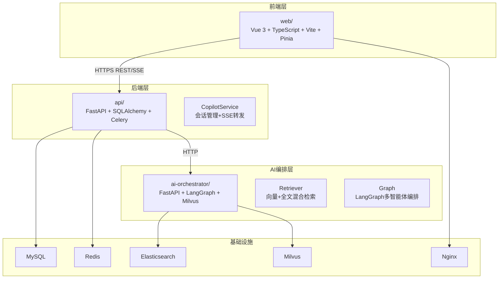
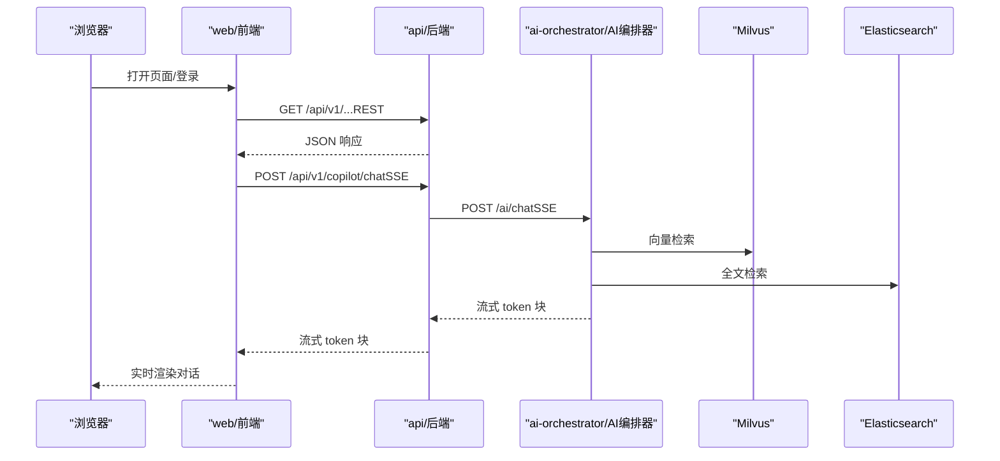
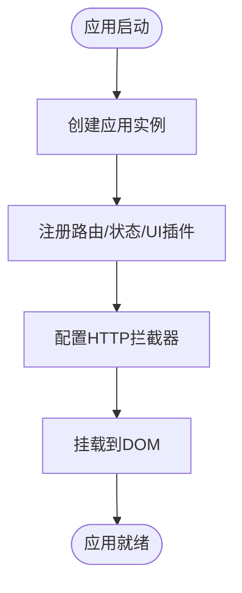
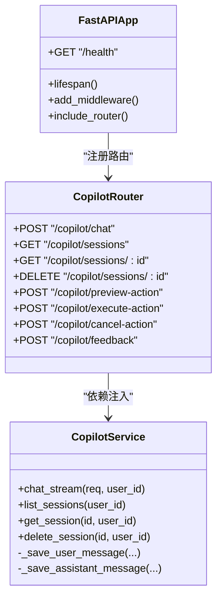
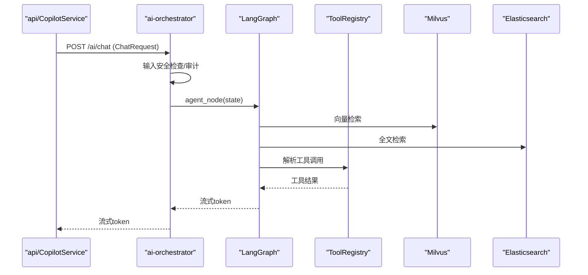
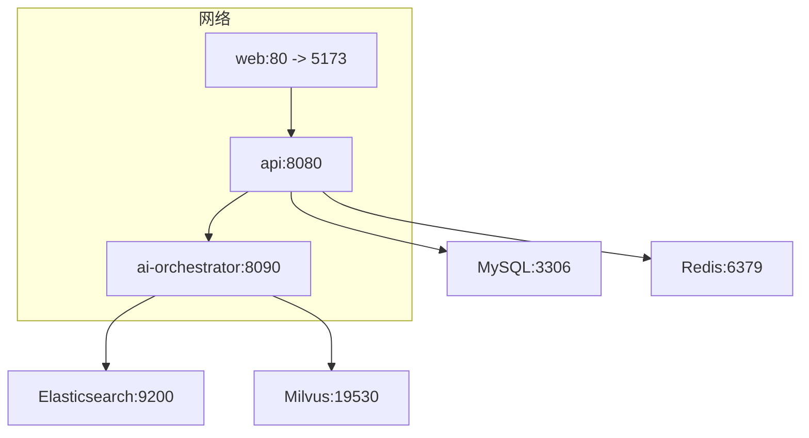
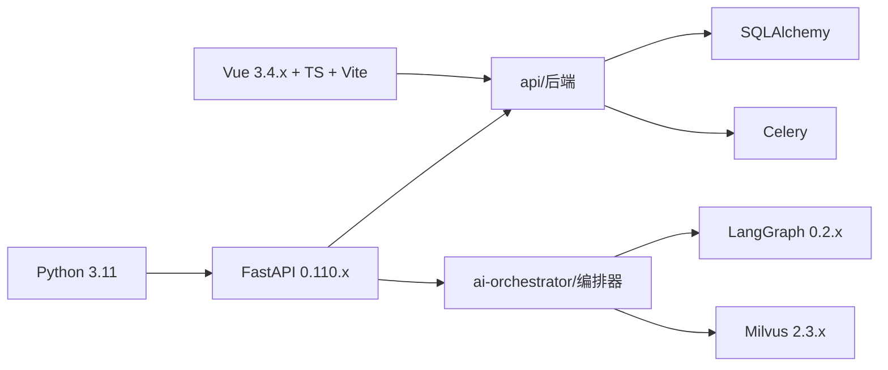

# 技术架构概览

<cite>
**本文档引用的文件**
- [workspace/README.md](file://workspace/README.md)
- [workspace/api/pyproject.toml](file://workspace/api/pyproject.toml)
- [workspace/web/package.json](file://workspace/web/package.json)
- [workspace/ai-orchestrator/pyproject.toml](file://workspace/ai-orchestrator/pyproject.toml)
- [workspace/api/app/main.py](file://workspace/api/app/main.py)
- [workspace/web/src/main.ts](file://workspace/web/src/main.ts)
- [workspace/ai-orchestrator/app/main.py](file://workspace/ai-orchestrator/app/main.py)
- [workspace/api/app/routers/copilot.py](file://workspace/api/app/routers/copilot.py)
- [workspace/ai-orchestrator/app/orchestrator/graph.py](file://workspace/ai-orchestrator/app/orchestrator/graph.py)
- [workspace/web/src/apis/modules/copilot.ts](file://workspace/web/src/apis/modules/copilot.ts)
- [workspace/infra/docker-compose/docker-compose.yml](file://workspace/infra/docker-compose/docker-compose.yml)
- [workspace/api/app/services/copilot_service.py](file://workspace/api/app/services/copilot_service.py)
- [workspace/ai-orchestrator/app/rag/retriever.py](file://workspace/ai-orchestrator/app/rag/retriever.py)
- [workspace/api/app/middleware/tenant.py](file://workspace/api/app/middleware/tenant.py)
- [workspace/ai-orchestrator/app/tools/base.py](file://workspace/ai-orchestrator/app/tools/base.py)
- [workspace/web/vite.config.ts](file://workspace/web/vite.config.ts)
- [workspace/api/app/config/settings.py](file://workspace/api/app/config/settings.py)
- [workspace/ai-orchestrator/app/config.py](file://workspace/ai-orchestrator/app/config.py)
</cite>

## 目录
1. [引言](#引言)
2. [项目结构](#项目结构)
3. [核心组件](#核心组件)
4. [架构总览](#架构总览)
5. [详细组件分析](#详细组件分析)
6. [依赖关系分析](#依赖关系分析)
7. [性能考量](#性能考量)
8. [故障排查指南](#故障排查指南)
9. [结论](#结论)
10. [附录](#附录)

## 引言
本文件为 FDE 工作台项目的“技术架构概览”，面向架构师与高级开发者，同时兼顾初级开发者理解路径。文档围绕前后端分离架构、微服务设计模式与 AI 服务集成展开，系统性阐述 FastAPI 后端服务、Vue.js 前端应用、AI 编排器服务以及基础设施组件之间的职责划分、交互方式与数据流，并给出架构图、组件交互图、可扩展性设计、性能与安全要点，以及技术栈版本与兼容性说明。

## 项目结构
FDE 工作台采用 Monorepo 组织方式，按功能域划分为四个主要子模块：
- web：前端 SPA 应用，使用 Vue 3 + TypeScript + Vite + Pinia
- api：后端业务服务，使用 Python + FastAPI + SQLAlchemy + Celery
- ai-orchestrator：AI 编排服务，使用 Python + FastAPI + LangGraph + Milvus
- infra：基础设施，包含 Docker Compose 编排与 Kubernetes 清单占位
- scripts：一键启动与开发脚本
- shared-protos：共享协议（OpenAPI 规范）占位

模块间边界清晰，遵循“web → HTTPS REST/SSE → api → HTTP → ai-orchestrator”的调用链路，禁止跨服务直接 import 业务代码，统一通过 shared-protos 生成类型与 OpenAPI 规范进行契约约束。

图表来源
- [workspace/README.md:47-56](file://workspace/README.md#L47-L56)
- [workspace/infra/docker-compose/docker-compose.yml:66-126](file://workspace/infra/docker-compose/docker-compose.yml#L66-L126)

章节来源
- [workspace/README.md:9-16](file://workspace/README.md#L9-L16)
- [workspace/README.md:47-56](file://workspace/README.md#L47-L56)

## 核心组件
- 前端 Web 应用（Vue 3 + TypeScript + Vite + Pinia）
  - 负责用户界面、状态管理、路由与 API 调用；通过代理将 /api 请求转发至后端服务；支持 Mock 与真实环境切换。
- 后端 API 服务（FastAPI + SQLAlchemy + Celery）
  - 提供 REST 接口与 SSE 流式响应；内置中间件（CORS、日志、追踪、租户上下文）；封装 CopilotService 实现与 AI 编排器的对接。
- AI 编排器服务（FastAPI + LangGraph + Milvus）
  - 提供聊天、工具列表、RAG 检索/索引/删除等接口；通过 LangGraph 实现多智能体编排与工具调用；内置安全守卫与审计日志。
- 基础设施（Docker Compose）
  - 统一编排 MySQL、Redis、Elasticsearch、Milvus、后端 API、AI 编排器与前端 Nginx；提供健康检查与端口映射。

章节来源
- [workspace/web/package.json:18-29](file://workspace/web/package.json#L18-L29)
- [workspace/api/pyproject.toml:9-28](file://workspace/api/pyproject.toml#L9-L28)
- [workspace/ai-orchestrator/pyproject.toml:8-19](file://workspace/ai-orchestrator/pyproject.toml#L8-L19)
- [workspace/infra/docker-compose/docker-compose.yml:1-132](file://workspace/infra/docker-compose/docker-compose.yml#L1-L132)

## 架构总览
系统采用“前端 SPA + 后端 API + AI 编排器 + 搜索引擎/向量库”的三层解耦架构。前端通过 HTTPS 与后端交互，后端通过 HTTP 与 AI 编排器交互，避免 web 直接访问 AI 编排器，确保鉴权与审计可控。搜索能力由 Milvus（向量）+ Elasticsearch（全文）构成混合检索，配合重排序与嵌入模型提升召回质量。

图表来源
- [workspace/api/app/routers/copilot.py:29-65](file://workspace/api/app/routers/copilot.py#L29-L65)
- [workspace/ai-orchestrator/app/main.py:89-172](file://workspace/ai-orchestrator/app/main.py#L89-L172)
- [workspace/api/app/services/copilot_service.py:21-56](file://workspace/api/app/services/copilot_service.py#L21-L56)
- [workspace/ai-orchestrator/app/rag/retriever.py:49-102](file://workspace/ai-orchestrator/app/rag/retriever.py#L49-L102)

章节来源
- [workspace/README.md:47-56](file://workspace/README.md#L47-L56)

## 详细组件分析

### 前端组件分析（Vue 3 + TypeScript + Vite + Pinia）
- 应用入口与插件初始化：创建应用实例、注册路由与状态管理、安装 Ant Design Vue 插件、配置 Axios 拦截器与样式。
- 路由与状态：集中式路由配置与 Pinia Store 管理页面级状态。
- Copilot API 封装：通过 openSse 封装 SSE 流式聊天；提供会话管理与动作预览/执行接口。
- 构建与代理：Vite 别名配置、开发服务器代理到后端 API、产物分包优化 vendor 与 ant-design-vue。

图表来源
- [workspace/web/src/main.ts:13-21](file://workspace/web/src/main.ts#L13-L21)

章节来源
- [workspace/web/src/main.ts:1-24](file://workspace/web/src/main.ts#L1-L24)
- [workspace/web/src/apis/modules/copilot.ts:12-39](file://workspace/web/src/apis/modules/copilot.ts#L12-L39)
- [workspace/web/vite.config.ts:6-36](file://workspace/web/vite.config.ts#L6-L36)

### 后端组件分析（FastAPI + SQLAlchemy + Celery）
- 应用入口与中间件：定义 lifespan、CORS、追踪与日志中间件；注册异常处理器；注册业务路由。
- Copilot 路由：提供 /copilot/chat 的 SSE 接口，转发到 AI 编排器并回写会话与消息记录。
- CopilotService：负责保存用户消息、调用 AI 编排器、解析流式响应、保存助手回复；在网络异常时提供降级 Mock 响应。
- 配置管理：通过 pydantic-settings 加载环境变量，校验 JWT 密钥长度等关键参数。

图表来源
- [workspace/api/app/main.py:36-73](file://workspace/api/app/main.py#L36-L73)
- [workspace/api/app/routers/copilot.py:18-137](file://workspace/api/app/routers/copilot.py#L18-L137)
- [workspace/api/app/services/copilot_service.py:15-111](file://workspace/api/app/services/copilot_service.py#L15-L111)

章节来源
- [workspace/api/app/main.py:1-73](file://workspace/api/app/main.py#L1-L73)
- [workspace/api/app/routers/copilot.py:1-137](file://workspace/api/app/routers/copilot.py#L1-L137)
- [workspace/api/app/services/copilot_service.py:1-111](file://workspace/api/app/services/copilot_service.py#L1-L111)
- [workspace/api/app/config/settings.py:12-81](file://workspace/api/app/config/settings.py#L12-L81)

### AI 编排器组件分析（FastAPI + LangGraph + Milvus）
- 应用入口与安全：统一异常处理、输入安全守卫、审计日志；SSE 错误帧包含稳定错误码。
- 聊天接口：接收 ChatRequest，执行安全检查，构建审计条目，流式输出 token；内部通过 LangGraph 调用 LLM 并处理工具调用。
- 工具体系：抽象 BaseTool 与 ToolRegistry，支持读写类工具区分与二次确认。
- RAG 检索：Retriever 并行执行 Milvus 向量检索与 ES 全文检索，结合重排序与嵌入模型，构建上下文文本。
- 图编排：LangGraph 定义 AgentState 与 agent_node，当前线性编排，未来扩展为多智能体路由。

图表来源
- [workspace/ai-orchestrator/app/main.py:89-172](file://workspace/ai-orchestrator/app/main.py#L89-L172)
- [workspace/ai-orchestrator/app/orchestrator/graph.py:113-183](file://workspace/ai-orchestrator/app/orchestrator/graph.py#L113-L183)
- [workspace/ai-orchestrator/app/rag/retriever.py:49-102](file://workspace/ai-orchestrator/app/rag/retriever.py#L49-L102)
- [workspace/ai-orchestrator/app/tools/base.py:50-89](file://workspace/ai-orchestrator/app/tools/base.py#L50-L89)

章节来源
- [workspace/ai-orchestrator/app/main.py:1-307](file://workspace/ai-orchestrator/app/main.py#L1-L307)
- [workspace/ai-orchestrator/app/orchestrator/graph.py:1-211](file://workspace/ai-orchestrator/app/orchestrator/graph.py#L1-L211)
- [workspace/ai-orchestrator/app/rag/retriever.py:1-127](file://workspace/ai-orchestrator/app/rag/retriever.py#L1-L127)
- [workspace/ai-orchestrator/app/tools/base.py:1-89](file://workspace/ai-orchestrator/app/tools/base.py#L1-L89)

### 基础设施与部署（Docker Compose）
- 服务编排：MySQL、Redis、Elasticsearch、Milvus、api、ai-orchestrator、web（Nginx）。
- 环境变量：数据库连接、缓存、搜索引擎、向量库、AI 编排器地址、JWT 密钥、LLM 提供商等。
- 健康检查：各服务提供健康检查端点，确保容器编排稳定性。
- 端口映射：前端 5173 映射到 80，后端 8080，AI 编排器 8090。

图表来源
- [workspace/infra/docker-compose/docker-compose.yml:66-126](file://workspace/infra/docker-compose/docker-compose.yml#L66-L126)

章节来源
- [workspace/infra/docker-compose/docker-compose.yml:1-132](file://workspace/infra/docker-compose/docker-compose.yml#L1-L132)

## 依赖关系分析
- 技术栈版本与兼容性
  - Python 版本：后端与 AI 编排器均使用 Python 3.11，保证类型系统与异步生态一致性。
  - FastAPI：后端与 AI 编排器均使用 FastAPI 0.110.x，保持路由、SSE、异常处理一致。
  - LangGraph：AI 编排器使用 0.2.x，提供稳定的多智能体编排能力。
  - Vue 生态：前端使用 Vue 3.4.x、TypeScript ~5.4.5、Vite 5.x、Pinia 2.x，保证现代前端开发体验。
  - 搜索与向量：Elasticsearch 8.12.0、Milvus 2.3.0，确保检索与嵌入能力稳定。
- 组件耦合与内聚
  - web 与 api 通过 REST/SSE 解耦；api 与 ai-orchestrator 通过 HTTP 解耦，避免直接 import。
  - CopilotService 在 api 层承担“编排器转发 + 会话持久化”的职责，内聚度高且职责单一。
  - AI 编排器内部通过 ToolRegistry、Retriever、LangGraph 分层解耦，便于扩展与测试。

图表来源
- [workspace/api/pyproject.toml:9-28](file://workspace/api/pyproject.toml#L9-L28)
- [workspace/ai-orchestrator/pyproject.toml:8-19](file://workspace/ai-orchestrator/pyproject.toml#L8-L19)
- [workspace/web/package.json:18-29](file://workspace/web/package.json#L18-L29)

章节来源
- [workspace/api/pyproject.toml:1-61](file://workspace/api/pyproject.toml#L1-L61)
- [workspace/ai-orchestrator/pyproject.toml:1-29](file://workspace/ai-orchestrator/pyproject.toml#L1-L29)
- [workspace/web/package.json:1-59](file://workspace/web/package.json#L1-L59)

## 性能考量
- SSE 流式传输：前端以 SSE 接收 token 块，降低首字节延迟，提升交互体验。
- 并行检索：AI 编排器在 RAG 检索中并行执行 Milvus 与 ES 查询，缩短响应时间。
- 限流与熔断：AI 编排器提供熔断器与电路保护（在代码中预留），防止下游异常放大。
- 缓存与队列：后端使用 Redis 作为缓存与 Celery 任务队列，支撑异步任务与会话状态。
- 前端分包：Vite 配置手动分包策略，减少第三方库重复打包，优化首屏加载。

章节来源
- [workspace/ai-orchestrator/app/rag/retriever.py:65-77](file://workspace/ai-orchestrator/app/rag/retriever.py#L65-L77)
- [workspace/ai-orchestrator/app/main.py:192-220](file://workspace/ai-orchestrator/app/main.py#L192-L220)
- [workspace/web/vite.config.ts:26-35](file://workspace/web/vite.config.ts#L26-L35)

## 故障排查指南
- 健康检查
  - 后端 API 健康端点：/health，返回服务状态与版本。
  - AI 编排器健康端点：/health，返回服务状态、版本与提供商状态。
- 常见问题定位
  - 前端无法访问后端：检查 Vite 代理配置与后端 CORS 设置。
  - SSE 断流或无响应：检查后端 Copilot 路由与 AI 编排器流式输出。
  - RAG 检索失败：检查 Milvus 与 ES 健康状态与索引状态。
  - 认证失败：检查 JWT 密钥长度与格式，确保 .env 中配置正确。
- 审计与追踪
  - 后端中间件包含 TraceMiddleware 与 LoggingMiddleware，结合结构化日志定位问题。
  - AI 编排器对安全拦截与聊天过程进行审计记录，便于回溯。

章节来源
- [workspace/api/app/main.py:70-73](file://workspace/api/app/main.py#L70-L73)
- [workspace/ai-orchestrator/app/main.py:79-86](file://workspace/ai-orchestrator/app/main.py#L79-L86)
- [workspace/api/app/config/settings.py:63-72](file://workspace/api/app/config/settings.py#L63-L72)
- [workspace/api/app/middleware/tenant.py:11-23](file://workspace/api/app/middleware/tenant.py#L11-L23)

## 结论
FDE 工作台通过清晰的前后端分离、微服务边界与 AI 编排器集成，实现了可扩展、可观测、可维护的现代化架构。Vue 3 与 FastAPI 的组合提供了高效的开发体验与稳定的运行时表现；LangGraph 与 Milvus/ES 的检索融合提升了 AI 对话的准确性与上下文感知能力。建议在后续阶段完善 shared-protos 的 OpenAPI 导出与前端类型生成流程，持续优化 RAG 与工具调用的稳定性与性能。

## 附录
- 技术栈版本与兼容性摘要
  - Python：3.11（后端与 AI 编排器）
  - FastAPI：0.110.x（后端与 AI 编排器）
  - LangGraph：0.2.x（AI 编排器）
  - Vue：3.4.x（前端）
  - TypeScript：~5.4.5（前端）
  - Vite：5.x（前端）
  - Pinia：2.x（前端）
  - Elasticsearch：8.12.0
  - Milvus：2.3.0
- 端口与服务
  - 前端：5173（开发）、80（生产 Nginx）
  - 后端 API：8080
  - AI 编排器：8090
  - MySQL：3307
  - Redis：6380
  - Elasticsearch：9200
  - Milvus：19530