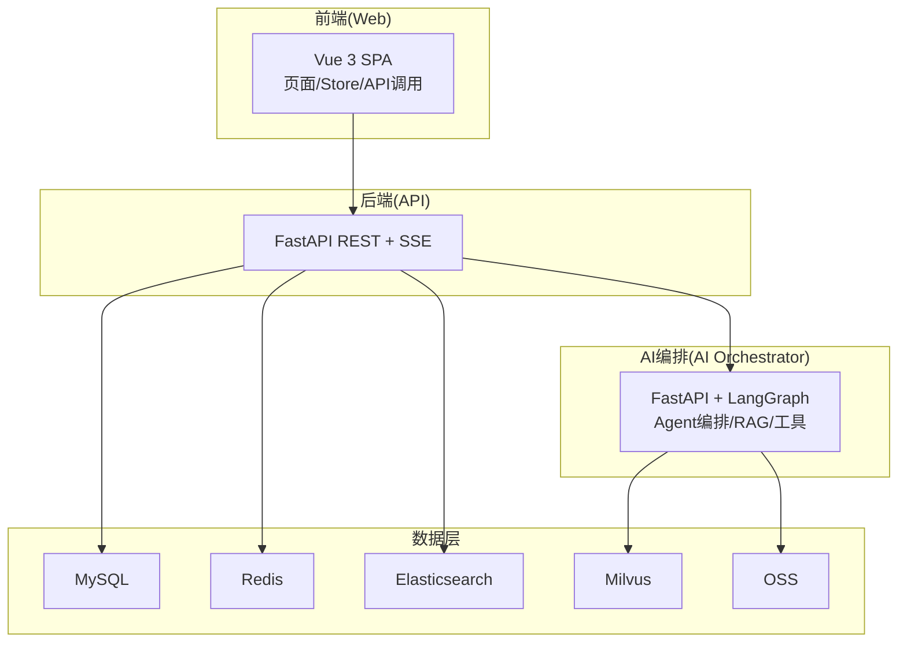
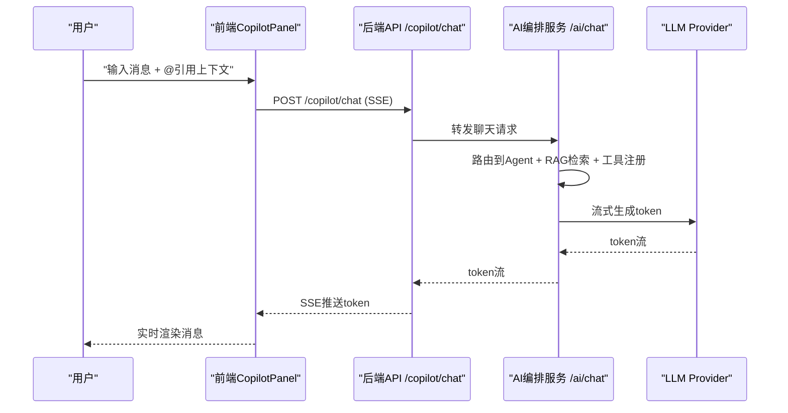
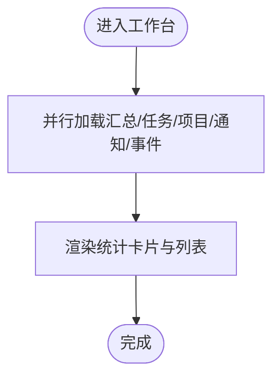
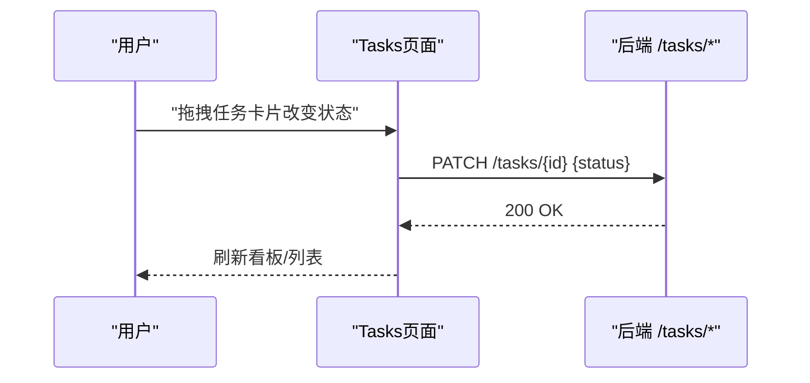
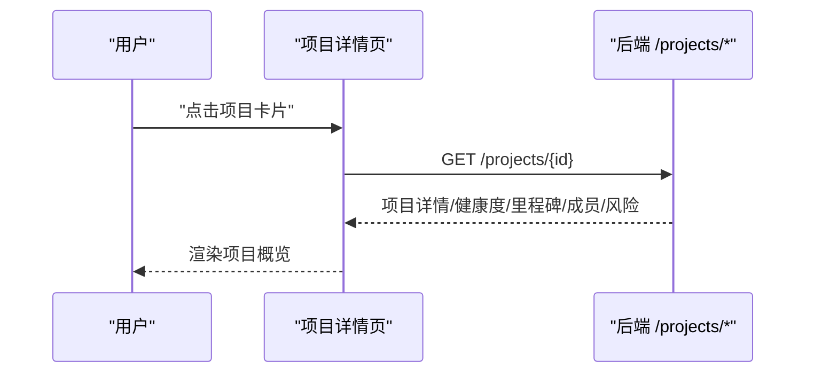
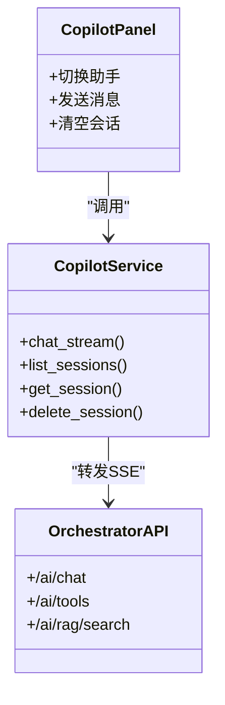
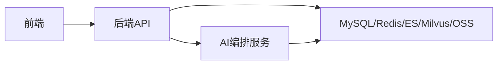

# 核心功能特性

<cite>
**本文引用的文件**
- [FDE工作台产品需求文档.md](file://docs/FDE工作台产品需求文档.md)
- [FDE工作台技术方案.md](file://docs/FDE工作台技术方案.md)
- [README.md（工作台代码仓库总览）](file://workspace/README.md)
- [DashboardPage.vue](file://workspace/web/src/pages/dashboard/DashboardPage.vue)
- [ProjectsListPage.vue](file://workspace/web/src/pages/projects/ProjectsListPage.vue)
- [TasksPage.vue](file://workspace/web/src/pages/tasks/TasksPage.vue)
- [FilesPage.vue](file://workspace/web/src/pages/files/FilesPage.vue)
- [CustomersPage.vue](file://workspace/web/src/pages/customers/CustomersPage.vue)
- [CoachIndexPage.vue](file://workspace/web/src/pages/coach/CoachIndexPage.vue)
- [CopilotPanel.vue](file://workspace/web/src/components/copilot/CopilotPanel.vue)
- [projects.py（后端路由）](file://workspace/api/app/routers/projects.py)
- [tasks.py（后端路由）](file://workspace/api/app/routers/tasks.py)
- [copilot.py（后端路由）](file://workspace/api/app/routers/copilot.py)
- [copilot_service.py（后端服务）](file://workspace/api/app/services/copilot_service.py)
- [main.py（AI编排服务入口）](file://workspace/ai-orchestrator/app/main.py)
- [graph.py（AI编排图）](file://workspace/ai-orchestrator/app/orchestrator/graph.py)
</cite>

## 目录
1. [简介](#简介)
2. [项目结构](#项目结构)
3. [核心组件](#核心组件)
4. [架构总览](#架构总览)
5. [详细组件分析](#详细组件分析)
6. [依赖分析](#依赖分析)
7. [性能考虑](#性能考虑)
8. [故障排查指南](#故障排查指南)
9. [结论](#结论)
10. [附录](#附录)

## 简介
本文件面向FDE工作台项目的“核心功能特性”，系统化梳理项目管理、任务协作、AI助手、文件管理、客户关系管理等关键业务模块，解释模块间的协作关系与数据流转，给出技术实现要点与创新设计，并结合原型与代码路径提供可操作的参考。

## 项目结构
工作台采用前后端分离与AI编排服务分层的Monorepo组织方式：
- 前端（web/）：Vue 3 + TypeScript + Vite，负责页面与Copilot交互
- 后端（api/）：Python FastAPI，提供REST API与SSE流式对话
- AI编排（ai-orchestrator/）：Python FastAPI + LangGraph，负责Agent编排、RAG与工具调用
- 基础设施（infra/）：Docker Compose与Kubernetes部署样例
- 共享协议（shared-protos/）：OpenAPI规范占位
- 脚本（scripts/）：一键启动与开发脚本

**图表来源**
- [FDE工作台技术方案.md](file://docs/FDE工作台技术方案.md)
- [README.md（工作台代码仓库总览）](file://workspace/README.md)

**章节来源**
- [README.md（工作台代码仓库总览）:1-110](file://workspace/README.md#L1-L110)
- [FDE工作台技术方案.md:45-120](file://docs/FDE工作台技术方案.md#L45-L120)

## 核心组件
- 工作台（Dashboard）：聚合任务、项目、通知与关键事件，支持AI快捷入口
- 任务中心（Tasks）：任务全生命周期管理（列表/看板）、过滤与批量操作
- 项目空间（Projects）：项目详情、健康度、里程碑、成员与风险
- 客户空间（Customers）：客户全景画像、联系人、商机与历史项目
- FDE教练（Coach）：最佳实践库、SOP库、学习路径与个性化推荐
- 文件中心（Files）：文件上传、树形浏览、搜索与配额
- AI助手（Copilot）：页面级T/P/C/F助手与全局AI对话中心
- 系统设置（Settings）：用户偏好、通知与AI模型选择

**章节来源**
- [FDE工作台产品需求文档.md:113-141](file://docs/FDE工作台产品需求文档.md#L113-L141)
- [DashboardPage.vue:1-286](file://workspace/web/src/pages/dashboard/DashboardPage.vue#L1-L286)
- [TasksPage.vue:1-384](file://workspace/web/src/pages/tasks/TasksPage.vue#L1-L384)
- [ProjectsListPage.vue:1-330](file://workspace/web/src/pages/projects/ProjectsListPage.vue#L1-L330)
- [CustomersPage.vue:1-345](file://workspace/web/src/pages/customers/CustomersPage.vue#L1-L345)
- [CoachIndexPage.vue:1-215](file://workspace/web/src/pages/coach/CoachIndexPage.vue#L1-L215)
- [FilesPage.vue:1-316](file://workspace/web/src/pages/files/FilesPage.vue#L1-L316)
- [CopilotPanel.vue:1-92](file://workspace/web/src/components/copilot/CopilotPanel.vue#L1-L92)

## 架构总览
整体采用“前端三栏布局 + 后端REST/SSE + AI编排服务”的分层架构。前端通过统一的Copilot面板与页面上下文联动；后端负责鉴权、会话、动作预览与执行；AI编排服务通过LangGraph路由到不同Agent，结合RAG与工具调用实现智能决策与自动化。

**图表来源**
- [FDE工作台技术方案.md:186-214](file://docs/FDE工作台技术方案.md#L186-L214)
- [copilot.py（后端路由）:29-65](file://workspace/api/app/routers/copilot.py#L29-L65)
- [copilot_service.py（后端服务）:21-56](file://workspace/api/app/services/copilot_service.py#L21-L56)
- [main.py（AI编排服务入口）:89-172](file://workspace/ai-orchestrator/app/main.py#L89-L172)

**章节来源**
- [FDE工作台技术方案.md:158-283](file://docs/FDE工作台技术方案.md#L158-L283)

## 详细组件分析

### 工作台（Dashboard）
- 功能要点
  - 概览卡片：总任务数、已完成、活跃项目、任务完成率
  - 最近任务与通知列表
  - 近期关键事件时间线
- 用户价值
  - 早晨快速掌握当日工作重点与风险
  - 通过AI快捷入口提升准备效率
- 技术实现
  - 并行加载多个聚合接口，减少首屏等待
  - 使用Ant Design Vue卡片与统计组件，直观展示指标

**图表来源**
- [DashboardPage.vue:28-48](file://workspace/web/src/pages/dashboard/DashboardPage.vue#L28-L48)

**章节来源**
- [FDE工作台产品需求文档.md:145-169](file://docs/FDE工作台产品需求文档.md#L145-L169)
- [DashboardPage.vue:1-286](file://workspace/web/src/pages/dashboard/DashboardPage.vue#L1-L286)

### 任务中心（Tasks）
- 功能要点
  - 列表/看板双视图，支持状态与优先级筛选
  - 新建/编辑/删除任务，状态变更与批量操作
  - 与任务助手（T助手）联动，支持批量延期等动作预览
- 用户价值
  - 降低任务管理成本，提升任务可见性与协同效率
- 技术实现
  - 前端Store隔离任务状态，后端提供REST与批量更新接口
  - 看板拖拽状态变更通过后端PATCH接口同步

**图表来源**
- [tasks.py（后端路由）:47-54](file://workspace/api/app/routers/tasks.py#L47-L54)
- [TasksPage.vue:167-175](file://workspace/web/src/pages/tasks/TasksPage.vue#L167-L175)

**章节来源**
- [FDE工作台产品需求文档.md:170-187](file://docs/FDE工作台产品需求文档.md#L170-L187)
- [TasksPage.vue:1-384](file://workspace/web/src/pages/tasks/TasksPage.vue#L1-L384)
- [tasks.py（后端路由）:1-70](file://workspace/api/app/routers/tasks.py#L1-L70)

### 项目空间（Projects）
- 功能要点
  - 项目列表与筛选（按阶段）
  - 项目详情页：健康度环、里程碑、成员、风险、关键文档
  - 与项目助手（P助手）联动，支持周报生成与成员调整
- 用户价值
  - 项目全景掌控，风险前置预警，提升交付质量
- 技术实现
  - 详情页聚合健康度、里程碑、成员与风险接口
  - 项目成员与风险变更通过后端接口维护

**图表来源**
- [projects.py（后端路由）:24-81](file://workspace/api/app/routers/projects.py#L24-L81)
- [ProjectsListPage.vue:53-56](file://workspace/web/src/pages/projects/ProjectsListPage.vue#L53-L56)

**章节来源**
- [FDE工作台产品需求文档.md:188-208](file://docs/FDE工作台产品需求文档.md#L188-L208)
- [ProjectsListPage.vue:1-330](file://workspace/web/src/pages/projects/ProjectsListPage.vue#L1-L330)
- [projects.py（后端路由）:1-82](file://workspace/api/app/routers/projects.py#L1-L82)

### 客户空间（Customers）
- 功能要点
  - 客户列表与筛选（按行业）
  - 客户详情：联系人、商机、历史项目
  - 支持新建/删除客户
- 用户价值
  - 客户全貌可视化，提升客户关系管理效率
- 技术实现
  - 双栏布局：左侧列表 + 右侧详情，详情页并行加载联系人与商机

**章节来源**
- [FDE工作台产品需求文档.md:233-256](file://docs/FDE工作台产品需求文档.md#L233-L256)
- [CustomersPage.vue:1-345](file://workspace/web/src/pages/customers/CustomersPage.vue#L1-L345)

### 文件中心（Files）
- 功能要点
  - 文件树与网格视图，支持搜索与批量操作
  - 存储配额与进度条
  - 上传流程：获取令牌 → 上传 → 完成归档
- 用户价值
  - 统一文件管理，降低版本与归档成本
- 技术实现
  - 前端封装上传流程，后端提供上传令牌与归档接口
  - 支持RAG检索与向量索引（异步任务）

**章节来源**
- [FDE工作台产品需求文档.md:257-282](file://docs/FDE工作台产品需求文档.md#L257-L282)
- [FilesPage.vue:1-316](file://workspace/web/src/pages/files/FilesPage.vue#L1-L316)

### FDE教练（Coach）
- 功能要点
  - 最佳实践库、SOP库、学习路径入口
  - 个性化推荐：案例、SOP、路径
- 用户价值
  - 专家经验数字化，加速新人成长与知识复用
- 技术实现
  - 前端入口卡片跳转至对应页面，后端提供推荐接口

**章节来源**
- [FDE工作台产品需求文档.md:209-232](file://docs/FDE工作台产品需求文档.md#L209-L232)
- [CoachIndexPage.vue:1-215](file://workspace/web/src/pages/coach/CoachIndexPage.vue#L1-L215)

### AI助手（Copilot）
- 功能要点
  - 页面级助手：T（任务）、P（项目）、C（教练）、F（文件）
  - 全局AI对话中心：三栏布局、@引用业务对象、三种对话模式
  - 写操作必预览：actionCard二次确认
- 用户价值
  - 嵌入式AI助手，随场景自动切换，降低操作门槛
- 技术实现
  - 前端CopilotPanel统一壳，按页面隔离会话
  - 后端SSE流式转发至AI编排服务，支持工具调用与RAG检索

**图表来源**
- [CopilotPanel.vue:1-92](file://workspace/web/src/components/copilot/CopilotPanel.vue#L1-L92)
- [copilot_service.py（后端服务）:15-111](file://workspace/api/app/services/copilot_service.py#L15-L111)
- [main.py（AI编排服务入口）:89-172](file://workspace/ai-orchestrator/app/main.py#L89-L172)

**章节来源**
- [FDE工作台产品需求文档.md:126-140](file://docs/FDE工作台产品需求文档.md#L126-L140)
- [CopilotPanel.vue:1-92](file://workspace/web/src/components/copilot/CopilotPanel.vue#L1-L92)
- [copilot.py（后端路由）:29-137](file://workspace/api/app/routers/copilot.py#L29-L137)
- [copilot_service.py（后端服务）:15-111](file://workspace/api/app/services/copilot_service.py#L15-L111)
- [main.py（AI编排服务入口）:1-307](file://workspace/ai-orchestrator/app/main.py#L1-L307)
- [graph.py（AI编排图）:1-211](file://workspace/ai-orchestrator/app/orchestrator/graph.py#L1-L211)

## 依赖分析
- 前端依赖
  - Vue 3 + TypeScript + Vite + Pinia + Vue Router
  - Ant Design Vue + Lucide Icons
  - SSE客户端：@microsoft/fetch-event-source
- 后端依赖
  - FastAPI + SQLAlchemy + Celery + Redis + RocketMQ
  - Elasticsearch + Milvus + OSS
- AI编排依赖
  - LangGraph + LLM Provider适配层 + RAG引擎

**图表来源**
- [FDE工作台技术方案.md:555-691](file://docs/FDE工作台技术方案.md#L555-L691)

**章节来源**
- [FDE工作台技术方案.md:555-691](file://docs/FDE工作台技术方案.md#L555-L691)

## 性能考虑
- 前端
  - 首屏加载：路由懒加载 + Vite代码分割 + CDN
  - 页面切换：keep-alive缓存 + Pinia状态保持
  - Copilot切换：同一壳组件 + 配置切换，避免卸载
  - @引用响应：本地缓存 + 防抖
- 后端
  - SSE流式：后端逐token推送，前端即时渲染
  - 缓存：Redis缓存会话与actionId，MySQL配合缓存命中
- AI编排
  - RAG检索：Milvus向量检索 + ES全文检索混合
  - 工具调用：按Agent注册，写操作需二次确认

**章节来源**
- [FDE工作台技术方案.md:543-552](file://docs/FDE工作台技术方案.md#L543-L552)

## 故障排查指南
- Copilot无响应
  - 检查后端SSE是否正常，确认网络连通与超时设置
  - 若AI编排服务不可用，后端将返回Mock文本，确认服务健康
- 写操作未生效
  - 确认actionCard是否被二次确认执行
  - 检查Redis中actionId是否存在与TTL
- RAG检索异常
  - 检查Milvus与ES状态，确认索引任务是否完成
- 权限与鉴权
  - 确认JWT Token有效与路由守卫逻辑

**章节来源**
- [copilot_service.py（后端服务）:48-52](file://workspace/api/app/services/copilot_service.py#L48-L52)
- [copilot.py（后端路由）:124-126](file://workspace/api/app/routers/copilot.py#L124-L126)
- [main.py（AI编排服务入口）:223-248](file://workspace/ai-orchestrator/app/main.py#L223-L248)

## 结论
FDE工作台通过“页面级AI助手 + 全局对话中心”的设计，将AI能力深度嵌入任务、项目、文件与教练等核心业务流程，显著降低操作门槛并提升交付效率。前后端与AI编排服务的清晰分层，既保证了扩展性，也为后续能力演进（如教练助手、客户助手）预留了空间。

## 附录
- 业务场景示例
  - 晨间一站式查看：工作台聚合当日任务、项目与通知，AI生成晨会摘要
  - AI协助任务管理：T助手支持创建/批量延期/工作量分析，actionCard二次确认
  - 项目实施与风险预警：P助手绑定项目，主动告警高风险并给出建议
  - 能力成长：C助手基于专家身份与项目背景推荐Next Steps与最佳实践
  - 智能文件管理：F助手支持搜索、总结与批量归档，RAG检索增强

**章节来源**
- [FDE工作台产品需求文档.md:63-84](file://docs/FDE工作台产品需求文档.md#L63-L84)