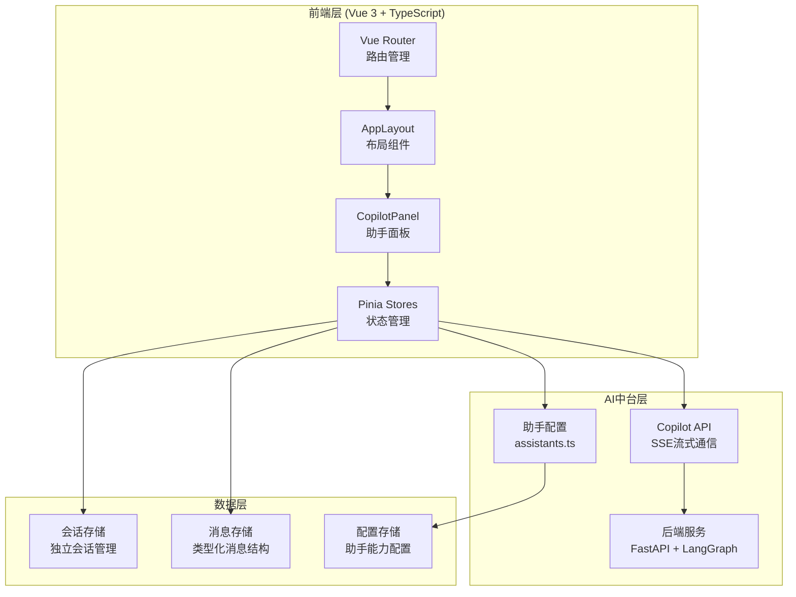
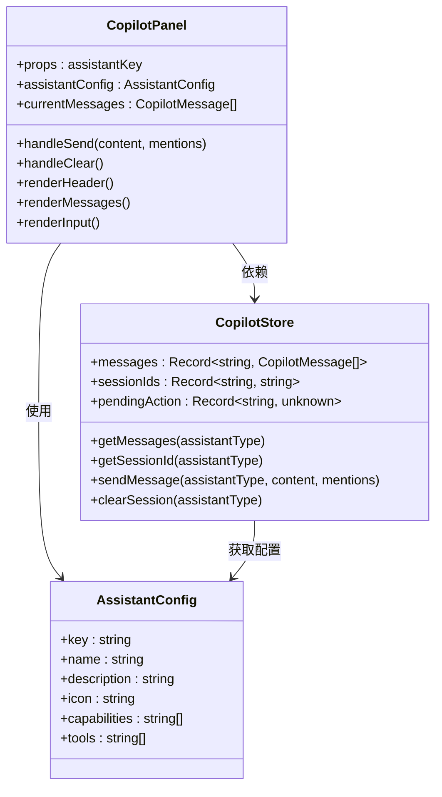
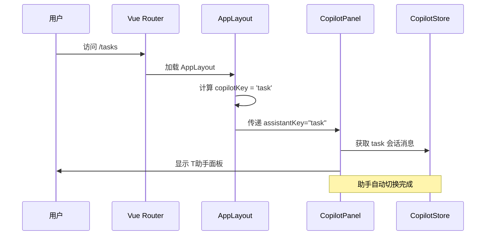
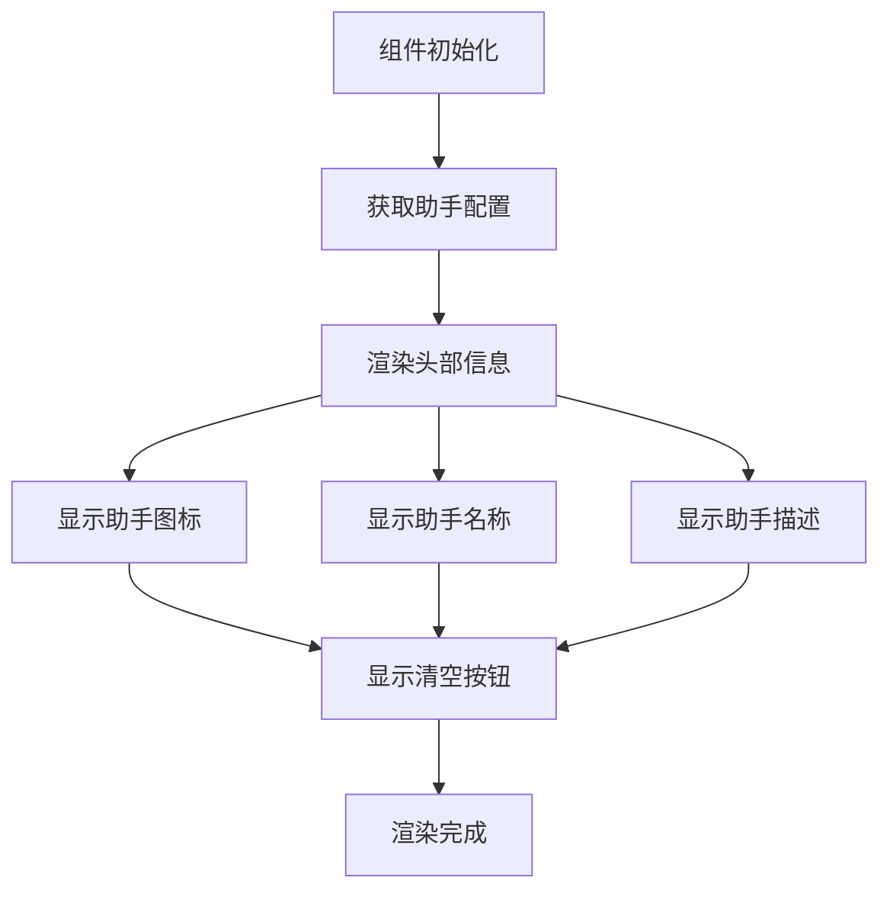
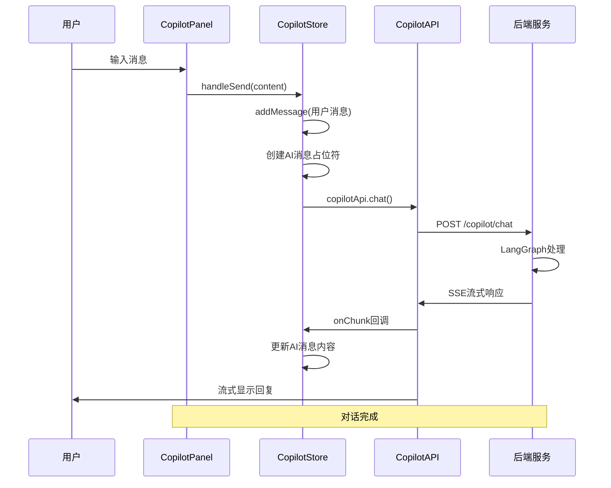
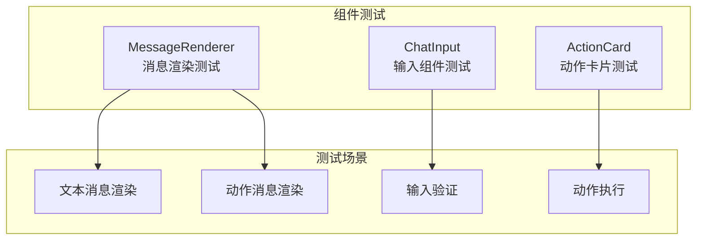
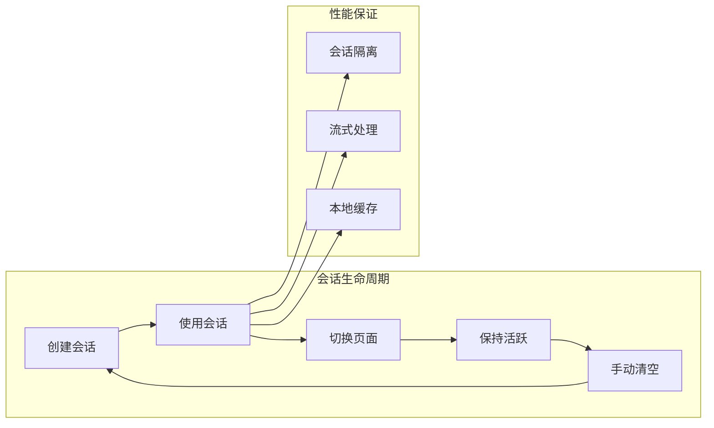

# AI助手跟随菜单切换改造说明

<cite>
**本文档引用的文件**
- [AI助手跟随菜单切换改造说明.md](file://docs/AI助手跟随菜单切换改造说明.md)
- [FDE工作台技术方案.md](file://docs/FDE工作台技术方案.md)
- [CopilotPanel.vue](file://workspace/web/src/components/copilot/CopilotPanel.vue)
- [copilot.ts](file://workspace/web/src/stores/copilot.ts)
- [index.ts](file://workspace/web/src/router/index.ts)
- [assistants.ts](file://workspace/web/src/config/assistants.ts)
- [AppLayout.vue](file://workspace/web/src/components/layout/AppLayout.vue)
- [copilot.d.ts](file://workspace/web/src/types/copilot.d.ts)
- [copilot.ts](file://workspace/web/src/apis/modules/copilot.ts)
- [copilot.test.ts](file://workspace/web/tests/components/copilot.test.ts)
- [DashboardPage.vue](file://workspace/web/src/pages/dashboard/DashboardPage.vue)
- [TasksPage.vue](file://workspace/web/src/pages/tasks/TasksPage.vue)
</cite>

## 目录
1. [项目概述](#项目概述)
2. [技术架构](#技术架构)
3. [核心组件分析](#核心组件分析)
4. [路由与菜单映射](#路由与菜单映射)
5. [状态管理设计](#状态管理设计)
6. [UI组件重构](#ui组件重构)
7. [数据流分析](#数据流分析)
8. [测试验证](#测试验证)
9. [性能优化](#性能优化)
10. [故障排除指南](#故障排除指南)
11. [总结](#总结)

## 项目概述

### 改造背景
本次改造将AI助手从传统的**顶部Tab切换**模式升级为**跟随左侧菜单自动切换**模式，旨在提升用户体验的一致性和操作效率。

### 改造前状态
- 右侧AI助手面板顶部包含Tab栏（T助手、P助手、C助手、F助手）
- 用户需要手动点击Tab切换助手
- 助手与当前页面可能存在不匹配的情况

### 改造后优势
- 移除顶部Tab栏，界面更加简洁
- AI助手自动跟随左侧菜单切换
- 当前菜单对应的助手自动显示在右侧面板
- 显示助手图标、名称和描述
- 会话保持独立，切换页面不会清空历史消息

## 技术架构

### 整体架构概览



**图表来源**
- [FDE工作台技术方案.md:45-120](file://docs/FDE工作台技术方案.md#L45-L120)
- [CopilotPanel.vue:1-123](file://workspace/web/src/components/copilot/CopilotPanel.vue#L1-L123)
- [copilot.ts:1-184](file://workspace/web/src/stores/copilot.ts#L1-L184)

## 核心组件分析

### CopilotPanel 组件重构

#### 组件架构



**图表来源**
- [CopilotPanel.vue:12-33](file://workspace/web/src/components/copilot/CopilotPanel.vue#L12-L33)
- [assistants.ts:35-42](file://workspace/web/src/config/assistants.ts#L35-L42)
- [copilot.ts:15-184](file://workspace/web/src/stores/copilot.ts#L15-L184)

#### 关键特性
- **Props驱动**: 通过`assistantKey`属性接收当前助手类型
- **配置化**: 使用`getAssistantConfig()`获取助手配置
- **会话管理**: 独立的会话存储，支持清空操作
- **消息渲染**: 自动渲染不同类型的消息（文本、动作、报告等）

**章节来源**
- [CopilotPanel.vue:1-123](file://workspace/web/src/components/copilot/CopilotPanel.vue#L1-L123)
- [assistants.ts:1-109](file://workspace/web/src/config/assistants.ts#L1-L109)

## 路由与菜单映射

### 路由配置分析

#### 路由映射关系

| 菜单路径 | 菜单名称 | 助手Key | 助手名称 |
|----------|----------|----------|----------|
| `/dashboard` | 仪表盘 | `chat` | 全局对话 |
| `/tasks` | 任务管理 | `task` | T助手 |
| `/projects` | 项目空间 | `project` | P助手 |
| `/customers` | 客户空间 | `chat` | 全局对话 |
| `/files` | 文件中心 | `file` | F助手 |
| `/coach` | FDE教练 | `coach` | C助手 |
| `/settings` | 系统设置 | `chat` | 全局对话 |

#### 路由实现



**图表来源**
- [index.ts:12-23](file://workspace/web/src/router/index.ts#L12-L23)
- [AppLayout.vue:14-24](file://workspace/web/src/components/layout/AppLayout.vue#L14-L24)

**章节来源**
- [index.ts:1-34](file://workspace/web/src/router/index.ts#L1-L34)
- [AppLayout.vue:1-58](file://workspace/web/src/components/layout/AppLayout.vue#L1-L58)

## 状态管理设计

### Pinia Store 架构

#### 状态结构

```mermaid
graph TD
subgraph "CopilotStore 状态"
Messages[Messages<br/>Record<string, CopilotMessage[]>]
SessionIds[SessionIds<br/>Record<string, string>]
PendingAction[PendingAction<br/>Record<string, unknown>]
StreamingMsgIds[StreamingMsgIds<br/>Record<string, string>>
end
subgraph "会话管理"
TaskSession[task-session<br/>任务助手会话]
ProjectSession[project-session<br/>项目助手会话]
CoachSession[coach-session<br/>教练助手会话]
FileSession[file-session<br/>文件助手会话]
ChatSession[chat-session<br/>全局对话会话]
end
Messages --> TaskSession
Messages --> ProjectSession
Messages --> CoachSession
Messages --> FileSession
Messages --> ChatSession
SessionIds --> TaskSession
SessionIds --> ProjectSession
SessionIds --> CoachSession
SessionIds --> FileSession
SessionIds --> ChatSession
```

**图表来源**
- [copilot.ts:17-26](file://workspace/web/src/stores/copilot.ts#L17-L26)
- [copilot.ts:7-13](file://workspace/web/src/stores/copilot.ts#L7-L13)

#### 核心功能

| 功能 | 实现方式 | 作用 |
|------|----------|------|
| `getMessages()` | 返回指定助手的消息数组 | 获取当前会话历史 |
| `getSessionId()` | 返回或创建会话ID | 确保会话唯一性 |
| `sendMessage()` | SSE流式发送消息 | 实现AI对话功能 |
| `clearSession()` | 清空消息并重置会话ID | 支持手动清空会话 |

**章节来源**
- [copilot.ts:1-184](file://workspace/web/src/stores/copilot.ts#L1-L184)

## UI组件重构

### 组件结构设计

#### 头部信息展示



**图表来源**
- [CopilotPanel.vue:35-61](file://workspace/web/src/components/copilot/CopilotPanel.vue#L35-L61)

#### 样式特点
- **图标**: 24px助手emoji图标
- **名称**: 14px粗体显示助手名称
- **描述**: 11px灰色显示助手描述
- **背景**: 浅灰色背景区分内容区

**章节来源**
- [CopilotPanel.vue:64-123](file://workspace/web/src/components/copilot/CopilotPanel.vue#L64-L123)

## 数据流分析

### 对话流程



**图表来源**
- [CopilotPanel.vue:26-28](file://workspace/web/src/components/copilot/CopilotPanel.vue#L26-L28)
- [copilot.ts:48-137](file://workspace/web/src/stores/copilot.ts#L48-L137)
- [copilot.ts:13-20](file://workspace/web/src/apis/modules/copilot.ts#L13-L20)

### 助手类型映射

| 前端助手类型 | 后端助手ID | 用途 |
|-------------|------------|------|
| `task` | `tasks` | 任务管理助手 |
| `project` | `project` | 项目助手 |
| `coach` | `coach` | 教练助手 |
| `file` | `files` | 文件助手 |
| `chat` | `chat` | 全局对话 |

**章节来源**
- [copilot.ts:75-81](file://workspace/web/src/stores/copilot.ts#L75-L81)

## 测试验证

### 测试覆盖范围

#### 组件测试



**图表来源**
- [copilot.test.ts:9-70](file://workspace/web/tests/components/copilot.test.ts#L9-L70)
- [copilot.test.ts:72-109](file://workspace/web/tests/components/copilot.test.ts#L72-L109)
- [copilot.test.ts:111-151](file://workspace/web/tests/components/copilot.test.ts#L111-L151)

#### 测试用例验证

| 测试场景 | 预期结果 |
|----------|----------|
| 进入任务管理页 | 显示T助手📋 |
| 进入项目空间页 | 显示P助手📁 |
| 进入FDE教练页 | 显示C助手👨‍🏫 |
| 进入文件中心页 | 显示F助手📄 |
| 进入仪表盘页 | 显示全局对话💬 |
| 在助手内发送消息 | 消息保存在对应助手会话 |
| 切换页面后再切回 | 保留之前的对话历史 |

**章节来源**
- [copilot.test.ts:1-156](file://workspace/web/tests/components/copilot.test.ts#L1-L156)

## 性能优化

### 性能指标

| 优化点 | 措施 | 目标 |
|--------|------|------|
| 首屏加载 | 路由懒加载 + Vite代码分割 + CDN | < 1.5s |
| 页面切换 | keep-alive缓存 + Pinia状态保持 | < 200ms |
| Copilot切换 | 同一壳组件 + config切换，不卸载 | < 200ms |
| @引用响应 | 本地缓存 + 防抖300ms | < 100ms |
| SSE首token | 后端流式 + 前端逐token追加 | < 1s |

### 会话管理优化



## 故障排除指南

### 常见问题及解决方案

#### 助手配置问题
- **症状**: 助手图标或名称显示异常
- **原因**: `assistants.ts`中缺少对应配置
- **解决**: 检查`ASSISTANT_CONFIG`数组中的配置项

#### 路由映射问题
- **症状**: 页面切换后助手不匹配
- **原因**: 路由`meta.copilot`字段缺失
- **解决**: 为新页面添加正确的`meta.copilot`配置

#### 会话丢失问题
- **症状**: 切换页面后消息消失
- **原因**: 会话ID生成逻辑异常
- **解决**: 检查`getSessionId()`函数实现

#### SSE连接问题
- **症状**: 消息无法流式显示
- **原因**: 后端API不可用或网络问题
- **解决**: 检查`copilotApi.chat()`的SSE连接

**章节来源**
- [assistants.ts:1-109](file://workspace/web/src/config/assistants.ts#L1-L109)
- [index.ts:1-34](file://workspace/web/src/router/index.ts#L1-L34)
- [copilot.ts:1-184](file://workspace/web/src/stores/copilot.ts#L1-L184)

## 总结

### 改造成果

本次AI助手跟随菜单切换改造成功实现了以下目标：

1. **用户体验提升**: 从手动切换升级为自动跟随，操作更加自然流畅
2. **界面简洁化**: 移除Tab栏，界面布局更加清爽
3. **功能一致性**: 助手与页面功能高度匹配，减少认知负担
4. **技术架构优化**: 采用配置驱动的设计模式，便于扩展和维护

### 技术亮点

- **配置化设计**: 通过`assistants.ts`集中管理所有助手配置
- **类型安全**: 使用TypeScript确保类型安全和开发体验
- **状态隔离**: 每个助手拥有独立的会话状态，避免相互干扰
- **流式通信**: 基于SSE的流式对话，提供更好的交互体验

### 后续优化方向

1. **动画过渡**: 添加助手切换动画效果
2. **快捷提示**: 首次切换时显示助手能力提示
3. **上下文感知**: 根据页面内容自动添加上下文标签
4. **快捷键支持**: 支持快捷键快速切换助手

这次改造不仅提升了用户体验，更重要的是建立了一套可扩展、可维护的技术架构，为后续的功能扩展奠定了坚实基础。