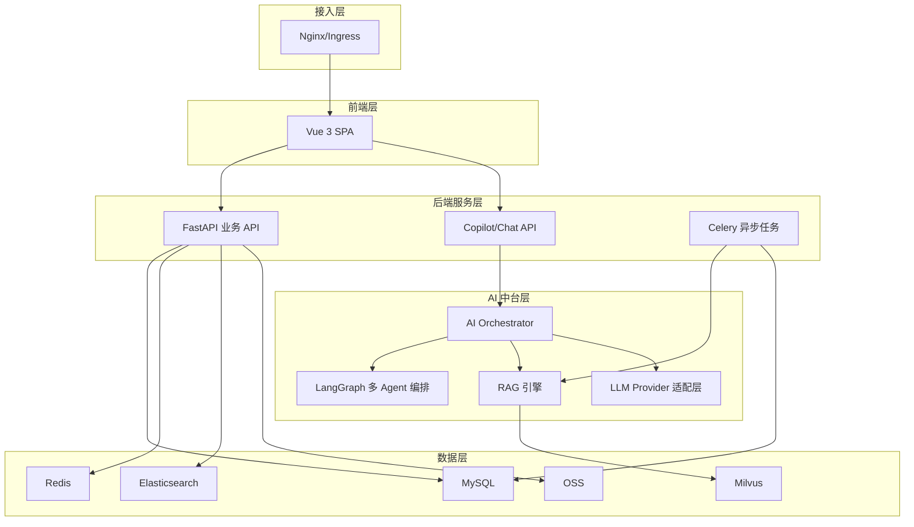
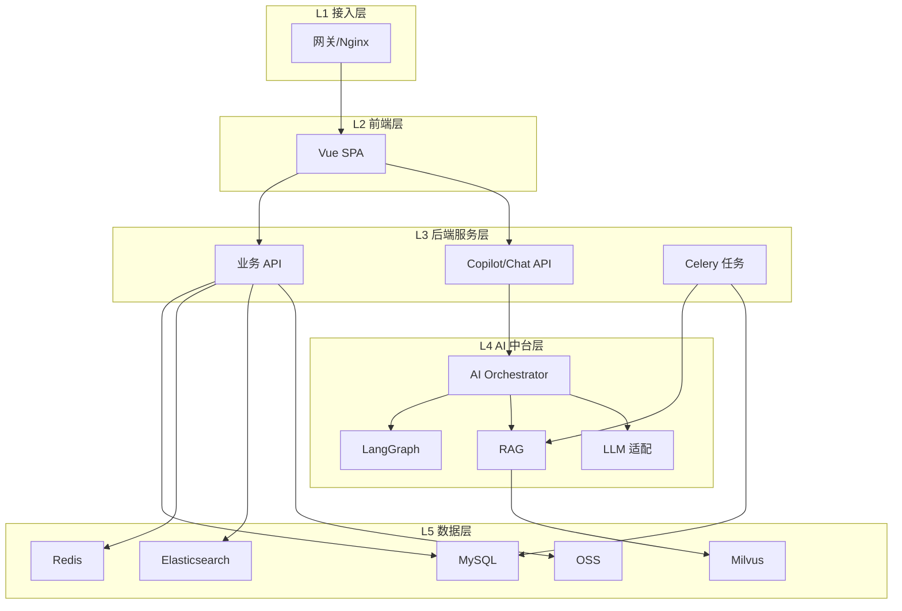
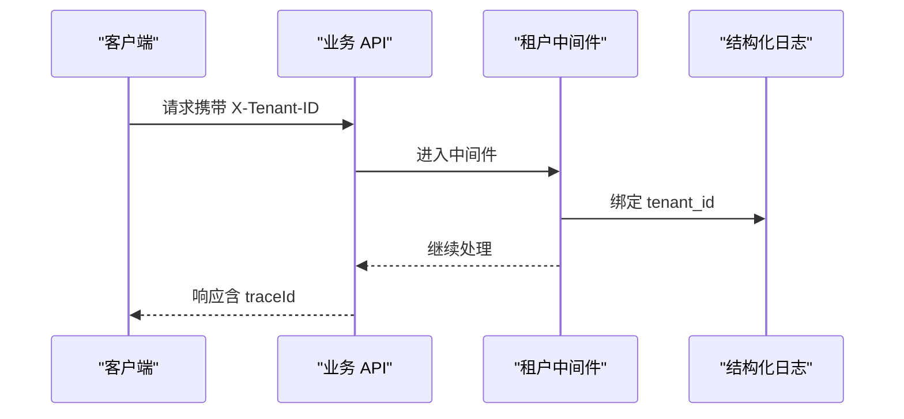
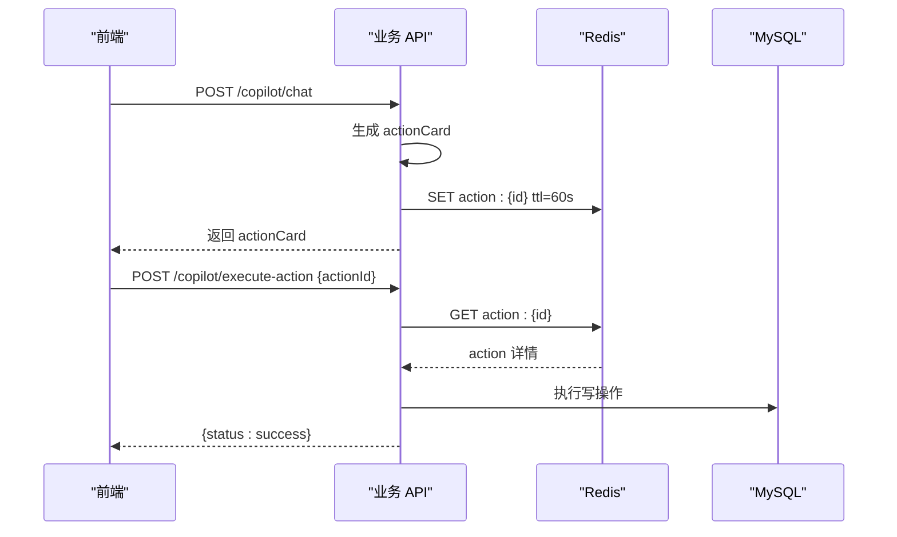
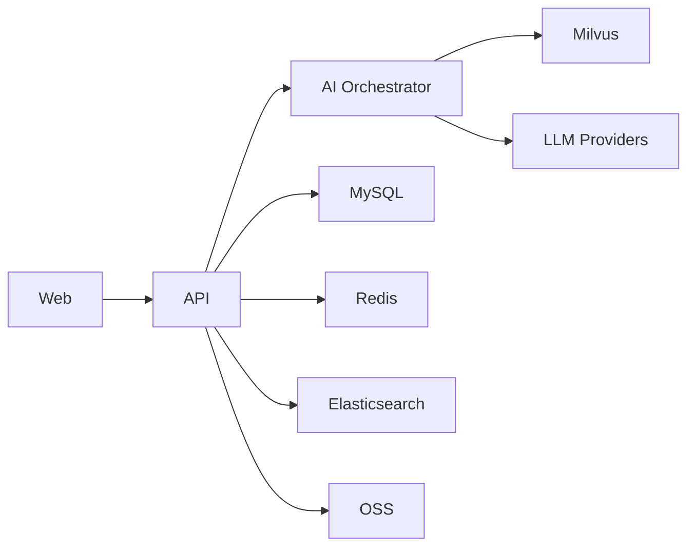

# 系统设计原理

<cite>
**本文引用的文件**   
- [README.md](file://workspace/README.md)
- [FDE工作台技术方案.md](file://docs/FDE工作台技术方案.md)
- [FDE工作台产品需求文档.md](file://docs/FDE工作台产品需求文档.md)
- [api/README.md](file://workspace/api/README.md)
- [ai-orchestrator/README.md](file://workspace/ai-orchestrator/README.md)
- [web/README.md](file://workspace/web/README.md)
- [api/app/main.py](file://workspace/api/app/main.py)
- [ai-orchestrator/app/main.py](file://workspace/ai-orchestrator/app/main.py)
- [api/app/middleware/tenant.py](file://workspace/api/app/middleware/tenant.py)
- [api/app/middleware/logging.py](file://workspace/api/app/middleware/logging.py)
- [api/app/config/settings.py](file://workspace/api/app/config/settings.py)
- [api/app/routers/copilot.py](file://workspace/api/app/routers/copilot.py)
- [api/app/services/action_service.py](file://workspace/api/app/services/action_service.py)
- [ai-orchestrator/app/orchestrator/graph.py](file://workspace/ai-orchestrator/app/orchestrator/graph.py)
- [ai-orchestrator/app/routing/router.py](file://workspace/ai-orchestrator/app/routing/router.py)
- [api/alembic/versions/001_initial.py](file://workspace/api/alembic/versions/001_initial.py)
</cite>

## 目录
1. [引言](#引言)
2. [项目结构](#项目结构)
3. [核心组件](#核心组件)
4. [架构总览](#架构总览)
5. [详细组件分析](#详细组件分析)
6. [依赖分析](#依赖分析)
7. [性能考虑](#性能考虑)
8. [故障排查指南](#故障排查指南)
9. [结论](#结论)
10. [附录](#附录)

## 引言
本文件面向系统架构师与高级开发者，系统化阐述 FDE 工作台项目的系统设计原理与工程实践。围绕多租户架构、微服务拆分、数据一致性、安全性、事件驱动与流式交互、分布式事务与幂等、高可用与弹性、可观测性与审计等主题，结合代码级实现与设计文档，给出可落地的设计决策与权衡。

## 项目结构
FDE 工作台采用 Monorepo 组织，包含前端、后端业务服务、AI 编排服务、共享协议、基础设施与脚本。模块边界清晰，跨模块通信通过 HTTP 与共享 OpenAPI 规范约束，避免直接代码耦合。

**图示来源**
- [FDE工作台技术方案.md](file://docs/FDE工作台技术方案.md)
- [workspace/README.md](file://workspace/README.md)

**章节来源**
- [workspace/README.md](file://workspace/README.md)
- [FDE工作台技术方案.md](file://docs/FDE工作台技术方案.md)

## 核心组件
- 前端 Web 应用：Vue 3 + TypeScript + Vite，提供 Copilot 统一壳与页面级助手，支持 Mock/真实 API 切换与 SSE 流式对话。
- 业务 API 服务：FastAPI + SQLAlchemy + Celery，提供 REST API 与 SSE，承载鉴权、中间件、异常处理、动作二次确认等职责。
- AI 编排服务：FastAPI + LangGraph + Milvus，提供多 Agent 编排、RAG 检索、工具调用、熔断与降级、审计与安全防护。
- 数据与中间件：MySQL/Redis/Elasticsearch/Milvus/OSS，以及结构化日志、链路追踪、多租户上下文绑定等基础设施。

**章节来源**
- [web/README.md](file://workspace/web/README.md)
- [api/README.md](file://workspace/api/README.md)
- [ai-orchestrator/README.md](file://workspace/ai-orchestrator/README.md)

## 架构总览
系统采用“前端层-后端服务层-AI 中台层-数据层”的分层架构，辅以外部系统（Aone/Crm/OSS）与 AI 外部提供商（DashScope/IDEAlab）。跨模块通信通过 HTTP 与共享 OpenAPI 规范，确保边界清晰与演进可控。

**图示来源**
- [FDE工作台技术方案.md](file://docs/FDE工作台技术方案.md)

## 详细组件分析

### 多租户架构设计
- 设计理念：通过请求头注入租户上下文，贯穿日志与审计，实现跨服务的租户隔离与观测。
- 实现要点：
  - 租户中间件从请求头提取租户 ID，并绑定到结构化日志上下文，便于跨服务串联。
  - 业务模型中包含软删除与时间戳混合基类，便于后续扩展租户字段与隔离策略。
- 关键文件：
  - [api/app/middleware/tenant.py](file://workspace/api/app/middleware/tenant.py)
  - [api/app/models/base.py](file://workspace/api/app/models/base.py)

**图示来源**
- [api/app/middleware/tenant.py](file://workspace/api/app/middleware/tenant.py)
- [api/app/middleware/logging.py](file://workspace/api/app/middleware/logging.py)

**章节来源**
- [api/app/middleware/tenant.py](file://workspace/api/app/middleware/tenant.py)
- [api/app/models/base.py](file://workspace/api/app/models/base.py)

### 微服务拆分原则
- 边界与职责：
  - Web：纯前端，不直接访问 AI 编排服务，通过业务 API 转发。
  - API：业务编排、鉴权、动作二次确认、SSE、异步任务编排。
  - AI Orchestrator：AI 编排、RAG、工具调用、安全与审计。
- 跨模块通信：
  - API 与 AI Orchestrator 仅通过 HTTP 通信，禁止 Python 跨服务 import。
  - 共享类型通过 shared-protos 导出 OpenAPI，前后端类型生成与契约一致。
- 关键文件：
  - [workspace/README.md](file://workspace/README.md)
  - [api/README.md](file://workspace/api/README.md)
  - [ai-orchestrator/README.md](file://workspace/ai-orchestrator/README.md)

**章节来源**
- [workspace/README.md](file://workspace/README.md)
- [api/README.md](file://workspace/api/README.md)
- [ai-orchestrator/README.md](file://workspace/ai-orchestrator/README.md)

### 数据一致性保证
- 事务边界与幂等：
  - 动作二次确认（actionId）在 API 层完成：预览、校验、执行、取消均在 API 层完成，AI 层不再持有 actionId 生命周期。
  - 使用 Redis 缓存 actionId，TTL 60s，确保超时即失效，避免悬挂写操作。
- 写操作必预览：
  - 所有写操作（创建/修改/删除/批量）必须先生成 actionCard，用户确认后才执行，降低误操作风险。
- 关键文件：
  - [api/app/services/action_service.py](file://workspace/api/app/services/action_service.py)
  - [ai-orchestrator/app/main.py](file://workspace/ai-orchestrator/app/main.py)

**图示来源**
- [api/app/services/action_service.py](file://workspace/api/app/services/action_service.py)
- [api/app/routers/copilot.py](file://workspace/api/app/routers/copilot.py)

**章节来源**
- [api/app/services/action_service.py](file://workspace/api/app/services/action_service.py)
- [api/app/routers/copilot.py](file://workspace/api/app/routers/copilot.py)

### 安全性设计
- 输入安全与审计：
  - AI 编排服务在 SSE 路由中进行输入安全检查，若检测到不安全输入则拦截并记录审计日志。
  - 审计日志包含输入预览、输出预览、耗时、token 数、错误原因等，支持回溯。
- 认证与授权：
  - API 层使用 JWT 鉴权，路由层依赖依赖注入获取当前用户上下文。
- 关键文件：
  - [ai-orchestrator/app/main.py](file://workspace/ai-orchestrator/app/main.py)
  - [api/app/routers/copilot.py](file://workspace/api/app/routers/copilot.py)

**章节来源**
- [ai-orchestrator/app/main.py](file://workspace/ai-orchestrator/app/main.py)
- [api/app/routers/copilot.py](file://workspace/api/app/routers/copilot.py)

### 事件驱动与流式交互
- SSE 流式对话：
  - 前端通过 @microsoft/fetch-event-source 以 POST + SSE 方式接收流式 token，实现低延迟的 AI 对话体验。
  - 后端 Copilot 路由将 traceId 注入响应头，便于前端与后端联动定位问题。
- LangGraph 编排：
  - AI Orchestrator 使用 LangGraph StateGraph，结合 RAG 检索与工具调用，支持多轮对话与工具执行。
- 关键文件：
  - [web/README.md](file://workspace/web/README.md)
  - [api/app/routers/copilot.py](file://workspace/api/app/routers/copilot.py)
  - [ai-orchestrator/app/orchestrator/graph.py](file://workspace/ai-orchestrator/app/orchestrator/graph.py)

**章节来源**
- [web/README.md](file://workspace/web/README.md)
- [api/app/routers/copilot.py](file://workspace/api/app/routers/copilot.py)
- [ai-orchestrator/app/orchestrator/graph.py](file://workspace/ai-orchestrator/app/orchestrator/graph.py)

### 分布式事务与幂等
- 两阶段写操作：
  - 预览阶段：生成 actionId，写入 Redis，TTL 60s。
  - 执行阶段：校验 actionId、用户与工具匹配，执行写操作并落库，同时记录审计日志。
- 幂等与回放：
  - Redis TTL 保证过期即失效，避免悬挂写操作；审计日志可用于回放与对账。
- 关键文件：
  - [api/app/services/action_service.py](file://workspace/api/app/services/action_service.py)

**章节来源**
- [api/app/services/action_service.py](file://workspace/api/app/services/action_service.py)

### 高可用与弹性
- 多模型路由与熔断：
  - AI Orchestrator 提供多模型路由（DashScope/OpenAI/Mock），内置熔断器，当上游服务不稳定时自动降级至 Mock。
- 健康检查与降级：
  - AI 服务健康检查返回可用 Provider 列表；前端在 AI 服务不可用时可显示离线 mock 内容与友好提示。
- 关键文件：
  - [ai-orchestrator/app/routing/router.py](file://workspace/ai-orchestrator/app/routing/router.py)
  - [ai-orchestrator/app/main.py](file://workspace/ai-orchestrator/app/main.py)

**章节来源**
- [ai-orchestrator/app/routing/router.py](file://workspace/ai-orchestrator/app/routing/router.py)
- [ai-orchestrator/app/main.py](file://workspace/ai-orchestrator/app/main.py)

### 可观测性与审计
- 结构化日志与链路追踪：
  - HTTP 请求/响应日志、TraceMiddleware、Tenant 中间件将 traceId/tenant_id 注入日志，便于问题定位。
- 审计日志：
  - AI 写操作审计包含输入/输出预览、耗时、token 数、错误原因等，支持回溯与合规。
- 关键文件：
  - [api/app/middleware/logging.py](file://workspace/api/app/middleware/logging.py)
  - [ai-orchestrator/app/main.py](file://workspace/ai-orchestrator/app/main.py)

**章节来源**
- [api/app/middleware/logging.py](file://workspace/api/app/middleware/logging.py)
- [ai-orchestrator/app/main.py](file://workspace/ai-orchestrator/app/main.py)

### 数据模型与一致性基线
- 初始 DDL 覆盖用户、任务、项目、客户、文件、学习路径、AI 会话与消息等核心实体，具备软删除与时间戳基类，满足后续扩展。
- 关键文件：
  - [api/alembic/versions/001_initial.py](file://workspace/api/alembic/versions/001_initial.py)

**章节来源**
- [api/alembic/versions/001_initial.py](file://workspace/api/alembic/versions/001_initial.py)

## 依赖分析
- 模块间依赖：
  - Web → API（HTTPS REST + SSE）
  - API → AI Orchestrator（HTTP）
  - API → MySQL/Redis/ES/OSS
  - AI Orchestrator → Milvus + LLM Providers
- 依赖可视化：

**图示来源**
- [workspace/README.md](file://workspace/README.md)
- [api/README.md](file://workspace/api/README.md)
- [ai-orchestrator/README.md](file://workspace/ai-orchestrator/README.md)

**章节来源**
- [workspace/README.md](file://workspace/README.md)
- [api/README.md](file://workspace/api/README.md)
- [ai-orchestrator/README.md](file://workspace/ai-orchestrator/README.md)

## 性能考虑
- 前端性能：
  - 路由懒加载、Vite 代码分割、CDN 加速；Copilot 切换与 @ 引用响应时间目标明确。
- 后端性能：
  - Redis 缓存热点数据；SSE 流式传输；Celery 异步任务处理耗时操作（RAG 索引、周报生成）。
- AI 性能：
  - LangGraph 编排 + RAG 检索 + 多模型路由 + 熔断降级，保障首 token 与稳定性。
- 关键文件：
  - [web/README.md](file://workspace/web/README.md)
  - [api/README.md](file://workspace/api/README.md)
  - [ai-orchestrator/README.md](file://workspace/ai-orchestrator/README.md)

**章节来源**
- [web/README.md](file://workspace/web/README.md)
- [api/README.md](file://workspace/api/README.md)
- [ai-orchestrator/README.md](file://workspace/ai-orchestrator/README.md)

## 故障排查指南
- 常见问题定位：
  - SSE 连接中断：检查后端 event_stream 是否抛出异常，确认 traceId 与心跳头。
  - AI 写操作失败：检查 actionId 是否存在、是否过期、用户与工具是否匹配。
  - LLM Provider 不可用：查看路由健康状态，确认熔断器状态与降级行为。
- 关键文件：
  - [api/app/routers/copilot.py](file://workspace/api/app/routers/copilot.py)
  - [api/app/services/action_service.py](file://workspace/api/app/services/action_service.py)
  - [ai-orchestrator/app/routing/router.py](file://workspace/ai-orchestrator/app/routing/router.py)

**章节来源**
- [api/app/routers/copilot.py](file://workspace/api/app/routers/copilot.py)
- [api/app/services/action_service.py](file://workspace/api/app/services/action_service.py)
- [ai-orchestrator/app/routing/router.py](file://workspace/ai-orchestrator/app/routing/router.py)

## 结论
FDE 工作台通过清晰的模块边界、严格的跨模块契约、事件驱动与流式交互、动作二次确认与审计、多模型路由与熔断降级等设计，实现了在复杂业务场景下的可扩展性、可维护性、性能与可靠性。这些设计原则与实现细节为系统在高并发与多租户环境下稳定运行提供了坚实基础。

## 附录
- 产品需求与技术方案：
  - [FDE工作台产品需求文档.md](file://docs/FDE工作台产品需求文档.md)
  - [FDE工作台技术方案.md](file://docs/FDE工作台技术方案.md)
- 模块启动与依赖：
  - [workspace/README.md](file://workspace/README.md)
  - [api/README.md](file://workspace/api/README.md)
  - [ai-orchestrator/README.md](file://workspace/ai-orchestrator/README.md)
  - [web/README.md](file://workspace/web/README.md)