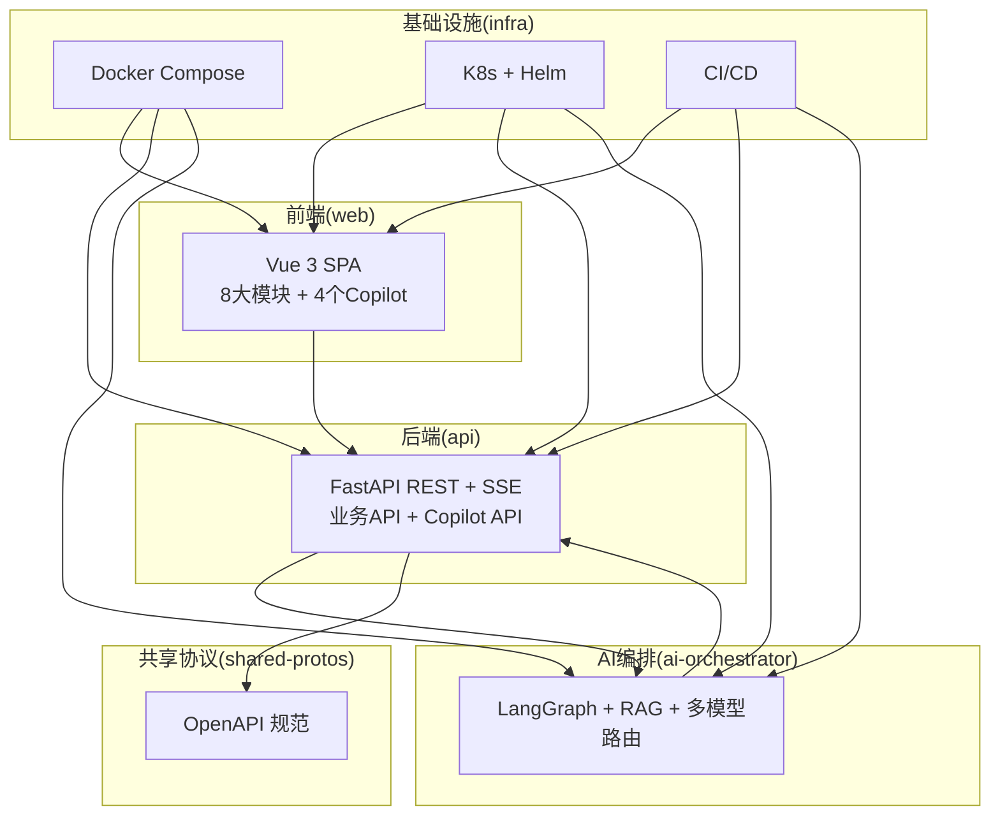
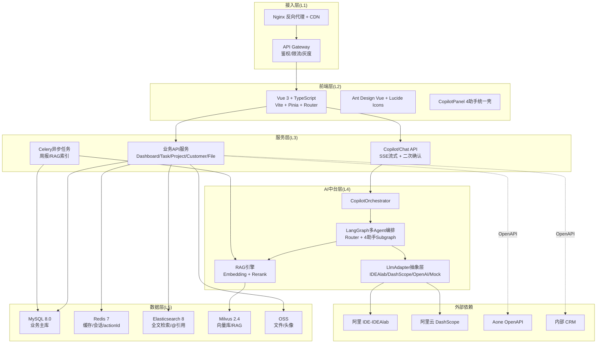
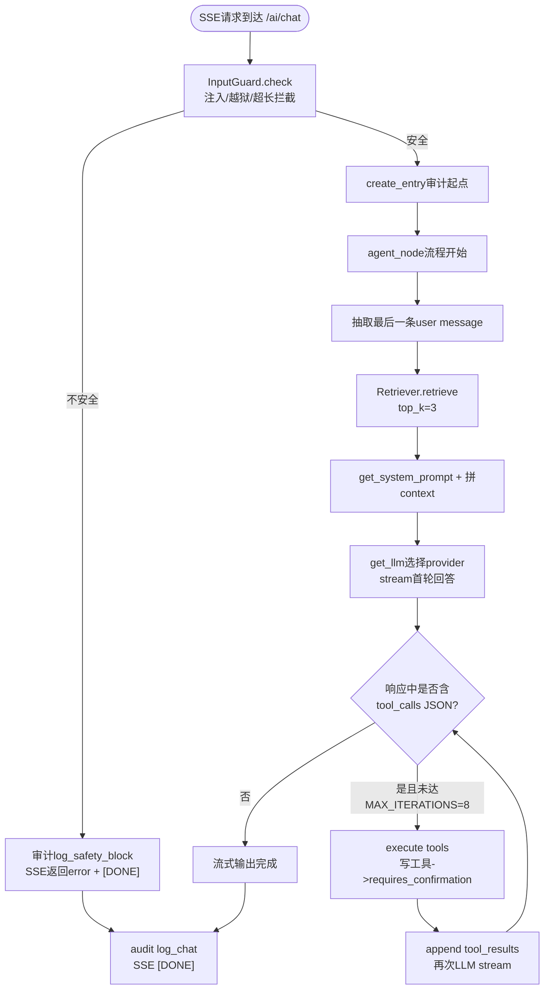
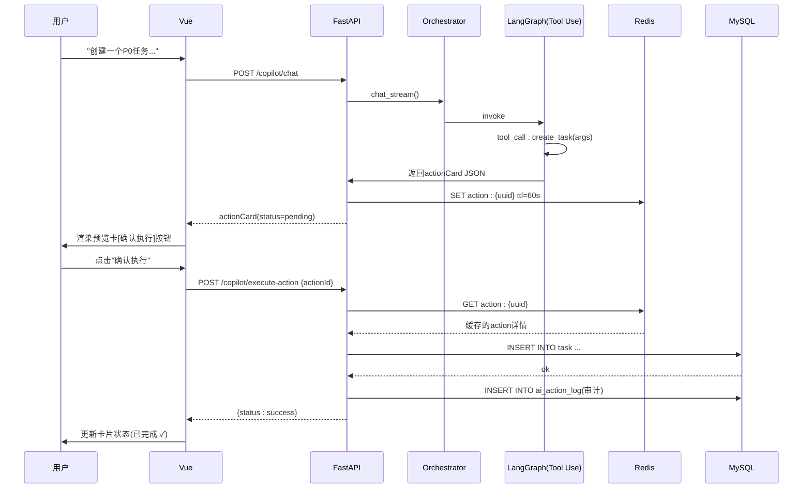
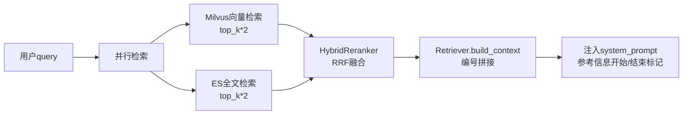
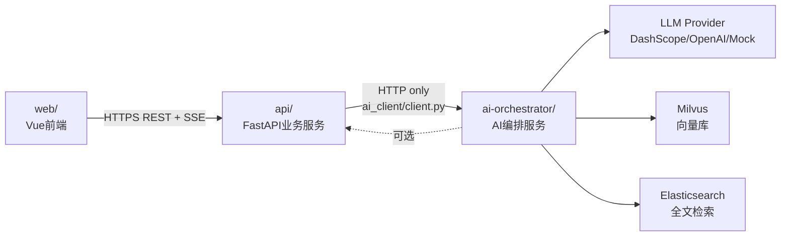

# 项目介绍与背景

<cite>
**本文档引用的文件**
- [FDE工作台产品需求文档.md](file://docs/FDE工作台产品需求文档.md)
- [FDE工作台技术方案.md](file://docs/FDE工作台技术方案.md)
- [开发进度.md](file://docs/开发进度.md)
- [03-AI编排服务详细设计.md](file://docs/detail-design/03-AI编排服务详细设计.md)
- [03-AI接入详细设计.md](file://docs/detail-design/03-AI接入详细设计.md)
- [CLAUDE.md](file://CLAUDE.md)
- [.github/workflows/ci.yml](file://.github/workflows/ci.yml)
- [ai-orchestrator/README.md](file://workspace/ai-orchestrator/README.md)
- [api/README.md](file://workspace/api/README.md)
- [web/README.md](file://workspace/web/README.md)
</cite>

## 目录
1. [引言](#引言)
2. [项目结构](#项目结构)
3. [核心组件](#核心组件)
4. [架构总览](#架构总览)
5. [详细组件分析](#详细组件分析)
6. [依赖分析](#依赖分析)
7. [性能考虑](#性能考虑)
8. [故障排查指南](#故障排查指南)
9. [结论](#结论)
10. [附录](#附录)

## 引言
FDE工作台是一个面向“前线部署工程师”（Forward Deployed Engineer，简称FDE）的AI原生项目管理平台。它旨在解决传统交付场景中信息分散、能力依赖个人经验、AI工具孤岛化、写操作风险高等痛点，通过“一站式工作中枢 + 嵌入式Copilot + 写操作必预览”的方式，帮助FDE团队实现“交付更可控、更高效、更专业”。

- **一句话定位**：面向FDE的AI原生工作台，让交付更可控、更高效、更专业。
- **核心价值主张**：效率提升（任务创建时长缩短50%）、智能增强（4个页面级Copilot覆盖核心场景）、成长加速（新人Onboard周期缩短30%）。
- **目标用户**：FDE交付工程师（P5/P6/P7），日均处理5-10个任务、并行管理2-4个项目、每周对接3+客户，高频使用（日均4小时+）。

## 项目结构
FDE工作台采用monorepo组织方式，将前端、后端、AI编排服务、基础设施与脚本统一管理，确保跨服务的一致性与可演进性。核心模块包括：
- 前端（web）：Vue 3 + TypeScript，提供8大功能模块与4个页面级Copilot。
- 后端（api）：Python FastAPI，提供REST API与SSE流式对话，承载业务编排与数据访问。
- AI编排服务（ai-orchestrator）：独立部署的LangGraph + RAG + 多模型路由，负责Copilot编排与工具调用。
- 基础设施（infra）：Docker/K8s/Helm/CI/监控配置，支撑全链路部署与可观测。
- 共享协议（shared-protos）：OpenAPI规范，确保前后端类型一致性。

**图表来源**
- [CLAUDE.md:13-21](file://CLAUDE.md#L13-L21)
- [docs/FDE工作台技术方案.md:45-120](file://docs/FDE工作台技术方案.md#L45-L120)

**章节来源**
- [CLAUDE.md:13-21](file://CLAUDE.md#L13-L21)
- [docs/FDE工作台技术方案.md:45-120](file://docs/FDE工作台技术方案.md#L45-L120)

## 核心组件
- **4个页面级Copilot（嵌入式AI助手）**
  - T助手（任务）：任务创建/查询/批量调整/工作量分析
  - P助手（项目）：风险分析/周报/成员调整/里程碑
  - C助手（教练）：Next Step/案例推荐/最佳实践SOP/专家问答
  - F助手（文件）：智能搜索/总结/对比/批量归档
- **全局AI对话中心**：三栏布局（历史/对话/上下文），支持@引用业务对象与三种对话模式（智能/创意/严谨）。
- **写操作必预览机制**：所有写操作（创建/修改/删除/批量）必须先生成actionCard，经用户确认后才执行，确保可审计、可回滚。
- **RAG检索与混合重排**：向量检索（Milvus）+ 全文检索（ES）+ RRF融合重排，支持ACL过滤与上下文注入。
- **多模型路由与熔断保护**：DashScope/OpenAI/Mock三路模型，自动降级与熔断，保障稳定性与SLA。

**章节来源**
- [docs/FDE工作台产品需求文档.md:126-140](file://docs/FDE工作台产品需求文档.md#L126-L140)
- [docs/FDE工作台技术方案.md:1015-1133](file://docs/FDE工作台技术方案.md#L1015-L1133)
- [docs/detail-design/03-AI编排服务详细设计.md:451-480](file://docs/detail-design/03-AI编排服务详细设计.md#L451-L480)

## 架构总览
FDE工作台采用“前端-后端-AI编排-数据层”的分层架构，结合“服务独立部署 + 代码同仓”的组织方式，确保可演进与可维护性。核心数据流包括：
- 页面加载 → 业务API → 数据库
- Copilot对话（SSE流式）→ AI编排 → LLM/工具/RAG
- 写操作（actionCard二次确认）→ Redis缓存 → 业务服务执行
- 文件上传 → Celery异步任务 → RAG索引（Milvus/ES）

**图表来源**
- [docs/FDE工作台技术方案.md:45-120](file://docs/FDE工作台技术方案.md#L45-L120)

**章节来源**
- [docs/FDE工作台技术方案.md:45-120](file://docs/FDE工作台技术方案.md#L45-L120)

## 详细组件分析

### Copilot编排与工具系统
- **LangGraph工作流**：单节点agent_node + 内部分支，支持RAG检索、工具调用、写操作二次确认、断开检测与审计日志。
- **工具系统**：每个助手拥有独立工具注册表，写工具自动走二次确认（requires_confirmation），由api层ActionService负责执行。
- **Prompt管理**：Jinja2模板按助手与模式（smart/creative/rigorous）渲染系统Prompt。
- **多模型路由**：DashScope/OpenAI/Mock三路Provider，自动降级与熔断，保障可用性。

**图表来源**
- [docs/detail-design/03-AI编排服务详细设计.md:139-159](file://docs/detail-design/03-AI编排服务详细设计.md#L139-L159)

**章节来源**
- [docs/detail-design/03-AI编排服务详细设计.md:133-189](file://docs/detail-design/03-AI编排服务详细设计.md#L133-L189)
- [docs/detail-design/03-AI编排服务详细设计.md:413-449](file://docs/detail-design/03-AI编排服务详细设计.md#L413-L449)

### 写操作二次确认机制
- **actionId生命周期**：LLM返回写工具调用标记 → 生成actionId（Redis TTL=60s）→ 前端渲染actionCard → 用户确认 → api层ActionService执行 → 审计日志记录。
- **错误处理**：未找到、过期、用户不匹配、工具不匹配、取消等场景均有明确处理与回退。

**图表来源**
- [docs/detail-design/03-AI编排服务详细设计.md:458-479](file://docs/detail-design/03-AI编排服务详细设计.md#L458-L479)

**章节来源**
- [docs/detail-design/03-AI编排服务详细设计.md:451-480](file://docs/detail-design/03-AI编排服务详细设计.md#L451-L480)

### RAG检索与混合重排
- **检索流程**：向量检索（Milvus）+ 全文检索（ES）并行，RRF融合重排，支持ACL过滤与上下文注入。
- **索引与删除**：文件上传触发Celery任务，ai-orchestrator通过HTTP端点接收索引/删除指令，双写Milvus与ES。

**图表来源**
- [docs/detail-design/03-AI编排服务详细设计.md:359-368](file://docs/detail-design/03-AI编排服务详细设计.md#L359-L368)

**章节来源**
- [docs/detail-design/03-AI编排服务详细设计.md:355-410](file://docs/detail-design/03-AI编排服务详细设计.md#L355-L410)

### 前后端交互与类型同步
- **类型生成**：后端导出OpenAPI至shared-protos，前端通过脚本生成TypeScript类型，确保API契约一致。
- **Mock与真实API切换**：前端支持mock/real/hybrid三种模式，便于联调与测试。

**章节来源**
- [docs/开发进度.md:42-46](file://docs/开发进度.md#L42-L46)
- [docs/开发进度.md:509-511](file://docs/开发进度.md#L509-L511)
- [web/README.md:28-33](file://workspace/web/README.md#L28-L33)

## 依赖分析
- **跨服务通信约束**：前端仅通过后端访问AI编排服务，AI编排服务仅通过HTTP调用后端，避免直接耦合。
- **共享协议**：OpenAPI规范统一前后端契约，减少跨模块直接导入。
- **CI/CD流水线**：自动化测试与镜像构建，保障质量与交付效率。

**图表来源**
- [docs/detail-design/03-AI编排服务详细设计.md:18-36](file://docs/detail-design/03-AI编排服务详细设计.md#L18-L36)

**章节来源**
- [docs/detail-design/03-AI编排服务详细设计.md:18-36](file://docs/detail-design/03-AI编排服务详细设计.md#L18-L36)
- [.github/workflows/ci.yml:1-106](file://.github/workflows/ci.yml#L1-L106)

## 性能考虑
- **前端性能**：路由懒加载、keep-alive缓存、Pinia状态保持、SSE首token优化（<1s），Copilot切换<200ms。
- **后端性能**：Redis缓存（actionId/会话/限流）、MySQL/ES/Milvus索引优化、Celery异步任务。
- **AI编排性能**：并行检索（asyncio.gather）、超时降级、熔断保护、审计日志聚合指标。

**章节来源**
- [docs/FDE工作台技术方案.md:543-552](file://docs/FDE工作台技术方案.md#L543-L552)
- [docs/detail-design/03-AI编排服务详细设计.md:370-374](file://docs/detail-design/03-AI编排服务详细设计.md#L370-L374)

## 故障排查指南
- **输入/输出安全**：InputGuard/OutputGuard拦截不安全输入与敏感数据，命中后审计日志记录并返回SSE错误帧。
- **多模型路由**：DashScope/OpenAI熔断状态可通过/health端点查看，自动切换到Mock兜底。
- **写操作审计**：actionId生命周期与执行结果均记录审计日志，支持回溯与风控运营查看。
- **CI/CD质量门禁**：PR需通过后端/前端/AI编排测试与类型检查，确保代码质量。

**章节来源**
- [docs/detail-design/03-AI编排服务详细设计.md:276-313](file://docs/detail-design/03-AI编排服务详细设计.md#L276-L313)
- [docs/detail-design/03-AI编排服务详细设计.md:552-583](file://docs/detail-design/03-AI编排服务详细设计.md#L552-L583)
- [.github/workflows/ci.yml:1-106](file://.github/workflows/ci.yml#L1-L106)

## 结论
FDE工作台通过“AI原生 + 嵌入式Copilot + 写操作必预览 + RAG检索”的技术理念，解决了FDE团队在信息分散、经验依赖、工具孤岛与写操作风险等方面的痛点，实现了效率、智能与成长的全面提升。项目采用清晰的分层架构与严格的跨服务约束，结合完善的CI/CD与可观测性设计，为大规模交付场景提供了可演进、可维护、可审计的AI驱动项目管理平台。

## 附录
- **术语对齐**：FDE（Forward Deployed Engineer）、Copilot（AI助手）、actionCard（写操作预览卡）、RAG（检索增强生成）、SOP（标准操作流程）。
- **里程碑与验收指标**：M1-M4里程碑与FDE团队DAU占比、AI助手日均交互次数、任务平均创建时长、新人Onboard周期、周报撰写时长等目标。
- **开发进度**：M1-M5核心代码完成、M6链路打通与gap修复、M7联调与质量收口、M8深化业务模块详细设计、M9长期优化与性能。

**章节来源**
- [docs/FDE工作台技术方案.md:2129-2145](file://docs/FDE工作台技术方案.md#L2129-L2145)
- [docs/FDE工作台产品需求文档.md:406-424](file://docs/FDE工作台产品需求文档.md#L406-L424)
- [docs/开发进度.md:8-17](file://docs/开发进度.md#L8-L17)