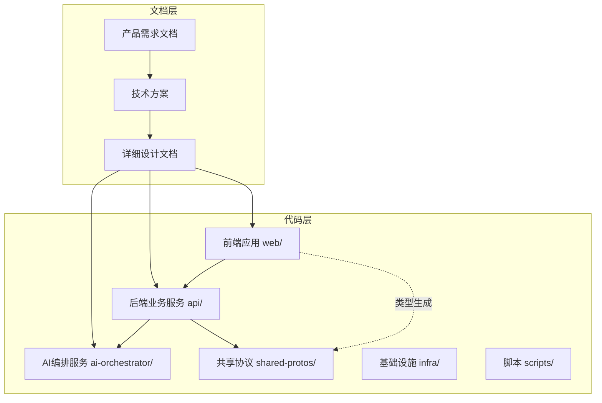
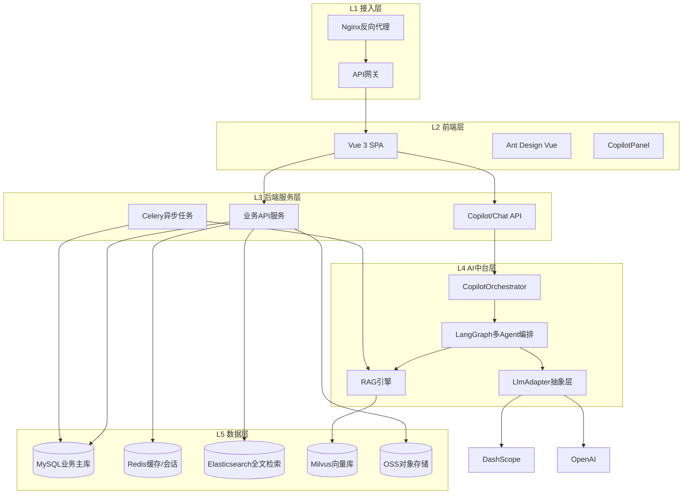
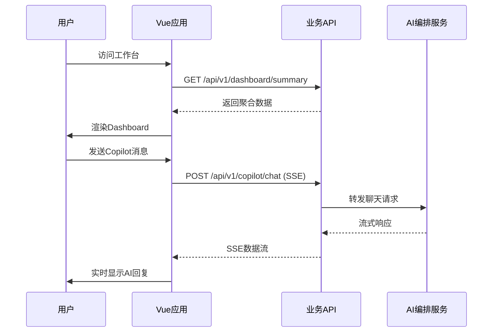
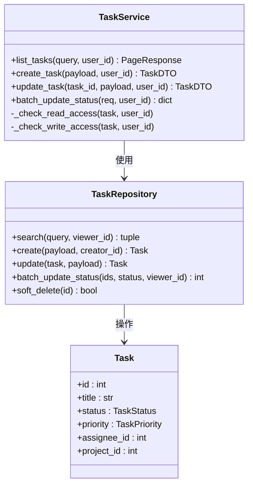
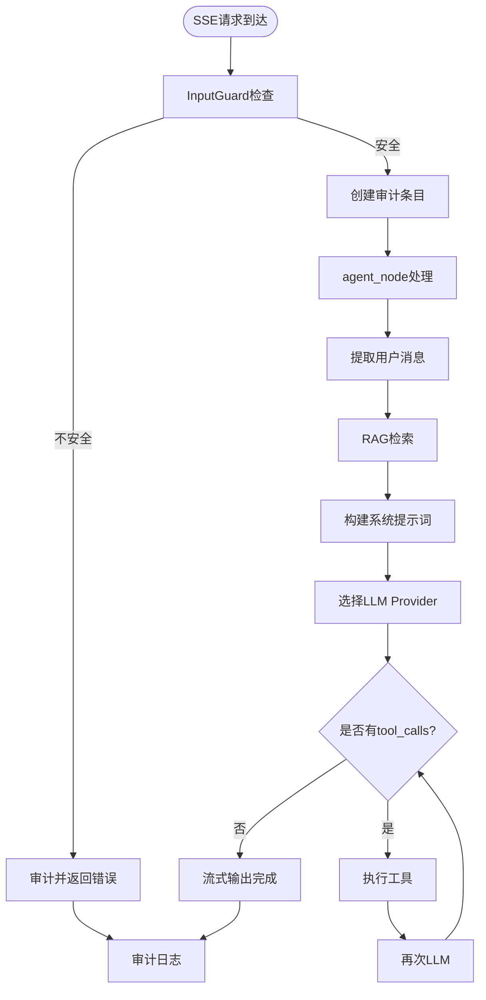
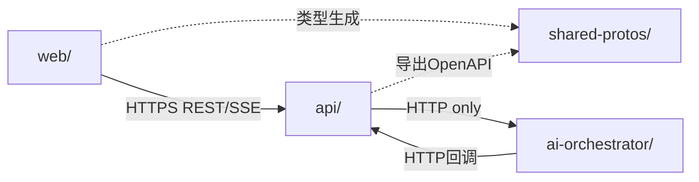

# 项目概述

<cite>
**本文档引用的文件**
- [FDE工作台产品需求文档.md](file://docs/FDE工作台产品需求文档.md)
- [FDE工作台技术方案.md](file://docs/FDE工作台技术方案.md)
- [00-目录结构设计.md](file://docs/detail-design/00-目录结构设计.md)
- [01-前端详细设计.md](file://docs/detail-design/01-前端详细设计.md)
- [02-后端详细设计.md](file://docs/detail-design/02-后端详细设计.md)
- [03-AI编排服务详细设计.md](file://docs/detail-design/03-AI编排服务详细设计.md)
- [README.md](file://workspace/README.md)
- [api/README.md](file://workspace/api/README.md)
- [web/README.md](file://workspace/web/README.md)
- [ai-orchestrator/README.md](file://workspace/ai-orchestrator/README.md)
- [workspace/api/app/main.py](file://workspace/api/app/main.py)
- [workspace/web/src/main.ts](file://workspace/web/src/main.ts)
- [workspace/ai-orchestrator/app/main.py](file://workspace/ai-orchestrator/app/main.py)
</cite>

## 目录
1. [项目简介](#项目简介)
2. [项目结构](#项目结构)
3. [核心组件](#核心组件)
4. [架构总览](#架构总览)
5. [详细组件分析](#详细组件分析)
6. [依赖关系分析](#依赖关系分析)
7. [性能考量](#性能考量)
8. [故障排查指南](#故障排查指南)
9. [结论](#结论)
10. [附录](#附录)

## 项目简介

FDE工作台是一个AI驱动的项目管理平台，面向前线部署工程师（FDE，Forward Deployed Engineer），旨在提供“AI原生”的一站式工作中枢，解决信息分散、能力依赖个人经验、AI工具孤岛以及写操作风险高等核心痛点。

### 产品定位与价值主张

- **定位**：面向FDE的AI原生工作台，让交付更可控、更高效、更专业
- **核心价值**：
  - 效率：任务平均创建时长缩短50%，周报/风险报告自动生成
  - 智能：4个嵌入式AI Copilot覆盖每个核心工作场景
  - 成长：FDE新人Onboard周期缩短30%

### 核心用户与高频场景

- **核心用户**：FDE交付工程师（P5/P6/P7级别）
- **高频使用场景**：晨间一站式查看、任务跟踪与调整、客户沟通前方案准备、项目周报撰写、案例学习与能力提升

### 核心功能架构

系统包含8大功能模块与4个页面级AI Copilot，以及全局AI对话中心：

- **8大功能模块**：工作台、任务中心、项目空间、客户空间、FDE教练、文件中心、AI对话、系统设置
- **4个页面级Copilot**：T任务助手（蓝）、P项目助手（紫）、C教练助手（青）、F文件助手（橙）
- **全局AI对话中心**：三栏布局，支持@引用业务对象

**章节来源**
- [FDE工作台产品需求文档.md:14-140](file://docs/FDE工作台产品需求文档.md#L14-L140)
- [FDE工作台产品需求文档.md:113-140](file://docs/FDE工作台产品需求文档.md#L113-L140)

## 项目结构

FDE工作台采用monorepo架构，统一管理前端、后端、AI编排、基础设施与脚本。项目结构清晰，职责分明，便于跨服务协作与演进。



**图表来源**
- [00-目录结构设计.md:53-86](file://docs/detail-design/00-目录结构设计.md#L53-L86)
- [README.md:7-17](file://workspace/README.md#L7-L17)

### 模块职责划分

- **web/**：Vue 3 + TypeScript前端SPA，负责用户界面与交互
- **api/**：Python + FastAPI后端服务，提供REST API与业务逻辑
- **ai-orchestrator/**：独立的AI编排服务，提供LangGraph多Agent编排与RAG能力
- **shared-protos/**：跨服务共享协议，包含OpenAPI规范与类型定义
- **infra/**：基础设施配置，包含Docker Compose与Kubernetes部署文件
- **scripts/**：开发与运维脚本，包括一键启动、数据导入等

**章节来源**
- [README.md:7-17](file://workspace/README.md#L7-L17)
- [00-目录结构设计.md:76-86](file://docs/detail-design/00-目录结构设计.md#L76-L86)

## 核心组件

### 前端组件体系

前端采用Vue 3 + TypeScript技术栈，构建了完整的组件体系：

- **应用骨架**：AppLayout三栏布局（Header + Nav + Main + Copilot）
- **Copilot系统**：统一的CopilotPanel壳组件，支持4个助手的自动切换
- **业务组件**：任务看板、项目详情、文件管理、教练学习等专用组件
- **状态管理**：Pinia stores管理用户、导航、Copilot会话等状态

### 后端服务架构

后端基于FastAPI构建，采用Clean Architecture分层：

- **路由层**：按业务模块划分的REST API
- **服务层**：业务编排与事务边界控制
- **仓储层**：数据访问抽象与SQLAlchemy集成
- **中间件**：认证、链路追踪、日志等横切关注点

### AI编排服务

AI编排服务独立部署，提供：

- **LangGraph多Agent编排**：Router + 5个子Agent（T/P/C/F/Chat）
- **RAG引擎**：混合检索（向量+全文）+ 重排
- **工具系统**：19个Function Calling工具，支持写操作二次确认
- **安全闸门**：输入/输出双重安全防护

**章节来源**
- [01-前端详细设计.md:313-550](file://docs/detail-design/01-frontend详细设计.md#L313-L550)
- [02-后端详细设计.md:504-607](file://docs/detail-design/02-后端详细设计.md#L504-L607)
- [03-AI编排服务详细设计.md:96-131](file://docs/detail-design/03-AI编排服务详细设计.md#L96-L131)

## 架构总览

FDE工作台采用五层架构设计，确保系统的可扩展性与可维护性。



**图表来源**
- [FDE工作台技术方案.md:45-121](file://docs/FDE工作台技术方案.md#L45-L121)

### 核心数据流

系统包含四条关键数据流：

1. **页面加载数据流**：前端→业务API→数据库缓存
2. **Copilot对话流**：前端SSE→业务API→AI编排→LLM
3. **AI写操作流**：前端→业务API→Redis缓存→数据库审计
4. **文件RAG索引流**：文件上传→Celery任务→RAG索引→向量库

**章节来源**
- [FDE工作台技术方案.md:158-283](file://docs/FDE工作台技术方案.md#L158-L283)

## 详细组件分析

### 前端应用架构

前端采用模块化设计，支持Mock与真实API切换：



**图表来源**
- [FDE工作台技术方案.md:186-214](file://docs/FDE工作台技术方案.md#L186-L214)

前端核心特性：
- **Mock系统**：开发期支持本地Mock数据，便于快速原型验证
- **SSE流式通信**：支持AI回复的实时流式显示
- **Copilot集成**：4个助手自动切换，上下文感知
- **主题系统**：支持明暗主题切换

**章节来源**
- [01-前端详细设计.md:17-82](file://docs/detail-design/01-前端详细设计.md#L17-L82)
- [01-前端详细设计.md:209-311](file://docs/detail-design/01-前端详细设计.md#L209-L311)

### 后端服务设计

后端采用Clean Architecture，确保业务逻辑与基础设施分离：



**图表来源**
- [02-后端详细设计.md:513-592](file://docs/detail-design/02-后端详细设计.md#L513-L592)

后端关键特性：
- **事务边界**：Service方法即事务边界，确保数据一致性
- **权限控制**：细粒度的读写权限检查
- **异常处理**：统一的业务异常与全局异常处理
- **中间件体系**：认证、链路追踪、日志等横切关注点

**章节来源**
- [02-后端详细设计.md:504-607](file://docs/detail-design/02-后端详细设计.md#L504-L607)

### AI编排服务架构

AI编排服务是系统的核心智能中枢：



**图表来源**
- [03-AI编排服务详细设计.md:133-189](file://docs/detail-design/03-AI编排服务详细设计.md#L133-L189)

AI服务关键特性：
- **多Agent编排**：统一的agent_node + 内部分支策略
- **混合RAG**：向量+全文检索并行，RRF重排
- **安全防护**：输入/输出双重安全闸门
- **熔断保护**：多模型路由与熔断器
- **审计日志**：完整的AI操作审计

**章节来源**
- [03-AI编排服务详细设计.md:18-46](file://docs/detail-design/03-AI编排服务详细设计.md#L18-L46)
- [03-AI编排服务详细设计.md:230-274](file://docs/detail-design/03-AI编排服务详细设计.md#L230-L274)

## 依赖关系分析

系统采用严格的跨模块边界设计，确保服务间的松耦合：



**图表来源**
- [00-目录结构设计.md:682-709](file://docs/detail-design/00-目录结构设计.md#L682-L709)

### 技术选型考量

- **前端**：Vue 3 + TypeScript + Vite，提供优秀的开发体验与性能
- **后端**：FastAPI + SQLAlchemy，充分利用Python异步生态
- **AI编排**：LangGraph + LangChain，支持复杂的多Agent协作
- **数据存储**：MySQL + Redis + Milvus + Elasticsearch，满足不同场景需求
- **部署**：Docker + Kubernetes，支持云原生部署

**章节来源**
- [FDE工作台技术方案.md:16-21](file://docs/FDE工作台技术方案.md#L16-L21)
- [00-目录结构设计.md:42-50](file://docs/detail-design/00-目录结构设计.md#L42-L50)

## 性能考量

系统在性能方面有明确的目标与实现策略：

### 性能指标目标

- **首屏加载**：< 1.5秒（不含AI响应）
- **页面切换**：< 200ms
- **Copilot切换**：< 200ms
- **@引用响应**：< 100ms
- **AI流式响应首token**：< 1秒

### 性能优化措施

- **前端优化**：路由懒加载、代码分割、CDN加速、keep-alive缓存
- **后端优化**：连接池、缓存策略、异步处理、数据库索引优化
- **AI优化**：流式响应、模型路由、熔断保护、审计日志异步写入

**章节来源**
- [FDE工作台产品需求文档.md:367-385](file://docs/FDE工作台产品需求文档.md#L367-L385)
- [01-前端详细设计.md:543-552](file://docs/detail-design/01-前端详细设计.md#L543-L552)

## 故障排查指南

### 常见问题与解决方案

#### 1. 启动问题

**问题**：服务无法启动
**排查步骤**：
1. 检查依赖服务（MySQL、Redis、ES、Milvus）是否正常运行
2. 验证环境变量配置是否正确
3. 查看日志文件定位具体错误

#### 2. Copilot对话问题

**问题**：Copilot无响应或响应缓慢
**排查步骤**：
1. 检查AI编排服务健康状态
2. 验证LLM Provider配置与API Key
3. 查看审计日志中的错误信息

#### 3. 写操作失败

**问题**：AI写操作无法执行
**排查步骤**：
1. 检查actionId是否过期（默认60秒）
2. 验证用户权限与业务规则
3. 查看ActionService的执行日志

### 监控与诊断

系统提供了完善的监控与诊断能力：

- **健康检查**：各服务提供/health端点
- **审计日志**：完整的AI操作审计
- **链路追踪**：X-Trace-Id贯穿整个请求链路
- **性能指标**：Prometheus指标导出（规划中）

**章节来源**
- [03-AI编排服务详细设计.md:552-584](file://docs/detail-design/03-AI编排服务详细设计.md#L552-L584)

## 结论

FDE工作台项目通过AI原生的设计理念，为前线部署工程师提供了一套完整的智能化工作解决方案。项目采用现代化的技术栈与架构设计，在保证系统稳定性的同时，充分发挥了AI技术在项目管理领域的潜力。

### 项目优势

1. **架构清晰**：五层架构设计，职责分离明确
2. **技术先进**：采用Vue 3、FastAPI、LangGraph等前沿技术
3. **AI深度集成**：多Agent编排、RAG检索、工具系统一体化
4. **用户体验优秀**：Copilot自动切换、流式响应、主题系统
5. **可扩展性强**：monorepo架构，支持持续演进

### 发展前景

项目目前处于M1原型阶段，后续将逐步完善AI对话中心、客户空间、文件中心等功能模块，最终实现完整的AI原生项目管理平台。

## 附录

### 快速开始

```bash
# 一键启动全部服务
cd workspace/scripts/dev
./start-all.sh

# 访问地址
前端：http://localhost:5173
后端：http://localhost:8080
AI服务：http://localhost:8090
```

### 开发指南

- **前端开发**：npm run dev（默认Mock模式）
- **后端开发**：poetry run uvicorn app.main:app --reload
- **AI开发**：poetry run uvicorn app.main:app --reload --port 8090
- **数据库初始化**：poetry run alembic upgrade head

**章节来源**
- [README.md:20-42](file://workspace/README.md#L20-L42)
- [api/README.md:7-18](file://workspace/api/README.md#L7-L18)
- [web/README.md:7-17](file://workspace/web/README.md#L7-L17)
- [ai-orchestrator/README.md:14-19](file://workspace/ai-orchestrator/README.md#L14-L19)