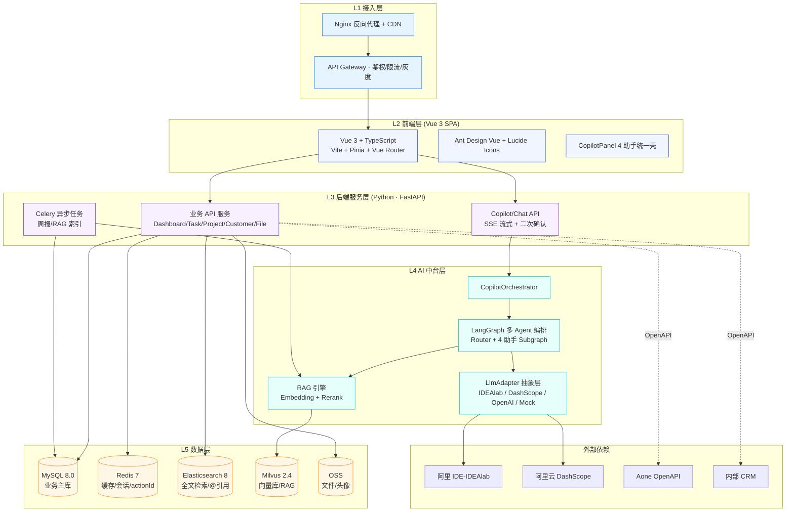
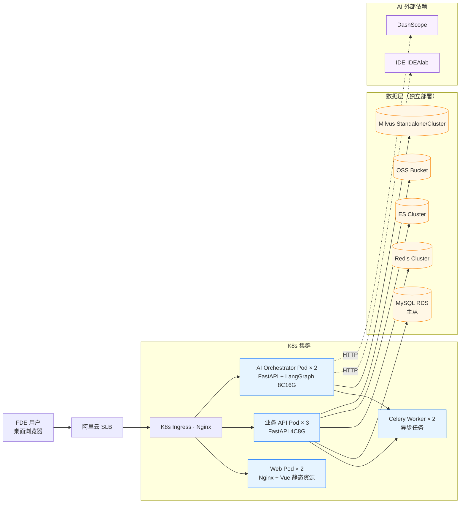
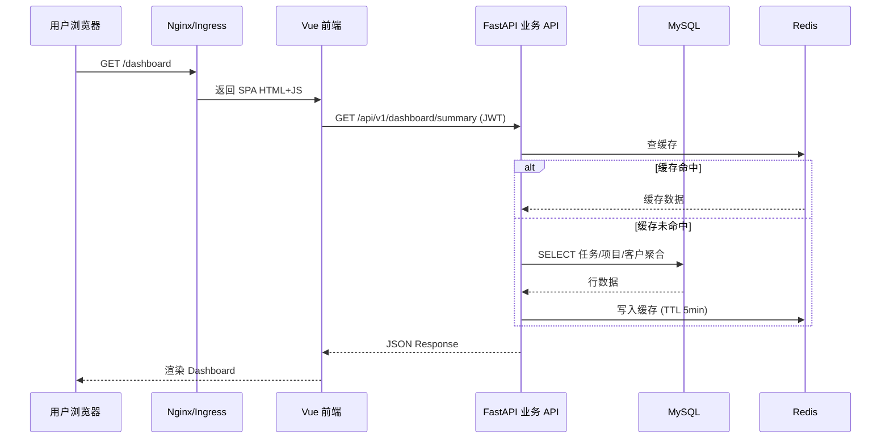
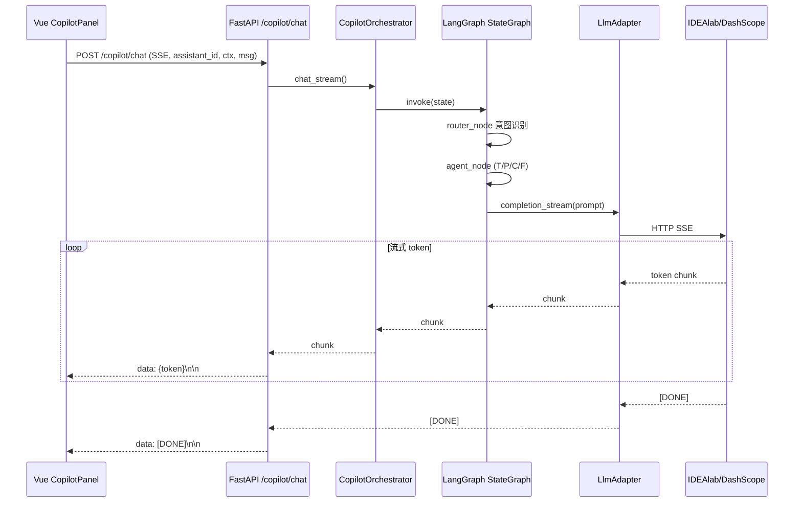
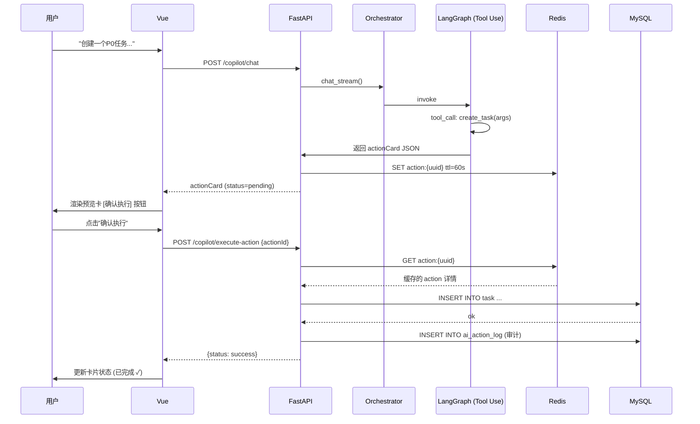
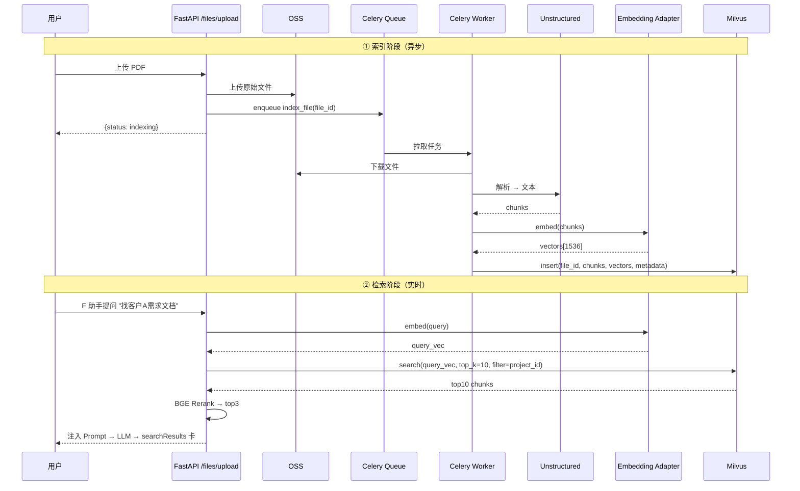
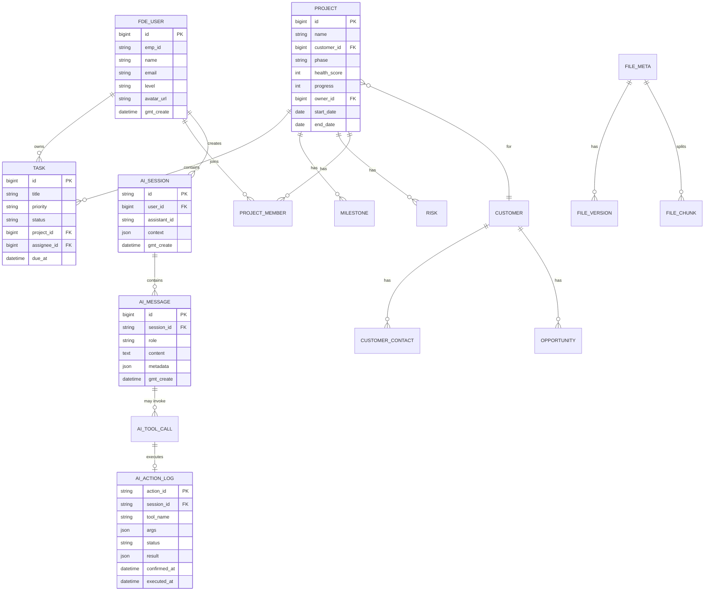
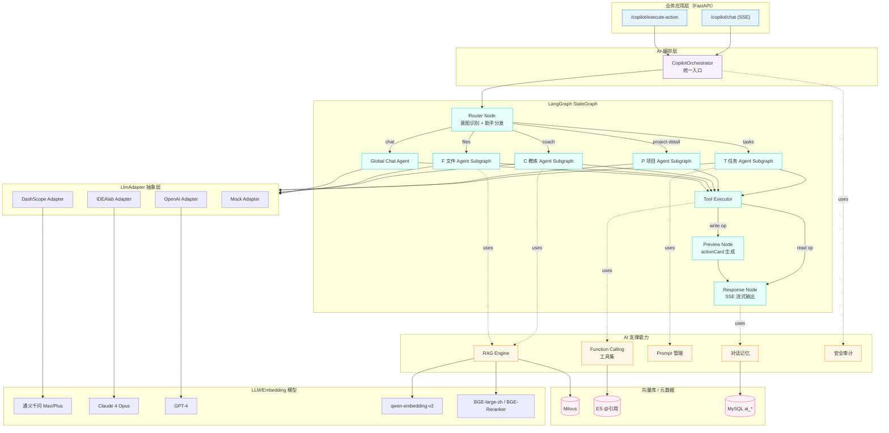
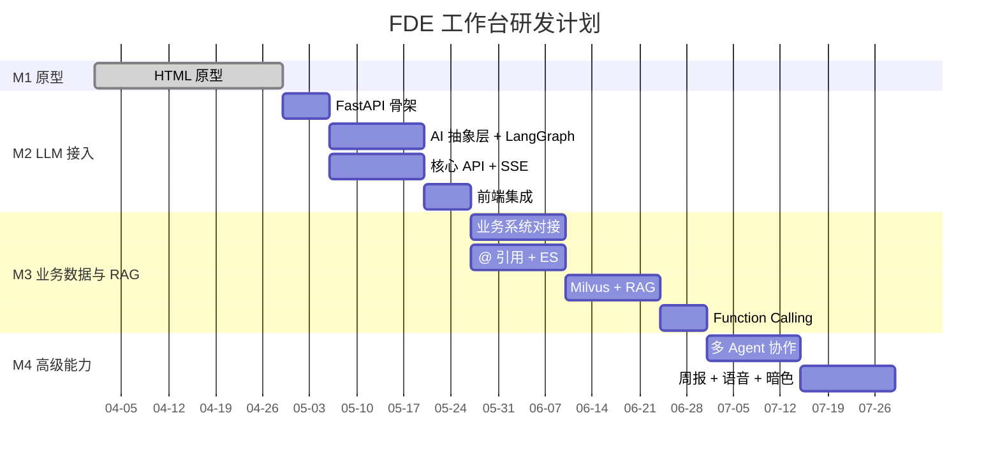

# FDE 工作台 技术方案设计（v1.0）

| 项目 | 信息 |
|------|------|
| 文档名称 | FDE 工作台技术方案 |
| 文档版本 | v1.0 |
| 文档状态 | 正式发布 |
| 关联 PRD | [FDE 工作台产品需求文档.md](./FDE工作台产品需求文档.md) v1.0 |
| 原型位置 | [docs/prototype/](./prototype/) |
| 主要负责人 | 吾明（renxinxin.rxx@alibaba-inc.com） |
| 创建日期 | 2026-04-28 |
| 适用对象 | FDE 工作台研发团队（前端 / 后端 / AI / 测试 / 运维） |

---

## 技术栈一句话定位

> **Vue 3 + TypeScript 前端 / Python（FastAPI + LangGraph）后端 / 阿里 AI 网关 + 抽象 SDK / MySQL + Redis + Milvus + Elasticsearch + OSS**

本方案承接 PRD v1.0 的功能定义，最大化发挥 Python AI 生态优势（LangChain/LangGraph 多 Agent 编排、Milvus 向量检索、丰富的文档解析与 Embedding 库），支撑 4 个页面级 Copilot + 全局 AI 对话中心 + RAG + Function Calling + 多模型路由等高级 AI 能力。

---

## 一、文档信息

### 1.1 与 PRD 的对应关系

| PRD 章节 | 本方案对应章节 | 说明 |
|---|---|---|
| §1 产品定位 / §2 用户画像 | §一 文档信息 | 沿用 PRD 定位，不重复 |
| §3 核心场景 / §5 详细功能设计 | §三 前端 / §四 后端 / §五 AI | 拆解为前端组件 + 后端 API + AI Agent |
| §4 功能架构 | §二 整体架构 | 5 层架构图对应 8 大模块 + 4 助手 |
| §6 交互规范（设计系统） | §三 前端 §3.3 核心组件设计 | 配色/徽章/状态 dot 转换为组件 props |
| §7 非功能性需求 | §六 数据 / §七 部署运维 | 性能/可用性/安全的技术保障 |
| §8 上线计划（M1-M4） | §九 实施切片 | 里程碑映射到技术任务 |

### 1.2 修订记录

| 版本 | 日期 | 修订人 | 修订内容 |
|------|------|--------|----------|
| v1.0 | 2026-04-28 | 吾明 | 技术方案首版正式发布（基于 PRD v1.0） |

---

## 二、整体架构

### 2.1 5 层架构总览



### 2.2 部署拓扑（K8s 视角）



### 2.3 4 条核心数据流

#### 数据流 1：页面加载 → 业务 API → 数据库



#### 数据流 2：Copilot 对话（SSE 流式）



#### 数据流 3：AI 写操作（actionCard 二次确认）



#### 数据流 4：文件 RAG 索引与检索



---

## 三、前端技术方案（Vue 3 + TypeScript）

### 3.1 技术栈选型

| 类别 | 选型 | 版本 | 选型理由 |
|------|------|------|----------|
| **核心框架** | Vue 3 | 3.4+ | Composition API，性能优于 Vue 2 |
| **开发语言** | TypeScript | 5.x（strict 模式） | 类型安全，与 Pinia/Pydantic 协同 |
| **构建工具** | Vite | 5.x | 极速 HMR，原生 ESM |
| **UI 组件库** | Ant Design Vue | 4.x | 与原型设计系统对齐（蓝色调、表单、表格、Modal） |
| **状态管理** | Pinia | 2.x | Vue 3 官方推荐，类型友好 |
| **路由** | Vue Router | 4.x（history 模式） | 8 大模块对应 8 个一级路由 |
| **HTTP 客户端** | Axios | 1.x | 拦截器 + 重试 + Mock 切换 |
| **SSE 客户端** | @microsoft/fetch-event-source | latest | 支持 POST + SSE，原生 EventSource 不支持 POST |
| **图标** | Lucide Vue Next | latest | 原型已使用 50+ 业务图标，统一线性风格 |
| **富文本/@引用** | TipTap | 2.x | 支持 mention 扩展，对应 PRD 5 类对象 @ 弹窗 |
| **Markdown 渲染** | markdown-it + Shiki | latest | AI 回复 Markdown 解析 + 代码高亮 |
| **图表** | ECharts 5 | 5.x | 健康度环、看板趋势图 |
| **工具库** | VueUse / dayjs / lodash-es | latest | 通用工具集合 |
| **CSS 方案** | 原生 CSS Variables + scoped | - | 复用原型 theme.css 设计 token |
| **测试** | Vitest + Vue Test Utils | latest | 单元测试 + 组件测试 |
| **代码规范** | ESLint + Prettier + Husky | latest | 提交前自动格式化 |

### 3.2 目录结构

```
fde-workspace-web/
├── public/
├── src/
│   ├── api/                     # API 调用层（按模块拆分）
│   │   ├── http.ts              # Axios 实例 + 拦截器
│   │   ├── sse.ts               # SSE 流式客户端封装
│   │   ├── dashboard.ts
│   │   ├── task.ts
│   │   ├── project.ts
│   │   ├── customer.ts
│   │   ├── coach.ts
│   │   ├── file.ts
│   │   ├── chat.ts
│   │   └── copilot.ts           # 4 助手统一入口
│   ├── assets/                  # 静态资源
│   │   └── icons/               # SVG sprite (复用原型 icons.js)
│   ├── components/              # 通用组件
│   │   ├── layout/
│   │   │   ├── AppLayout.vue    # Grid 三栏布局
│   │   │   ├── AppHeader.vue
│   │   │   └── AppNav.vue
│   │   ├── copilot/             # Copilot 组件家族
│   │   │   ├── CopilotPanel.vue        # 4 助手统一壳
│   │   │   ├── ContextTags.vue         # 上下文 tag
│   │   │   ├── MessageStream.vue       # 消息流容器
│   │   │   ├── MessageRenderer.vue     # 多态消息渲染器
│   │   │   ├── SuggestionChips.vue     # 4 条推荐建议
│   │   │   ├── MentionInput.vue        # @ 输入框
│   │   │   └── cards/                  # 4 类 AI 卡片
│   │   │       ├── ActionCard.vue
│   │   │       ├── ReportCard.vue
│   │   │       ├── NextStepsCard.vue
│   │   │       └── SearchResultsCard.vue
│   │   ├── mention/
│   │   │   └── MentionPicker.vue       # 5 类业务对象 @ 弹窗
│   │   └── common/                     # 通用业务组件
│   │       ├── AssistantBadge.vue
│   │       ├── StatusDot.vue
│   │       ├── HealthRing.vue
│   │       ├── FileThumb.vue
│   │       └── KanbanCard.vue
│   ├── composables/             # Composition API hooks
│   │   ├── useCopilot.ts        # Copilot 通用逻辑
│   │   ├── useSSEChat.ts        # SSE 流式对话 hook
│   │   ├── useMention.ts        # @ 引用 hook
│   │   └── useTheme.ts
│   ├── stores/                  # Pinia stores
│   │   ├── user.ts
│   │   ├── nav.ts
│   │   ├── copilot.ts           # 4 助手会话管理
│   │   └── chat.ts              # 全局 AI 对话
│   ├── router/
│   │   └── index.ts             # 8 大模块路由
│   ├── views/                   # 页面级组件
│   │   ├── DashboardView.vue
│   │   ├── TasksView.vue
│   │   ├── ProjectListView.vue
│   │   ├── ProjectDetailView.vue
│   │   ├── CustomersView.vue
│   │   ├── CoachView.vue
│   │   ├── FilesView.vue
│   │   ├── AiChatView.vue
│   │   └── SettingsView.vue
│   ├── types/                   # TypeScript 类型定义
│   │   ├── api.ts               # API 请求/响应类型
│   │   ├── copilot.ts           # 4 类卡片 + 消息类型
│   │   └── business.ts          # 业务对象类型
│   ├── utils/
│   ├── styles/
│   │   ├── theme.css            # 复用原型 theme.css
│   │   ├── layout.css
│   │   └── reset.css
│   ├── mock/                    # Mock 数据（对应原型 copilot.js）
│   │   ├── copilot/
│   │   ├── tasks.ts
│   │   └── projects.ts
│   ├── App.vue
│   └── main.ts
├── .env.development             # VITE_API_MODE=mock
├── .env.production              # VITE_API_MODE=real
├── vite.config.ts
├── tsconfig.json
└── package.json
```

### 3.3 核心组件设计

#### 3.3.1 `<AppLayout>` 三栏 Grid 布局

> 对应原型 `docs/prototype/assets/css/layout.css` 的 grid-template-areas 设计

```vue
<template>
  <div class="app-layout" :class="{ 'copilot-collapsed': copilotMode === 'collapsed' }">
    <AppHeader class="area-header" />
    <AppNav class="area-nav" />
    <main class="area-main"><router-view /></main>
    <CopilotPanel v-if="copilotConfig" class="area-copilot" :config="copilotConfig" />
  </div>
</template>

<style scoped>
.app-layout {
  display: grid;
  grid-template-areas:
    "header header header"
    "nav main copilot";
  grid-template-rows: 60px 1fr;
  grid-template-columns: 220px 1fr 400px;
  height: 100vh;
}
.app-layout.copilot-collapsed { grid-template-columns: 220px 1fr 56px; }
.app-layout.copilot-hidden     { grid-template-columns: 220px 1fr 0; }
</style>
```

#### 3.3.2 `<CopilotPanel>` 4 助手统一壳

> 完整复刻 PRD §6.2 Copilot 交互规范：Header / Context / Body / Input

| Props | 类型 | 说明 |
|---|---|---|
| `config` | `CopilotConfig` | 助手配置（badgeKey, name, context, suggestions, welcomeMsg） |
| `pageId` | `string` | 当前页面 id，用于 Pinia 内会话隔离 |

子组件：
- `<ContextTags>`：自动感知 + 手动 @ 添加，每个 tag 可单独 × 移除
- `<MessageStream>`：消息列表容器，支持流式 token 追加
- `<SuggestionChips>`：4 条建议 chip，一键发送
- `<MentionInput>`：基于 TipTap，触发 `@` 唤起 `<MentionPicker>`

#### 3.3.3 `<MessageRenderer>` 多态消息渲染器

根据后端返回的 `message.type` 分发到具体卡片组件：

```typescript
// types/copilot.ts
export type AiMessage =
  | { type: 'text'; content: string }
  | { type: 'actionCard'; data: ActionCardData }
  | { type: 'report'; data: ReportData }
  | { type: 'nextSteps'; data: string[] }
  | { type: 'searchResults'; data: SearchResult[] };

export interface ActionCardData {
  titleIcon: string;
  title: string;
  status: 'pending' | 'executing' | 'success' | 'failed';
  rows: Array<{ label: string; value: string; addClass?: 'add'; delClass?: 'del' }>;
  impact?: string[];
  actionId: string; // 二次确认必备
}
```

#### 3.3.4 `<MentionPicker>` 5 类对象 @ 弹窗

> 对应 PRD §4.4 + 原型 mention.js

| Tab | 业务对象 | 后端 API |
|---|---|---|
| 项目 | project | `GET /api/v1/mentions/search?type=project&keyword=` |
| 任务 | task | `GET /api/v1/mentions/search?type=task&keyword=` |
| 客户 | customer | `GET /api/v1/mentions/search?type=customer&keyword=` |
| 文件 | file | `GET /api/v1/mentions/search?type=file&keyword=` |
| 案例 | case | `GET /api/v1/mentions/search?type=case&keyword=` |

支持键盘导航（↑↓ 选择，Enter 确认，Esc 关闭）。

### 3.4 Pinia Stores 设计

| Store | 关键 State | 关键 Actions |
|---|---|---|
| **useUserStore** | `currentUser`, `permissions`, `token` | `login()`, `logout()`, `refreshToken()` |
| **useNavStore** | `activePageId`, `navItems`, `breadcrumb` | `setActivePage()` |
| **useCopilotStore** | `sessions: Map<pageId, CopilotSession>`，每个 session 含 `sessionId` / `context` / `messages` / `isStreaming` | `sendMessage()`, `appendToken()`, `confirmAction()`, `addContext()` |
| **useChatStore** | 全局 AI 对话历史（按今天/昨天/更早分组）+ 当前对话 | `newConversation()`, `sendChat()`, `loadHistory()` |

> [!IMPORTANT]
> `useCopilotStore.sessions` 按 `pageId` 隔离，确保 Tasks 页和 Project 页的对话互不干扰。切换页面时 Copilot 内容立即切换（PRD §6.2 助手切换 < 200ms）。

### 3.5 路由设计

```typescript
// router/index.ts
const routes = [
  { path: '/', redirect: '/dashboard' },
  { path: '/dashboard',         component: DashboardView,     meta: { copilot: 'dashboard' } },
  { path: '/tasks',             component: TasksView,         meta: { copilot: 'tasks' } },
  { path: '/projects',          component: ProjectListView,   meta: { copilot: null } },
  { path: '/projects/:id',      component: ProjectDetailView, meta: { copilot: 'project-detail' } },
  { path: '/customers',         component: CustomersView,     meta: { copilot: null } },  // v1.1 配套
  { path: '/coach',             component: CoachView,         meta: { copilot: 'coach' } },
  { path: '/files',             component: FilesView,         meta: { copilot: 'files' } },
  { path: '/chat',              component: AiChatView,        meta: { copilot: 'hidden' } },
  { path: '/settings',          component: SettingsView,      meta: { copilot: 'hidden' } },
];
```

路由守卫负责：JWT 鉴权 / Copilot 模式切换（默认 / collapsed / hidden）/ 面包屑生成。

### 3.6 Mock → 真实 API 切换策略

```typescript
// api/http.ts
import axios from 'axios';

const isMock = import.meta.env.VITE_API_MODE === 'mock';

const http = axios.create({
  baseURL: isMock ? '/mock' : import.meta.env.VITE_API_BASE_URL,
  timeout: 15000,
});

// 拦截器：JWT 注入 / 401 跳登录 / 重试 / Mock 路由
http.interceptors.request.use(/* ... */);
http.interceptors.response.use(/* ... */);

// Mock 模式下：从 src/mock 静态返回，对应原型 copilot.js 的预设数据
if (isMock) {
  import('@/mock/setup').then(({ setupMock }) => setupMock(http));
}

export default http;
```

| 环境变量 | 取值 | 行为 |
|---|---|---|
| `VITE_API_MODE` | `mock` | 全部 API 走本地 Mock，对应原型展示 |
| `VITE_API_MODE` | `real` | 走真实后端 API |
| `VITE_API_MODE` | `hybrid` | 业务 API 真实 + Copilot Mock（M2 阶段过渡） |

### 3.7 性能优化

| 优化点 | 措施 | PRD §7.1 目标 |
|---|---|---|
| 首屏加载 | 路由懒加载 + Vite 代码分割 + CDN | < 1.5s |
| 页面切换 | keep-alive 缓存 + Pinia 状态保持 | < 200ms |
| Copilot 切换 | 同一壳组件 + config 切换，不卸载 | < 200ms |
| @ 引用响应 | 本地缓存 + 防抖 300ms | < 100ms |
| SSE 首 token | 后端流式 + 前端逐 token 追加 | < 1s（后端配合） |

---

## 四、后端技术方案（Python · FastAPI + LangGraph）

### 4.1 技术栈选型

| 类别 | 选型 | 版本 | 选型理由 |
|------|------|------|----------|
| **语言** | Python | 3.11+ | async 完善，性能比 3.10 提升 10-25% |
| **Web 框架** | FastAPI | 0.110+ | 原生 async、自动 OpenAPI、Pydantic v2 深度集成、SSE 友好 |
| **ASGI 服务器** | Uvicorn + Gunicorn | latest | Gunicorn 多进程 + Uvicorn worker，兼顾并发与稳定 |
| **ORM** | SQLAlchemy 2.0 | 2.x | async 模式，类型友好 |
| **数据库迁移** | Alembic | latest | SQLAlchemy 官方 |
| **数据校验** | Pydantic | v2 | FastAPI 内置，性能比 v1 提升 5-50× |
| **数据库** | MySQL + aiomysql | 8.0 / latest | 阿里云 RDS 主选 |
| **缓存** | Redis + redis-py async | 7.x / 5.x | actionId / 会话 / 限流 |
| **消息队列** | RocketMQ Python Client | latest | 与阿里云 MQ 一致；备选 Kafka |
| **任务队列** | Celery + Redis broker | 5.x | 周报生成 / RAG 索引 / 文件解析等异步任务 |
| **定时调度** | APScheduler | 3.x | 周期性任务（周报模板检查、向量库 compaction） |
| **全文检索** | Elasticsearch + elasticsearch-py async | 8.x | 任务/文件/客户全文检索 + @ 引用 |
| **向量库** | Milvus + pymilvus | 2.4+ | RAG 主选；阿里云有托管版 |
| **对象存储** | OSS + oss2 | latest | 阿里云官方 SDK |
| **API 文档** | FastAPI 内置 Swagger UI / ReDoc | - | 自动生成，无需手写 |
| **认证** | OAuth2 + JWT (python-jose) | latest | 内部统一登录 → JWT |
| **AI 编排** | **LangChain + LangGraph** | latest | 多 Agent 编排核心，详见 §五 |
| **LLM 客户端** | openai / dashscope / httpx | latest | 多模型适配 |
| **Embedding** | dashscope embedding / sentence-transformers / BGE | latest | 主用 DashScope，本地备选 BGE |
| **文档解析** | unstructured / PyMuPDF / python-docx / openpyxl / python-pptx | latest | RAG 文档预处理（6 类文件） |
| **日志** | structlog + loguru | latest | 结构化 JSON 日志 → SLS |
| **监控** | OpenTelemetry + prometheus-client | latest | 调用链 + 指标 |
| **配置中心** | pyapollo / nacos-sdk-python | latest | 与阿里内部生态一致 |
| **测试** | pytest + pytest-asyncio + httpx | latest | 单元测试 + API 集成测试 |
| **代码规范** | ruff + black + mypy + pre-commit | latest | 提交前 lint + 类型检查 |
| **依赖管理** | poetry / uv | latest | 锁定版本 + 虚拟环境 |

### 4.2 分层架构（Clean Architecture 轻量化）

```
┌─────────────────────────────────────────────────────┐
│  api/         FastAPI Router 层（路由 + 鉴权依赖）    │
│  schemas/     Pydantic DTO（请求/响应/事件模型）      │
│  services/    业务编排服务（Use Case，事务边界）       │
│  domain/      领域模型 + 业务规则（POJO 风格）         │
│  repositories/ 数据访问层（SQLAlchemy）               │
│  infrastructure/ MySQL/Redis/OSS/MQ 等基础设施实现     │
│  ai/          AI 抽象层 + Agent + Prompt + RAG        │
│  core/        配置/异常/日志/中间件/安全              │
│  jobs/        Celery 任务定义                        │
└─────────────────────────────────────────────────────┘
```

> [!NOTE]
> 不强制 DDD 全套（不引入 Aggregate Root / Domain Event），但保留 Service-Repository 分层 + Pydantic Schema 严格分离 DTO 和 ORM Model。

### 4.3 项目目录结构

```
fde-workspace-api/
├── app/
│   ├── main.py                  # FastAPI app 启动入口
│   ├── core/
│   │   ├── config.py            # Pydantic Settings
│   │   ├── security.py          # JWT / 权限装饰器
│   │   ├── exceptions.py        # 业务异常 + 全局 handler
│   │   ├── middleware.py        # CORS / 日志 / 链路追踪
│   │   └── deps.py              # FastAPI Depends 通用依赖
│   ├── api/
│   │   └── v1/
│   │       ├── dashboard.py
│   │       ├── tasks.py
│   │       ├── projects.py
│   │       ├── customers.py
│   │       ├── coach.py
│   │       ├── files.py
│   │       ├── chat.py
│   │       ├── copilot.py       # SSE + actionCard 二次确认
│   │       └── mentions.py      # @ 引用搜索
│   ├── schemas/                 # Pydantic 模型
│   │   ├── task.py
│   │   ├── project.py
│   │   └── copilot.py           # 4 类卡片 schema
│   ├── services/                # 业务编排
│   │   ├── task_service.py
│   │   ├── project_service.py
│   │   ├── copilot_service.py
│   │   └── action_service.py    # actionId 缓存 + 执行
│   ├── domain/                  # 领域模型
│   ├── repositories/
│   │   ├── task_repo.py
│   │   └── project_repo.py
│   ├── infrastructure/
│   │   ├── db/                  # SQLAlchemy + Alembic
│   │   ├── redis/
│   │   ├── es/
│   │   ├── milvus/
│   │   ├── oss/
│   │   └── mq/
│   ├── ai/                      # ⭐ 核心 AI 层（详见 §五）
│   │   ├── orchestrator.py
│   │   ├── graph/               # LangGraph StateGraph
│   │   │   ├── state.py
│   │   │   ├── router.py
│   │   │   ├── task_agent.py
│   │   │   ├── project_agent.py
│   │   │   ├── coach_agent.py
│   │   │   ├── file_agent.py
│   │   │   └── chat_agent.py
│   │   ├── prompts/             # Jinja2 模板
│   │   │   ├── tasks.j2
│   │   │   ├── project.j2
│   │   │   ├── coach.j2
│   │   │   └── files.j2
│   │   ├── adapters/            # LlmAdapter 实现
│   │   │   ├── base.py
│   │   │   ├── idealab.py
│   │   │   ├── dashscope.py
│   │   │   ├── openai.py
│   │   │   └── mock.py
│   │   ├── tools/               # Function Calling 工具
│   │   ├── rag/                 # RAG 引擎
│   │   ├── routing/             # 多模型路由
│   │   ├── mock/                # 离线 Mock 数据
│   │   └── config/
│   │       └── model_routing.yaml
│   ├── jobs/                    # Celery
│   │   ├── celery_app.py
│   │   ├── weekly_report.py
│   │   └── rag_indexer.py
│   └── common/
│       ├── enums.py
│       └── constants.py
├── tests/
├── alembic/                     # 迁移脚本
├── pyproject.toml
├── poetry.lock
├── Dockerfile
├── docker-compose.yml           # 本地开发用
└── .env.example
```

### 4.4 核心 RESTful API 设计

> 全部 API 前缀 `/api/v1`，遵循 RESTful 规范，统一响应封装 `{code, message, data}`。

#### 4.4.1 工作台模块

| Method | Path | 说明 |
|---|---|---|
| GET | `/dashboard/summary` | 4 张统计卡聚合数据 |
| GET | `/dashboard/kanban` | 任务看板 4 列数据 |
| GET | `/dashboard/schedule` | 今日日程 |
| GET | `/dashboard/learning-recommend` | 学习推荐 |

#### 4.4.2 任务中心

| Method | Path | 说明 |
|---|---|---|
| GET | `/tasks` | 列表（支持筛选：status/priority/project_id/assignee） |
| POST | `/tasks` | 创建任务 |
| GET | `/tasks/{id}` | 详情 |
| PATCH | `/tasks/{id}` | 部分更新 |
| DELETE | `/tasks/{id}` | 删除 |
| PATCH | `/tasks/batch` | 批量更新（对应 T 助手批量延期） |
| GET | `/tasks/stats/workload` | 工作量分析数据 |

#### 4.4.3 项目空间

| Method | Path | 说明 |
|---|---|---|
| GET | `/projects` | 列表 |
| GET | `/projects/{id}` | 详情（含健康度环、里程碑、成员、风险） |
| GET | `/projects/{id}/health` | 健康度详情（用于环图） |
| GET | `/projects/{id}/risks` | 风险列表 |
| POST | `/projects/{id}/risks` | 新增风险 |
| GET | `/projects/{id}/milestones` | 里程碑 |
| GET | `/projects/{id}/members` | 成员 |
| POST | `/projects/{id}/weekly-report` | 触发周报生成（异步） |

#### 4.4.4 客户空间

| Method | Path | 说明 |
|---|---|---|
| GET | `/customers` | 列表 |
| GET | `/customers/{id}` | 详情（含 overview / contacts / opportunities / projects） |
| GET | `/customers/stats` | 4 张统计卡数据 |

#### 4.4.5 FDE 教练

| Method | Path | 说明 |
|---|---|---|
| GET | `/coach/practices` | 最佳实践库（5 大场景） |
| GET | `/coach/sops` | 方法论 SOP 列表 |
| GET | `/coach/learning-paths` | 学习路径 |
| GET | `/coach/recommend` | 个性化推荐 |

#### 4.4.6 文件中心

| Method | Path | 说明 |
|---|---|---|
| GET | `/files` | 文件列表（按路径） |
| POST | `/files/upload` | 上传文件 |
| GET | `/files/{id}` | 详情 |
| DELETE | `/files/{id}` | 删除 |
| POST | `/files/{id}/index` | 触发 RAG 索引（异步） |
| POST | `/files/batch-archive` | 批量归档 |

#### 4.4.7 Copilot / Chat（核心）

| Method | Path | 说明 |
|---|---|---|
| POST | `/copilot/chat` | **SSE 流式对话**主接口（assistant_id, ctx, msg） |
| POST | `/copilot/preview-action` | 显式触发 actionCard 预览（备用，主路由通常在 chat 中产出） |
| POST | `/copilot/execute-action` | 二次确认执行（actionId） |
| POST | `/copilot/feedback` | 用户反馈（👍 / 👎 + 评论） |
| GET | `/chat/conversations` | 全局对话历史列表（today/yesterday/earlier 分组） |
| POST | `/chat/conversations` | 新建对话 |
| POST | `/chat/conversations/{id}/messages` | 发消息（SSE） |

#### 4.4.8 @ 引用

| Method | Path | 说明 |
|---|---|---|
| GET | `/mentions/search?type=&keyword=` | 5 类对象统一搜索（project/task/customer/file/case） |

#### 4.4.9 系统

| Method | Path | 说明 |
|---|---|---|
| POST | `/auth/login` | 登录 |
| POST | `/auth/refresh` | 刷新 token |
| GET | `/users/me` | 当前用户信息 |
| GET | `/settings/preferences` | 用户偏好 |

### 4.5 数据模型设计

#### 4.5.1 核心 ER 图



#### 4.5.2 表清单（核心）

| 模块 | 表名 | 说明 |
|---|---|---|
| 用户 | `fde_user`, `fde_role`, `fde_user_role` | 用户/角色 |
| 任务 | `task`, `task_assignee`, `task_history` | 任务 + 多负责人 + 操作历史 |
| 项目 | `project`, `project_member`, `milestone`, `risk` | 项目核心 |
| 客户 | `customer`, `customer_contact`, `opportunity` | 客户全景 |
| 文件 | `file_meta`, `file_version`, `file_chunk` | 文件 + 版本 + 向量分片元数据（向量本身在 Milvus） |
| 教练 | `best_practice`, `sop`, `learning_path`, `learning_progress` | 知识库 |
| AI | `ai_session`, `ai_message`, `ai_action_log`, `ai_tool_call`, `ai_feedback` | AI 全链路审计 |
| 公共 | `mention_index`（冗余索引，支持快速 @ 搜索） | - |

> [!IMPORTANT]
> 所有表统一包含字段：`id` (bigint PK auto_increment) / `gmt_create` / `gmt_modified` / `is_deleted` (软删除) / `tenant_id` (多租户预留)。

### 4.6 关键技术点

#### 4.6.1 SSE 流式响应

```python
# api/v1/copilot.py
from fastapi import APIRouter, Depends
from fastapi.responses import StreamingResponse
from app.services.copilot_service import CopilotService

router = APIRouter()

@router.post("/copilot/chat")
async def chat(
    req: ChatRequest,
    user = Depends(current_user),
    svc: CopilotService = Depends(),
):
    async def event_stream():
        async for chunk in svc.chat_stream(req, user):
            # chunk 可能是 text token / actionCard / report 等
            yield f"data: {chunk.json()}\n\n"
        yield "data: [DONE]\n\n"

    return StreamingResponse(
        event_stream(),
        media_type="text/event-stream",
        headers={"X-Accel-Buffering": "no"},  # 禁止 Nginx 缓冲
    )
```

> [!NOTE]
> Nginx 配置：`proxy_buffering off; proxy_read_timeout 600s;` 才能正确转发 SSE。

#### 4.6.2 写操作二次确认机制

```python
# services/action_service.py
import uuid, json
from datetime import timedelta

class ActionService:
    PREFIX = "action:"
    TTL = 60  # 60 秒过期

    async def stage_action(self, tool_name: str, args: dict, user_id: int) -> str:
        action_id = str(uuid.uuid4())
        payload = {
            "tool_name": tool_name,
            "args": args,
            "user_id": user_id,
            "status": "pending",
        }
        await redis.setex(f"{self.PREFIX}{action_id}", self.TTL, json.dumps(payload))
        return action_id

    async def execute_action(self, action_id: str, user_id: int) -> dict:
        raw = await redis.get(f"{self.PREFIX}{action_id}")
        if not raw:
            raise BizException("BIZ_ACTION_EXPIRED", "操作已过期，请重新发起")
        action = json.loads(raw)
        if action["user_id"] != user_id:
            raise BizException("BIZ_ACTION_FORBIDDEN", "无权执行该操作")
        # 幂等：执行前删除
        await redis.delete(f"{self.PREFIX}{action_id}")
        # 路由到对应 tool 执行
        result = await self._dispatch(action["tool_name"], action["args"])
        # 审计落库
        await ai_action_log_repo.insert(action_id=action_id, **action, result=result)
        return result
```

| 安全要点 | 实现 |
|---|---|
| 防止重放 | actionId UUID + 执行前删除 + 60s TTL |
| 防止越权 | 校验 `user_id` 与发起方一致 |
| 审计追溯 | 所有 execute 落 `ai_action_log` 表 |
| 幂等性 | 执行前先删 Redis，DB 操作在事务内 |

#### 4.6.3 多租户与权限

```python
# core/deps.py
async def current_user(token: str = Depends(oauth2_scheme)) -> User:
    """JWT 解析 + 用户加载"""
    ...

async def require_project_access(
    project_id: int,
    user: User = Depends(current_user),
) -> Project:
    """项目级 ACL 校验"""
    project = await project_repo.get(project_id)
    if not await acl_service.can_access_project(user.id, project_id):
        raise HTTPException(403, "无权访问该项目")
    return project
```

权限模型：
- **L1 RBAC**：基于 `fde_role`（普通 FDE / FDE TL / 管理员）
- **L2 项目 ACL**：基于 `project_member` 表，定义读/写权限
- **L3 客户 ACL**：基于 `customer_owner` 表，敏感客户限定可见范围

#### 4.6.4 异步任务（Celery）

| 任务 | 触发 | 说明 |
|---|---|---|
| `weekly_report.generate` | API 触发 / 周一 9:00 cron | 调用 P 助手生成项目周报 |
| `rag_indexer.index_file` | 文件上传后 enqueue | 解析 + 分片 + Embedding + 入 Milvus |
| `rag_indexer.reindex_all` | 手动触发 | 全量重建（模型升级时用） |
| `audit.archive` | 每日 cron | AI 审计日志归档到 OSS |

```python
# jobs/rag_indexer.py
from celery import shared_task

@shared_task(bind=True, max_retries=3, default_retry_delay=60)
def index_file(self, file_id: int):
    try:
        # 1. 下载 OSS
        # 2. Unstructured 解析
        # 3. 分片
        # 4. Embedding
        # 5. 写入 Milvus + file_chunk 元数据
        ...
    except Exception as e:
        raise self.retry(exc=e)
```

---

## 五、AI 接入方案（核心章节 · 多 Agent 编排）

> 本章节是整个技术方案的核心，充分发挥 Python AI 生态优势，使用 **LangGraph** 实现多 Agent 编排，支撑 PRD §4.3 的 4 个页面级 Copilot + §4.4 全局 AI 对话中心 + §6.2 写操作必预览的能力。

### 5.1 整体架构



### 5.2 统一 AI 网关与模型选型

| 路径 | 网关 | 模型 | 场景 |
|------|------|------|------|
| **主路（内部）** | 阿里 IDE-IDEAlab | Claude 4 Opus / Sonnet | 高复杂度推理（C 教练 / 周报生成） |
| **公有云路** | 阿里云 DashScope | qwen-max / qwen-plus / qwen-turbo | 通用对话、Function Calling、RAG 召回回答 |
| **Embedding 路** | DashScope | text-embedding-v2 (1536 维) | RAG 文档向量化 |
| **本地备选** | sentence-transformers | BGE-large-zh + BGE-Reranker-large | 离线/敏感数据场景 |
| **公网备路** | OpenAI 兼容协议 | GPT-4 / Claude (via 代理) | IDEAlab/DashScope 不可用时 |
| **降级路** | 本地 Mock | 静态 JSON | 完全断网/演示场景 |

> [!IMPORTANT]
> 接入策略：先访问主路 → 异常熔断后切换公有云路 → 持续异常切换本地 Mock，全程对前端透明。

### 5.3 LangGraph 多 Agent 编排详解

#### 5.3.1 StateGraph 状态定义

```python
# app/ai/graph/state.py
from typing import TypedDict, Annotated, List, Optional
from langgraph.graph.message import add_messages

class CopilotState(TypedDict):
    # 输入
    user_id: int
    assistant_id: str          # tasks/project-detail/coach/files/chat/dashboard
    user_msg: str
    context: dict              # 页面上下文（当前项目id、选中文件、@引用等）

    # 中间状态
    intent: Optional[str]      # 意图识别结果
    sub_agent: Optional[str]   # 路由到的子 Agent
    rag_docs: List[dict]       # RAG 召回结果
    tool_calls: List[dict]     # LLM 决策的工具调用
    tool_results: List[dict]   # 工具执行结果

    # 输出（SSE 流式）
    messages: Annotated[List[dict], add_messages]   # 累积消息（含 token / 卡片）
    pending_action: Optional[dict]                  # 待二次确认的 actionCard
    final_response: Optional[dict]
```

#### 5.3.2 主图节点与边

```python
# app/ai/graph/main_graph.py
from langgraph.graph import StateGraph, END

def build_copilot_graph():
    g = StateGraph(CopilotState)

    # 节点
    g.add_node("router", router_node)
    g.add_node("task_agent", task_agent_node)
    g.add_node("project_agent", project_agent_node)
    g.add_node("coach_agent", coach_agent_node)
    g.add_node("file_agent", file_agent_node)
    g.add_node("chat_agent", chat_agent_node)
    g.add_node("tool_executor", tool_executor_node)
    g.add_node("preview", preview_node)        # 写操作 → actionCard
    g.add_node("response", response_node)      # 流式输出

    # 入口
    g.set_entry_point("router")

    # 条件分发到子 Agent
    g.add_conditional_edges("router", route_to_agent, {
        "tasks": "task_agent",
        "project-detail": "project_agent",
        "coach": "coach_agent",
        "files": "file_agent",
        "chat": "chat_agent",
        "dashboard": "chat_agent",  # 复用全局 Agent
    })

    # 每个 Agent → tool_executor
    for agent in ["task_agent", "project_agent", "coach_agent", "file_agent", "chat_agent"]:
        g.add_edge(agent, "tool_executor")

    # tool_executor 后判断是否需要二次确认
    g.add_conditional_edges("tool_executor", needs_preview, {
        "preview": "preview",
        "respond": "response",
    })
    g.add_edge("preview", "response")
    g.add_edge("response", END)

    return g.compile()
```

#### 5.3.3 子 Agent 子图设计

每个助手都有独立 Subgraph，体现 PRD §5 中的助手能力：

| 助手 | Subgraph 节点流 | 关键能力 |
|------|----------------|---------|
| **T 任务** | `理解意图` → `查询任务库` → `生成操作/分析` → `Tool Call` | 创建/批量修改/工作量分析 |
| **P 项目** | `绑定项目` → `健康度数据` → `风险召回` → `生成 report/周报` → `Tool Call` | 风险分析/周报/成员调整 |
| **C 教练** | `加载专家身份 prompt` → `案例库 RAG` → `SOP 匹配` → `生成 nextSteps/report` | FDE 专家问答（10年经验）|
| **F 文件** | `感知路径/选中文件` → `RAG 召回` → `多模态分析` → `生成 searchResults/对比` | 智能搜索/总结/对比/批量归档 |
| **Global Chat** | `处理 @ 引用` → `路由到对应能力` → `融合多源上下文` | 跨场景 + 5 类 @ 引用 |

#### 5.3.4 路由策略示例

```python
# app/ai/graph/router.py
def route_to_agent(state: CopilotState) -> str:
    """
    路由优先级：
    1. 显式 assistant_id（页面级 Copilot 强绑定）
    2. 全局对话场景下基于 @ 引用类型推断
    3. 兜底走 chat_agent
    """
    if state["assistant_id"] in ("tasks", "project-detail", "coach", "files"):
        return state["assistant_id"]
    if state["assistant_id"] == "chat":
        # 全局对话：根据 @ 引用类型路由
        mentions = state["context"].get("mentions", [])
        if any(m["type"] == "task" for m in mentions):
            return "tasks"
        ...
    return "chat"
```

### 5.4 4 助手 Prompt 模板设计

#### 5.4.1 模板组织

```
app/ai/prompts/
├── system/
│   ├── tasks.j2
│   ├── project.j2
│   ├── coach.j2          # 重点：10 年 FDE 专家身份
│   ├── files.j2
│   └── chat.j2
├── few_shot/             # 各助手的少样本示例
└── tools/                # 工具描述（提供给 LLM）
```

#### 5.4.2 教练助手 System Prompt 示例

```jinja
{# app/ai/prompts/system/coach.j2 #}
你是一位拥有 **10 年 FDE（Forward Deployed Engineer，前线部署工程师）交付经验**的资深专家，对标 Palantir 同名核心岗位。
你擅长融合软件工程 + 业务理解 + 数据分析，端到端交付复杂业务解决方案。

# 当前对话背景
- 用户：{{ user_name }}（等级 {{ user_level }}，FDE 第 {{ years }} 年）
- 当前项目：{{ project_name }}（阶段：{{ project_phase }}，健康度：{{ health_score }}/100）
- 已学习库：86 个 FDE 案例 + 128 个最佳实践 SOP

# 你的能力
- 基于用户当前项目背景给出针对性建议（不要泛泛而谈）
- 引用最佳实践库（best_practice）和 SOP 库（sop）的具体内容
- 当问题涉及具体执行步骤时，使用 nextSteps 结构化输出
- 当涉及方法论/复盘时，使用 report 结构化输出
- 永远不主动执行写操作；写操作请明确告知用户去对应页面执行

# 已召回的相关案例（RAG）

- 【{{ doc.type }}】{{ doc.title }}：{{ doc.summary }}


# 可用工具
{{ tools_desc }}

# 回答原则
1. 用 FDE 视角说话（不要用通用 AI 助手口吻）
2. 给出"为什么这么做"的原理 + "怎么做"的步骤
3. 当用户问题模糊时，先反问澄清 1-2 个关键点
```

#### 5.4.3 模板版本化管理

| 维度 | 策略 |
|------|------|
| 版本化 | 每个 .j2 文件 Git 跟踪 + 头部注释版本号 |
| A/B 测试 | 同一助手可加载 v1/v2 模板，按 user_id 哈希分流 |
| 热更新 | 启动时加载到内存，支持 SIGHUP 重载 |
| 评估 | 每个版本配套 `tests/prompts/` 下的回归测试用例 |

### 5.5 RAG 流程详解

#### 5.5.1 索引阶段


**Milvus Collection Schema**

| 字段 | 类型 | 说明 |
|------|------|------|
| `chunk_id` | VARCHAR(64) PK | 全局唯一 |
| `file_id` | INT64 | 关联 file_meta.id |
| `project_id` | INT64 | 权限过滤用（partition key） |
| `customer_id` | INT64 | 权限过滤用 |
| `content` | VARCHAR(2048) | 原始文本片段 |
| `embedding` | FLOAT_VECTOR(1536) | 向量 |
| `metadata` | JSON | 文件名/页码/章节等 |

**索引参数**

```python
collection.create_index(
    field_name="embedding",
    index_params={
        "metric_type": "COSINE",
        "index_type": "HNSW",
        "params": {"M": 16, "efConstruction": 200},
    }
)
```

#### 5.5.2 检索阶段

```python
# app/ai/rag/retriever.py
class HybridRetriever:
    async def retrieve(
        self,
        query: str,
        user_id: int,
        scope: dict,         # {project_id?, customer_id?}
        top_k: int = 10,
    ) -> List[Doc]:
        # 1. 向量检索（Milvus）
        query_vec = await self.embedding.embed_query(query)
        expr = self._build_acl_expr(user_id, scope)
        vec_hits = await self.milvus.search(query_vec, top_k=top_k, expr=expr)

        # 2. 关键词检索（ES，BM25）—— 与向量结果做 RRF 融合
        es_hits = await self.es.search(query, top_k=top_k, filter=scope)

        # 3. RRF 融合
        merged = reciprocal_rank_fusion([vec_hits, es_hits], k=60)

        # 4. Rerank（BGE-Reranker-large）
        reranked = await self.reranker.rerank(query, merged, top_n=3)

        # 5. 阈值过滤（避免无关召回污染 Prompt）
        return [d for d in reranked if d.score >= 0.65]
```

#### 5.5.3 权限过滤（关键）

> [!IMPORTANT]
> RAG 必须做严格权限过滤，禁止用户检索到无权访问的文档（客户 A 的合同被客户 B 的 FDE 看到将是严重事故）。

实现方式：在 Milvus 检索 `expr` 中拼接 ACL 条件：

```python
def _build_acl_expr(self, user_id: int, scope: dict) -> str:
    """构建 Milvus 检索过滤表达式"""
    accessible_projects = acl_service.get_user_projects(user_id)  # 缓存 5min
    accessible_customers = acl_service.get_user_customers(user_id)

    conds = []
    if scope.get("project_id"):
        conds.append(f"project_id == {scope['project_id']}")
    else:
        conds.append(f"project_id in {list(accessible_projects)}")

    if scope.get("customer_id"):
        conds.append(f"customer_id == {scope['customer_id']}")

    return " and ".join(conds)
```

### 5.6 Function Calling / Tool Use 设计

#### 5.6.1 工具定义（LangChain @tool）

```python
# app/ai/tools/task_tools.py
from langchain_core.tools import tool
from pydantic import BaseModel, Field
from datetime import datetime

class CreateTaskArgs(BaseModel):
    title: str = Field(..., description="任务标题")
    priority: str = Field(..., description="优先级", pattern="^(P0|P1|P2)$")
    due_at: datetime = Field(..., description="截止时间")
    project_id: Optional[int] = Field(None, description="关联项目id")

@tool(args_schema=CreateTaskArgs)
async def create_task(title: str, priority: str, due_at: datetime,
                      project_id: Optional[int] = None) -> dict:
    """创建任务。这是写操作，必须经过用户二次确认。
    返回 actionCard，等待用户确认后再真正执行。"""
    return {
        "kind": "actionCard",
        "title": "创建任务",
        "titleIcon": "i-plus",
        "rows": [
            {"label": "标题", "value": title},
            {"label": "优先级", "value": priority, "addClass": "add"},
            {"label": "截止时间", "value": due_at.strftime("%Y-%m-%d %H:%M")},
            {"label": "关联项目", "value": project_id_to_name(project_id) if project_id else "-"},
        ],
        "tool_name": "create_task",
        "args": {"title": title, "priority": priority, "due_at": due_at.isoformat(), "project_id": project_id},
    }
```

#### 5.6.2 工具清单

| 工具 | 助手归属 | 类型 | 功能 |
|---|---|---|---|
| `create_task` | T | 写 | 创建任务 → actionCard |
| `update_task` | T | 写 | 单个修改 → actionCard |
| `batch_update_tasks` | T | 写 | 批量更新 → actionCard + impact list |
| `query_tasks` | T | 读 | 任务查询/过滤 |
| `analyze_workload` | T | 读 | 工作量分析 → report |
| `analyze_project_risks` | P | 读 | 风险分析 → report |
| `update_project_member` | P | 写 | 改成员 → actionCard |
| `generate_weekly_report` | P | 读+异步写 | 周报生成 |
| `query_best_practices` | C | 读 | 查最佳实践库 |
| `query_sops` | C | 读 | 查 SOP 库 |
| `recommend_next_steps` | C | 读 | 生成 nextSteps |
| `search_files` | F | 读 | RAG 文件搜索 → searchResults |
| `summarize_file` | F | 读 | 文档总结 → report |
| `compare_files` | F | 读 | 版本对比 → report |
| `archive_files` | F | 写 | 批量归档 → actionCard + impact |
| `mention_search` | 全部 | 读 | @ 引用搜索 |

#### 5.6.3 写操作 → actionCard 流程

> [!IMPORTANT]
> 严格执行 PRD §6.2.4 "写操作必预览"原则。

LLM 输出 `tool_calls` → tool_executor 路由到具体工具 → 写工具不真实执行，只返回 actionCard JSON → preview_node 调用 `ActionService.stage_action` 缓存 actionId → 流式输出给前端 → 用户点击"确认执行" → 走 `/copilot/execute-action` 接口真正落库。

### 5.7 多模型路由策略

```yaml
# app/ai/config/model_routing.yaml
default:
  primary: dashscope/qwen-plus
  fallback: idealab/claude-4-sonnet
  mock: local/mock

routes:
  # 教练助手：高复杂度推理，优先 Claude
  coach:
    primary: idealab/claude-4-opus
    fallback: dashscope/qwen-max
    mock: local/coach_mock

  # 任务助手：通用对话 + Function Calling
  tasks:
    primary: dashscope/qwen-plus
    fallback: idealab/claude-4-sonnet
    mock: local/tasks_mock

  # 项目助手：周报场景需要长上下文
  project-detail:
    primary: dashscope/qwen-max          # 32K context
    fallback: idealab/claude-4-sonnet    # 200K context
    mock: local/project_mock

  # 文件助手 RAG：召回后回答用便宜模型
  files:
    primary: dashscope/qwen-plus
    fallback: dashscope/qwen-turbo
    mock: local/files_mock

  # Embedding 路由
  embedding:
    primary: dashscope/text-embedding-v2
    fallback: local/bge-large-zh

  # Reranker
  reranker:
    primary: local/bge-reranker-large
```

```python
# app/ai/routing/router.py
class ModelRouter:
    def __init__(self, config: dict):
        self.config = config
        self.circuit_breakers = {}  # per-route

    async def get_adapter(self, route: str) -> LlmAdapter:
        cfg = self.config["routes"].get(route, self.config["default"])
        for tier in ["primary", "fallback", "mock"]:
            model_id = cfg.get(tier)
            if not model_id or self.is_circuit_open(model_id):
                continue
            return self._build_adapter(model_id)
        raise NoAvailableModelError()
```

> [!NOTE]
> 配置接入 Apollo/Nacos 后支持运行时动态调整路由规则，无需重启。

### 5.8 LlmAdapter 抽象接口

```python
# app/ai/adapters/base.py
from abc import ABC, abstractmethod
from typing import AsyncIterator, List

class LlmAdapter(ABC):
    @abstractmethod
    async def completion_stream(
        self,
        messages: List[dict],
        tools: Optional[List[dict]] = None,
        **params,
    ) -> AsyncIterator[dict]:
        """流式输出 token / tool_call chunks"""

    @abstractmethod
    async def completion(self, messages: List[dict], **params) -> dict:
        """非流式（用于内部短任务）"""

    @abstractmethod
    async def embedding(self, texts: List[str]) -> List[List[float]]:
        """文本向量化"""
```

实现类：
- `DashScopeAdapter`：基于 dashscope SDK，支持 qwen-* 全系列 + Function Calling
- `IDEAlabAdapter`：基于内部 OpenAPI（OpenAI 兼容协议）
- `OpenAIAdapter`：基于 openai SDK
- `MockAdapter`：从 `app/ai/mock/` 加载预设响应（同步自原型 `copilot.js`）

### 5.9 降级与容错

| 故障类型 | 检测 | 降级动作 |
|---|---|---|
| 模型超时 | timeout=30s | 切换 fallback 模型重试 1 次 |
| 模型 5xx | HTTP code | 切换 fallback；连续 10 次失败 → 熔断 30s |
| 限流 429 | HTTP code | 退避重试（指数 1s/2s/4s） |
| 全部模型不可用 | 路由耗尽 | 切到 Mock，前端展示"AI 服务降级中"提示 |
| Milvus 不可用 | 连接异常 | RAG 降级为纯 LLM 回答 + 提示"知识库暂不可用" |

熔断实现：基于 `circuit-breaker` 或 `purgatory` 库。

### 5.10 AI 安全与审计

#### 5.10.1 输入侧防护（Prompt Injection）

```python
# app/ai/safety/prompt_filter.py
class PromptInjectionFilter:
    BLACKLIST_PATTERNS = [
        r"ignore previous instructions",
        r"忽略.{0,5}之前.{0,5}指令",
        r"system\s*prompt",
        r"reveal.{0,10}system",
    ]

    async def check(self, user_msg: str) -> bool:
        # 1. 关键词黑名单
        for p in self.BLACKLIST_PATTERNS:
            if re.search(p, user_msg, re.IGNORECASE):
                return False
        # 2. LLM 二次校验（小模型快速判断）
        verdict = await self.guard_llm.classify(user_msg)
        return verdict != "injection"
```

#### 5.10.2 输出侧脱敏

| 数据类型 | 脱敏规则 |
|---|---|
| 手机号 | `138****1234` |
| 邮箱 | `r***@example.com` |
| 客户名 | 高敏感客户用代号（`客户A` 而非真实名称） |
| 金额 | `¥85**w` |

#### 5.10.3 全链路审计

| 审计表 | 记录内容 | 保留期限 |
|---|---|---|
| `ai_session` | 会话元数据（assistant_id, context, created_at） | 1 年 |
| `ai_message` | 全量对话消息（user/ai） | 1 年 |
| `ai_tool_call` | LLM 决策的 tool_call（args, response） | 7 年 |
| `ai_action_log` | 真正执行的写操作（含确认者/执行结果） | **7 年** |
| `ai_feedback` | 用户反馈（👍 / 👎） | 1 年 |

> [!IMPORTANT]
> `ai_action_log` 是合规审计核心表，保留 7 年用于事后追溯（"这条任务为什么被批量删除"）。

#### 5.10.4 成本与配额

- 每用户每日 Token 配额（默认 100k tokens/day，可配置）
- 单次对话 Token 限制（context 8k + response 4k）
- 超额后降级到便宜模型 + 前端友好提示

---

## 六、数据存储方案

### 6.1 存储分层总览

| 存储 | 角色 | 数据类型 | 部署形态 |
|------|------|---------|---------|
| **MySQL 8.0** | 业务主库 | 任务/项目/客户/用户/AI 元数据/审计 | 阿里云 RDS（主从 + 读写分离） |
| **Redis 7** | 缓存/会话 | actionId / SSE 连接 / @ 引用缓存 / 限流计数 / 热点排行 | 阿里云 Tair / Redis Cluster |
| **Elasticsearch 8** | 全文检索 | 任务 / 文件 / 客户 / 案例（5 类对象统一索引） | 阿里云 ES / 自建集群 |
| **Milvus 2.4** | 向量库 | 文档 Embedding（RAG） | Standalone（< 1000w 向量）→ Cluster |
| **OSS** | 对象存储 | 原始文件 / 头像 / 周报导出 / 审计归档 | 阿里云 OSS（标准存储 + 低频归档） |

### 6.2 MySQL 数据库设计要点

#### 6.2.1 通用字段规范

```sql
-- 所有业务表统一包含
id           BIGINT UNSIGNED NOT NULL AUTO_INCREMENT PRIMARY KEY,
gmt_create   DATETIME NOT NULL DEFAULT CURRENT_TIMESTAMP,
gmt_modified DATETIME NOT NULL DEFAULT CURRENT_TIMESTAMP ON UPDATE CURRENT_TIMESTAMP,
is_deleted   TINYINT NOT NULL DEFAULT 0 COMMENT '0-未删 1-已删',
tenant_id    BIGINT NOT NULL DEFAULT 1 COMMENT '多租户预留',
INDEX idx_tenant_deleted (tenant_id, is_deleted)
```

#### 6.2.2 关键索引策略

| 表 | 索引 | 场景 |
|---|---|---|
| `task` | `idx_assignee_status_due (assignee_id, status, due_at)` | 我的任务列表 |
| `task` | `idx_project_status (project_id, status)` | 项目下任务看板 |
| `project` | `idx_owner_phase (owner_id, phase)` | 我负责的项目 |
| `ai_message` | `idx_session_time (session_id, gmt_create)` | 对话历史时间序 |
| `ai_action_log` | `idx_user_time (user_id, gmt_create)` | 用户审计追溯 |

#### 6.2.3 数据迁移（Alembic）

```bash
# 初始化
alembic init alembic

# 生成迁移脚本（基于 SQLAlchemy Model 自动 diff）
alembic revision --autogenerate -m "init schema"

# 应用迁移
alembic upgrade head
```

迁移脚本目录：`alembic/versions/`，每个 PR 必须包含对应的 migration。

### 6.3 Redis 数据模型

| Key 模式 | 类型 | TTL | 用途 |
|---|---|---|---|
| `action:{uuid}` | String (JSON) | 60s | actionCard 二次确认缓存 |
| `session:{user_id}` | String | 24h | JWT 反向索引（强制下线） |
| `copilot:ctx:{user}:{page}` | Hash | 30min | Copilot 页面上下文 |
| `mention:cache:{type}:{kw}` | String | 5min | @ 引用搜索结果缓存 |
| `ratelimit:llm:{user}:{day}` | String (counter) | 24h | 每日 Token 配额 |
| `acl:projects:{user}` | Set | 5min | 用户可访问项目 ID 集合 |
| `circuit:{model_id}` | String | 30s | 模型熔断状态 |

### 6.4 Elasticsearch 索引设计

5 类业务对象使用**统一 mention 索引** + 各自业务索引：

```json
// PUT /mention_v1
{
  "mappings": {
    "properties": {
      "type":       { "type": "keyword" },        // project/task/customer/file/case
      "biz_id":     { "type": "long" },
      "title":      { "type": "text", "analyzer": "ik_max_word" },
      "subtitle":   { "type": "text" },
      "tags":       { "type": "keyword" },
      "tenant_id":  { "type": "long" },
      "acl_users":  { "type": "long" },           // 可见用户列表（写入时计算）
      "updated_at": { "type": "date" }
    }
  }
}
```

> [!NOTE]
> 业务表写入/更新时通过 MQ 异步同步到 ES（解耦业务事务和检索更新）。

### 6.5 Milvus 向量库设计

详见 §5.5 RAG 流程。Collection 设计要点：

- **单一 Collection** `fde_documents`：所有文档共享，通过 `expr` 过滤
- **Partition** 按 `tenant_id` 分区，提升查询效率
- **索引**：HNSW（M=16, efConstruction=200），COSINE 距离
- **运维**：每日 compaction，每周备份元数据到 OSS

### 6.6 OSS 目录规范

```
oss://fde-workspace/
├── files/                       # 用户文件
│   ├── personal/{user_id}/...
│   ├── project/{project_id}/...
│   ├── customer/{customer_id}/...
│   └── shared/...
├── avatars/                     # 头像
├── reports/                     # 周报导出
│   └── {project_id}/{year}/{week}/...
└── audit/                       # AI 审计归档
    └── {year}/{month}/...
```

权限：通过 STS 临时凭证下发给前端，避免直接暴露 AccessKey。

### 6.7 数据隔离与备份

| 维度 | 策略 |
|---|---|
| **多租户** | `tenant_id` 字段 + 全局拦截器自动注入 WHERE 条件 |
| **项目隔离** | `project_member` 表 ACL，进入业务接口前 Depends 校验 |
| **客户隔离** | `customer_owner` + 高敏感客户白名单 |
| **MySQL 备份** | 阿里云 RDS 每日自动备份，保留 7 天 + 跨 region 异地灾备 |
| **OSS 备份** | 跨区域复制（同城 + 异地） |
| **Milvus 备份** | 元数据每周快照到 OSS；向量可从原文件 + 模型重建 |

---

## 七、部署与运维方案

### 7.1 环境分层

| 环境 | 用途 | 特点 |
|------|------|------|
| **本地（local）** | 开发自测 | Docker Compose 一键启动；AI 走 Mock |
| **测试（test）** | QA 集成测试 | 独立 K8s namespace；接入测试用 LLM 配额 |
| **预发（staging）** | UAT + 灰度 | 与生产配置一致；独立数据库 |
| **生产（prod）** | 正式服务 | 多可用区部署；蓝绿发布 |

### 7.2 容器化

#### 7.2.1 后端 Dockerfile（多阶段构建）

```dockerfile
# 构建阶段
FROM python:3.11-slim AS builder
WORKDIR /app
RUN pip install poetry==1.7.0
COPY pyproject.toml poetry.lock ./
RUN poetry export -f requirements.txt --output requirements.txt --without-hashes

# 运行阶段
FROM python:3.11-slim
WORKDIR /app
COPY --from=builder /app/requirements.txt .
RUN pip install --no-cache-dir -r requirements.txt
COPY app ./app
COPY alembic ./alembic
COPY alembic.ini ./
EXPOSE 8000
CMD ["gunicorn", "app.main:app", \
     "-w", "4", \
     "-k", "uvicorn.workers.UvicornWorker", \
     "-b", "0.0.0.0:8000", \
     "--access-logfile", "-", \
     "--timeout", "120"]
```

#### 7.2.2 前端 Dockerfile

```dockerfile
FROM node:20-alpine AS builder
WORKDIR /app
COPY package*.json ./
RUN npm ci
COPY . .
RUN npm run build

FROM nginx:1.25-alpine
COPY --from=builder /app/dist /usr/share/nginx/html
COPY nginx.conf /etc/nginx/conf.d/default.conf
EXPOSE 80
```

### 7.3 K8s 部署清单

| 服务 | Pod 数 | 资源（request/limit） | 备注 |
|---|---|---|---|
| **fde-web** | 2 | 0.5C 256M / 1C 512M | Nginx 静态资源 |
| **fde-api** | 3 | 2C 4G / 4C 8G | 业务 API |
| **fde-ai** | 2 | 4C 8G / 8C 16G | AI Orchestrator（独立部署，便于扩缩容） |
| **fde-celery** | 2 | 1C 2G / 2C 4G | 异步任务 worker |
| **fde-celery-beat** | 1 | 0.25C 256M | 定时调度（单实例） |

> [!IMPORTANT]
> AI Orchestrator 独立部署的原因：
> 1. 内存占用高（Embedding 模型 + 缓存）
> 2. 调用模式不同（长连接 SSE vs 短连接 REST）
> 3. 扩缩容策略不同（基于 SSE 连接数 vs QPS）

```yaml
# k8s/fde-ai-deployment.yaml
apiVersion: apps/v1
kind: Deployment
metadata:
  name: fde-ai
spec:
  replicas: 2
  selector:
    matchLabels: { app: fde-ai }
  template:
    metadata:
      labels: { app: fde-ai }
    spec:
      containers:
      - name: app
        image: registry.cn-hangzhou.aliyuncs.com/fde/ai:${VERSION}
        ports: [{ containerPort: 8000 }]
        resources:
          requests: { cpu: "4", memory: "8Gi" }
          limits:   { cpu: "8", memory: "16Gi" }
        env:
        - { name: APP_MODE, value: "ai" }
        - { name: APOLLO_META, valueFrom: { configMapKeyRef: { name: apollo-config, key: meta } } }
        livenessProbe:
          httpGet: { path: /health, port: 8000 }
          initialDelaySeconds: 30
        readinessProbe:
          httpGet: { path: /ready, port: 8000 }
---
apiVersion: autoscaling/v2
kind: HorizontalPodAutoscaler
metadata: { name: fde-ai-hpa }
spec:
  scaleTargetRef: { apiVersion: apps/v1, kind: Deployment, name: fde-ai }
  minReplicas: 2
  maxReplicas: 10
  metrics:
  - type: Resource
    resource: { name: cpu, target: { type: Utilization, averageUtilization: 70 } }
```

### 7.4 CI/CD 流水线


| 阶段 | 工具 | 准入条件 |
|---|---|---|
| Lint | ruff + mypy + eslint | 0 error |
| 单元测试 | pytest + vitest | 覆盖率 ≥ 70% |
| 镜像构建 | Kaniko | 多阶段构建产物 |
| 部署 | ArgoCD（GitOps） | 配置在独立 Git 仓库 |
| 灰度 | K8s Deployment + Istio | 5% → 25% → 100% |

### 7.5 监控体系

```mermaid
graph TB
    App[应用 Pod] -->|OpenTelemetry SDK| Otel[OTel Collector]
    Otel --> Trace[Trace → Jaeger / ARMS]
    Otel --> Metric[Metric → Prometheus]
    Otel --> Log[Log → SLS]
    Metric --> Grafana
    Trace --> Grafana
    Log --> Grafana
    Grafana --> Alert[告警 → 钉钉机器人]
```



#### 7.5.1 关键监控指标

| 类别 | 指标 | 告警阈值 |
|---|---|---|
| **服务可用性** | http_requests_total / 5xx 比例 | 5xx > 1% 持续 2min |
| **延迟** | http_request_duration_p99 | API > 1s / SSE 首 token > 2s |
| **AI 调用** | llm_requests_total / 失败率 / Token 消耗 | 失败率 > 5% |
| **AI 成本** | llm_cost_total（按用户/助手维度） | 日预算超限 80% |
| **Milvus** | search_latency / qps | p99 > 500ms |
| **MySQL** | slow_queries / connections | 慢查询 > 10/min |
| **Redis** | hit_rate / memory_usage | 命中率 < 90% |

#### 7.5.2 AI 专属监控面板

Grafana Dashboard 包含：
- 实时 SSE 连接数（按助手分布）
- LLM Token 消耗趋势（按模型/助手/用户）
- actionCard 确认率（生成 vs 执行）
- RAG 召回准确率（基于用户 👍/👎 反馈）
- 模型熔断状态实时面板

### 7.6 配置中心

| 配置项 | 存储 | 热更新 |
|---|---|---|
| 应用基础配置 | `.env` + Apollo override | ✅ |
| 数据库连接 | Apollo + 阿里云 KMS（加密） | ❌（启动时加载） |
| AI 模型路由 | Apollo（YAML） | ✅ |
| Prompt 模板 | Git + 启动时加载 + SIGHUP 重载 | ✅ |
| 限流规则 | Apollo | ✅ |
| Feature Flag | Apollo | ✅ |

### 7.7 安全合规

| 项目 | 实现 |
|------|------|
| **传输加密** | 全链路 HTTPS / TLS 1.3 |
| **存储加密** | 客户敏感字段 AES-256 加密 + 阿里云 KMS 托管密钥 |
| **认证** | OAuth2 + JWT（access 2h / refresh 7d） |
| **授权** | RBAC + 项目 ACL + 客户 ACL（详见 §4.6.3） |
| **AI 审计** | 所有写操作落 `ai_action_log`，保留 7 年 |
| **日志脱敏** | 中间件统一脱敏（手机/邮箱/客户名） |
| **密钥管理** | 阿里云 KMS + ServiceAccount，禁止硬编码 |
| **依赖扫描** | Snyk + Trivy 镜像扫描 |
| **渗透测试** | 上线前 + 季度复测 |
| **数据合规** | 客户数据本地化存储，不出境 |

---

## 八、阿里内部生态对接策略

> [!IMPORTANT]
> Python 后端在阿里内部生态接入时，部分组件 SDK 不如 Java 完善，本章节给出每个关键依赖的接入策略。

### 8.1 接入策略总表

| 系统 | Python 接入策略 | 难度 | 备注 |
|---|---|---|---|
| **Aone（任务/代码）** | OpenAPI HTTP 调用，httpx 异步客户端 | 低 | 官方提供 OpenAPI |
| **内部 CRM** | OpenAPI 网关 + JWT 鉴权 | 低 | 走标准 HTTP API |
| **OSS** | 阿里云官方 oss2 Python SDK | 极低 | 成熟 SDK |
| **DashScope** | 官方 dashscope Python SDK | 极低 | 一等公民支持 |
| **IDE-IDEAlab** | OpenAPI（OpenAI 兼容协议）+ openai-python SDK | 低 | 兼容协议直接复用 |
| **Apollo 配置中心** | pyapollo / apollo-client-python | 中 | 社区 SDK，需要补充重连逻辑 |
| **Nacos** | nacos-sdk-python（备选 Apollo） | 中 | 社区 SDK |
| **Sentinel 限流** | 通过 API Gateway 层接入（Sidecar 模式）/ 自实现 token-bucket | 中 | Sentinel 官方对 Python 支持有限 |
| **RocketMQ** | rocketmq-client-python | 中 | C++ binding，部署稍复杂；备选 Kafka |
| **MetaQ** | 同上 RocketMQ | 中 | - |
| **TDDL/DRDS** | 走标准 MySQL 协议 + SQLAlchemy | 低 | 透明 |
| **HSF（内部 RPC）** | 走 HTTP 网关旁路 / 必要时引入 Java Sidecar | 高 | HSF 协议 Python 无原生支持 |
| **钉钉 OpenAPI** | dingtalk-stream / 官方 HTTP API | 低 | 标准 HTTP |
| **语雀 OpenAPI** | 标准 HTTP API | 低 | - |
| **SLS 日志** | aliyun-log-python-sdk | 低 | 阿里云官方 |
| **ARMS 监控** | OpenTelemetry → ARMS | 低 | 标准协议 |
| **统一登录 SSO** | OAuth2 标准协议 | 低 | - |
| **PolarDB / RDS** | aiomysql / asyncpg | 低 | 标准协议 |
| **EDAS / ACK** | K8s 原生 + Helm | 低 | 标准 K8s |

### 8.2 高难度场景：HSF 接入

如果必须调用纯 HSF 服务（无 HTTP 网关），方案：

**方案 A：HTTP 网关旁路（推荐）**
- 推动服务方提供 HTTP/Dubbo 协议
- 通过统一网关（如 Envoy）转换 HSF → HTTP

**方案 B：Java Sidecar**
- 在同 Pod 内部署一个 Java Sidecar 作为 HSF 客户端
- Python 应用通过 localhost gRPC 调用 Sidecar
- 适合调用频次极高、性能敏感场景

```yaml
# k8s sidecar 示例
spec:
  containers:
  - name: app           # Python 主容器
    image: fde/api:v1
  - name: hsf-sidecar   # Java HSF 桥接
    image: fde/hsf-bridge:v1
    ports: [{ containerPort: 50051 }]
```

### 8.3 阿里云 SDK 注意事项

| SDK | Python 版本 | 注意事项 |
|---|---|---|
| oss2 | ✅ 完善 | 异步需要包一层 `asyncio.to_thread` |
| dashscope | ✅ 完善 | 流式 API 原生 async |
| aliyun-python-sdk-core | ✅ 完善 | RDS / SLB 等管控用 |
| pymilvus | ✅ 完善 | 阿里云 Milvus 兼容 |
| aliyun-log-python-sdk | ✅ 完善 | SLS 日志写入 |

---

## 九、与原型对应的实施切片

> 按 PRD §8.1 的 4 大里程碑映射到具体技术任务。

### 9.1 M1（已完成）：原型阶段

| 交付物 | 状态 |
|---|---|
| 6 个核心页面 HTML 原型 | ✅ 已完成 |
| 4 助手 Mock 对话 | ✅ 已完成（`copilot.js`）|
| 客户空间页面原型 | ✅ 已完成（`customers.html`）|
| 设计系统（CSS Variables）| ✅ 已完成 |

### 9.2 M2（第 5-8 周）：LLM 接入 MVP

**目标**：4 助手对接真实 LLM，前端从 Mock 切换到真实 SSE 流式。

| 模块 | 关键任务 |
|---|---|
| **后端基础** | FastAPI 骨架 + Alembic 初始化 + 用户/JWT 认证 |
| **AI 抽象层** | LlmAdapter 抽象 + DashScope/IDEAlab/Mock 三个实现 |
| **LangGraph** | 主图骨架 + 4 助手 Subgraph 基础版（不含 RAG）|
| **核心 API** | `/copilot/chat` SSE + `/copilot/preview-action` + `/copilot/execute-action` |
| **前端集成** | `useSSEChat` + `MessageRenderer` + Mock→Real 切换 |
| **基础数据表** | `fde_user` / `ai_session` / `ai_message` / `ai_action_log` |
| **5 个核心业务 API** | 任务 CRUD + 项目详情 + 工作台 summary |
| **DevOps** | Docker 镜像 + GitLab CI + 测试环境部署 |

**M2 验收**：原型上的 4 助手对话能切换到真实 LLM，actionCard 二次确认链路打通。

### 9.3 M3（第 9-12 周）：业务数据与 RAG

**目标**：@ 引用接入真实业务数据，RAG 上线，Function Calling 全工具覆盖。

| 模块 | 关键任务 |
|---|---|
| **业务系统对接** | Aone OpenAPI（任务）+ CRM OpenAPI（客户）+ OSS（文件）|
| **@ 引用** | ES `mention_v1` 索引 + `/mentions/search` API + 增量同步 MQ |
| **RAG 基础设施** | Milvus 部署 + Embedding 调用 + Celery RAG 索引任务 |
| **RAG 流程** | Unstructured 解析 + 分片 + 向量化 + 混合检索 + Rerank |
| **Function Calling** | 16 个工具完整实现（详见 §5.6.2）|
| **C 教练专家库** | 86 案例 + 128 SOP 数据导入 + Embedding |
| **F 文件助手** | 智能搜索 + 总结 + 对比 + 批量归档 |
| **工作台助手 W** | dashboard Copilot 上线（PRD §4.2 备注的 v1.1 提前到 M3）|
| **多模型路由** | Apollo 配置 + 熔断 + 降级 |

**M3 验收**：F 助手可基于真实文件回答问题；T/P 助手能完成端到端写操作；@ 引用 5 类对象覆盖。

### 9.4 M4（第 13-16 周）：高级能力

**目标**：跨 Agent 协作 + 周报自动归档 + 暗色模式 + 语音。

| 模块 | 关键任务 |
|---|---|
| **多 Agent 协作** | LangGraph 跨子图调用（如 P 助手生成周报时调用 T 助手汇总任务）|
| **周报全自动** | 定时调度 + 模板生成 + OSS 归档 + 钉钉推送 |
| **客户助手** | PRD §4.2 v1.1 计划的客户空间 Copilot 实现 |
| **语音** | DashScope Paraformer ASR + CosyVoice TTS（C 助手优先）|
| **暗色模式** | CSS Variables 切换 + UI 适配 |
| **审计与配额** | AI 审计 Dashboard + 用户配额管理后台 |
| **性能优化** | RAG 热点缓存 + LLM 响应 KV-Cache + 索引优化 |

**M4 验收**：达成 PRD §8.2 全部验收指标。

### 9.5 任务依赖关系



---

## 十、关键技术风险与应对

| # | 风险 | 等级 | 触发条件 | 应对策略 |
|---|------|------|----------|----------|
| 1 | LLM SLA 不稳定 | 🔴 高 | DashScope/IDEAlab 不可用 | 多模型路由 + 熔断 + Mock 降级；监控告警 |
| 2 | AI 写操作误执行 | 🔴 高 | 用户误点确认 / actionCard 被恶意构造 | actionId UUID + 60s TTL + 用户校验 + 7 年审计；高危操作（批量 > 10 项）二次密码确认 |
| 3 | Prompt Injection 攻击 | 🟡 中 | 用户输入恶意 prompt 越权 | 输入侧黑名单 + LLM 二次校验；输出侧脱敏；权限不依赖 LLM 而依赖代码层 |
| 4 | Python GIL 性能瓶颈 | 🟡 中 | 高并发场景 CPU 密集任务 | async I/O 全异步；Gunicorn 多 worker；CPU 密集走 Celery；AI 服务独立部署可水平扩展 |
| 5 | Milvus 向量库运维成本 | 🟡 中 | 数据量上来后 Standalone 顶不住 | 初期 Standalone（<1000w 向量）；规模上来切阿里云托管 Milvus Cluster；备份策略完善 |
| 6 | RAG 召回准确率低 | 🟡 中 | 用户反馈"答非所问" | 混合检索（向量+ES BM25）+ BGE Rerank + 阈值过滤 0.65；持续基于 👍/👎 反馈优化 |
| 7 | 阿里内部 Java 生态对接 | 🟡 中 | HSF 协议无 Python SDK | HTTP 网关旁路（推荐）；必要时 Java Sidecar；详见 §8.2 |
| 8 | LLM 成本失控 | 🟡 中 | 用户重度使用导致 Token 暴涨 | 日配额 + 模型路由（重场景用便宜模型）+ 实时成本监控告警 |
| 9 | RAG 跨权限泄露 | 🔴 高 | 用户检索到无权访问的文档 | Milvus expr 强制 ACL 过滤 + 单元测试覆盖 + 上线前权限渗透测试 |
| 10 | SSE 长连接占用资源 | 🟢 低 | 高并发 SSE 耗尽 worker | 设置最大连接数 + 空闲超时（5min）+ Nginx 配合 keepalive |
| 11 | 模型升级导致 Embedding 不兼容 | 🟡 中 | DashScope embedding 模型版本变更 | 元数据记录 embedding model 版本；切换模型时全量 reindex |
| 12 | FDE 用户接受度 | 🟡 中 | 新工具上线无人用 | 与 5 名种子 FDE 共建 M1；M2 灰度内测；持续基于 PRD §8.2 指标优化 |

---

## 十一、附录

### A. 关键术语对齐 PRD

| 术语 | 全称 | 含义（同 PRD 附录 A） |
|------|------|---------------------|
| FDE | Forward Deployed Engineer | 前线部署工程师，对标 Palantir 同名核心岗位 |
| Copilot | AI Copilot | 嵌入式 AI 助手 |
| actionCard | Action Preview Card | 写操作预览卡 |
| RAG | Retrieval-Augmented Generation | 检索增强生成 |
| SOP | Standard Operating Procedure | 标准操作流程 |
| SSE | Server-Sent Events | 服务端推送事件（流式响应协议） |
| Function Calling | Tool Use | LLM 工具调用 |
| Embedding | - | 文本向量化 |
| RRF | Reciprocal Rank Fusion | 倒数排名融合（混合检索算法） |
| ACL | Access Control List | 访问控制列表 |
| HNSW | Hierarchical Navigable Small World | 向量索引算法 |

### B. Python 关键依赖（pyproject.toml 摘录）

```toml
[tool.poetry.dependencies]
python = "^3.11"

# Web 框架
fastapi = "^0.110.0"
uvicorn = {extras = ["standard"], version = "^0.27.0"}
gunicorn = "^21.2.0"
pydantic = "^2.6.0"
pydantic-settings = "^2.2.0"

# 数据库
sqlalchemy = {extras = ["asyncio"], version = "^2.0.27"}
alembic = "^1.13.0"
aiomysql = "^0.2.0"

# 缓存与队列
redis = "^5.0.0"
celery = "^5.3.0"
apscheduler = "^3.10.0"

# 检索
elasticsearch = {extras = ["async"], version = "^8.12.0"}
pymilvus = "^2.4.0"

# AI 核心
langchain = "^0.1.10"
langgraph = "^0.0.30"
langchain-openai = "^0.0.8"
dashscope = "^1.14.0"
openai = "^1.13.0"
sentence-transformers = "^2.5.0"

# 文档解析
unstructured = {extras = ["pdf", "docx", "pptx", "xlsx"], version = "^0.12.0"}
pymupdf = "^1.23.0"
python-docx = "^1.1.0"
openpyxl = "^3.1.0"

# 阿里云
oss2 = "^2.18.0"
aliyun-log-python-sdk = "^0.9.0"

# 监控/日志
opentelemetry-api = "^1.23.0"
opentelemetry-sdk = "^1.23.0"
prometheus-client = "^0.20.0"
structlog = "^24.1.0"
loguru = "^0.7.0"

# 安全
python-jose = {extras = ["cryptography"], version = "^3.3.0"}
passlib = {extras = ["bcrypt"], version = "^1.7.0"}

# HTTP 客户端
httpx = "^0.27.0"

[tool.poetry.group.dev.dependencies]
pytest = "^8.0.0"
pytest-asyncio = "^0.23.0"
ruff = "^0.3.0"
black = "^24.2.0"
mypy = "^1.9.0"
pre-commit = "^3.6.0"
```

### C. 关键技术调研链接

| 主题 | 链接 |
|------|------|
| FastAPI 官方文档 | `https://fastapi.tiangolo.com/` |
| LangChain 官方文档 | `https://python.langchain.com/` |
| LangGraph 官方文档 | `https://langchain-ai.github.io/langgraph/` |
| Milvus 官方文档 | `https://milvus.io/docs` |
| 阿里云 DashScope | `https://help.aliyun.com/zh/dashscope/` |
| Pydantic V2 | `https://docs.pydantic.dev/latest/` |
| SQLAlchemy 2.0 Async | `https://docs.sqlalchemy.org/en/20/orm/extensions/asyncio.html` |
| Celery 文档 | `https://docs.celeryq.dev/` |

### D. 修订记录

| 版本 | 日期 | 修订人 | 修订内容 |
|------|------|--------|----------|
| v1.0 | 2026-04-28 | 吾明 | 技术方案首版正式发布（基于 PRD v1.0） |

---

**文档结束**

