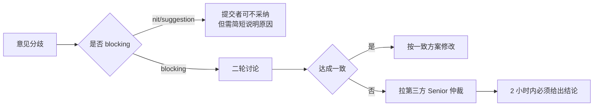

# 00 · Code Review 通用规范

> **本文档是 FDE 工作台 CR 体系的基线规范**，适用于所有子工程（web/api/ai-orchestrator）。分栈细则（[01-前端](./01-前端CR规范.md) / [02-后端](./02-后端CR规范.md) / [03-AI 代码](./03-AI代码CR规范.md)）在此基础上扩展专项内容。

| 项目 | 信息 |
|------|------|
| 文档版本 | v1.0 |
| 文档状态 | 正式发布 |
| 适用对象 | 全体研发（FE/BE/AI/QA）+ Reviewer |
| 编写依据 | [FDE工作台技术方案](../FDE工作台技术方案.md) + [详细设计](../detail-design/README.md) + [测试用例库](../test-cases/README.md) |
| 创建日期 | 2026-04-28 |

---

## 一、CR 哲学与基本原则

### 1.1 五条核心理念

> [!IMPORTANT]
> 1. **CR 不是挑刺，是协作演进**：目标是让代码更好，而不是证明谁对
> 2. **Review 代码不是 Review 人**：评论对事不对人，禁用"你怎么这都不会"等表述
> 3. **小步快跑**：单 PR ≤ 400 行变更，超过 800 行 Reviewer 有权要求拆分
> 4. **及时响应**：Reviewer 应在 24h 内首次响应（节假日除外）
> 5. **Approve 即背书**：点击 Approve 等同于"我也愿意为这段代码负责"

### 1.2 提交者职责

提交 PR 前**自检 6 项**：

| # | 自检项 | 不通过的影响 |
|---|--------|------------|
| 1 | 本地跑通 lint（`npm run lint` / `ruff check`）| Reviewer 直接 Request Changes |
| 2 | 本地跑通单元测试 | 同上 |
| 3 | PR 描述填写完整（背景/方案/影响/测试/截图）| Reviewer 拒绝 review |
| 4 | 自己先 review 一遍 diff | 浪费 Reviewer 时间 |
| 5 | 涉及 UI 改动必有截图 / 录屏 | UI 变更不可见 |
| 6 | 涉及破坏性变更必在 PR 标题加 `[BREAKING]` 标识 | 影响下游服务 |

### 1.3 Reviewer 职责

收到 Review 请求时**优先级排序**：

1. **Hotfix（生产事故修复）** — 1 小时内响应
2. **Blocker（阻塞他人开发）** — 4 小时内响应
3. **常规 PR** — 24 小时内首次响应
4. **重构 / 优化** — 48 小时内响应

Reviewer 必须做的 4 件事：

- ✅ 通读全部 diff（不只看作者标注的关键文件）
- ✅ 至少在本地 checkout 一次（涉及关键流程时）
- ✅ 区分评论严重程度（见 §1.4）
- ✅ 无问题时明确回复 `LGTM`，禁止只点 Approve 不留言

### 1.4 评论严重程度分级（强制使用）

每条评论必须以**前缀标签**起始，方便提交者快速分类处理：

| 前缀 | 含义 | 提交者必须处理 | 不处理可合并 |
|------|------|----------------|-------------|
| `[blocking]` | 阻塞合并：必须修改 | ✅ 是 | ❌ 否 |
| `[nit]` | 吹毛求疵：建议但不强制（如换行/命名微调）| ⚠️ 视情况 | ✅ 是 |
| `[question]` | 提问：请求作者解释 | ✅ 必须回复 | ✅ 是（解释清楚即可）|
| `[praise]` | 称赞：好的设计 | ❌ 不需要 | ✅ 是 |
| `[suggestion]` | 改进建议：可以下个 PR 优化 | ⚠️ 视情况 | ✅ 是 |

**评论示例**：

```markdown
[blocking] 此处缺少越权检查，攻击者可以通过修改 URL 访问他人项目。
请加上 require_role 或在 service 层做 ACL 校验。

[nit] 建议把这个魔法数字 86400 提取成常量 SECONDS_PER_DAY

[question] 这里为什么要用 Promise.all 而不是 Promise.allSettled？
如果其中一个失败，整批都会丢失，是预期行为吗？

[praise] 这里的状态机设计很优雅，把复杂的 actionCard 流转梳理得很清晰

[suggestion] 这段逻辑可以抽到 utils 中复用，可以下个 PR 重构
```

### 1.5 决议机制

当提交者与 Reviewer 意见不一致时：



---

## 二、6 大类通用 Checklist

> 本节为**全栈通用**的 6 大类规则，分栈细则在此基础上扩展。每条规则配 good/bad 示例（伪代码或真实片段）。

### 2.1 功能正确性

#### CR-G-FUNC-001 边界值必须显式处理

任何输入必须考虑：空值（null/undefined/None）、空数组、0、负数、最大值、超长字符串。

❌ Bad：

```typescript
function getFirstUser(users: User[]): User {
  return users[0]  // 空数组会返回 undefined，但类型签名说返回 User
}
```

✅ Good：

```typescript
function getFirstUser(users: User[]): User | null {
  if (users.length === 0) return null
  return users[0]
}
```

#### CR-G-FUNC-002 异常路径必有处理或显式日志

捕获异常后必须：处理、抛出新异常、或至少记录日志。**禁止 silent catch**。

❌ Bad：

```python
try:
    result = await llm.invoke(prompt)
except Exception:
    pass  # 静默吞掉异常，bug 难以追溯
```

✅ Good：

```python
try:
    result = await llm.invoke(prompt)
except LlmTimeoutError as e:
    logger.warning("llm_invoke_timeout", prompt_id=prompt.id, error=str(e))
    raise BizException(ErrorCode.SYS_LLM_TIMEOUT) from e
```

#### CR-G-FUNC-003 事务边界明确

涉及多个 DB 写操作时，必须明确事务边界，禁止"半成功"状态。

❌ Bad：

```python
async def create_project_with_members(data):
    project = await project_repo.create(data.project)  # 写 1
    for m in data.members:
        await member_repo.add(project.id, m)            # 写 N，中途失败会留下脏数据
```

✅ Good：

```python
async def create_project_with_members(data, session: AsyncSession):
    async with session.begin():
        project = await project_repo.create(session, data.project)
        for m in data.members:
            await member_repo.add(session, project.id, m)
        # 任一步失败都会整体回滚
    return project
```

#### CR-G-FUNC-004 写操作必须考虑幂等

涉及"创建任务""扣款""发送消息"等不可重复操作，必须有幂等保障（actionId / 业务唯一键 / 数据库唯一索引）。

❌ Bad：

```python
@router.post("/orders")
async def create_order(req: CreateOrderRequest):
    return await order_service.create(req)  # 用户网络抖动重发会创建 2 个订单
```

✅ Good：

```python
@router.post("/orders")
async def create_order(
    req: CreateOrderRequest,
    idempotency_key: str = Header(...)
):
    # 用 redis SETNX 做幂等，5 分钟内同一 key 只允许处理一次
    if not await redis.set(f"idem:{idempotency_key}", "1", nx=True, ex=300):
        return await order_service.get_by_idem_key(idempotency_key)
    return await order_service.create(req, idempotency_key)
```

#### CR-G-FUNC-005 并发安全

共享资源（计数器、缓存写、文件写）必须考虑并发，禁止 Read-Modify-Write 无锁操作。

❌ Bad：

```python
async def increment_view_count(article_id: int):
    article = await repo.get(article_id)
    article.view_count += 1                # 并发下会丢更新
    await repo.update(article)
```

✅ Good：

```python
async def increment_view_count(article_id: int):
    # 用 SQL 原子 +1，避免 RMW
    await session.execute(
        update(Article).where(Article.id == article_id).values(view_count=Article.view_count + 1)
    )
```

#### Checklist 速查

- [ ] 所有外部输入都考虑了 null / 空 / 边界值
- [ ] 所有 try 都没有 silent catch
- [ ] 多写操作有事务包裹
- [ ] 幂等性已考虑（重复请求不会产生副作用）
- [ ] 并发场景使用了原子操作或锁

---

### 2.2 可读性

#### CR-G-READ-001 命名表意

变量、函数、类名必须能"望文生义"，禁止单字母、数字后缀（`a/b/c/data2`）、缩写（`mgr/svc/utl`）。

❌ Bad：

```typescript
const d = new Date()
const arr2 = arr.filter(x => x.s > 0)
function pdProc(d: any) { ... }
```

✅ Good：

```typescript
const today = new Date()
const activeUsers = users.filter(user => user.score > 0)
function processPaidOrder(order: Order) { ... }
```

允许的常见缩写白名单：`id / url / api / db / ui / qps / sql / json / xml / http / ttl`。

#### CR-G-READ-002 函数 ≤ 50 行 / 圈复杂度 ≤ 10

单函数超过 50 行或圈复杂度超过 10 的，必须拆分。

❌ Bad：

```python
async def handle_task_create(req):
    # 100 行：参数校验 + 权限检查 + 业务逻辑 + 通知 + 日志 全混在一起
    ...
```

✅ Good：

```python
async def handle_task_create(req):
    await _validate_request(req)
    await _check_permission(req.user, req.project_id)
    task = await _create_task(req)
    await _notify_assignee(task)
    await _audit_log(req.user, "task_create", task.id)
    return task
```

#### CR-G-READ-003 注释解释"为什么"，不是"做什么"

代码本身已经表达"做什么"，注释应该补充上下文（业务背景、历史决策）。

❌ Bad：

```python
# 把 status 设置为 done
task.status = "done"

# 循环遍历 users
for user in users:
    ...
```

✅ Good：

```python
# 任务完成后保留 7 天再归档（PRD §5.2.4 要求保留以便下游统计）
task.status = "done"
task.archive_after = datetime.now() + timedelta(days=7)

# 必须按 priority 倒序遍历，因为下游依赖了顺序约定（详见 ADR-007）
for user in sorted(users, key=lambda u: -u.priority):
    ...
```

#### CR-G-READ-004 禁用魔法数字

数字 0 / 1 / -1 / 100 等以外的"业务数字"必须提取为命名常量。

❌ Bad：

```python
if user.login_attempts > 5:                  # 5 是什么？
    user.locked_until = now + 1800          # 1800 是什么？
```

✅ Good：

```python
MAX_LOGIN_ATTEMPTS = 5
LOCK_DURATION_SECONDS = 30 * 60

if user.login_attempts > MAX_LOGIN_ATTEMPTS:
    user.locked_until = now + LOCK_DURATION_SECONDS
```

#### CR-G-READ-005 重复代码必须抽取（DRY）

同一段逻辑出现 ≥ 3 次必须抽函数；出现 2 次时视具体场景。

❌ Bad：

```python
# project_service.py
hash_pwd = bcrypt.hashpw(req.password.encode(), bcrypt.gensalt()).decode()
# user_service.py
hash_pwd = bcrypt.hashpw(req.password.encode(), bcrypt.gensalt()).decode()
# auth_service.py
hash_pwd = bcrypt.hashpw(req.password.encode(), bcrypt.gensalt()).decode()
```

✅ Good：

```python
# app/utils/password.py
def hash_password(plain: str) -> str:
    return bcrypt.hashpw(plain.encode(), bcrypt.gensalt()).decode()

# 各 service 调用
hash_pwd = hash_password(req.password)
```

#### CR-G-READ-006 禁止 Dead Code

注释掉的代码、未使用的 import、未调用的函数必须删除（git 历史里能找回来）。

❌ Bad：

```typescript
import { unused } from './lib'           // 未使用
// const oldLogic = () => { ... }        // 注释掉的旧逻辑
function neverCalled() { ... }           // 没有任何引用
```

#### Checklist 速查

- [ ] 所有命名都能"望文生义"（无 a/b/c/data2 等）
- [ ] 单函数 ≤ 50 行 / 圈复杂度 ≤ 10
- [ ] 注释解释"为什么"，不解释"做什么"
- [ ] 无魔法数字（业务数字提取为常量）
- [ ] 无重复代码（≥ 3 次必须抽取）
- [ ] 无注释掉的代码 / 未使用的 import / 未调用的函数

---

### 2.3 性能

#### CR-G-PERF-001 循环内禁止 IO / 查询

循环内调 DB / 网络 / 文件 IO 是最常见的性能杀手。必须改为批量。

❌ Bad（N+1 查询）：

```python
async def list_tasks_with_assignee():
    tasks = await task_repo.find_all()      # 1 次查询
    for task in tasks:
        task.assignee = await user_repo.get(task.assignee_id)  # N 次查询
    return tasks
```

✅ Good：

```python
async def list_tasks_with_assignee():
    tasks = await task_repo.find_all()
    user_ids = list({task.assignee_id for task in tasks})
    users = await user_repo.get_many(user_ids)      # 1 次批量
    user_map = {u.id: u for u in users}
    for task in tasks:
        task.assignee = user_map.get(task.assignee_id)
    return tasks
```

#### CR-G-PERF-002 大列表必须分页

列表返回 > 100 条必须有分页机制，禁止"一次性返回全部"。

❌ Bad：

```python
@router.get("/customers")
async def list_customers():
    return await customer_repo.find_all()  # 客户表 5 万行，前端页面卡死
```

✅ Good：

```python
@router.get("/customers")
async def list_customers(
    page: int = Query(1, ge=1),
    page_size: int = Query(20, ge=1, le=100)
):
    return await customer_repo.find_paged(page, page_size)
```

#### CR-G-PERF-003 性能基线对齐

涉及性能敏感路径（首屏 / API / SSE 首 token），必须能达到 PRD §7.1 基线：

| 场景 | 基线 |
|------|------|
| 前端首屏（FCP）| < 1.5s |
| 页面切换 / 路由 | < 200ms |
| API P95 响应时间 | < 500ms |
| AI SSE 首 token | < 1s |
| @ 引用弹窗响应 | < 100ms |

不满足必须加性能优化（缓存 / CDN / 懒加载 / 索引），否则 blocking。

#### CR-G-PERF-004 警惕异步阻塞

JS 主线程 / Python 协程内禁止同步阻塞操作。

❌ Bad：

```python
async def export_report():
    data = await fetch_data()
    pdf = generate_pdf_sync(data)   # 同步 CPU 密集，会阻塞整个 event loop
    return pdf
```

✅ Good：

```python
async def export_report():
    data = await fetch_data()
    # 重 CPU 任务交给线程池或丢进 Celery 异步队列
    pdf = await asyncio.to_thread(generate_pdf_sync, data)
    return pdf
```

#### CR-G-PERF-005 缓存使用规范

使用缓存必须明确：缓存 key 设计 / TTL / 失效策略 / 缓存穿透保护。

❌ Bad：

```python
# 没有 TTL，可能永久脏数据
await redis.set("user:123", json.dumps(user))
```

✅ Good：

```python
USER_CACHE_TTL = 5 * 60  # 5 分钟

async def get_user_cached(user_id: int):
    key = f"user:{user_id}"
    cached = await redis.get(key)
    if cached:
        return User.model_validate_json(cached)
    user = await user_repo.get(user_id)
    if user:
        await redis.set(key, user.model_dump_json(), ex=USER_CACHE_TTL)
    return user
```

#### Checklist 速查

- [ ] 循环内无 DB / 网络 / 文件 IO（无 N+1）
- [ ] 列表接口都有分页
- [ ] 性能敏感路径满足 PRD §7.1 基线
- [ ] 协程内无同步阻塞调用
- [ ] 所有缓存都有明确 TTL 与失效策略

---

### 2.4 安全

#### CR-G-SEC-001 用户输入必经校验

所有外部输入（HTTP body / query / header / cookie / 文件名）必须经过类型 + 范围校验。

❌ Bad：

```python
@router.post("/tasks")
async def create_task(data: dict):  # dict 没有任何约束
    return await service.create(data)
```

✅ Good：

```python
class CreateTaskRequest(BaseModel):
    title: str = Field(..., min_length=1, max_length=200)
    priority: Literal["P0", "P1", "P2", "P3"]
    deadline: datetime | None = None

@router.post("/tasks")
async def create_task(req: CreateTaskRequest):
    return await service.create(req)
```

#### CR-G-SEC-002 输出必经 escape（防 XSS）

任何用户提供的字符串渲染到页面前必须 escape；使用 v-html / dangerouslySetInnerHTML 必经 sanitize。

❌ Bad（前端）：

```vue
<!-- 用户输入的 comment 包含 <script> 会被执行 -->
<div v-html="comment.content"></div>
```

✅ Good：

```vue
<!-- 默认插值会自动 escape -->
<div>{{ comment.content }}</div>

<!-- 必须用 v-html 时经 DOMPurify -->
<div v-html="DOMPurify.sanitize(comment.content)"></div>
```

#### CR-G-SEC-003 SQL / NoSQL 必用参数化

禁止字符串拼接 SQL，必须使用 ORM 或参数化查询。

❌ Bad：

```python
# SQL 注入：keyword=' OR 1=1 -- 会返回所有数据
sql = f"SELECT * FROM tasks WHERE title LIKE '%{keyword}%'"
result = await session.execute(text(sql))
```

✅ Good：

```python
# ORM
result = await session.execute(
    select(Task).where(Task.title.like(f"%{keyword}%"))
)
# 或 text + 参数绑定
result = await session.execute(
    text("SELECT * FROM tasks WHERE title LIKE :kw"),
    {"kw": f"%{keyword}%"}
)
```

#### CR-G-SEC-004 敏感字段禁止入日志

`password / token / secret_key / phone / id_card / bank_card` 等禁止打印到日志。

❌ Bad：

```python
logger.info("user login", username=req.username, password=req.password)
```

✅ Good：

```python
logger.info("user_login_attempt", username=req.username)  # 不打 password
# Pydantic 模型可用 SecretStr 类型
class LoginRequest(BaseModel):
    username: str
    password: SecretStr  # 默认 repr 显示 "**********"
```

#### CR-G-SEC-005 越权检查（行级 ACL）

所有"读取/修改他人数据"的操作必须显式校验数据归属。

❌ Bad：

```python
@router.get("/projects/{project_id}")
async def get_project(project_id: int, user: User = Depends(current_user)):
    return await project_repo.get(project_id)  # 任意用户都能访问任意项目
```

✅ Good：

```python
@router.get("/projects/{project_id}")
async def get_project(project_id: int, user: User = Depends(current_user)):
    project = await project_repo.get(project_id)
    if not project:
        raise BizException(ErrorCode.BIZ_NOT_FOUND)
    if user.id not in project.member_ids and "admin" not in user.roles:
        raise BizException(ErrorCode.BIZ_FORBIDDEN)
    return project
```

#### CR-G-SEC-006 凭证 / Secret 禁止硬编码

API Key / DB 密码 / JWT Secret 必须从环境变量或配置中心读取。

❌ Bad：

```python
JWT_SECRET = "my-super-secret-key-12345"  # 硬编码进代码仓库
DB_PASSWORD = "Pwd@2024"
```

✅ Good：

```python
# config/settings.py
class Settings(BaseSettings):
    jwt_secret: str = Field(..., env="JWT_SECRET")
    db_password: str = Field(..., env="DB_PASSWORD")

settings = Settings()
# 启动时如果环境变量缺失会立刻报错
```

#### Checklist 速查

- [ ] 所有外部输入有 Pydantic / TS 类型校验
- [ ] 所有用户字符串渲染前已 escape / sanitize
- [ ] 所有 SQL 都用 ORM 或参数化（无字符串拼接）
- [ ] 敏感字段未入日志（password / token / phone）
- [ ] 行级 ACL 已校验（个人 / 项目 / 客户三级）
- [ ] 无硬编码的 API Key / 密码 / JWT Secret

---

### 2.5 测试

#### CR-G-TEST-001 新增功能必带单测

新增 public 函数 / API endpoint / Vue 组件必须配套单测。

❌ Bad：PR 新增 5 个 service 方法，0 行测试代码。

✅ Good：每个新方法至少 1 个正向 + 1 个异常用例。

```python
# tests/services/test_task_service.py
async def test_create_task_success():
    req = CreateTaskRequest(title="test", priority="P1")
    task = await task_service.create(req)
    assert task.id is not None
    assert task.status == "todo"

async def test_create_task_invalid_priority():
    with pytest.raises(ValidationError):
        CreateTaskRequest(title="test", priority="P9")  # 不存在的优先级
```

#### CR-G-TEST-002 修复 bug 必带回归用例

修复 bug 时必须新增能复现该 bug 的测试用例（防止再次回归）。

❌ Bad：修了 bug 但没加测试，下次重构又踩同样的坑。

✅ Good：

```python
# tests/regression/test_bug_2026_04_28_task_count.py
async def test_task_count_excludes_archived():
    """
    Bug: PR#234, 任务数统计错误地包含了 archived 状态
    Fixed: PR#235, 在 count() 中加了 status != 'archived' 过滤
    """
    await _create_tasks(status="todo", count=3)
    await _create_tasks(status="archived", count=2)
    count = await task_service.count_active()
    assert count == 3  # 不应该是 5
```

#### CR-G-TEST-003 Mock 不可滥用

外部依赖（DB / Redis / 第三方 API / LLM）必须 mock；同模块内的协作类**不应** mock（mock 越多测试越脆弱）。

❌ Bad：

```python
# 把同模块的 helper 都 mock 掉，测试失去意义
mocker.patch("app.services.task_service._validate")
mocker.patch("app.services.task_service._notify")
mocker.patch("app.services.task_service._audit_log")
result = await task_service.create(req)  # 测了什么？
```

✅ Good：

```python
# 只 mock 外部 IO，内部逻辑真实跑
mocker.patch("app.repositories.user_repo.get", return_value=fake_user)
mocker.patch("app.clients.dingtalk.send", return_value=True)
result = await task_service.create(req)
assert result.id  # 真实跑了 _validate / _notify / _audit_log
```

#### CR-G-TEST-004 覆盖率门槛

| 范围 | 行覆盖率 | 分支覆盖率 |
|------|---------|----------|
| 核心业务（Service / Repository）| ≥ 80% | ≥ 70% |
| API Controller | ≥ 70% | ≥ 60% |
| 工具类 / 通用层 | ≥ 90% | ≥ 80% |
| 整体 | ≥ 70% | ≥ 60% |

CI 必须卡点：覆盖率不达标 PR 无法合并。

#### CR-G-TEST-005 测试要可重复 / 独立

测试用例之间禁止依赖执行顺序，禁止依赖外部状态（时间 / 环境 / 网络）。

❌ Bad：

```python
def test_a():
    global_counter += 1   # 依赖全局状态
    assert global_counter == 1  # 第二次跑就会失败
```

✅ Good：

```python
def test_a(setup_clean_db):  # 每个测试独立的 fixture
    counter = Counter()
    counter.increment()
    assert counter.value == 1
```

#### Checklist 速查

- [ ] 新增 public 函数 / API / 组件都有单测
- [ ] 修 bug 都带了能复现的回归用例
- [ ] 只 mock 外部 IO，不 mock 内部协作
- [ ] 覆盖率达标（核心 ≥ 80% / 整体 ≥ 70%）
- [ ] 测试用例可重复执行（无全局状态依赖）

---

### 2.6 文档

#### CR-G-DOC-001 Public API 必有 docstring / JSDoc

对外暴露的函数 / 类 / API endpoint 必须有完整文档。

❌ Bad：

```python
async def create_task(req, user):
    ...
```

✅ Good：

```python
async def create_task(req: CreateTaskRequest, user: UserContext) -> Task:
    """
    创建一个新任务并指派负责人。

    Args:
        req: 创建任务的请求体（含 title / priority / deadline / project_id）
        user: 当前登录用户上下文

    Returns:
        创建后的 Task 对象（含 id / 默认 status=todo / created_at）

    Raises:
        BizException(BIZ_NO_PROJECT_PERMISSION): 用户对该 project_id 无权限
        BizException(BIZ_TITLE_DUPLICATE): 同项目下已存在同名任务
    """
    ...
```

#### CR-G-DOC-002 复杂业务逻辑必有内联注释

涉及业务规则、特殊算法、历史决策的代码块必须有注释。

❌ Bad：

```python
score = base * 0.7 + recent * 0.2 + senior * 0.1
```

✅ Good：

```python
# FDE 健康度评分公式（详见 PRD §5.3.3）：
# - 基础分（任务完成率）权重 70%
# - 近期表现权重 20%
# - 资历加成权重 10%
score = base * 0.7 + recent * 0.2 + senior * 0.1
```

#### CR-G-DOC-003 破坏性变更必更新 CHANGELOG

API 删除、字段重命名、行为变更必须在 `CHANGELOG.md` 标注 `BREAKING`。

✅ Good（CHANGELOG.md 示例）：

```markdown
## [0.5.0] - 2026-05-15

### BREAKING
- `GET /api/v1/projects/{id}` 返回结构 `health` 字段从 number 改为 enum string
  ('green'|'yellow'|'red')，前端需同步升级
- 删除已废弃的 `/api/v1/legacy/tasks` 端点（预告于 v0.4.0）

### Added
- 新增 `/api/v1/projects/{id}/risks` 端点
```

#### CR-G-DOC-004 配置变更必更新 .env.example

新增 / 修改环境变量必须同步更新 `.env.example` 与 `README`。

❌ Bad：

```python
# settings.py 新增了一个必填配置
new_feature_flag: bool = Field(..., env="NEW_FEATURE_FLAG")
# 但 .env.example 没更新，新人 clone 后启动直接报错
```

✅ Good：

```env
# .env.example 同步加了一行说明
# 控制是否启用新版任务卡片，true=新版/false=旧版（默认 false）
NEW_FEATURE_FLAG=false
```

#### CR-G-DOC-005 README 与代码同源

涉及目录结构、启动方式、依赖变化必须同步更新 README。

#### Checklist 速查

- [ ] 所有 public 函数 / API 都有 docstring / JSDoc
- [ ] 复杂业务规则有内联注释（解释"为什么"）
- [ ] 破坏性变更已更新 CHANGELOG 并标 BREAKING
- [ ] 新增环境变量已同步 .env.example
- [ ] 涉及结构变更的 README 已更新

---

## 三、CR 流程规范

### 3.1 分支策略

```
main                     生产分支，仅接受来自 release/* 的合并
  │
  └── develop            集成分支，所有 feature 合到这里
        ├── feat/{ID}-{slug}     新功能（需对应任务 ID）
        ├── fix/{ID}-{slug}      修 bug
        ├── refactor/{ID}-{slug} 重构
        ├── chore/{ID}-{slug}    杂项（依赖升级、配置改动）
        └── docs/{ID}-{slug}     纯文档
  │
  └── release/v{X.Y.Z}   发布分支，从 develop 切出，仅接受 hotfix
        └── hotfix/{slug} 紧急生产修复（同步合回 main + develop）
```

**命名示例**：

```
feat/T-235-task-batch-update          ✅
fix/T-189-actionId-expired-handling   ✅
my-branch                              ❌ 缺少类型与 ID
fix-bug                                ❌ 太模糊
```

### 3.2 PR 标题与描述模板

**标题**：`{type}({scope}): {summary}` （Conventional Commits）

```
feat(task): 支持任务批量延期操作      ✅
fix(copilot): 修复 actionId 过期未提示  ✅
[BREAKING] feat(api): 重构 health 字段类型  ✅（破坏性必加 [BREAKING]）
update code                            ❌
```

**描述模板**（必填 5 段）：

```markdown
## 背景
<为什么要改？关联的需求 / Bug 链接>

## 方案
<怎么改的？关键设计点 / 涉及的模块>

## 影响范围
<改了哪些文件 / 影响哪些下游 / 是否破坏性变更>

## 测试
- [ ] 单测已补充并通过
- [ ] 本地手工验证（贴步骤）
- [ ] 涉及 UI：截图 / 录屏

## 风险与回滚
<潜在风险 / 回滚方案>
```

### 3.3 Reviewer 指派规则

| PR 类型 | 必须的 Reviewer |
|---------|----------------|
| 普通 feature/fix | ≥1 same-stack（同栈）同事 |
| 跨服务（涉及 web+api 或 api+ai）| ≥1 same-stack + ≥1 cross-stack |
| 涉及 DB schema 变更 | + 1 名后端 owner |
| 涉及安全（鉴权 / 加密）| + 1 名安全 owner |
| 涉及 AI Prompt / Agent 改动 | + 1 名 AI owner |
| Hotfix | ≥2 人（含 1 名 senior）|

### 3.4 合并门槛（强制）

PR 可以合并的**充要条件**：

1. ✅ CI 全绿（lint + test + build + 覆盖率）
2. ✅ 至少 1 个 LGTM（关键模块 ≥2）
3. ✅ 所有 `[blocking]` 评论已解决
4. ✅ 所有 `[question]` 评论已回复
5. ✅ PR 描述完整（5 段）
6. ✅ 无未解决的合并冲突
7. ✅ 涉及 DB 变更：DBA 已 review

不满足任一条 PR 不允许 merge（CI / 平台层应做强制卡点）。

### 3.5 评论处理 SLA

| 评论类型 | 提交者响应 SLA |
|---------|--------------|
| `[blocking]` | 24h 内回应（修改或讨论）|
| `[question]` | 24h 内回复 |
| `[nit]` / `[suggestion]` | 可在合并后下个 PR 处理 |
| `[praise]` | 不需要回复 |

---

## 四、反模式案例库

> 以下是日常 CR 中最常出现的 5 类反模式，必须能识别并要求修改。

### 4.1 God Function（上帝函数）

**特征**：单函数 100+ 行 / 多重嵌套 / 多职责。

❌ Bad：

```python
async def process_order(order_data):
    # 步骤 1: 校验（30 行）
    if not order_data.get("user_id"): ...
    if not order_data.get("items"): ...
    # ... 略

    # 步骤 2: 库存扣减（25 行）
    for item in order_data["items"]:
        if item["count"] > stock[item["sku"]]: ...
        # ...

    # 步骤 3: 计算价格（20 行）
    # ...

    # 步骤 4: 写入 DB（15 行）
    # ...

    # 步骤 5: 发送通知（10 行）
    # ...
    # 总共 ~150 行，圈复杂度爆炸
```

✅ Good：每步抽函数 + 主流程做编排（参考 §2.2 CR-G-READ-002）

---

### 4.2 Magic Number（魔法数字）

**特征**：业务相关数字直接出现在代码中，无任何说明。

❌ Bad：

```typescript
if (file.size > 10485760) {
  throw new Error('文件过大')
}
setTimeout(retry, 5000)
const fee = total * 0.06
```

✅ Good：

```typescript
const MAX_FILE_SIZE_BYTES = 10 * 1024 * 1024  // 10 MB（PRD §5.6 规定）
const RETRY_DELAY_MS = 5_000
const SERVICE_FEE_RATE = 0.06                  // 6% 服务费

if (file.size > MAX_FILE_SIZE_BYTES) { ... }
setTimeout(retry, RETRY_DELAY_MS)
const fee = total * SERVICE_FEE_RATE
```

---

### 4.3 Silent Catch（静默吞异常）

**特征**：catch 后什么都不做，bug 难以追溯。

❌ Bad：

```python
try:
    result = await api.invoke()
except Exception:
    pass

try:
    parsed = json.loads(text)
except:
    parsed = {}
```

✅ Good：

```python
try:
    result = await api.invoke()
except ApiTimeoutError as e:
    logger.warning("api_timeout", error=str(e))
    raise BizException(ErrorCode.SYS_API_TIMEOUT) from e
except Exception as e:
    logger.exception("api_unexpected_error")
    raise

try:
    parsed = json.loads(text)
except json.JSONDecodeError as e:
    logger.warning("invalid_json", text_preview=text[:100], error=str(e))
    parsed = {}  # 显式给默认值，但日志里有迹可循
```

---

### 4.4 Copy-Paste Coding（重复代码）

**特征**：同一段逻辑 ctrl+c/v 出现在多处，改一处忘一处。

❌ Bad：

```python
# 在 10 个 endpoint 中各自重复了同样的脱敏逻辑
@router.get("/users")
async def list_users():
    users = await repo.list()
    for u in users:
        u.phone = u.phone[:3] + "****" + u.phone[-4:]
        u.email = u.email[0] + "****" + u.email.split("@")[1]
    return users

@router.get("/customers")
async def list_customers():
    customers = await repo.list()
    for c in customers:
        c.phone = c.phone[:3] + "****" + c.phone[-4:]  # 又写一次
        c.email = c.email[0] + "****" + c.email.split("@")[1]
    return customers
```

✅ Good：

```python
# app/utils/mask.py
def mask_phone(phone: str) -> str:
    return phone[:3] + "****" + phone[-4:] if len(phone) >= 7 else phone

def mask_email(email: str) -> str:
    name, domain = email.split("@", 1)
    return name[0] + "****@" + domain

# Pydantic 模型用 field_validator 统一处理
class UserMasked(BaseModel):
    phone: str
    email: str
    @field_validator("phone")
    def mask_p(cls, v): return mask_phone(v)
    @field_validator("email")
    def mask_e(cls, v): return mask_email(v)
```

---

### 4.5 Premature Optimization（过早优化）

**特征**：还没有性能问题就引入复杂的缓存 / 并发 / 池化，增加维护成本。

❌ Bad：

```python
# 用户量 100 人的内部系统，引入了 5 层缓存：
# Browser cache → CDN → Nginx cache → Redis L1 → Redis L2 → DB
# 维护成本极高，且缓存一致性问题频发
```

✅ Good：

```
原则：
- 先满足正确性，再考虑性能
- 性能优化必须有压测数据 / 监控告警佐证
- 引入缓存前先看 SQL 是否走索引
```

---

## 五、Checklist 速查表（可打印）

> Reviewer 可对照本表逐项勾选，未勾选项必须有 [blocking] 评论说明。

### 5.1 功能正确性（5 条）

- [ ] 边界值（null / 空 / 0 / 最大值）显式处理
- [ ] 异常路径有处理或日志（无 silent catch）
- [ ] 多写操作有事务包裹
- [ ] 写操作有幂等保障
- [ ] 共享资源使用原子操作或锁

### 5.2 可读性（6 条）

- [ ] 命名表意（无 a/b/c/data2）
- [ ] 函数 ≤ 50 行 / 圈复杂度 ≤ 10
- [ ] 注释解释"为什么"
- [ ] 无魔法数字
- [ ] 无重复代码
- [ ] 无 dead code

### 5.3 性能（5 条）

- [ ] 循环内无 IO / 查询
- [ ] 列表接口有分页
- [ ] 满足 PRD §7.1 性能基线
- [ ] 协程内无同步阻塞
- [ ] 缓存有 TTL 与失效策略

### 5.4 安全（6 条）

- [ ] 用户输入有 Pydantic / TS 校验
- [ ] 输出有 escape / sanitize
- [ ] SQL 用 ORM / 参数化
- [ ] 敏感字段未入日志
- [ ] 越权检查（行级 ACL）
- [ ] 无硬编码 Secret

### 5.5 测试（5 条）

- [ ] 新增功能有单测
- [ ] 修 bug 有回归用例
- [ ] 只 mock 外部 IO
- [ ] 覆盖率达标
- [ ] 测试可重复执行

### 5.6 文档（5 条）

- [ ] Public API 有 docstring / JSDoc
- [ ] 复杂业务有内联注释
- [ ] 破坏性变更更新 CHANGELOG
- [ ] 新环境变量同步 .env.example
- [ ] 结构变更同步 README

---

## 六、补充资源

### 6.1 分栈细则

- [01-前端 CR 规范](./01-前端CR规范.md) — Vue 3 / TypeScript / Pinia 专项
- [02-后端 CR 规范](./02-后端CR规范.md) — Python / FastAPI / SQLAlchemy 专项
- [03-AI 代码 CR 规范](./03-AI代码CR规范.md) — LangGraph / Prompt / RAG 专项

### 6.2 相关文档

- [详细设计](../detail-design/README.md) — 工程蓝图（含 lint / 异常码体系）
- [测试用例库](../test-cases/README.md) — 测试视角的质量基线
- [PRD §7 非功能需求](../FDE工作台产品需求文档.md) — 性能 / 安全基线

### 6.3 修订记录

| 版本 | 日期 | 修订人 | 内容 |
|------|------|--------|------|
| v1.0 | 2026-04-28 | 吾明 | 通用规范首版（CR 哲学 + 6 大类 Checklist + 流程 + 反模式） |

---

**通用规范结束** · 进入分栈细则前，请先吃透本文档。
