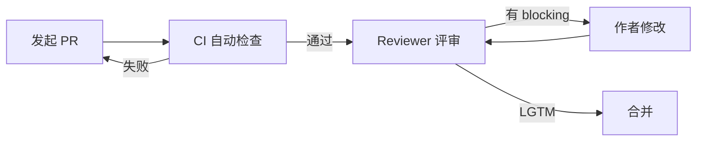

# FDE 工作台 Code Review 规范库 · 总索引

> 本目录是 FDE 工作台 v1.0 的 **Code Review 规范库**，包含 1 份通用规范 + 3 份分栈细则，共 **4 份规范文档**，合计 **5080 行**（含示例代码）。

| 项目 | 信息 |
|------|------|
| 文档版本 | v1.0 |
| 适用产品 | FDE 工作台 v1.0 |
| 编写依据 | [详细设计](../detail-design/README.md) + [测试用例库](../test-cases/README.md) + [PRD](../FDE工作台产品需求文档.md) |
| 创建日期 | 2026-04-28 |

---

## 一、文档清单（4 份）

> [!IMPORTANT]
> **任何 Reviewer 与提交者上岗前**必须先吃透 [00-通用规范.md](./00-通用规范.md)，再根据自己负责的栈选读对应分栈细则。

| # | 文档 | 适用对象 | 实际行数 | 规则数 | 主要章节 |
|---|------|---------|---------|--------|---------|
| 0 | [00-通用规范.md](./00-通用规范.md) | 全员 | 1222 | 32 | CR 哲学 / 6 大类 Checklist / CR 流程 / 反模式 / 速查表 |
| 1 | [01-前端CR规范.md](./01-前端CR规范.md) | FE | 1084 | 43 | Vue 组件 / TS 类型 / Pinia / API / 性能 / 安全 / 测试 / Copilot / Lint |
| 2 | [02-后端CR规范.md](./02-后端CR规范.md) | BE | 1572 | 51 | API 设计 / 分层 / DB / 异常码 / 安全 / 性能 / 测试 / 跨服务 / Copilot 二次确认 / Lint |
| 3 | [03-AI代码CR规范.md](./03-AI代码CR规范.md) | AI | 1202 | 33 | LangGraph Agent / Prompt 工程 / Function Calling / RAG / LlmAdapter / AI 安全 / AI 测试 |

**合计**：4 份规范，5080 行，**159 条具体规则**，全部配 good/bad 代码对照。

---

## 二、CR 五大哲学（速记）

> 详见 [00-通用规范.md §一](./00-通用规范.md#一cr-哲学与基本原则)

1. **CR 不是挑刺，是协作演进** — 让代码更好，而非证明谁对
2. **Review 代码不是 Review 人** — 评论对事不对人
3. **小步快跑** — 单 PR ≤ 400 行，超过 800 行强制拆分
4. **及时响应** — Reviewer 24h 内首次响应
5. **Approve 即背书** — 点 Approve 等同于"我也愿为这段代码负责"

---

## 三、按栈选读对照表

| 你负责的代码位置 | 必读 | 选读 |
|-----------------|------|------|
| `workspace/web/` | 00 + 01 | - |
| `workspace/api/` | 00 + 02 | 03（涉及 AI 接入时）|
| `workspace/ai-orchestrator/` | 00 + 03 | 02（涉及与 api 通信时）|
| `workspace/shared-protos/` | 00 + 02 | 01（前端类型生成）|
| `workspace/infra/` `workspace/scripts/` | 00 | - |
| `docs/` 文档 | 00 §2.6 文档章节 | - |

---

## 四、6 大类 Checklist 速查（4 份文档导航）

每份文档统一按 6 大类组织 Checklist。下表帮助你快速定位某类规则在哪份文档：

| 类别 | 通用 §（00, 32 条）| 前端专项 §（01, 43 条）| 后端专项 §（02, 51 条）| AI 专项 §（03, 33 条）|
|------|------------------|----------------------|----------------------|---------------------|
| 功能正确性 | §2.1（5 条）| §一 Vue 响应式（7 条）| §四 异常处理（6 条）| §一 Agent 节点异常（6 条）|
| 可读性 | §2.2（6 条）| §二 TS 类型（5 条）| §二 分层（5 条）| §二 Prompt 工程（5 条）|
| 性能 | §2.3（5 条）| §五 性能（6 条：首屏 / 懒加载 / 虚拟滚动）| §六 性能（6 条：async / Celery / Redis TTL）| §四 RAG 性能（6 条：批量 embedding / rerank fallback）|
| 安全 | §2.4（6 条）| §六 安全（5 条：DOMPurify / XSS / token 存储）| §五 安全（8 条：current_user / SQL 注入 / 文件上传）| §六 AI 安全（6 条：PII 脱敏 / Prompt 注入）|
| 测试 | §2.5（5 条）| §七 测试（4 条：vitest / @vue/test-utils）| §七 测试（6 条：pytest-asyncio / testcontainers）| §七 AI 测试（6 条：eval set / regression / Mock）|
| 文档 | §2.6（5 条）| §二 TS 类型注释 | §一 OpenAPI / docstring | §二 Prompt 文件化 |

---

## 五、CR 工作流极简版（3 步）

**详细流程**：[00-通用规范.md §三 CR 流程规范](./00-通用规范.md#三cr-流程规范)

**评论分级使用**（强制）：

| 前缀 | 用途 | 是否阻塞合并 |
|------|------|-------------|
| `[blocking]` | 必须修改才能合并 | ✅ 阻塞 |
| `[nit]` | 微小改进建议 | ❌ 不阻塞 |
| `[question]` | 提问要求作者解释 | ❌ 不阻塞（但需回复）|
| `[suggestion]` | 改进建议（可下个 PR）| ❌ 不阻塞 |
| `[praise]` | 称赞 | ❌ 不阻塞 |

---

## 六、与详细设计 / 测试用例库的关联

CR 规范并非孤立存在，与现有文档的关系如下：

| 现有文档 | 关系 |
|---------|------|
| [详细设计](../detail-design/README.md) | CR 规范的"工程蓝图"输入；CR 时对照详细设计验证一致性 |
| [测试用例库](../test-cases/README.md) | CR 规范的"测试视角"补充；CR 关注代码，测试用例关注行为 |
| [PRD §7 非功能需求](../FDE工作台产品需求文档.md) | CR 规范的性能 / 安全基线来源 |

---

## 七、贡献指南

1. **本规范不是石碑**：欢迎在 PR 中讨论改进；规范变更必须经全员讨论 + 至少 2 名 senior Approve
2. **新增规则的标准**：必须有真实 bug 案例或 ≥ 3 次重复评论佐证
3. **废弃规则**：标 `[已废弃]` 不删除，便于历史追溯
4. **规则编号**：`CR-{S}-{C}-NNN`，S = G(通用) / FE(前端) / BE(后端) / AI(AI 代码)，C = FUNC/READ/PERF/SEC/TEST/DOC

---

## 八、修订记录

| 版本 | 日期 | 修订人 | 内容 |
|------|------|--------|------|
| v1.0 | 2026-04-28 | 吾明 | CR 规范库首版（4 份文档：00 通用 + 01/02/03 分栈细则，合计 5080 行 / 159 条规则） |

---

**索引结束** · 开始 CR 之旅请从 [00-通用规范.md](./00-通用规范.md) 入手。
