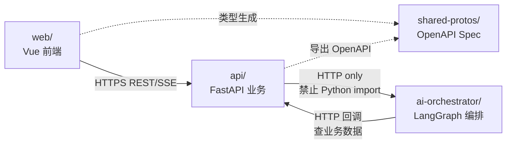

# FDE 工作台 · 目录结构设计

> **本文档是后续所有详细设计文档与代码任务的"位置约定基础"**。
> 任何文档、代码、配置、脚本都必须落在本文档定义的位置，避免散落和冲突。

| 项目 | 信息 |
|------|------|
| 文档版本 | v1.1 |
| 文档状态 | 正式发布（已与代码对齐） |
| 关联文档 | [总体技术方案](../FDE工作台技术方案.md) / [PRD](../FDE工作台产品需求文档.md) |
| 创建日期 | 2026-04-28 |
| 最近更新 | 2026-05-06（v1.1：与 `workspace/` 实际代码同步，增补落地状态标注） |
| 适用对象 | 全体研发（FE/BE/AI/QA/OPS） |

---

## 〇、实施状态对照（v1.1 新增）

> 本节回填 `workspace/` 实际代码的落地状态，与本文档约定结构进行差异核对。

| 子目录 | 约定状态 | 实际状态 | 差异说明 |
|---|---|---|---|
| `workspace/web/` | 规划 | ✅ 已实施 | `src/pages/` 10 个、`src/stores/` 7 个、`src/apis/modules/` 9 个、`src/composables/` 2 个、`src/components/{common,layout,copilot,business}/` 已建 |
| `workspace/api/` | 规划 | ✅ 已实施 | `app/` 下 routers/services/repositories/models/schemas/deps/middleware/exceptions/tasks/integrations/ai_client/config 全部建立；alembic/versions/001_initial.py 已生成 18 张表完整 DDL |
| `workspace/ai-orchestrator/` | 规划 | ✅ 已实施 | `app/` 下 orchestrator(LangGraph graph.py)/safety/audit/routing(含 circuit_breaker)/rag(embedder/reranker/es_search/milvus_store/retriever)/tools(5 个工具模块)/llm/provider 全部建立；6 个 endpoint 在 main.py 暴露 |
| `workspace/shared-protos/` | 规划 | ⏳ 占位 | 仅 README，待 OpenAPI 自动导出脚本接入 |
| `workspace/infra/` | 规划 | ⏳ 部分实施 | 仅 docker-compose 已建；k8s/helm/grafana/argocd 待补 |
| `workspace/scripts/` | 规划 | ⏳ 部分实施 | dev/start-all 已建；data 导入脚本与 ci 校验脚本待补 |

### 与本文档不一致的最小调整

1. **后端 `tasks/` 子模块**：实际 Celery 任务模块已落地为 `data_sync.py / rag_index.py / weekly_report.py / notification.py + celery_app.py`，与本文档约定一致
2. **后端 `integrations/` 子模块**：实际为 `aone_client / crm_client / oss_client / dingtalk_client / yuque_client`，与约定一致
3. **AI 服务 `orchestrator/`**：实际采用 `graph.py + prompts.py + prompts/` 而非 `main_graph.py + state.py + subgraphs/` 的多文件拆分（出于早期单图迭代效率考虑），后续按需重构为 subgraphs
4. **AI 服务 `adapters/`**：实际落地为 `llm/provider.py`（LlmProvider 抽象），命名与约定不同但语义一致——**后续重命名计划**：在 v2 拆分多 provider 时将路径改为 `app/adapters/`
5. **AI 服务 `routers/`**：当前所有 endpoint 集中在 `main.py`（6 个 endpoint），未拆分到 `routers/{chat,action,rag,health}.py`——**后续重构计划**：endpoint 数量超过 8 个时再拆分

详细更新请参见各子模块详细设计文档（01/02/03）。

---

## 一、设计原则

1. **单一事实来源（SSOT）**：每类资产只有一个标准位置，禁止散落
2. **monorepo 友好**：前端 / 后端 / AI / 基础设施 / 脚本 共仓管理，便于跨服务原子提交
3. **服务独立部署**：业务 API 与 AI Orchestrator 物理隔离（详见总体方案 §7.3），但代码同仓
4. **可演进**：现在为 monorepo，未来按需拆分为多 repo 时只需平移子目录
5. **文档与代码同源**：`docs/` 与 `workspace/` 平级，文档变更与代码变更走同一 PR
6. **新人友好**：每个一级目录都有 README，新人 `cat README.md` 即可上手

---

## 二、仓库根目录全景

```
fdework/                            # Git 仓库根
├── README.md                       # 项目门面：定位 / 快速启动 / 文档导航
├── .gitignore                      # 全局 ignore（见 §11）
├── .editorconfig                   # 编辑器统一配置
├── docs/                           # 全部文档（人类可读）
│   ├── FDE工作台产品需求文档.md     # PRD（已有，v1.0）
│   ├── FDE工作台技术方案.md         # 总体技术方案（已有，v1.0）
│   ├── prototype/                  # HTML 原型（已有，作为 UI 蓝本）
│   └── detail-design/              # 【本次新增】详细设计与任务总表
│       ├── README.md
│       ├── 00-目录结构设计.md       # 本文档
│       ├── 01-前端详细设计.md
│       ├── 02-后端详细设计.md
│       ├── 03-AI接入详细设计.md
│       ├── 04-数据存储详细设计.md
│       ├── 05-部署运维详细设计.md
│       ├── 06-AI对话中心详细设计.md
│       ├── 07-客户空间与文件中心详细设计.md
│       ├── 08-FDE教练与系统设置详细设计.md
│       └── 任务总表.md
├── workspace/                      # 【本次新增】代码 monorepo
│   ├── README.md                   # monorepo 总览
│   ├── web/                        # 前端 Vue 3 应用
│   ├── api/                        # 后端 FastAPI 业务服务
│   ├── ai-orchestrator/            # AI 编排独立服务（LangGraph）
│   ├── shared-protos/              # 跨服务共享协议（OpenAPI / Pydantic）
│   ├── infra/                      # 基础设施（Docker / K8s / Helm / Nginx / 监控）
│   └── scripts/                    # 一键脚本（dev / test / release / data / ci）
├── .changes/                       # 需求变更记录（已有，request-analysis skill 输出）
└── .aone_copilot/                  # Aone Copilot 计划目录（已有）
```

> [!IMPORTANT]
> **`docs/` 与 `workspace/` 平级**：人类可读资产 vs 机器可执行资产，互不污染。
> **`workspace/` 而非 `src/` 或 `apps/`**：避免与单一应用混淆，清晰表达"这是 monorepo"。

---

## 三、`docs/detail-design/` 详细规划

| 文件 | 行数预算 | 定位 | 主要使用者 |
|---|---|---|---|
| README.md | ~80 | 文档索引 + 阅读路径 | 全员 |
| 00-目录结构设计.md | ~600 | **目录约定本身** | 全员 |
| 01-前端详细设计.md | ~1200 | Vue 工程蓝图：组件/store/路由/类型 | FE |
| 02-后端详细设计.md | ~1500 | FastAPI 工程蓝图：API/Service/Repository/异常码 | BE |
| 03-AI接入详细设计.md | ~2000 | LangGraph + RAG + 5 助手 Prompt 全文 + 16 工具 | AI |
| 04-数据存储详细设计.md | ~1200 | MySQL DDL（25+表）/ Redis Key / ES mapping / Milvus Schema | BE+DA |
| 05-部署运维详细设计.md | ~1000 | Dockerfile / K8s / CI / 监控 / 应急预案 | OPS |
| 06-AI对话中心详细设计.md | ~600 | 三栏布局 / 历史 / 三种模式 / @ 引用 | FE+BE |
| 07-客户空间与文件中心详细设计.md | ~800 | 双栏 / 5 Tabs / 文件树 / 分片上传 / RAG 触发 | FE+BE |
| 08-FDE教练与系统设置详细设计.md | ~700 | 4 入口卡 / 案例库 / SOP / C 助手 prompt | FE+AI |
| 任务总表.md | ~1500 | ~100 个 Task（ID/标题/描述/优先级/工时） | PM+全员 |

---

## 四、`workspace/web/` 前端目录（Vue 3 + TypeScript）

```
web/
├── README.md                       # 启动指南、目录说明、关键依赖
├── public/                         # 静态资源（favicon、index.html 模板）
├── src/
│   ├── main.ts                     # 应用入口（创建 app + 注册插件 + mount）
│   ├── App.vue                     # 根组件（仅承载 RouterView）
│   ├── apis/                       # HTTP / SSE 客户端 + Mock 切换
│   │   ├── http.ts                 # Axios 实例 + 拦截器（auth/error/loading）
│   │   ├── sse.ts                  # SSE 客户端（基于 EventSource）
│   │   ├── modules/                # 按业务模块分
│   │   │   ├── auth.ts
│   │   │   ├── dashboard.ts
│   │   │   ├── tasks.ts
│   │   │   ├── projects.ts
│   │   │   ├── customers.ts
│   │   │   ├── files.ts
│   │   │   ├── coach.ts
│   │   │   ├── copilot.ts
│   │   │   └── mentions.ts
│   │   └── mock/                   # MSW Mock 数据（开发期，VITE_USE_MOCK=true 启用）
│   │       ├── handlers.ts
│   │       └── data/
│   ├── assets/                     # 图片/字体/svg 图标
│   │   ├── images/
│   │   ├── fonts/
│   │   └── icons/
│   ├── components/
│   │   ├── common/                 # 通用基础组件（无业务语义）
│   │   │   ├── HealthRing.vue
│   │   │   ├── StatusDot.vue
│   │   │   ├── EmptyState.vue
│   │   │   └── LoadingShimmer.vue
│   │   ├── layout/                 # 应用骨架
│   │   │   ├── AppLayout.vue       # Grid 三栏：Header + Nav + Main + Copilot
│   │   │   ├── AppHeader.vue
│   │   │   ├── AppNav.vue
│   │   │   └── AppFooter.vue
│   │   ├── copilot/                # AI 助手相关
│   │   │   ├── CopilotPanel.vue    # 4 助手统一壳
│   │   │   ├── MessageList.vue
│   │   │   ├── MessageRenderer.vue # 消息渲染分发器
│   │   │   ├── cards/              # 4 类卡片
│   │   │   │   ├── ActionCard.vue
│   │   │   │   ├── ReportCard.vue
│   │   │   │   ├── NextStepsCard.vue
│   │   │   │   └── SearchResultsCard.vue
│   │   │   ├── ChatInput.vue
│   │   │   └── MentionPicker.vue   # 5 类对象 @ 弹窗（与 chat 中心共用）
│   │   └── business/               # 业务组件
│   │       ├── KanbanCard.vue
│   │       ├── KanbanBoard.vue
│   │       ├── FileThumb.vue
│   │       ├── FileTree.vue
│   │       ├── TaskRow.vue
│   │       ├── ProjectHeader.vue
│   │       ├── CustomerCard.vue
│   │       ├── BestPracticeCard.vue
│   │       └── SopCard.vue
│   ├── composables/                # Vue 3 Composition API hooks
│   │   ├── useSSEChat.ts           # SSE 流式对话 hook
│   │   ├── useCopilot.ts           # 4 助手状态管理 hook
│   │   ├── useMention.ts           # @ 引用搜索 hook
│   │   ├── useAuth.ts
│   │   └── useTheme.ts
│   ├── pages/                      # 路由页面（按业务域分文件夹）
│   │   ├── login/
│   │   │   └── LoginPage.vue
│   │   ├── dashboard/
│   │   │   └── DashboardPage.vue
│   │   ├── tasks/
│   │   │   └── TasksPage.vue
│   │   ├── projects/
│   │   │   ├── ProjectsListPage.vue
│   │   │   └── ProjectDetailPage.vue
│   │   ├── customers/
│   │   │   └── CustomersPage.vue
│   │   ├── files/
│   │   │   └── FilesPage.vue
│   │   ├── coach/
│   │   │   ├── CoachIndexPage.vue
│   │   │   ├── BestPracticesPage.vue
│   │   │   ├── SopsPage.vue
│   │   │   └── LearningPathPage.vue
│   │   ├── chat/
│   │   │   └── AiChatPage.vue      # 全局 AI 对话中心
│   │   └── settings/
│   │       └── SettingsPage.vue
│   ├── router/
│   │   ├── index.ts                # createRouter + 路由表
│   │   └── guards.ts               # 全局守卫（auth/title/track）
│   ├── stores/                     # Pinia stores
│   │   ├── auth.ts
│   │   ├── user.ts
│   │   ├── copilot.ts              # 4 助手会话状态
│   │   ├── chat.ts                 # 全局 AI 对话中心状态
│   │   ├── tasks.ts
│   │   ├── projects.ts
│   │   └── ui.ts                   # 主题/侧边栏/Copilot 开合
│   ├── styles/
│   │   ├── reset.css
│   │   ├── theme.css               # CSS 设计 token（移植自 docs/prototype）
│   │   ├── layout.css
│   │   ├── copilot.css
│   │   └── pages.css
│   ├── types/                      # TS 类型定义
│   │   ├── business.d.ts           # 业务实体（Task/Project/Customer/File…）
│   │   ├── api.d.ts                # API 请求/响应（与 shared-protos 同步）
│   │   ├── copilot.d.ts            # 消息/卡片/工具
│   │   └── env.d.ts                # 环境变量
│   ├── utils/                      # 工具函数
│   │   ├── format.ts
│   │   ├── date.ts
│   │   ├── debounce.ts
│   │   └── storage.ts
│   └── plugins/                    # Vue 插件初始化
│       ├── antd.ts
│       └── icons.ts
├── tests/                          # vitest 单元测试（结构镜像 src/）
│   ├── components/
│   ├── composables/
│   └── stores/
├── .env.example                    # 环境变量样板（VITE_API_BASE/VITE_USE_MOCK 等）
├── .env.development
├── .env.production
├── .eslintrc.cjs
├── .prettierrc
├── index.html
├── package.json
├── tsconfig.json
├── tsconfig.node.json
├── vite.config.ts
└── vitest.config.ts
```

> [!NOTE]
> **组件分层逻辑**：
> - `common/` = 无业务语义，可单独发包
> - `layout/` = 应用骨架（一处使用）
> - `copilot/` = AI 助手相关（与业务解耦）
> - `business/` = 业务组件（依赖业务类型）

---

## 五、`workspace/api/` 后端目录（Python · FastAPI）

```
api/
├── README.md
├── pyproject.toml                  # Poetry 依赖管理
├── poetry.lock
├── .env.example
├── Dockerfile
├── .dockerignore
├── alembic.ini                     # Alembic 数据库迁移配置
├── alembic/
│   ├── env.py
│   └── versions/                   # 迁移脚本（按时间戳命名）
├── app/
│   ├── __init__.py
│   ├── main.py                     # FastAPI 应用入口
│   ├── config/
│   │   ├── __init__.py
│   │   ├── settings.py             # pydantic-settings 配置
│   │   └── logging.py              # 日志配置（structlog/loguru）
│   ├── deps/                       # FastAPI Depends（依赖注入）
│   │   ├── __init__.py
│   │   ├── auth.py                 # current_user / require_role
│   │   ├── db.py                   # get_db_session
│   │   ├── redis.py                # get_redis
│   │   ├── acl.py                  # require_project_access / require_customer_access
│   │   └── pagination.py
│   ├── middleware/                 # 中间件
│   │   ├── __init__.py
│   │   ├── trace.py                # traceId 链路追踪
│   │   ├── logging.py              # 请求日志
│   │   ├── tenant.py               # 多租户拦截
│   │   └── cors.py
│   ├── exceptions/                 # 业务异常 + 全局异常处理
│   │   ├── __init__.py
│   │   ├── codes.py                # 错误码常量（BIZ_xxx / SYS_xxx）
│   │   ├── biz.py                  # BizException 基类与子类
│   │   └── handlers.py             # FastAPI exception_handler
│   ├── routers/                    # API 路由层（按业务模块拆分）
│   │   ├── __init__.py
│   │   ├── auth.py                 # /api/v1/auth/*
│   │   ├── dashboard.py            # /api/v1/dashboard/*
│   │   ├── tasks.py                # /api/v1/tasks/*
│   │   ├── projects.py             # /api/v1/projects/*
│   │   ├── customers.py            # /api/v1/customers/*
│   │   ├── files.py                # /api/v1/files/*
│   │   ├── coach.py                # /api/v1/coach/*
│   │   ├── copilot.py              # /api/v1/copilot/* (SSE)
│   │   ├── mentions.py             # /api/v1/mentions/search
│   │   └── settings.py             # /api/v1/settings/*
│   ├── schemas/                    # Pydantic 请求/响应模型
│   │   ├── __init__.py
│   │   ├── common.py               # PageRequest/PageResponse/ApiResponse
│   │   ├── auth.py
│   │   ├── task.py
│   │   ├── project.py
│   │   ├── customer.py
│   │   ├── file.py
│   │   ├── coach.py
│   │   └── copilot.py
│   ├── services/                   # 业务编排层
│   │   ├── __init__.py
│   │   ├── auth_service.py
│   │   ├── task_service.py
│   │   ├── project_service.py
│   │   ├── customer_service.py
│   │   ├── file_service.py
│   │   ├── coach_service.py
│   │   ├── copilot_service.py      # 转发到 ai-orchestrator HTTP
│   │   ├── action_service.py       # 二次确认 stage/execute/dispatch
│   │   ├── mention_service.py
│   │   └── notification_service.py
│   ├── repositories/               # 数据访问层（SQLAlchemy）
│   │   ├── __init__.py
│   │   ├── base.py                 # BaseRepository<T>
│   │   ├── task_repo.py
│   │   ├── project_repo.py
│   │   ├── customer_repo.py
│   │   └── file_repo.py
│   ├── models/                     # ORM 模型（与 04-数据存储详细设计一致）
│   │   ├── __init__.py
│   │   ├── base.py                 # Base / 通用字段 mixin
│   │   ├── user.py
│   │   ├── task.py
│   │   ├── project.py
│   │   ├── customer.py
│   │   ├── file.py
│   │   ├── coach.py
│   │   └── ai.py
│   ├── tasks/                      # Celery 异步任务
│   │   ├── __init__.py
│   │   ├── celery_app.py
│   │   ├── weekly_report.py
│   │   ├── rag_index.py
│   │   ├── notification.py
│   │   └── data_sync.py            # ES/Milvus 同步
│   ├── integrations/               # 外部系统适配（防腐层）
│   │   ├── __init__.py
│   │   ├── aone_client.py
│   │   ├── crm_client.py
│   │   ├── oss_client.py
│   │   ├── dingtalk_client.py
│   │   └── yuque_client.py
│   ├── ai_client/                  # 调用 ai-orchestrator 的 HTTP 客户端
│   │   ├── __init__.py
│   │   └── client.py
│   └── utils/
│       ├── __init__.py
│       ├── crypto.py
│       ├── id_gen.py
│       └── time.py
└── tests/                          # pytest（结构镜像 app/）
    ├── conftest.py
    ├── routers/
    ├── services/
    └── repositories/
```

---

## 六、`workspace/ai-orchestrator/` AI 编排服务目录

```
ai-orchestrator/
├── README.md
├── pyproject.toml
├── poetry.lock
├── .env.example
├── Dockerfile
├── app/
│   ├── __init__.py
│   ├── main.py                     # FastAPI 入口（独立服务，端口与 api 隔离）
│   ├── config/
│   │   ├── settings.py
│   │   └── routing.yaml            # 多模型路由配置
│   ├── orchestrator/               # LangGraph 编排核心
│   │   ├── __init__.py
│   │   ├── main_graph.py           # 主图：Router + Subgraph 调度
│   │   ├── state.py                # CopilotState (TypedDict)
│   │   └── subgraphs/              # 5 子 Agent
│   │       ├── __init__.py
│   │       ├── tasks_agent.py      # T 助手
│   │       ├── project_agent.py    # P 助手
│   │       ├── coach_agent.py      # C 助手
│   │       ├── files_agent.py      # F 助手
│   │       └── chat_agent.py       # 全局对话
│   ├── adapters/                   # LlmAdapter 抽象 + 4 实现
│   │   ├── __init__.py
│   │   ├── base.py                 # LlmAdapter ABC
│   │   ├── dashscope_adapter.py
│   │   ├── idealab_adapter.py
│   │   ├── openai_adapter.py
│   │   └── mock_adapter.py
│   ├── prompts/                    # Jinja2 模板
│   │   ├── tasks.j2
│   │   ├── project.j2
│   │   ├── coach.j2                # 10 年 FDE 专家身份
│   │   ├── files.j2
│   │   ├── chat.j2
│   │   ├── router.j2               # 意图路由 prompt
│   │   └── _shared/                # 共享片段
│   │       ├── safety.j2
│   │       └── output_format.j2
│   ├── tools/                      # Function Calling 工具（16 个）
│   │   ├── __init__.py
│   │   ├── registry.py             # 工具注册表
│   │   ├── base.py                 # BaseTool（含 args_schema/return_schema）
│   │   ├── task_tools.py           # create_task / update_task / batch_update_status…
│   │   ├── project_tools.py        # generate_weekly_report / update_milestone…
│   │   ├── customer_tools.py
│   │   ├── file_tools.py           # search_files / summarize_file / compare_files…
│   │   └── coach_tools.py          # find_best_practice / find_sop…
│   ├── rag/                        # RAG 引擎
│   │   ├── __init__.py
│   │   ├── chunker.py              # 分片策略
│   │   ├── embedder.py             # DashScope embedding 调用
│   │   ├── retriever.py            # HybridRetriever（向量+ES+RRF）
│   │   ├── reranker.py             # BGE Reranker
│   │   ├── acl_filter.py           # ACL 表达式构建
│   │   └── parsers/                # 文档解析（6 类文件）
│   │       ├── __init__.py
│   │       ├── pdf_parser.py
│   │       ├── docx_parser.py
│   │       ├── pptx_parser.py
│   │       ├── xlsx_parser.py
│   │       ├── md_parser.py
│   │       └── txt_parser.py
│   ├── routing/                    # 多模型路由 + 熔断
│   │   ├── __init__.py
│   │   ├── router.py               # ModelRouter
│   │   ├── circuit_breaker.py      # 熔断器
│   │   └── fallback.py             # 降级策略
│   ├── safety/                     # AI 安全
│   │   ├── __init__.py
│   │   ├── injection_filter.py     # Prompt Injection 检测
│   │   └── output_sanitizer.py     # 输出脱敏
│   ├── audit/                      # AI 操作审计
│   │   ├── __init__.py
│   │   └── logger.py
│   ├── routers/                    # 对外 HTTP 接口
│   │   ├── __init__.py
│   │   ├── chat.py                 # /ai/chat (SSE)
│   │   ├── action.py               # /ai/preview-action /ai/execute-action
│   │   ├── rag.py                  # /ai/rag/index /ai/rag/search
│   │   └── health.py
│   └── schemas/                    # Pydantic 模型
│       ├── chat.py
│       ├── action.py
│       └── rag.py
└── tests/
    ├── conftest.py
    ├── prompts/                    # Prompt 回归测试
    ├── tools/
    ├── rag/
    └── e2e/
```

> [!IMPORTANT]
> **AI Orchestrator 与 API 物理隔离**：
> - API 服务调用 AI 仅通过 HTTP（`api/app/ai_client/client.py`）
> - AI 服务调用业务数据仅通过 API 暴露的内部接口
> - **禁止任何跨服务的 Python import**

---

## 七、`workspace/shared-protos/` 共享协议目录

```
shared-protos/
├── README.md                       # 协议同步流程：API 启动时导出 → 前端 npm run gen-types
├── openapi/
│   └── api.json                    # 由 api/ 启动时自动导出（fastapi /openapi.json）
├── schemas/                        # 跨服务共用的 Pydantic 模型（仅做参考，不直接 import）
│   ├── auth.py
│   └── user.py
└── scripts/
    └── export-openapi.sh           # CI 中触发导出
```

> [!NOTE]
> **协议同步策略**：
> 1. 后端启动时自动生成 OpenAPI Spec → `shared-protos/openapi/api.json`
> 2. 前端 `npm run gen:types` 通过 `openapi-typescript` 生成 `web/src/types/api.d.ts`
> 3. CI 检查：若 api.json 变更未同步前端类型，PR 失败

---

## 八、`workspace/infra/` 基础设施目录

```
infra/
├── README.md
├── docker-compose/
│   ├── docker-compose.yml          # 全栈本地启动（Web + API + AI + 全部依赖）
│   ├── docker-compose.deps.yml     # 仅依赖（MySQL/Redis/ES/Milvus）开发常用
│   └── .env.example
├── k8s/                            # Kustomize 风格
│   ├── base/                       # 基础资源
│   │   ├── kustomization.yaml
│   │   ├── web-deployment.yaml
│   │   ├── api-deployment.yaml
│   │   ├── ai-deployment.yaml
│   │   ├── celery-deployment.yaml
│   │   ├── celery-beat-deployment.yaml
│   │   ├── services.yaml
│   │   ├── ingress.yaml
│   │   ├── hpa.yaml
│   │   ├── configmap.yaml
│   │   └── secret.yaml             # 占位（实际值由 KMS 注入）
│   └── overlays/                   # 各环境覆盖
│       ├── test/
│       ├── staging/
│       └── prod/
├── helm/                           # Helm Chart（与 k8s/ 二选一，保留两套）
│   └── fde-workspace/
│       ├── Chart.yaml
│       ├── values.yaml
│       ├── values-test.yaml
│       ├── values-staging.yaml
│       ├── values-prod.yaml
│       └── templates/
├── nginx/
│   ├── nginx.conf                  # 主配置（前端静态 + SSE 转发）
│   └── conf.d/
├── grafana/                        # Dashboard JSON
│   ├── api-overview.json
│   ├── ai-overview.json            # AI 专属面板
│   └── infra-overview.json
├── prometheus/                     # 告警规则
│   ├── api-rules.yaml
│   └── ai-rules.yaml
├── argocd/                         # ArgoCD Application 配置
│   └── applications.yaml
└── terraform/                      # 云资源（可选：RDS/OSS/SLB）
    └── README.md
```

---

## 九、`workspace/scripts/` 脚本目录

```
scripts/
├── README.md
├── dev/
│   ├── start-all.sh                # 一键启动（依赖 + API + Web + AI）
│   ├── stop-all.sh
│   ├── reset-db.sh                 # 清库重建 + 种子数据
│   └── seed.py                     # 数据初始化脚本
├── test/
│   ├── run-unit.sh
│   ├── run-integration.sh
│   └── run-perf.sh                 # locust 性能压测
├── release/
│   ├── bump-version.sh
│   └── changelog.sh
├── data/
│   ├── import-best-practices.py    # 86 案例导入
│   ├── import-sops.py              # 128 SOP 导入
│   └── rebuild-rag-index.py        # 全量 RAG 索引重建
└── ci/
    ├── lint.sh
    └── check-openapi-sync.sh       # 校验 OpenAPI 与前端类型同步
```

---

## 十、命名约定（Coding Style）

| 类别 | 约定 | 示例 |
|---|---|---|
| **Python 文件** | snake_case.py | `task_service.py` / `dashscope_adapter.py` |
| **Python 包/目录** | snake_case | `app/services/` / `ai_client/` |
| **Python 类** | PascalCase | `TaskService` / `LlmAdapter` |
| **Python 函数/变量** | snake_case | `get_task_by_id` / `user_id` |
| **Python 常量** | UPPER_SNAKE | `MAX_TOKEN_LIMIT` |
| **TS/JS 文件** | kebab-case.ts | `use-sse-chat.ts`（hooks 例外用 `useSSEChat.ts` 与 React 习惯一致）|
| **Vue 组件文件** | PascalCase.vue | `AppLayout.vue` / `CopilotPanel.vue` |
| **TS 类型** | PascalCase | `TaskDTO` / `CopilotMessage` |
| **TS 接口** | PascalCase（不加 I 前缀） | `TaskRepository` |
| **CSS class** | kebab-case | `.copilot-panel` / `.message-card` |
| **目录（仓库根/前端）** | kebab-case | `ai-orchestrator/` / `shared-protos/` |
| **数据库表** | snake_case + 业务前缀（必要时） | `fde_user` / `task` / `ai_session` |
| **数据库字段** | snake_case | `assignee_id` / `gmt_create` |
| **REST API 路径** | kebab-case + 复数名词 | `/api/v1/tasks` / `/api/v1/projects/{id}/members` |
| **Git 分支** | `feat/{Task-ID}-{kebab-desc}` | `feat/M2-FE-001-app-layout` |
| **Git Commit** | Conventional Commits | `feat(task): add batch update api` |
| **环境变量** | UPPER_SNAKE | `DATABASE_URL` / `DASHSCOPE_API_KEY` |
| **K8s 资源** | kebab-case | `fde-api` / `fde-ai-orchestrator` |

---

## 十一、`.gitignore` 全局规范

仓库根 `.gitignore` 包含：

```gitignore
# 系统
.DS_Store
Thumbs.db
*.swp
*.swo

# IDE
.idea/
.vscode/
!.vscode/extensions.json   # 推荐插件保留
*.iml

# 环境变量
.env
.env.local
.env.*.local
!.env.example

# Python
__pycache__/
*.py[cod]
*$py.class
*.so
.Python
.venv/
venv/
.pytest_cache/
.mypy_cache/
.ruff_cache/
htmlcov/
.coverage
*.egg-info/
dist/
build/

# Node / 前端
node_modules/
.pnpm-store/
.npm
.yarn
dist/
.vite/
coverage/
.eslintcache

# 日志与临时
logs/
*.log
tmp/
temp/

# AI 缓存
.cache/
.langchain/

# 数据
*.sqlite
*.db
.aone_copilot/cache/
```

各子模块可在对应目录下追加专有 ignore（如 `web/.gitignore` 加 `dist-ssr/`）。

---

## 十二、跨模块引用约定（最重要的"边界"）



| 调用方向 | 允许方式 | 禁止方式 |
|---|---|---|
| Web → API | HTTPS REST + SSE | - |
| Web → AI | ❌ 不允许 | 任何形式（必须经 API 转发，便于鉴权与审计） |
| API → AI | HTTP（`ai_client/client.py`） | Python `import app.ai...` |
| AI → API | HTTP（查业务数据） | Python import |
| 任何 → 任何 | 共享类型走 `shared-protos/` | 跨服务直接 import 业务代码 |

> [!CAUTION]
> **违反跨模块引用约定 = PR 直接打回**。
> CI 中加入 `import-linter` 规则强制隔离。

---

## 十三、路径别名规范

### 13.1 前端 `@/` 别名

`web/vite.config.ts` 配置：

```ts
resolve: {
  alias: {
    '@': path.resolve(__dirname, 'src'),
    '@apis': path.resolve(__dirname, 'src/apis'),
    '@components': path.resolve(__dirname, 'src/components'),
    '@stores': path.resolve(__dirname, 'src/stores'),
    '@types': path.resolve(__dirname, 'src/types'),
  }
}
```

使用规范：
- ✅ `import { useAuth } from '@/composables/useAuth'`
- ❌ `import { useAuth } from '../../composables/useAuth'`（深层相对路径禁用）

### 13.2 后端 Python 包路径

- 顶层包名：`app`
- 引用规范：`from app.services.task_service import TaskService`
- 禁止：`from ..services.xxx import XXX`（相对导入仅用于同 package 内）

---

## 十四、与其他文档的映射关系

| 详细设计文档 | 主要落位的 workspace 子目录 |
|---|---|
| 01-前端详细设计 | `workspace/web/` |
| 02-后端详细设计 | `workspace/api/` |
| 03-AI接入详细设计 | `workspace/ai-orchestrator/` |
| 04-数据存储详细设计 | `workspace/api/alembic/` + `workspace/api/app/models/` + `workspace/scripts/data/` |
| 05-部署运维详细设计 | `workspace/infra/` + 各服务 `Dockerfile` |
| 06-AI 对话中心详细设计 | `workspace/web/src/pages/chat/` + `workspace/api/app/routers/copilot.py` |
| 07-客户空间与文件中心 | `workspace/web/src/pages/customers/` + `files/` + `workspace/api/app/routers/customers.py` + `files.py` |
| 08-FDE 教练与系统设置 | `workspace/web/src/pages/coach/` + `settings/` + `workspace/api/app/routers/coach.py` |
| 任务总表 | 每个 Task 的"描述"字段引用本文档约定的具体路径 |

---

## 十五、变更管理

| 类型 | 流程 |
|---|---|
| **新增一级目录**（如 `workspace/mobile/`） | 必须更新本文档 + PR 评审 + 通过架构组 |
| **新增二级目录**（如 `web/src/widgets/`） | PR 中说明动机，更新本文档对应章节 |
| **重命名/移动现有目录** | 必须修改本文档 + 全仓 grep 引用 + 一并修改 |
| **目录约定争议** | 优先以本文档为准；如需变更走 `.changes/` 流程 |

---

## 修订记录

| 版本 | 日期 | 修订人 | 修订内容 |
|------|------|--------|----------|
| v1.0 | 2026-04-28 | 吾明 | 初版发布：锁定 monorepo 结构 + 命名约定 + 跨模块边界 |

**文档结束**
