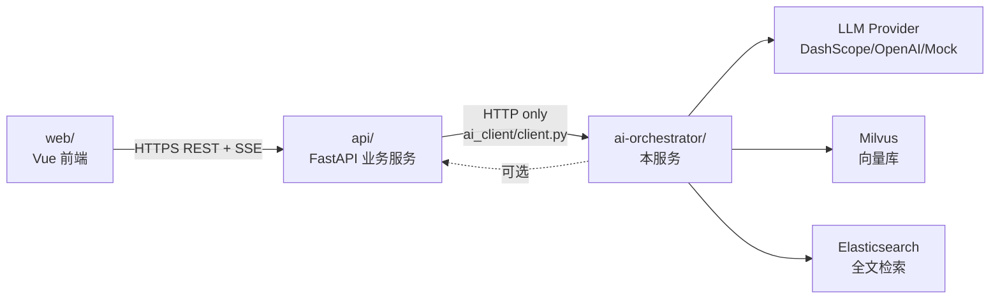
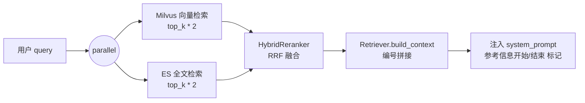
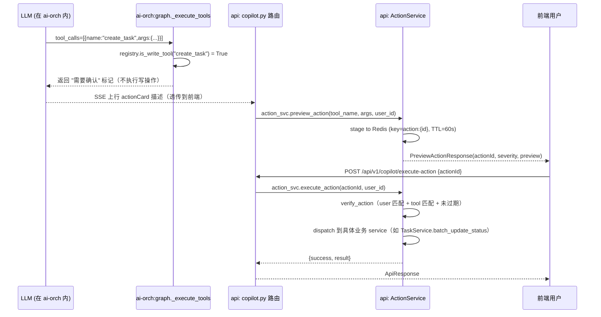

# 03 · AI 编排服务详细设计

> 承接 [00-目录结构设计](./00-目录结构设计.md) §六 `workspace/ai-orchestrator/`，是一份完整的 LangGraph + RAG + 多模型路由 + 工具系统的工程蓝图。
>
> 与同级文档 `03-AI接入详细设计.md`（v1.0，简版接入说明）的关系：本文档为 v1.1 工程级实现细节，是 03 系列的"详细版"，新人优先阅读简版后回到本文档查代码。

| 项目 | 信息 |
|------|------|
| 文档版本 | v1.1 |
| 落位 | `workspace/ai-orchestrator/` |
| 技术栈 | Python 3.11 + FastAPI + LangGraph 0.2 + LangChain 0.3 + pymilvus + elasticsearch + DashScope/OpenAI |
| 主要使用者 | AI 工程师（AI / RAG / Prompt） |
| 创建日期 | 2026-05-06 |
| 相关 CR 规范 | [docs/code-review/03-AI代码CR规范.md](../code-review/03-AI代码CR规范.md) |

---

## 一、服务定位

### 1.1 边界



- **唯一调用方**：`workspace/api/`（通过 `app/ai_client/client.py`）
- **禁止行为**：前端 `web/` 直连本服务、本服务 `import api/app/...`、与 api 共享数据库连接
- **暴露端口**：`8090`（独立部署），与 api 服务（8080）物理隔离

### 1.2 设计目标

1. **可热插拔的 LLM Provider**：DashScope / OpenAI / Mock 三方实现 + 自动降级
2. **可观测的安全闸门**：所有 chat 输入先过 InputGuard，命中即拦截 + 审计
3. **可解释的 RAG 链路**：Milvus 向量 + ES 全文检索并行 + Reranker 融合
4. **可扩展的工具体系**：每个 Agent 一个工具注册表，写工具自动走二次确认
5. **可压测的熔断保护**：每个 LLM Provider 独立 CircuitBreaker，3 次连失开路 30s

---

## 二、HTTP 端点完整签名

`workspace/ai-orchestrator/app/main.py` 暴露 6 个端点：

| Method | Path | 描述 | 输入 | 输出 |
|---|---|---|---|---|
| GET  | `/health` | 健康检查 | - | `{ status, service, version, providers[] }` |
| POST | `/ai/chat` | **SSE 流式对话**（5 助手统一入口） | `ChatRequest` | `text/event-stream` |
| GET  | `/ai/tools?agent={name}` | 列举可用 Function Calling 工具 | `agent` 可选 | `{ tools: ToolDefinition[] }` |
| POST | `/ai/preview-action` | 预览高危操作（不写库） | `{ toolName, args }` | `{ actionId, title, severity, preview, availableTools }` |
| POST | `/ai/execute-action` | 执行已预览操作（消费 actionId） | `{ actionId }` | `{ success, result }` |
| GET  | `/ai/rag/search?query=...&top_k=5` | RAG 混合检索 | query string | `{ results[], source }` |

### 2.1 ChatRequest（schemas.py）

```python
class ChatRequest(BaseModel):
    userId: int                                   # 业务用户 id（来自 api 层 JWT 解析）
    assistantId: Literal["workspace","tasks","task","project","coach","files","file","chat"]
    sessionId: str | None = None
    message: str = Field(..., min_length=1, max_length=8000)
    mode: Literal["smart","creative","rigorous"] = "smart"
    context: dict = {}                            # 业务上下文（projectId / customerId 等）
```

### 2.2 SSE Chunk 协议

```text
data: {"delta": "你好"}\n\n
data: {"delta": "，"}\n\n
data: {"delta": "我是"}\n\n
data: {"type": "tool_call", "tool": "create_task", "args": {...}}\n\n
data: {"type": "error", "code": "BIZ_AI_INTERNAL_ERROR", "message": "AI 处理失败"}\n\n
data: [DONE]\n\n
```

> 客户端遇到 `[DONE]` 即关闭；遇到 `type=error` 即终止并 toast 错误码。

### 2.3 SSE 响应头（main.py 已落地）

| Header | 值 | 用途 |
|---|---|---|
| `Cache-Control` | `no-cache` | 禁止 CDN/中间代理缓存 |
| `Connection` | `keep-alive` | 长连接 |
| `X-Accel-Buffering` | `no` | 禁用 Nginx 缓冲（关键，否则首 token 卡顿）|

---

## 三、模块全景

```text
ai-orchestrator/app/
├── main.py                 # FastAPI 入口（6 endpoint）
├── config.py               # pydantic-settings
├── schemas.py              # ChatRequest / ChatTokenChunk
├── orchestrator/           # LangGraph 编排
│   ├── graph.py            # agent_node + RAG + 工具调用主流程（211 行）
│   ├── prompts.py          # get_system_prompt(agent_name, mode)
│   └── prompts/            # Jinja2 模板（按版本归档）
├── llm/
│   └── provider.py         # LlmProvider ABC + DashScope/OpenAI/Mock
├── routing/
│   ├── router.py           # MultiModelRouter（按优先级 + 熔断切换）
│   └── circuit_breaker.py  # CircuitBreaker（CLOSED/OPEN/HALF_OPEN 三态）
├── safety/
│   └── input_guard.py      # InputGuard + OutputGuard（正则模式库）
├── audit/
│   └── logger.py           # AuditLogger + AuditEntry（jsonl 落盘）
├── rag/                    # 混合检索引擎
│   ├── embedder.py         # DashScope embedding 调用
│   ├── milvus_store.py     # MilvusStore（upsert/search/delete）
│   ├── es_search.py        # ElasticSearch（全文检索）
│   ├── reranker.py         # HybridReranker（RRF 融合）
│   └── retriever.py        # Retriever（向量+全文并行 + 重排 + 上下文构建）
└── tools/                  # Function Calling 工具注册表
    ├── base.py             # BaseTool / ToolRegistry / ToolResult
    ├── __init__.py         # AGENT_TOOLS_MAP（4 助手 -> 工具集）
    ├── task_tools.py       # T 助手 5 工具
    ├── project_tools.py    # P 助手 5 工具
    ├── coach_tools.py      # C 助手 5 工具
    └── file_tools.py       # F 助手 4 工具
```

---

## 四、LangGraph 编排（orchestrator/graph.py）

### 4.1 主流程（agent_node）

`workspace/ai-orchestrator/app/orchestrator/graph.py:agent_node` 已落地的完整流程：

```mermaid
flowchart TD
    Start([SSE 请求到达 main.py /ai/chat]) --> Guard[InputGuard.check<br/>注入/越狱/超长拦截]
    Guard -->|不安全| Block[审计 log_safety_block<br/>SSE 返回 error + DONE]
    Guard -->|安全| Audit[create_entry 审计起点]
    Audit --> Agent[agent_node 流程开始]

    Agent --> Q[抽取最后一条 user message]
    Q --> RAG[Retriever.retrieve<br/>top_k=3]
    RAG --> Prompt[get_system_prompt + 拼 context]
    Prompt --> LLM1[get_llm 选择 provider<br/>stream 首轮回答]
    LLM1 --> Parse{响应中是否含<br/>tool_calls JSON?}

    Parse -->|否| Done[流式输出完成]
    Parse -->|是且未达 MAX_ITERATIONS=8| Exec[execute tools<br/>写工具 -> requires_confirmation]
    Exec --> LLM2[append tool_results<br/>再次 LLM stream]
    LLM2 --> Parse

    Done --> AuditEnd[audit log_chat<br/>SSE [DONE]]
    Block --> AuditEnd
```

### 4.2 关键约束

- **MAX_ITERATIONS = 8**：防止工具递归 / LLM 死循环；超限时输出"已达到最大迭代次数"
- **写工具不直接执行**：在 `_execute_tools` 中通过 `registry.is_write_tool(name)` 判断，写工具仅返回 `requires_confirmation=True`，由 api 层走 actionCard 二次确认
- **断开检测**：每次 yield 前 `await request.is_disconnected()`，客户端断开后立即停止 LLM 调用，节省 token

### 4.3 AgentState（TypedDict）

```python
class AgentState(TypedDict):
    messages: list[dict]           # OpenAI message format
    assistant_id: str              # workspace/tasks/project/coach/files/chat
    mode: str                      # smart/creative/rigorous
    context: dict                  # 业务上下文
    response_chunks: list[str]     # 累积 chunks（用于审计 token_count）
```

### 4.4 助手映射表（get_agent_name）

| assistant_id | agent_name | 工具集 | Prompt 模板 |
|---|---|---|---|
| `tasks` / `task` | `task` | task_tools | `tasks.j2` |
| `project` | `project` | project_tools | `project.j2` |
| `coach` | `coach` | coach_tools | `coach.j2`（10 年 FDE 专家身份） |
| `files` / `file` | `file` | file_tools | `files.j2` |
| `chat` / `workspace` | `chat` | - | `chat.j2`（无工具，纯对话） |

> 当前 `graph.py` 采用单一 `agent_node` + 内部分支策略；后续若 agent 数量超过 8 个，可按 `00-目录结构设计.md §六` 重构为 `subgraphs/{tasks,project,coach,files,chat}_agent.py`。

---

## 五、LLM Provider 抽象（llm/provider.py）

### 5.1 接口定义

```python
class LlmProvider(ABC):
    @abstractmethod
    async def stream(self, messages: list[dict]) -> AsyncIterator[str]: ...
```

### 5.2 三个实现

| 类 | 模型 | 鉴权 | 用途 |
|---|---|---|---|
| `DashScopeLlm` | `qwen-plus`（可由 `settings.dashscope_model` 覆盖） | `DASHSCOPE_API_KEY` + DashScope OpenAI 兼容端点 | 主力（中文场景）|
| `OpenAiLlm` | `gpt-4o`（可覆盖） | `OPENAI_API_KEY` | 备份（英文复杂推理） |
| `MockLlm` | - | 无 | 本地开发 / 单测 / 上游全挂时兜底 |

### 5.3 选择策略（get_llm）

```python
def get_llm() -> LlmProvider:
    provider = settings.llm_provider     # dashscope | openai | mock
    if provider == "dashscope":
        return DashScopeLlm() if settings.dashscope_api_key else MockLlm()
    elif provider == "openai":
        return OpenAiLlm() if settings.openai_api_key else MockLlm()
    return MockLlm()
```

> **降级原则**：缺 key 不报错，自动降级到 Mock，保证服务永远可启动；`/health` 端点返回当前生效的 provider 列表，便于运维诊断。

### 5.4 MockLlm 智能桩

`MockLlm._get_mock_response` 按关键词（`任务` / `周报` / `最佳实践` / 兜底）返回不同的预设响应，便于前端联调，不需要真实 API Key。

---

## 六、多模型路由 + 熔断（routing/）

### 6.1 MultiModelRouter（router.py）

```python
class MultiModelRouter:
    """优先级：dashscope -> openai -> mock；任一失败立即切下一家"""
    async def stream(self, messages, preferred=None):
        order = [preferred] + [其余 provider]   # preferred 提到队首
        for provider_name in order:
            provider, cb = self._providers[provider_name]
            if cb is None or cb.can_execute():           # mock 无 cb，永远 True
                try:
                    async for chunk in provider.stream(messages):
                        yield chunk
                    return
                except Exception:
                    cb._on_failure()
                    continue
        # 全挂 -> mock 兜底（mock 永不抛异常）
```

### 6.2 CircuitBreaker（circuit_breaker.py）

| 状态 | 含义 | 进入条件 | 退出条件 |
|---|---|---|---|
| `CLOSED` | 正常 | 初始化 / HALF_OPEN 测试成功 | 连续失败 ≥ `failure_threshold`(默认 5) |
| `OPEN` | 熔断中 | 失败阈值触发 | 距上次失败 ≥ `recovery_timeout`(默认 60s) |
| `HALF_OPEN` | 探测中 | OPEN 超时后自动进入 | 探测成功 → CLOSED；失败 → 回到 OPEN |

> `MultiModelRouter` 中 dashscope/openai 实例配置：`failure_threshold=3, recovery_timeout=30s`，比默认更激进，适合在线对话场景。
> `stats` 暴露 `total_calls / total_failures / state / is_healthy`，由 `/health` 端点返回。

### 6.3 故障演练

```bash
# 模拟 dashscope 全挂：临时 unset key 或 mock dns 失败
unset DASHSCOPE_API_KEY && uvicorn app.main:app --port 8090

# 调用 chat，预期：dashscope cb 跳过 -> openai 也无 key 跳过 -> mock 兜底返回
curl -N -X POST http://localhost:8090/ai/chat -H "Content-Type: application/json" \
  -d '{"userId":1,"assistantId":"chat","message":"你好"}'
```

---

## 七、安全闸门（safety/input_guard.py）

### 7.1 InputGuard 检测维度

| 维度 | 阈值/规则 | 严重度 | 处置 |
|---|---|---|---|
| 输入长度 | `> 8000 字符` | medium | 拦截 + 审计 |
| Prompt Injection | 8 条正则（"ignore previous instructions" / "system: override" / "[INST]" 等） | high | 拦截 + 审计 |
| Jailbreak | 4 条正则（DAN / developer mode / disable safety 等） | high | 拦截 + 审计 |

### 7.2 OutputGuard 检测维度

| 维度 | 阈值/规则 | 严重度 |
|---|---|---|
| 输出长度 | `> 16000 字符` | low |
| 信用卡号 | `\d{4}[-\s]?\d{4}...{16}` | medium |
| 邮箱 | RFC 5322 简化版 | medium |

### 7.3 命中处置（main.py /ai/chat）

```python
safety = _input_guard.check(req.message)
if not safety.is_safe:
    audit_entry.safety_triggered = True
    audit_entry.safety_reason = safety.reason
    _audit.log_safety_block(audit_entry)
    # SSE 返回固定文案 + DONE
    yield 'data: {"type":"error","message":"请求包含不安全的输入，已被系统拦截"}\n\n'
    yield 'data: [DONE]\n\n'
```

> **不向用户暴露具体规则原因**（避免对抗性提示构造）；`safety_reason` 仅写入审计日志供风控运营查看。

### 7.4 模式库扩展

新增检测规则：在 `INJECTION_PATTERNS / JAILBREAK_PATTERNS / SENSITIVE_DATA_PATTERNS` 列表追加 `(regex, reason)` 元组，无需改 InputGuard.check 主流程。

---

## 八、审计日志（audit/logger.py）

### 8.1 AuditEntry 字段全集

| 字段 | 类型 | 说明 |
|---|---|---|
| `timestamp` | ISO 8601 UTC | 自动生成 |
| `event_type` | `chat` / `tool_call` / `rag_retrieve` / `safety_block` | 事件类型 |
| `user_id` | int | 业务用户 id |
| `assistant_id` | str | 助手 key |
| `input_preview` | str (≤200) | 输入前 200 字（避免日志爆炸） |
| `output_preview` | str (≤200) | 输出前 200 字 |
| `provider` | str | 实际命中的 LLM provider |
| `duration_ms` | float | 端到端耗时 |
| `token_count` | int | 输出 token 估算（按字符数兜底） |
| `tool_calls` | list[dict] | 本次调用的工具序列 |
| `rag_docs_count` | int | RAG 召回文档数 |
| `safety_triggered` | bool | 是否触发安全闸门 |
| `safety_reason` | str | 触发原因（仅运营可见）|
| `error` | str | 异常信息 / `client_disconnected` |
| `trace_id` | str | 与 api 层 X-Trace-ID 串联 |

### 8.2 落盘策略

- **格式**：JSONL（每行一条 JSON），便于 ELK / 阿里云 SLS 直接消费
- **路径**：`./logs/audit_YYYYMMDD.jsonl`，按天滚动
- **降级**：日志目录创建失败自动降级到 stderr，**永不阻塞主链路**
- **隔离**：`logger.handlers` 去重，避免同一进程多实例重复写

### 8.3 4 个埋点入口

| 方法 | 触发场景 |
|---|---|
| `log_chat(entry)` | `/ai/chat` 流式结束（含正常/中断/异常）|
| `log_tool_call(entry)` | 工具执行后（成功/失败均记录） |
| `log_rag(entry)` | RAG 检索后（即使无召回也记录） |
| `log_safety_block(entry)` | InputGuard / OutputGuard 命中 |

---

## 九、RAG 引擎（rag/）

### 9.1 整体架构



### 9.2 关键时序约束（retriever.py）

- **并行 + 超时**：`asyncio.gather(vec_task, txt_task)`，各自 `wait_for(timeout=10)`
- **优雅降级**：任一通道异常被 `gather(return_exceptions=True)` 捕获，返回空列表，不阻塞另一通道
- **来源标识**：`source` 字段返回 `hybrid / vector / text / none`，便于前端展示与审计

### 9.3 ACL 过滤

`MilvusStore.search` 与 `ElasticSearch.search` 均支持 `user_id / project_id` 过滤参数，确保检索结果**仅命中调用者有权访问的文档**——这是 FDE 多租户场景的核心安全约束。

### 9.4 上下文注入模板

```text
[原始 system prompt]

---

[参考信息开始]
[1] {doc_1.content}

[2] {doc_2.content}

...
[参考信息结束]

请基于以上参考信息回答用户的问题。参考信息仅作参考，不得编造信息。
如果参考信息不足以回答问题，请说明并给出通用建议。
```

### 9.5 索引/删除接口（仅库内 SDK，未对外 HTTP 暴露）

| 方法 | 用途 | 暴露形式 |
|---|---|---|
| `Retriever.index_document(doc_id, content, title, metadata, source)` | 双写 Milvus + ES | 仅模块内可调用，**未通过 HTTP 端点暴露** |
| `Retriever.delete_document(doc_id)` | 双删 Milvus + ES | 同上 |

> **当前实施状态（v1.2 / M6 已落地）**：
> - `workspace/ai-orchestrator/app/main.py` 已提供 `POST /ai/rag/index` 与 `DELETE /ai/rag/{doc_id}` 端点，内部调用 `Retriever.index_document / delete_document`。
> - `workspace/api/app/tasks/rag_index.py` 已从占位 stub 改为真实 `httpx` 调用，4xx 不重试 / 5xx 指数退避重试。
> - 端到端链路：file 上传 → Celery 任务 → ai-orch RAG 端点 → Milvus/ES 双写。

---

## 十、工具系统（tools/）

### 十.1 BaseTool 抽象

所有工具继承 `BaseTool`，必须实现：

| 属性/方法 | 类型 | 说明 |
|---|---|---|
| `name` | str | 唯一名称（snake_case，与 LLM function name 一致） |
| `description` | str | 自然语言描述（LLM 用来决策是否调用） |
| `args_schema` | JSON Schema | OpenAI tool calling 格式 |
| `is_write` | bool | 写工具 = True，会触发二次确认 |
| `async def execute(args: dict) -> ToolResult` | - | 实际执行（通常调 api 层 HTTP） |

### 10.2 ToolRegistry

```python
class ToolRegistry:
    def register(self, tool: BaseTool): ...
    def get(self, name: str) -> BaseTool | None: ...
    def is_write_tool(self, name: str) -> bool: ...
    async def execute(self, name: str, args: dict) -> ToolResult: ...
    def get_definitions(self) -> list[dict]:
        """返回 OpenAI tools 字段所需格式"""
```

### 10.3 当前工具清单（`tools/__init__.py:AGENT_TOOLS_MAP`）

| Agent | 工具数 | 工具列表（已落地） |
|---|---|---|
| `task` | 5 | `ListTasksTool` / `CreateTaskTool` (write) / `UpdateTaskTool` (write) / `BatchUpdateTasksTool` (write) / `GetTaskDetailTool` |
| `project` | 5 | `ListProjectsTool` / `GetProjectSummaryTool` / `GetWeeklyReportTool` / `ListProjectRisksTool` / `DashboardSummaryTool` |
| `coach` | 5 | `ListBestPracticesTool` / `GetPracticeDetailTool` / `ListSopsTool` / `GetLearningPathsTool` / `GetRecommendationsTool` |
| `file` | 4 | `SearchFilesTool` / `GetFileTreeTool` / `GetFileDetailTool` / `GetFileQuotaTool` |
| `chat` | 0 | （纯对话，不接入工具） |

> 总计 19 个工具，超过 00-目录结构设计 v1.0 预估的 16 个，差异原因：T 助手补充了 GetTaskDetail，P 助手把 dashboard summary 收编为通用工具。

### 10.4 写工具二次确认链路（实际实施）

> ⚠️ **重要**：actionId 的 stage / verify / execute 逻辑**完全在 api 层** `workspace/api/app/services/action_service.py`（`ActionService` 类，`PREFIX="action:"`、`TTL_SECONDS=60`，含 Redis + 内存双兜底）。
> ai-orchestrator 当前的 `/ai/preview-action` 仅返回占位 `actionId: "preview-placeholder"`、`/ai/execute-action` 是**未对接的孤立实现**（直接读 redis，但因为没人写所以总是 404）。

**真实的当前链路（以 api 层为中心）**：



**待对齐改造**：
- 将 ai-orchestrator 的 `/ai/preview-action`、`/ai/execute-action` 与 api 层 ActionService 真正打通，二选一：
  - 方案 A（推荐）：删除 ai-orch 这两个 endpoint，所有 actionId 仅存在于 api 层，ai-orch 仅产出"需要确认"标记
  - 方案 B：ai-orch 暴露内部 `/internal/tool/execute`（带 service-to-service token），由 api 层 ActionService dispatch 时回调

### 10.5 新增工具开发清单

1. 在 `tools/{agent}_tools.py` 新建类继承 `BaseTool`
2. 在 `tools/__init__.py` 的对应 `get_{agent}_tools()` 工厂中 `registry.register()`
3. 若是写工具，确保 `is_write = True`
4. 在 `api/app/services/action_service.py` 增加 dispatch 分支（如需走二次确认）
5. 写单测：`tests/tools/test_{tool}.py`

---

## 十一、配置（config.py）

### 11.1 当前已落地字段

```python
class Settings(BaseSettings):
    app_name: str = "fde-ai-orchestrator"
    host: str = "0.0.0.0"
    port: int = 8090

    # LLM
    llm_provider: str = "dashscope"          # dashscope | openai | mock
    dashscope_api_key: str = ""
    dashscope_model: str = "qwen-plus"
    dashscope_embedding_model: str = "text-embedding-v2"
    openai_api_key: str = ""
    openai_model: str = "gpt-4o"

    # RAG
    milvus_host: str = "localhost"
    milvus_port: int = 19530
    es_host: str = "http://localhost:9200"

    # 回调 api 业务接口（工具执行用）
    api_base_url: str = "http://localhost:8080/api/v1"
```

### 11.2 .env.example（与 `workspace/ai-orchestrator/.env.example` 实际一致）

```env
# AI Orchestrator Environment Variables
APP_NAME=fde-ai-orchestrator
HOST=0.0.0.0
PORT=8090

# LLM Configuration
# Set llm_provider to "mock" for development without API keys
LLM_PROVIDER=mock
DASHSCOPE_API_KEY=
DASHSCOPE_MODEL=qwen-plus
OPENAI_API_KEY=
OPENAI_MODEL=gpt-4o

# RAG Configuration
MILVUS_HOST=localhost
MILVUS_PORT=19530
ES_HOST=http://localhost:9200

# Business API URL (for tool calls)
API_BASE_URL=http://localhost:8080/api/v1
```

> 注：`config.py` 内部含 `dashscope_embedding_model: str = "text-embedding-v2"` 默认值，但 `.env.example` 暂未列出（如需自定义可手动添加 `DASHSCOPE_EMBEDDING_MODEL=...`）。

---

## 十二、可观测与运维

### 12.1 健康检查响应样例

```json
GET /health
{
  "status": "ok",
  "service": "fde-ai-orchestrator",
  "version": "0.2.0",
  "providers": [
    {"name":"dashscope","type":"DashScopeLlm","state":"closed","is_healthy":true,"total_calls":128,"total_failures":2},
    {"name":"openai","type":"OpenAiLlm","state":"open","is_healthy":false,"failure_count":3,"total_failures":12},
    {"name":"mock","type":"MockLlm","state":"always_available","is_healthy":true}
  ]
}
```

### 12.2 Prometheus 指标（规划草案 · 当前未实施）

> 当前 `ai-orchestrator` 代码中**没有任何** `prometheus_client` 集成，本表为后续接入指标导出端点（`/metrics`）时的设计草案，未落地。

| 指标（拟）| 类型 | label | 用途 |
|---|---|---|---|
| `ai_chat_requests_total` | Counter | `assistant_id`, `provider`, `status` | QPS / 错误率 |
| `ai_chat_duration_seconds` | Histogram | `assistant_id`, `provider` | P50/P95/P99 |
| `ai_safety_blocks_total` | Counter | `severity` | 风控大盘 |
| `ai_provider_circuit_state` | Gauge | `provider`, `state` | 熔断状态 |
| `ai_rag_retrieval_duration_seconds` | Histogram | `source` | RAG 性能 |

> 当前可观测性**仅依赖**：1) `/health` 端点的 `providers[]`（含 CircuitBreaker stats）；2) `audit/logger.py` 的 jsonl 日志（`duration_ms / token_count / safety_triggered` 等字段）。
> 接入 Prometheus 后，建议直接从审计日志聚合得到上述指标，避免业务代码到处打点。

---

## 十三、错误码与异常处理（实际现状 + 规划）

### 13.1 当前实际现状

`workspace/ai-orchestrator/app/exceptions/` 目录**当前不存在**。main.py 中 `from app.exceptions.codes import BIZ_AI_ACTION_NOT_FOUND, BIZ_AI_ACTION_EXPIRED` 是**遗留死代码**（永远 ImportError），实际错误处理路径：

| 场景 | 当前实际行为 |
|---|---|
| InputGuard 命中 | SSE 输出 `{"type":"error","message":"请求包含不安全的输入，已被系统拦截"}` + `[DONE]` |
| agent_node 抛异常 | SSE 输出 `{"type":"error","code":"BIZ_AI_INTERNAL_ERROR","message":"AI 处理失败，请稍后重试"}` |
| `/ai/execute-action` redis 未命中 | `HTTPException(404, "Action not found or expired")` |
| `/ai/execute-action` 工具执行失败 | `HTTPException(500, f"Action execution failed: {e}")` |
| `/ai/rag/search` 入参校验失败 | `HTTPException(400, ...)` |

### 13.2 错误码体系（v1.2 / M6 已落地 `app/exceptions/codes.py`）

| 错误码 | 触发场景 | 当前是否生效 |
|---|---|---|
| `BIZ_AI_INVALID_PARAMS` | 请求参数非法 / 调用废弃端点 | ✅ M6 已实施 |
| `BIZ_AI_PROMPT_INJECTION` | InputGuard 命中 high 严重度规则 | ✅ M6 已实施（SSE error 帧带 code 字段） |
| `BIZ_AI_ACTION_REQUIRED` | preview-action 引导走 api 层 ActionService | ✅ M6 已实施 |
| `BIZ_AI_RAG_INDEX_FAILED` | RAG 索引失败 / 双写异常 | ✅ M6 已实施 |
| `BIZ_AI_INTERNAL_ERROR` | agent_node 抛异常 / SSE 中途失败 | ✅ 已用于 SSE error 帧 |
| `SYS_AI_UPSTREAM_ERROR` | 所有 provider 全挂（mock 也异常） | ⏳ 未实施（且 mock 设计上不会挂） |

### 13.3 落地说明（M6 已完成）

1. ✅ 新建 `workspace/ai-orchestrator/app/exceptions/{codes,biz,handlers,__init__}.py`，错误码与 api 层 8xxx 段位对齐
2. ✅ `app/exceptions/handlers.py` 注册 FastAPI exception_handler，统一响应体为 `{code, message, data, traceId, details}`
3. ✅ `main.py` 移除内联 `HTTPException`，改为抛 `AIInvalidParamsException` / `AIRagSearchException` 等业务异常
4. ✅ SSE error 帧通过 `_sse_error_frame()` 统一带 `code` 字段

---

## 十四、实施状态对照（v1.1）

| 模块 | 设计章节 | 代码落位 | 状态 |
|---|---|---|---|
| 应用入口 + 6 endpoint | §二 | `app/main.py` (206 行) | ✅ 已实施 |
| LangGraph agent_node + RAG + 工具 | §四 | `app/orchestrator/graph.py` (211 行) | ✅ 已实施 |
| Prompt 模板 | §四 | `app/orchestrator/prompts.py` + `prompts/` 目录 | ✅ 已实施 |
| LlmProvider 抽象 + 3 实现 | §五 | `app/llm/provider.py` (119 行) | ✅ 已实施 |
| MultiModelRouter | §六 | `app/routing/router.py` (124 行) | ✅ 已实施 |
| CircuitBreaker | §六 | `app/routing/circuit_breaker.py` (129 行) | ✅ 已实施 |
| InputGuard / OutputGuard | §七 | `app/safety/input_guard.py` (140 行) | ✅ 已实施 |
| AuditLogger | §八 | `app/audit/logger.py` (136 行) | ✅ 已实施 |
| RAG Retriever | §九 | `app/rag/retriever.py` (127 行) | ✅ 已实施 |
| RAG MilvusStore | §九 | `app/rag/milvus_store.py` (5.62 KB) | ✅ 已实施 |
| RAG ElasticSearch | §九 | `app/rag/es_search.py` (4.47 KB) | ✅ 已实施 |
| RAG Embedder | §九 | `app/rag/embedder.py` (2.39 KB) | ✅ 已实施 |
| RAG Reranker | §九 | `app/rag/reranker.py` (4.59 KB) | ✅ 已实施 |
| 工具系统（4 Agent x 19 工具）| §十 | `app/tools/{base,__init__,task_tools,project_tools,coach_tools,file_tools}.py` | ✅ 已实施 |
| 配置 | §十一 | `app/config.py` (32 行) | ✅ 已实施 |
| Prometheus 指标导出 | §12.2 | - | ⏳ 草案，未实施（依赖审计日志聚合） |
| `/ai/rag/index` + `/ai/rag/{doc_id}` HTTP 端点 | §9.5 | `app/main.py` | ✅ M6 已实施（POST/DELETE 双向，httpx 链路联通） |
| `app/exceptions/{codes,biz,handlers,__init__}.py` | §13 | `app/exceptions/` | ✅ M6 已实施（5 个业务异常 + 全局 handler，与 api 层 8xxx 段位对齐） |
| `/ai/preview-action` 与 api `ActionService` 打通 | §10.4 | `main.py` | ✅ M6 已废弃：明确抛 `AIInvalidParamsException` 引导走 api 层 `/api/v1/copilot/preview-action` |
| `/ai/execute-action` 真实链路 | §10.4 | `main.py` | ✅ M6 已废弃：明确抛 `AIInvalidParamsException` 引导走 api 层 `/api/v1/copilot/execute-action` |
| OpenAPI 导出脚本 + shared-protos 占位 | §15 | `workspace/scripts/export_openapi.py` + `workspace/shared-protos/openapi/` | ✅ M6 已实施（`python scripts/export_openapi.py` 一键生成 api.json） |
| Subgraph 拆分（5 助手独立图）| §4.4 | - | ⏳ 当前单 agent_node + 内部分支足够；规模超 8 助手再拆 |

---

## 十五、与其他规范文档的关联

| 关联文档 | 关联内容 |
|---|---|
| [00-目录结构设计](./00-目录结构设计.md) §六 | AI 服务目录约定（部分子模块本文档已说明实际落位调整） |
| [02-后端详细设计](./02-后端详细设计.md) §十二 | api 层 `ai_client.py` 调用本服务的契约 |
| [02-后端详细设计](./02-后端详细设计.md) §九 | api 层二次确认 ActionService 与本文档 §10.4 的协作链路 |
| [03-AI接入详细设计](./03-AI接入详细设计.md) | v1.0 简版接入说明（适合产品/QA 入门）|
| [code-review/03-AI代码CR规范](../code-review/03-AI代码CR规范.md) | LangGraph / Prompt / Tools / RAG / LlmAdapter / AI安全 / AI测试 33 条规则 |

---

## 修订记录

| 版本 | 日期 | 修订人 | 修订内容 |
|------|------|--------|----------|
| v1.0 | -    | -     | （由旧 `03-AI接入详细设计.md` 承担简版职责，未独立成此文档） |
| v1.1 | 2026-05-06 | 吾明 | 初版发布：基于 `workspace/ai-orchestrator/` 实际代码（main.py / orchestrator / safety / audit / routing / rag / tools / llm / config）整理，6 endpoint + 4 Agent x 19 工具 + 3 provider + 熔断 + 双闸门 + 审计 + 混合 RAG 全部覆盖 |

**文档结束**
