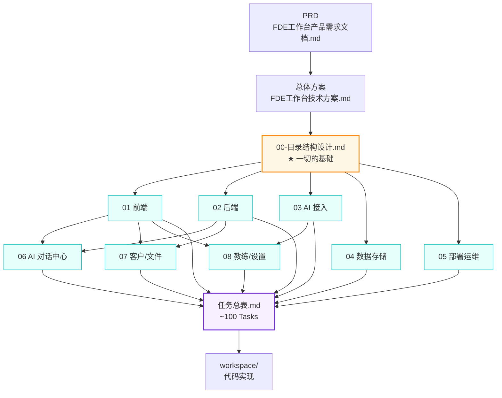

# FDE 工作台 · 详细设计文档索引

> 本目录是 FDE 工作台的**详细技术设计**和**开发者级任务总表**。
> 上承《[FDE 工作台总体技术方案](../FDE工作台技术方案.md)》，下达 `workspace/` 代码实现。

---

## 一、文档清单

| 序号 | 文档 | 定位 | 主要使用者 | 状态 |
|---|---|---|---|---|
| - | [README.md](./README.md) | 本索引 | 全员 | v1.1 ✅ |
| 00 | [00-目录结构设计.md](./00-目录结构设计.md) | **目录约定基础**（所有路径源头） | 全员 | v1.1 ✅ |
| 01 | [01-前端详细设计.md](./01-前端详细设计.md) | Vue 3 工程蓝图 | FE | v1.1 ✅ |
| 02 | [02-后端详细设计.md](./02-后端详细设计.md) | FastAPI 工程蓝图 | BE | v1.1 ✅ |
| 03（简）| [03-AI接入详细设计.md](./03-AI接入详细设计.md) | AI 接入概述（适合产品/QA 入门）| AI / PM / QA | v1.0 ✅ |
| 03（详）| [03-AI编排服务详细设计.md](./03-AI编排服务详细设计.md) | LangGraph + RAG + 多模型路由 + 熔断 + 工具系统 工程蓝图 | AI 工程师 | v1.1 ✅ |
| 04 | 04-数据存储详细设计.md | MySQL DDL / Redis / ES / Milvus | BE+DA | ⏳ 待编写（DDL 已落地于 `workspace/api/alembic/versions/001_initial.py`）|
| 05 | [05-部署运维详细设计.md](./05-部署运维详细设计.md) | Docker / K8s / CI / 监控 | OPS | v1.0 ✅ |
| 06 | 06-AI对话中心详细设计.md | 全局 AI 对话中心 | FE+BE | ⏳ 待编写 |
| 07 | 07-客户空间与文件中心详细设计.md | 业务模块深化 | FE+BE | ⏳ 待编写 |
| 08 | 08-FDE教练与系统设置详细设计.md | 业务模块深化 | FE+AI | ⏳ 待编写 |
| - | [任务总表.md](./任务总表.md) | **~100 个开发者级 Task** | PM+全员 | ✅ |

---

## 二、按角色推荐阅读路径

### 前端工程师（FE）
```
00 目录结构 → 01 前端详细设计 → 06/07/08 业务模块 → 任务总表（FE 任务）
```

### 后端工程师（BE）
```
00 目录结构 → 02 后端详细设计 → 04 数据存储 → 06/07/08 业务模块 → 任务总表（BE 任务）
```

### AI 工程师（AI）
```
00 目录结构 → 03（简）AI 接入概述 → 03（详）AI 编排服务详细设计（重点，工程蓝图）→ 06 AI 对话中心（待编写）→ 任务总表（AI 任务）
```

### 测试工程师（QA）
```
00 目录结构 → 01/02 前后端详细设计（重点验收标准） → 任务总表（QA 任务）
```

### 运维工程师（OPS）
```
00 目录结构 → 05 部署运维详细设计 → 04 数据存储（部署相关） → 任务总表（OPS 任务）
```

---

## 三、文档关系图



---

## 四、任务认领流程

```
1. 打开 任务总表.md
2. 按里程碑（M2/M3/M4）和角色（FE/BE/AI/DA/OPS/QA）筛选 Task
3. 选定 Task → 在 Aone 上认领（任务 ID 保持一致）
4. 创建 feature 分支：feat/{Task-ID}-{kebab-desc}
   例如：feat/M2-FE-001-app-layout
5. 按 Task 描述中的"涉及文件路径"在 workspace/ 对应目录下编写代码
6. 自测通过后提 MR：MR 标题 = Task 标题；描述中链接 Task ID
7. Code Review 通过后合并 → 更新任务状态为 Done
```

---

## 五、文档维护规范

| 类型 | 规则 |
|---|---|
| **路径变更** | 必须先改 `00-目录结构设计.md`，再批改其他文档引用 |
| **新增详细设计章节** | PR 标题 `docs(detail-design): ...`；评审通过后合入 |
| **任务总表新增 Task** | 必须分配下一个未使用的 ID（按 M{n}-{role}-{NNN} 严格递增）|
| **文档冲突** | 详细设计文档之间冲突 → 以 00-目录结构设计 为准；与总体方案冲突 → 以详细设计为准 |

---

## 修订记录

| 版本 | 日期 | 修订人 | 内容 |
|------|------|--------|------|
| v1.0 | 2026-04-28 | 吾明 | 初版索引建立 |
| v1.1 | 2026-05-06 | 吾明 | 同步实际落地：① 03 拆分为简版（v1.0）+ 详版（v1.1，新增 29KB 工程蓝图）；② 04/06/07/08 标注为"待编写"；③ 文档清单新增"状态"列。 |
