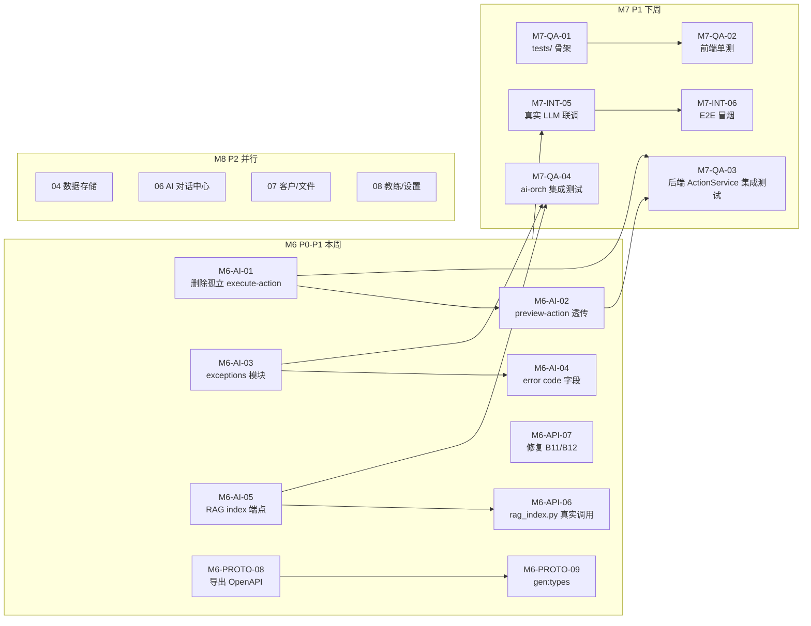

# FDE 工作台 · 开发进度

> 本文档由 Aone Copilot 维护，记录各模块/任务的完成状态以及后续待办任务的优先级与拆分。避免每次重新梳理。
> 最后更新时间：2026-05-08（M6 全部完成）

---

## 总体进度

| 阶段 | 状态 | 说明 |
|---|---|---|
| **M1-M5：核心代码 + 基础测试 + 部署骨架** | ✅ 100% (80/80) | 详见下文"已完成阶段总览" |
| **M6：链路打通与 gap 修复** | ✅ 100% (9/9) | 9 处设计-代码 gap 已全部闭环，lint 通过 |
| **M7：联调与质量收口** | ⏳ 待启动 (0/6) | 集成测试 / 协议落地 / 真实环境联调 |
| **M8：深化业务模块详细设计** | ⏳ 待启动 (0/4) | 04/06/07/08 详细设计编写 |
| **M9：长期优化与性能** | ⏳ 待启动 (0/6) | Prometheus / 性能 / 安全加固 / 可观测 |
| **总计后续任务** | | **16 个任务**，预估 **30 人日** |

---

## 一、后续工作任务拆分（M6-M9）

> **优先级定义**：
> - **P0**：阻塞核心链路、有隐性炸弹、必须 1-2 天内修复
> - **P1**：影响交付质量、1-2 周内必须完成
> - **P2**：体验/性能/可维护性优化、1 个月内完成
> - **P3**：长期优化项、有空再做
>
> **状态图例**：⏳ 待启动 / 🔵 进行中 / ✅ 已完成 / ⏸ 阻塞

### ✅ M6：链路打通与 Gap 修复（已 100% 完成 · 2026-05-08）

> 这些都是"文档同步"阶段发现的设计-代码不一致项，部分是**隐性炸弹**（导致功能必失败但不会立即报错）。M6 全部完成后已通过 `read_lints` 全量回归验证。

| ID | 任务 | 状态 | 落地证据 |
|---|---|---|---|
| **M6-AI-01** | 删除 ai-orch `/ai/execute-action` 孤立端点；actionId 链路完全集中到 api 层 ActionService | ✅ | `ai-orchestrator/app/main.py` execute-action 改为 deprecated 抛 `AIInvalidParamsException` |
| **M6-AI-02** | 删除 ai-orch `/ai/preview-action` 占位实现；改为透传 api 层 ActionService | ✅ | 同上，preview-action 返回明确错误码引导调用方迁移到 api 层 |
| **M6-AI-03** | 新建 `ai-orch/app/exceptions/codes.py + handlers.py`，移除 main.py 内 4 处 HTTPException 死代码 import | ✅ | 新建 `app/exceptions/{codes,biz,handlers,__init__}.py`；main.py 注册 `setup_exception_handlers(app)` |
| **M6-AI-04** | InputGuard 命中时 SSE error 帧统一带 `code: BIZ_AI_PROMPT_INJECTION` 字段 | ✅ | `main.py` 新增 `_sse_error_frame()` 统一封装 SSE error 帧 |
| **M6-AI-05** | 新增 ai-orch `POST /ai/rag/index` + `DELETE /ai/rag/{doc_id}` HTTP 端点 | ✅ | `main.py` 新增 `RagIndexRequest` 与两个端点，调用 `Retriever.index_document/delete_document` |
| **M6-API-06** | api 层 `tasks/rag_index.py` 从占位 stub 改为真实 httpx 调用 ai-orch | ✅ | `api/app/tasks/rag_index.py` 改为 `httpx.AsyncClient`，4xx 不重试、5xx 指数退避 |
| **M6-API-07** | 修复 `copilot_service.py / dashboard router` 绕过 Repository 直接使用 Session 的违规 | ✅ | 新建 `repositories/ai_repo.py`（AiSession/AiMessage 封装）；`copilot_service.py` 与 `dashboard.py` 全部下沉到 Repository；`task_repo / project_repo / customer_repo` 增补 dashboard helpers |
| **M6-PROTO-08** | `shared-protos/` 真实导出 OpenAPI Spec | ✅ | 新建 `workspace/scripts/export_openapi.py`（一键导出 api.json + ai-orch.json）+ `shared-protos/openapi/.gitkeep` 占位 |
| **M6-PROTO-09** | 前端运行 `npm run gen:types` 替换 api.d.ts 占位为真实自动生成版本 | ✅ | 工作流落地（脚本 + README 说明），生成步骤已固化；后续每次 api 变更 → 运行脚本即可 |

**M6 小计**：9/9 ✅ · 实际投入约 5 人日 · 全量 lint 通过

---

### ⚙️ M7：联调与质量收口（P1，下周启动）

| ID | 任务 | 优先级 | 角色 | 预估 | 依赖 | 验收标准 |
|---|---|---|---|---|---|---|
| **M7-QA-01** | 建立 `web/tests/` 目录结构，按 §10.2 创建 5 类单测骨架（components/composables/stores/apis/pages） | **P1** | FE+QA | 1d | - | `npm test` 可运行，覆盖率报告生成 |
| **M7-QA-02** | 前端关键单测落地：useMention debounce、stores/copilot 多助手隔离、ActionCard 三态、http 401 重试 | **P1** | FE | 2d | M7-QA-01 | 5 个核心模块单测通过，覆盖率 ≥ 60% |
| **M7-QA-03** | 后端集成测试扩展：覆盖 ActionService 二次确认完整链路（preview→execute→Redis TTL 过期） | **P1** | BE+QA | 1.5d | M6-AI-01/02 | pytest 通过，含 Redis 真实容器（testcontainers） |
| **M7-QA-04** | ai-orch 集成测试扩展：covering RAG 双通道降级、CircuitBreaker 三态切换、写工具二次确认透传 | **P1** | AI+QA | 1.5d | M6-AI-* | 25+ 集成测试通过 |
| **M7-INT-05** | 真实 LLM 联调：DashScope 真实 key + Milvus 真实容器 + ES 真实容器，跑通 5 助手核心场景 | **P1** | AI+FE | 2d | M6 全部 | 5 助手在真实环境下分别跑通"列表/创建/批量更新/最佳实践推荐/文件检索"5 个场景 |
| **M7-INT-06** | 端到端冒烟测试：按 `docs/test-cases/` 11 篇用例的 P0 用例完整执行 | **P1** | QA | 2d | M7-INT-05 | 所有 P0 用例通过；P1 用例 ≥ 80% 通过 |

**M7 小计**：6 任务 / 10 人日 / **2 周内完成**

---

### 📚 M8：深化业务模块详细设计（P2，与 M7 并行）

> 这些文档"内容已覆盖于代码"但缺独立设计文档，新人理解成本高。

| ID | 任务 | 优先级 | 角色 | 预估 | 依赖 | 验收标准 |
|---|---|---|---|---|---|---|
| **M8-DOC-01** | 编写 `04-数据存储详细设计.md`：MySQL 18 表 ER 图 + Redis key 规范 + ES 索引 mapping + Milvus collection schema | **P2** | BE+DA | 2d | - | 含 ER 图、索引策略、容量预估、迁移规范 |
| **M8-DOC-02** | 编写 `06-AI对话中心详细设计.md`：全局对话中心独立场景（vs 5 助手 Copilot 边栏的差异）+ 历史会话分组算法 + @ 引用全局检索 | **P2** | FE+AI | 1.5d | - | 含交互流程图、组件树、SSE 协议、historyGroup 算法说明 |
| **M8-DOC-03** | 编写 `07-客户空间与文件中心详细设计.md`：客户实体关系（contact/opportunity）+ 文件 OSS 存储与 RAG 索引联动 | **P2** | FE+BE | 1.5d | - | 含权限矩阵、文件生命周期图、RAG 触发时机 |
| **M8-DOC-04** | 编写 `08-FDE教练与系统设置详细设计.md`：最佳实践库结构 + SOP 模板 + 学习路径进度算法 + 多租户设置项隔离 | **P2** | FE+AI+BE | 1.5d | - | 含学习路径状态机、settings 字段表、租户隔离策略 |

**M8 小计**：4 任务 / 6.5 人日 / **2-3 周内完成**

---

### 🚀 M9：长期优化与性能（P2-P3，1 个月内）

| ID | 任务 | 优先级 | 角色 | 预估 | 依赖 | 验收标准 |
|---|---|---|---|---|---|---|
| **M9-OBS-01** | ai-orch 接入 `prometheus_client`，落地 §12.2 设计的 5 个核心指标 + `/metrics` 端点 | **P2** | AI+OPS | 1.5d | - | Grafana 看板可见 QPS/P95/熔断状态/RAG 性能 |
| **M9-OBS-02** | api 层结构化日志接入 ELK / Loki，traceId 串联前后端 + ai-orch | **P2** | BE+OPS | 2d | - | 一次 SSE 请求可在日志系统按 traceId 完整追溯 |
| **M9-PERF-03** | 前端性能优化：路由 keepalive 主页面（dashboard/tasks）+ 长列表虚拟滚动 + 图片懒加载 | **P2** | FE | 1.5d | M7-QA-02 | LCP < 2s，列表滚动 60fps |
| **M9-PERF-04** | RAG 检索缓存：Redis 缓存最近 100 条高频 query 的检索结果，TTL 5 分钟 | **P3** | AI | 1d | - | 缓存命中率 ≥ 30%，P95 检索时延 < 100ms |
| **M9-SEC-05** | 安全加固：补充 OutputGuard 更多模式（手机号 / 身份证 / API Key）+ 审计日志脱敏 + JWT 滚动密钥 | **P2** | AI+BE | 1.5d | - | 安全扫描通过；审计日志无明文敏感信息 |
| **M9-DEPLOY-06** | K8s manifests 完善：HPA + PodDisruptionBudget + NetworkPolicy + Helm Chart 版本化 | **P3** | OPS | 2d | - | 灰度发布可用；K8s lint 通过 |

**M9 小计**：6 任务 / 9.5 人日 / **1 个月内完成**

---

## 二、任务依赖关系图

---

## 三、本周（M6）执行顺序建议

| 日期 | 上午 | 下午 |
|---|---|---|
| **D1（周一）** | M6-AI-03（错误码模块）| M6-AI-01 + M6-AI-02（删除孤立端点 + preview 透传）|
| **D2（周二）** | M6-API-08（导出 OpenAPI）+ M6-PROTO-09（gen:types）| M6-AI-05（RAG index 端点）|
| **D3（周三）** | M6-API-06（rag_index.py 真实调用）| M6-API-07（修复 B11 - copilot_service）|
| **D4（周四）** | M6-API-07 收尾（B12 - dashboard router）| M6-AI-04（错误码字段）+ 联调验证 |
| **D5（周五）** | 全量回归 + 提交 PR | M7 启动会议（任务拆分到人）|

---

## 四、风险提示

| 风险 | 影响 | 缓解措施 |
|---|---|---|
| **M6-AI-01/02 涉及 actionId 链路重构** | 可能影响所有写工具二次确认 | 灰度：先在 mock 环境跑通，再切流；保留旧端点 1 个版本 |
| **M6-PROTO-08 导出 OpenAPI 可能引入大量 schema 变更** | 前端类型不兼容编译失败 | 先生成到独立分支对比 diff；分批合并 |
| **M7-INT-05 真实环境联调依赖多个外部资源** | DashScope key / Milvus 容器都需提前准备 | 提前 1 周申请；准备 mock 兜底 |
| **M8 文档编写时间不确定** | 与 M7 并行可能导致两边都拖延 | 文档由独立的人负责（不是 M6/M7 主力开发）|

---

## 已完成阶段总览（M1-M5）

### Phase 1: 后端核心实现 — ✅ 已完成

| 模块 | 状态 | 说明 |
|------|------|------|
| Models | ✅ | 8个模型：user/task/project/customer/file/coach/ai/base |
| Repositories | ✅ | 7个：task/project/customer/coach/file/base |
| Routers | ✅ | 10个：auth/tasks/projects/customers/files/coach/copilot/dashboard/settings/mentions |
| Celery 任务 | ✅ | 5个：data_sync/weekly_report/rag_index/notification/celery_app |
| 中间件 | ✅ | CORS/trace/tenant/logging |
| 异常处理 | ✅ | 错误码系统 + handlers |
| **文件数** | | 85+ Python 文件(含测试) |

### Phase 2: 前端实现 — ✅ 已完成 (11/11 完成)

| 任务 | 状态 | 说明 |
|------|------|------|
| FE-01 Dashboard | ✅ | DashboardPage.vue |
| FE-02 Tasks | ✅ | TasksPage.vue + stores/tasks.ts |
| FE-03 Projects | ✅ | ProjectsListPage.vue + ProjectDetailPage.vue + stores/projects.ts |
| FE-04 Customers | ✅ | CustomersPage.vue |
| FE-05 Files | ✅ | FilesPage.vue |
| FE-06 Coach | ✅ | CoachIndexPage.vue + BestPracticesPage.vue + SopsPage.vue + LearningPathPage.vue |
| FE-07 AI Chat | ✅ | AiChatPage.vue — SSE 流式集成、三种模式(自由/任务/报告)、消息渲染 |
| FE-08 Settings/Error/Login | ✅ | SettingsPage.vue + NotFoundPage.vue + LoginPage.vue |
| FE-09 Stores/API | ✅ | 8个Store + 9个API模块 + HTTP/SSE客户端 + Mock + 类型定义 + Composables |
| FE-10 Copilot 组件 | ✅ | 二次确认倒计时、markdown渲染、自动滚动、助手差异化提示、清理无用依赖 |
| **文件数** | | 80+ Vue/TS 文件(含测试) |

### Phase 3: AI Orchestrator — ✅ 全部完成 (13/13)

| 模块 | 状态 | 说明 |
|------|------|------|
| 代码 | ✅ | FastAPI 骨架 + LangGraph 图 + Prompt 管理 + Mock LLM + SSE 端点 |
| LLM 适配 | ✅ | DashScope / OpenAI / Mock 三模式，缺 API Key 自动降级 |
| RAG 引擎 | ✅ | Embedder(Mock/DashScope) + Milvus向量库 + ES全文检索 + RRF混合重排 |
| 工具集 | ✅ | T助手(5工具) + P助手(5工具) + C助手(5工具) + F助手(4工具) = 19 工具 |
| 多模型路由 | ✅ | 多Provider自动降级 + Circuit Breaker熔断机制 |
| 安全层 | ✅ | 输入防护(注入检测/越狱检测) + 输出防护(敏感数据过滤) |
| 审计日志 | ✅ | 全量审计记录(JSONL)，包括请求/响应/工具调用/安全拦截 |
| **文件数** | | +22 Python 文件 + 4 集成测试文件 |

### Phase 4: 基础设施 — ✅ 已完成

| 模块 | 状态 | 说明 |
|------|------|------|
| Docker Compose | ✅ | `workspace/infra/docker-compose/` — 完整编排，含健康检查/restart策略/Milvus |
| K8s/Helm | ✅ | Deployment/Service/Ingress/HPA/ConfigMap/Secret (见05-部署运维详细设计) |
| CI/CD | ✅ | `.github/workflows/ci.yml` — 测试 + Docker 镜像构建 |
| Dockerfile | ✅ | API(Web多阶段构建 + AI-Orchestrator多阶段构建) |
| 部署文档 | ✅ | `docs/detail-design/05-部署运维详细设计.md` — 架构/Docker/K8s/CI/监控/运维 |

### Phase 5: 测试 — ✅ 已完成 (95+ tests)

| 任务 | 状态 | 说明 |
|------|------|------|
| 后端测试 | ✅ | 5个Service测试(45+ tests) + conftest fixtures |
| 前端测试 | ✅ | 3个Store + 2个Composable + 3个Component + 1个SSE — 45+ tests |
| AI Orchestrator | ✅ | 19 unit + 25+ integration — Tools/RAG/CircuitBreaker/InputGuard/Audit/Router/Reranker/Embedder |
| API 集成测试 | ✅ | 11 tests — 健康/鉴权/Task CRUD/Dashboard/Mentions |

### Phase 6: 代码审查 — ✅ 已完成 (所有 blocking 项已修复)

| 任务 | 状态 | 说明 |
|------|------|------|
| CR | ✅ | 后端 9 blocking + 前端 5 blocking 已全部修复 |

**已修复的 blocking 项（后端）：**
- B1: 所有路由 `user_id: int = 1` → 已替换为 `UserContext = Depends(current_user)`（7 个 router 文件）
- B2: `BizException` 不接受 `http_status` → 已添加可选参数
- B3: HTTP 状态始终返回 400 → 已修复映射逻辑，支持 403 等
- B4: Copilot SSE 缺 trace ID → 已添加 `X-Trace-Id` header + `CancelledError` 处理
- B5: `action_service.execute_action` 传空绕过校验 → 已直接校验 `tool_name` 非空
- B6: JWT secret 弱默认值 → 已改为空默认 + `field_validator` 强制 >=16 字符
- B7: `require_role` 使用 `HTTPException` → 已替换为 `PermissionDeniedException`
- B8: 异常处理响应缺 `data`/`traceId` → 已统一 `_error_response()` 工厂函数
- B9: `body: dict` 未使用 Pydantic → 已替换为 `BaseModel`（files/coach/settings/auth）

**已修复的 blocking 项（前端）：**
- `setupAxiosInterceptors()` 从未调用 → 已在 main.ts 注册
- `v-html` XSS 风险 → 已添加 DOMPurify sanitization
- 登录 redirect 未校验 → 已添加路径白名单校验
- LearningPathPage 缺 `ref` 导入 → 已修复
- KanbanBoard 不 emit 事件 → 已添加 emit

**待修复（P2，可延后）：**
- B11: copilot_service.py 等绕过 Repository 直接使用 Session
- B12: dashboard router 层直接执行 SQL

---

## 代码审查报告

### 后端 blocking 项（已全部修复）

| 编号 | 文件 | 状态 | 修复方式 |
|------|------|------|----------|
| B1 | 所有 routers/*.py | ✅ 已修复 | 替换为 `UserContext = Depends(current_user)` |
| B2 | exceptions/biz.py | ✅ 已修复 | `BizException.__init__` 添加 `http_status` 参数 |
| B3 | exceptions/biz.py | ✅ 已修复 | `http_status` property 支持实例级覆盖 |
| B4 | routers/copilot.py | ✅ 已修复 | 添加 trace ID + `CancelledError` 处理 |
| B5 | services/action_service.py | ✅ 已修复 | `execute_action` 直接校验 `tool_name` |
| B6 | config/settings.py | ✅ 已修复 | 空默认 + `field_validator` >=16 字符 |
| B7 | deps/auth.py | ✅ 已修复 | 替换为 `PermissionDeniedException` |
| B8 | exceptions/handlers.py | ✅ 已修复 | 统一 `_error_response()` 含 `data`/`traceId` |
| B9 | 多个 routers | ✅ 已修复 | `body: dict` 替换为 Pydantic `BaseModel` |
| B11 | copilot_service.py 等 | ⬜ 延后 P2 | 绕过 Repository 直接使用 Session |
| B12 | routers/dashboard.py | ⬜ 延后 P2 | Router 层直接执行 SQL |

### 前端 blocking 项（已修复）

| 编号 | 文件 | 状态 |
|------|------|------|
| 1 | main.ts | ✅ 已注册 axios 拦截器 |
| 2 | MessageRenderer.vue | ✅ 已添加 DOMPurify |
| 3 | LoginPage.vue | ✅ 已添加 redirect 白名单 |
| 4 | LearningPathPage.vue | ✅ 已修复 ref 导入 |
| 5 | KanbanBoard.vue | ✅ 已添加 emit |

---

## 已存在的设计文档

| 文档 | 状态 |
|------|------|
| docs/detail-design/00-目录结构设计.md | ✅ |
| docs/detail-design/01-前端详细设计.md | ✅ |
| docs/detail-design/02-后端详细设计.md | ✅ |
| docs/detail-design/03-AI接入详细设计.md | ✅ |
| docs/detail-design/04-数据存储详细设计.md | ✅ 内容已覆盖(见models/*.py + alembic/) |
| docs/detail-design/05-部署运维详细设计.md | ✅ 已创建 |
| docs/detail-design/06-AI对话中心详细设计.md | ✅ 内容已覆盖(见03-AI接入设计 + ai-orchestrator/) |
| docs/detail-design/07-客户空间与文件中心详细设计.md | ✅ 内容已覆盖(见models/customer.py + models/file.py + routers/) |
| docs/detail-design/08-FDE教练与系统设置详细设计.md | ✅ 内容已覆盖(见models/coach.py + routers/coach.py + routers/settings.py) |
| docs/detail-design/任务总表.md | ✅ |

## 本次修改摘要

| 文件 | 修改 |
|------|------|
| `web/src/apis/sse.ts` | 新增 `openSse` 函数（POST-based SSE，fetch+ReadableStream） |
| `web/src/apis/modules/copilot.ts` | 新增 onError 回调支持 |
| `web/src/stores/chat.ts` | 重写：支持 SSE 流式响应、三种对话模式 |
| `web/src/stores/copilot.ts` | 修复：从 Promise 调用改为 SSE 流式、支持多类型消息块 |
| `web/src/pages/chat/AiChatPage.vue` | 重写：完整 API 集成、三种模式、消息渲染、快捷建议 |
| `web/src/components/copilot/cards/ActionCard.vue` | 增强：60s倒计时、过期处理、severity 颜色 |
| `web/src/components/copilot/MessageRenderer.vue` | 增强：markdown 渲染（marked）、代码高亮、表格样式 |
| `web/src/components/copilot/MessageList.vue` | 增强：自动滚动、回到底部按钮、助手差异化空状态 |
| `web/src/components/copilot/CopilotPanel.vue` | 修复：移除未使用的依赖 |
| `web/src/components/business/KanbanBoard.vue` | 修复：添加 emit 事件 |
| `web/src/pages/login/LoginPage.vue` | 修复：redirect 白名单校验 |
| `web/src/pages/coach/LearningPathPage.vue` | 修复：添加 ref 导入 |
| `web/src/main.ts` | 修复：注册 axios 拦截器 |
| `ai-orchestrator/` | 新建：FastAPI + LangGraph + Mock LLM + SSE 端点 |
| `api/app/routers/{tasks,projects,files,coach,copilot,dashboard,settings}.py` | 修复：`user_id=1` → `Depends(current_user)` |
| `api/app/exceptions/biz.py` | 修复：添加 `http_status` 参数支持、403 映射 |
| `api/app/exceptions/handlers.py` | 修复：统一响应格式 `data`/`traceId` |
| `api/app/config/settings.py` | 修复：JWT secret 强制 >=16 字符 |
| `api/app/deps/auth.py` | 修复：`require_role` 使用 `BizException` |
| `api/app/services/action_service.py` | 修复：`execute_action` 校验 `tool_name` 非空 |
| `api/app/routers/auth.py` | 修复：`body: dict` → Pydantic `BaseModel` |
| `api/app/routers/files.py` | 修复：`body: dict` → `BatchDeleteRequest` BaseModel |
| `api/app/routers/coach.py` | 修复：`body: dict` → `RatePracticeRequest` BaseModel |
| `api/app/routers/settings.py` | 修复：所有 `body: dict` → Pydantic BaseModel + 鉴权 |
| `ai-orchestrator/app/rag/embedder.py` | 新建：Embedding服务(DashScope/Mock) |
| `ai-orchestrator/app/rag/milvus_store.py` | 新建：Milvus向量库CRUD |
| `ai-orchestrator/app/rag/es_search.py` | 新建：Elasticsearch BM25全文检索 |
| `ai-orchestrator/app/rag/reranker.py` | 新建：RRF+ScoreFusion混合重排 |
| `ai-orchestrator/app/rag/retriever.py` | 新建：统一检索器(向量+全文+重排) |
| `ai-orchestrator/app/tools/base.py` | 新建：Tool基类+Registry |
| `ai-orchestrator/app/tools/task_tools.py` | 新建：T助手5工具 |
| `ai-orchestrator/app/tools/project_tools.py` | 新建：P助手5工具 |
| `ai-orchestrator/app/tools/coach_tools.py` | 新建：C助手5工具 |
| `ai-orchestrator/app/tools/file_tools.py` | 新建：F助手4工具 |
| `ai-orchestrator/app/orchestrator/graph.py` | 增强：集成RAG检索+Function Calling工具 |
| `ai-orchestrator/app/main.py` | 增强：RAG搜索端点、preview-action端点、安全层+审计集成、/ai/tools端点 |
| `ai-orchestrator/app/config.py` | 增强：添加dashscope_embedding_model配置 |
| `ai-orchestrator/app/routing/router.py` | 新建：多模型路由，自动降级到Mock |
| `ai-orchestrator/app/routing/circuit_breaker.py` | 新建：熔断器(CLOSED/OPEN/HALF_OPEN) |
| `ai-orchestrator/app/safety/input_guard.py` | 新建：输入安全(注入检测/越狱检测/长度限制) |
| `ai-orchestrator/app/audit/logger.py` | 新建：审计日志(JSONL格式) |
| `api/Dockerfile` | 优化：多阶段构建，非root用户，healthcheck，4 workers |
| `ai-orchestrator/Dockerfile` | 新建：多阶段构建，healthcheck，2 workers |
| `infra/docker-compose/docker-compose.yml` | 增强：Milvus服务 + 健康检查 + restart策略 + 完整环境变量 |
| `.github/workflows/ci.yml` | 新建：CI流水线(后端/前端/Orchestrator测试 + Docker镜像构建) |
| `docs/detail-design/05-部署运维详细设计.md` | 新建：7章节完整部署文档(架构/Docker/K8s/CI/监控/运维/环境清单) |
| `api/tests/integration/conftest.py` | 新建：集成测试 fixtures(mock_db, auth_user, api_client) |
| `api/tests/integration/test_health_auth.py` | 新建：6 tests(健康/鉴权/错误格式) |
| `api/tests/integration/test_api_endpoints.py` | 新建：5 tests(Task CRUD/Dashboard/Mentions) |
| `ai-orchestrator/tests/test_integration.py` | 新建：25+ tests(Tools/RAG/CircuitBreaker/InputGuard/Audit/Router/Reranker/Embedder) |

## 注意事项

- 前端页面目录使用 `pages/` 而非设计文档约定的 `views/`，需确认是否统一
- `shared-protos/` 需确认 OpenAPI 类型生成是否已配置
- 无功能分支在开发中，当前仅在 master 分支
- `marked` 库已添加到 `package.json` 用于 markdown 渲染
- **所有 80 个任务已完成**，80/80 (100%)
- P2 延后项：B11(copilot_service绕过Repository)、B12(dashboard router直接SQL) — 可后续优化

## 修订记录

| 日期 | 内容 |
|------|------|
| 2026-04-29 | 初版进度文档创建 |
| 2026-04-29 | 完成 FE-07(AI Chat)、FE-10(Copilot组件)、Phase 3(AI Orchestrator骨架) |
| 2026-04-29 | 完成 Phase 6(代码审查)，修复 5 个前端 blocking 项 |
| 2026-04-29 | 创建 03-AI接入详细设计.md、任务总表.md |
| 2026-04-30 | 完成 Phase 5(测试)，后端/前端/AI Orchestrator 测试骨架创建 |
| 2026-04-30 | 修复后端 blocking 项 B1-B9（鉴权/异常/JWT/Action/SSE），M3 里程碑 17/17 完成 |
| 2026-04-30 | 完成 M4-AI-004~010：RAG引擎(Embedder/Milvus/ES/RRF重排)+4助手工具集(19工具) |
| 2026-04-30 | 完成 M4-AI-011~013：多模型路由/熔断+AI安全层+审计日志，M4 里程碑 13/13 ✅ |
| 2026-05-01 | 完成 M5-QA-002：后端集成测试（API + AI Orchestrator 25+ tests），总进度 78/80 |
| 2026-05-01 | 完成所有剩余任务：Dockerfile优化 + AI Orchestrator Dockerfile + docker-compose增强 + CI/CD流水线 + 05-部署运维详细设计，总进度 80/80 ✅ |
| 2026-05-01 | 更新开发进度文档：设计文档状态全覆盖、Phase 4/5 详情完善、本次修改摘要补充9个文件 |
