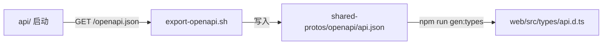

# shared-protos · 跨服务共享协议

存放后端 API 的 OpenAPI Spec 与跨服务共享的 Pydantic 模型，作为前后端类型同步的"单一事实来源"。

## 目录

```
shared-protos/
├── openapi/
│   └── api.json          # 由 api/ 启动时自动导出
├── schemas/              # 跨服务共用 Pydantic 模型（参考）
└── scripts/
    └── export-openapi.sh
```

## 同步流程



## 使用方式

### 后端（自动导出）

`api/app/main.py` 启动时通过 `app.openapi()` 生成，CI 中触发 `scripts/export-openapi.sh` 写入本目录。

### 前端（生成类型）

```bash
cd workspace/web
npm run gen:types
# 内部执行：openapi-typescript ../shared-protos/openapi/api.json -o src/types/api.d.ts
```

## CI 校验

CI 中执行 `scripts/ci/check-openapi-sync.sh`：
- 拉起 api 服务，重新导出 openapi.json
- 与本目录现有 api.json diff
- 若有差异 → PR 必须同步更新前端类型，否则失败
