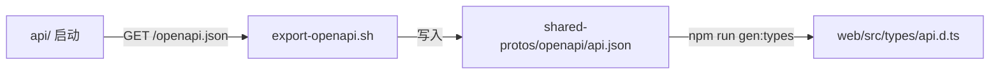

# shared-protos · 跨服务共享协议

存放后端 API 的 OpenAPI Spec 与跨服务共享的 Pydantic 模型，作为前后端类型同步的"单一事实来源"。

## 目录

```
shared-protos/
├── openapi/
│   └── api.json          # 由 api/ 启动时自动导出
├── schemas/              # 跨服务共用 Pydantic 模型（参考）
└── scripts/
    └── export-openapi.sh
```

## 同步流程



## 使用方式

### 后端（导出）

实际的导出脚本位于 `workspace/scripts/export_openapi.py`：

```bash
cd workspace
python scripts/export_openapi.py
# -> 写入 shared-protos/openapi/api.json
```

脚本通过 `app.openapi()` 直接从 `api/app/main.py` 取最新 schema，不需要拉起 HTTP 服务。

### 前端（生成类型）

```bash
cd workspace/web
npm run gen:types
# 内部执行：openapi-typescript ../shared-protos/openapi/api.json -o src/types/api.d.ts
```

## 推荐工作流

1. 后端开发新增/修改路由后，本地执行 `python scripts/export_openapi.py` 重新导出
2. 提交 PR 时同时提交 `shared-protos/openapi/api.json` 与 `web/src/types/api.d.ts`
3. Code Review 时通过 diff 即可看到协议变化

## CI 校验（建议）

在 CI 中加入：
- 重新执行 `scripts/export_openapi.py`
- `git diff --exit-code shared-protos/openapi/api.json` 校验是否同步
- 若有差异 → 提示 PR 必须同步更新
